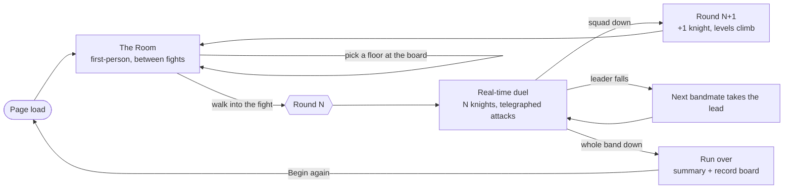

<h1 align="center">CHLOE</h1>

<p align="center">
  <em>A free browser roguelike. First-person, real-time, and it does not save.</em>
</p>

<p align="center">
  <a href="https://enderpeer.github.io/chloe/"><b>▶ Play</b></a> ·
  <a href="docs/README.md">Wiki</a> ·
  <a href="AGENTS.md">Contributor guide</a> ·
  <a href="GAME_SPEC.md">Design spec</a> ·
  <a href="ROADMAP.md">Roadmap</a>
</p>

<p align="center">
  
  
  
  
</p>

---

You wake up in a dressing room. It is dark, it is furnished, and you are alone in it in first
person — you can walk, sprint, jump, crouch, and close either hand around things that glint.
On one wall a board names the floor your next fight happens on, and there are arrows either
side of the name so you can change it.

Walk into the fight and the room drops away. You are standing on that floor with the **Hollow
Black Knight** across from you, and this is not a menu: he hunts you in real time, and you
answer in real time — move, sprint, crouch, evade on `SPACE`, and fire your abilities off the
number keys while he closes. Every attack he throws is *telegraphed*, and every telegraph has a
physical answer. Crouch under the slash. Sidestep the lunge. Back off the ground slam.

Kill him and you go back to the room. Next round he brings a friend. The round after, two.
Not copies of him, either — the one who has been coming since round one is a level for every
night he has come back, and the body that walked in tonight is a level 1.

**There are no saves.** No account, no cloud, no continue. One run per page load; death — or a
reload — starts the night over at level 1 with nothing carried across. The only thing that
outlives a run is your name on the record board on the wall.

---

## The night, in one picture



## Controls

**In the room**

| Input | Action |
|---|---|
| Click the canvas | capture the mouse (`ESC` releases) |
| Mouse | look around |
| `W` `A` `S` `D` | move · `Shift` sprint · `Space` jump · `Ctrl` / `C` crouch |
| Arrows, `Q` / `E` | keyboard-only fallback (move and turn) |
| Left / right mouse | close your left / right hand — look at something that glints and grab it |
| Click a prop | the TV toggles on and off; the stage board's `◀ ▶` arrows pick your next floor |
| `M` / `Tab` | menu — moves, binds, character sheet, inventory |

**In a fight**

| Input | Action |
|---|---|
| `W` `A` `S` `D` + mouse | move and look · `Shift` sprint · `Ctrl` / `C` crouch |
| `Space` | **evade** — a short dash with invulnerability frames |
| `1` – `9` | abilities and pocket consumables |
| Left / right mouse | two more bindable slots, addressed as `LMB` / `RMB` |

---

## The systems

### The night is a ladder of rounds

A run is a sequence of rounds fought between visits to the room. **Round N fields N knights.**
The floor alternates deterministically — the run *opens* in the Ring, because a lit blank circle
is where a new fight is legible, and the church with its pillars is the complication you walk
into second — but the board on the wall lets you override that, and your pick sticks until you
change it.

### Combat is real-time, with a hotbar

Three resources drive a fight — **Life, Stamina and Magic** — and you carry a hotbar of up to
9 number keys plus `LMB`/`RMB`. Every ability has a cast time, a recovery, a cooldown, charges, a
reach and an arc, and a damage type. Punch is the floor: free, fast, weak, always there.
Everything the ladder grants you has to beat it on damage-per-stamina or on reach. Sprinting and
evading spend from the same stamina bar your attacks do, so mobility is a real cost.

Damage runs through an **11-type chart** — physical, magical, lightning, fire, occult, blood,
poison, divine, virus, ghost, biological — with statuses that build up rather than land on a coin
flip. The knight is *occult*, so fire is halved against him and divine burns him double, which is
why the signature fire spell is priced as high as it is.

The two **pocket** slots exist so carrying a bandage never costs you a move. Using one locks you
out of casting for a moment and leaves you hittable — that lock is the entire price of the
feature.

### You level on one shared ladder

There is no point-buy tree to mis-click. Reaching a level **grants that level's row**, and every
character walks the same 1–100 ladder on their own level. The first nine rungs are the authored
game, and each one hands you something you can feel:

| Level | What you get |
|---|---|
| 1 | **Fists** — key 1 |
| 2 | **Fire Tornado** — trace a sigil, drop a pillar of fire. Key 2 |
| 3 | **Asteroid** — the first thing you can throw; it splashes, and it stuns. Key 3 |
| 4 | **Ash joins**, and **Water Wave** — throws them aside and opens a lane. Key 4 |
| 5 | +12 life, +6 stamina |
| 6 | **Hammer Fist** — one committed overhand. Key 5 |
| 7 | +8 magic, +2 magic power |
| 8 | **Ember Jab** — a jab that lights on contact. Key 6 |
| 9 | **Hollow Breaker** — the early kit is complete. Key 7 |

Abilities and the keys to hold them arrive *together*, on purpose: granting a move with nowhere
to bind it reads as a bug, not a reward. By level 9 that is 7 ability keys plus 2 pockets — the
hotbar is exactly full, and levels 10–100 are honest, readable growth.

Ash fights at her own level, and if you fall she takes the lead. The run ends when the whole band
is down, not when you are.

### The knight levels by how long he has been coming

This is the part the fight is built around. A knight's level is **not** the round number and
**not** how long this fight has run — it is **how many rounds he has been coming back**.

Round 5 therefore fields a ladder — **5 / 4 / 3 / 2 / 1** by seniority, with a brute's +1 riding
on top of his own rung — rather than five identical level-5s. The veteran who has fought since
round one knows the whole book of attacks; the body that walked in tonight only knows how to
sweep you off the floor. On top of that he keeps climbing *while you fight him*, at
a rate his temperament sets — an aggressive knight earns a level every 4.2 seconds alive, a
cautious one every 6.0, a brute every 8.7 but from a harder start. Each knight's climb is capped
against **his own** opening level, so a long fight ends on a ladder rather than flattening into
five copies of the same number.

What a level buys him is a table, not a curve fudge: life, attack and defence multipliers, and —
more importantly — **which attacks he knows at all**.

| His level | Unlocks | Life | Atk | Def |
|---|---|---|---|---|
| 1 | Slash | ×1.00 | ×1.00 | ×1.00 |
| 2 | Overhead | ×1.15 | ×1.06 | ×1.00 |
| 3 | Thrust combo | ×1.30 | ×1.12 | ×1.05 |
| 4 | Charge | ×1.45 | ×1.18 | ×1.05 |
| 5 | Ground slam | ×1.62 | ×1.24 | ×1.10 |

Full detail, including the ceilings and the balance arithmetic:
**[docs/knight-levels.md](docs/knight-levels.md)**.

### And from round 5, they get faster

Levels open low, so the *round's* own contribution to difficulty is speed — something you feel
rather than read off a stat block. From round 5 every knight gains one multiplier that closes,
circles and lunges him faster **and** shortens his wind-ups, rising 6% a round to a ceiling of
1.35× at round 10.

One number, one clock: it divides *every* time in a swing together, so if the telegraph shortens
the animation shortens by exactly the same factor. And it is floored — **no wind-up ever scales
below 900 ms**, because an attack you cannot see is not a hard attack, it is an unfair one. The
fastest attack in the set is the one that stops getting faster first.

### Two floors, and you choose

| | The Church | The Ring |
|---|---|---|
| Built from | a Draco-compressed GLB, with a baked navgrid | primitives and textures already shipped |
| Walkable area | ~250 m², measured by flood-filling the navgrid | ~616 m² (14 m radius) |
| Character | cold stone, close pillars, nowhere clean to stand | a lit circle in the dark, nowhere for him to hide |
| Containment | the baked grid | a radius clamp — it needs no grid at all |

### The room reads you back

The props are instrumentation. The **mirror** shows your stats. The **poster** shows his. The
**TV** plays a chaptered how-to programme. The **stage board** picks your next floor. The
**record board** keeps the top ten nights this machine has survived. The **giftbox** is a shop
you spend Shards in.

---

## Run it locally

Static site, no build step, no dependencies to install. Node is needed only to serve files.

```bash
git clone https://github.com/enderPeer/chloe.git
cd chloe
node tools/devserver.js 8080
```

Then open **http://localhost:8080/game/**. On Windows, `./dev.ps1` does the same via
`npx http-server`. Any static server works — `python -m http.server 8080` is fine.

> **A real server is required.** Browsers block GLTF and HDR loading from `file://`, so the 3D
> mode silently falls back to flat materials rather than crashing. It will look like the game and
> it will not be the game.

## Repo layout

```
index.html, landing.css   the landing page
game/                     the game
  index.html              THE LOAD ORDER — every module, hand-sequenced
  js/data/                content: no logic          (what things ARE)
  js/engine/              logic: no DOM              (what things DO)
  js/ui/                  screens and DOM only       (what you SEE)
  vendor/                 three.js r128 + GLTF/DRACO/RGBE loaders
  assets/                 3d/ · hdri/ · models/ · chloe/ · gen/
tools/                    dev server, version bumper, rig builder, image gen, manifests
worker/                   Cloudflare Worker — an optional records endpoint
docs/                     the wiki
GAME_SPEC.md              the binding design contract, §1 … §30
ROADMAP.md                history and the decisions not to re-litigate
```

## Contributing

Start with **[AGENTS.md](AGENTS.md)** — a five-minute orientation covering the rules, the layout,
how to run it and how to prove a change works. It is written for both humans and AI agents,
because both work on this repo.

The wiki at **[docs/README.md](docs/README.md)** documents every component in depth.

A few things worth knowing before your first change:

- **No build step, ever.** Classic `<script>` tags, one global `window.CHLOE`, no npm dependencies.
- **A new file needs a `<script>` tag** in `game/index.html`. Without it, the feature ships dead
  and silent.
- **[`GAME_SPEC.md`](GAME_SPEC.md) is binding**, and later sections supersede earlier ones. A drop
  is one new spec section plus the code that satisfies it.
- **Tuning constants live in `js/data/`**, never in an engine file.

### Versioning

The version on the title screen lives in one place —
[`game/js/data/version.js`](game/js/data/version.js) — as `major.minor.build`, where **`minor`
tracks the `GAME_SPEC.md` section the build implements**. `v0.30.x` *is* "the game as of §30".

The build number bumps on every commit, automatically. Enable the hook once per clone:

```bash
git config core.hooksPath tools/hooks
```

`node tools/bump-version.js --minor 31 --label "New Drop"` sets a new minor by hand, `--print`
shows the current version, and `SKIP_VERSION_BUMP=1 git commit` skips a bump once. The hook never
blocks a commit — if Node is missing it warns and lets it through.

## Host it yourself (all free)

- **GitHub Pages** — repo Settings → Pages → deploy from `main` / root. Auto-redeploys on every
  push, in about a minute.
- **Cloudflare Pages** — connect the repo, no build command, output directory `/`.
- **Anything else** — they are plain static files. Copy the folder to any web server.

## Third-party

[Three.js](https://threejs.org) r128 (MIT, vendored) · 3D models and HDRIs from
[Poly Haven](https://polyhaven.com), CC0, itemised in
[`tools/ATTRIBUTIONS.md`](tools/ATTRIBUTIONS.md) · generated art via
[Pollinations](https://pollinations.ai), free and keyless. The character photographs are
AI-generated originals made for this project.
