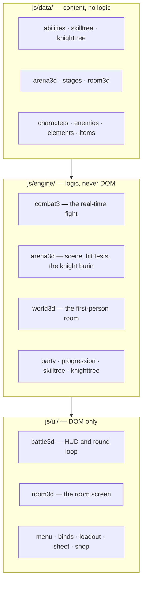

# The CHLOE Wiki

Everything about how this game actually works, one page per component. If you are an agent or a
contributor arriving for the first time, read **[AGENTS.md](../AGENTS.md)** first — it is the
five-minute orientation. This is the deep end.

Two conventions used throughout:

- **§N** refers to a numbered section of [`GAME_SPEC.md`](../GAME_SPEC.md), the binding design
  contract. **Later sections supersede earlier ones**, so §30 wins over §28 wins over §21.
- **Where a page and the code disagree, the code is right.** These pages were written by reading
  the source, and they flag the places where the spec has drifted ahead of or behind it.

---

## Start here

| Page | What it covers |
|---|---|
| **[Architecture](architecture.md)** | The `window.CHLOE` namespace, the hand-ordered load list, the data/engine/ui layer rules, and the boot sequence. Read this before your first change. |
| **[The Run Loop](run-loop.md)** | What a night is: rounds, the room↔arena handoff, party swap on death, permadeath, and the one thing that survives a run. |

## The fight

| Page | What it covers |
|---|---|
| **[Real-Time Combat](combat.md)** | Resources, the ability schema and every ability's real numbers, the cast→hit→recover timeline, the hotbar and pockets, evade, the damage formula, the type chart, and the rule that a dodge must cost nothing. |
| **[The Knight — Behaviour](knight-ai.md)** | The movement state machine, the three personalities, the five attack patterns with their telegraphs and dodges, feints, and the stagger punish window. |
| **[The Knight — Level System](knight-levels.md)** | Seniority: a knight's level is how many rounds he has been coming back. The in-fight climb, the two ceilings, what a level buys him, and the balance arithmetic. |
| **[The Knight — Rig & Animation](knight-rig.md)** | Animating a model with no skeleton: the 103-plate rigid hierarchy, the derived-pivot grip fix, the pose library, and the one-clock timing rule. |
| **[Difficulty Scaling](difficulty-scaling.md)** | The three axes that make a night harder — count, level and speed — and how they compose. Includes the round-speed table and the readability floor. |

## The world

| Page | What it covers |
|---|---|
| **[The Room](world-room.md)** | First-person movement, collision, hands and grabbing, and every interactive prop: the TV, the mirror, the poster, the stage board, the record board and the shop. |
| **[Stages](stages.md)** | The Church and The Ring — how each is built, contained and lit, and how the next floor is chosen. |
| **[Player Progression](progression.md)** | The shared 1–100 unlock ladder, the XP curve, effective stats, the party, and why abilities and their keybinds arrive together. |

## Reference

| Page | What it covers |
|---|---|
| **[Data Reference](data-reference.md)** | Every file in `js/data/`: what it publishes, its full schema, its gotchas — plus cookbooks for adding an ability, an attack pattern, an item, a stage or a ladder row. |
| **[Tooling, Assets & Deployment](tooling.md)** | The dev server, version bumping and its hook, the image and 3D asset pipelines, the worker, and how a change reaches production. |
| **[Debugging & Verification](debugging.md)** | Every `debug()` and `snapshot()` hook, what each publishes, and the traps that have actually cost this project time. |

---

## The one-minute mental model

Three rules follow from that picture, and most bugs in this repo have been a violation of one:

1. **A tuning number belongs in `data/`.** The engines are deliberately free of magic numbers, so
   a balance change is a data edit and can be reasoned about without reading logic.
2. **An engine never touches the DOM.** That is what makes `knighttree`, `skilltree` and
   `progression` pure functions you can exercise from a console without starting a fight.
3. **A module is only alive if `game/index.html` loads it.** There is no bundler to notice a file
   you forgot to register, and nothing throws — the feature is simply never there.
