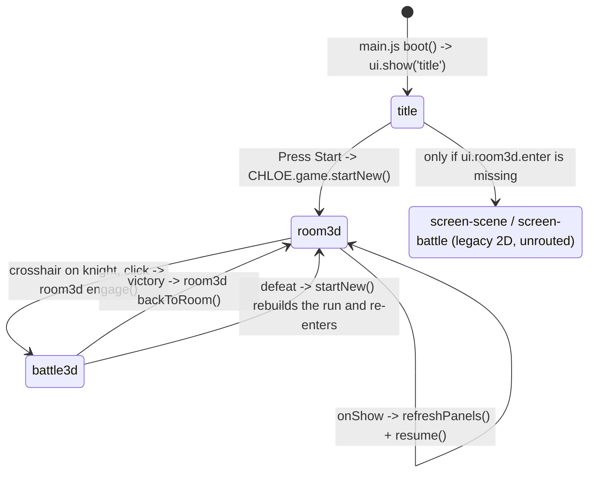
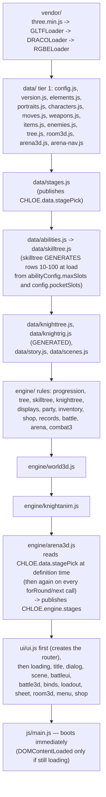

# Architecture

CHLOE is a zero-build browser roguelike: 49 hand-written JavaScript files plus a vendored copy of
three.js, loaded as plain `<script src>` tags from a single hand-ordered list in
[game/index.html](../game/index.html). There is no bundler, no `import`, no `npm install`, and no
`fetch()` for game data — every file assigns its public surface onto one global object,
`window.CHLOE`, and every file that exists must appear in that list or it simply never runs. The
code is split into three layers (`data/` = content, `engine/` = logic, `ui/` = DOM) that map onto
the three sub-objects of the namespace, and the whole thing boots from one function in
[game/js/main.js](../game/js/main.js). This page is the map: the namespace, the load order and which
parts of it are load-bearing, the boot sequence, the screen router, and a file-by-file inventory.

---

## 1. The namespace

Exactly one global is created. Grep confirms nothing else is assigned onto `window` anywhere under
`game/js`.

```js
window.CHLOE = window.CHLOE || {};   // every file opens with this line
```

| Sub-object | Created by | Holds | Rule |
|---|---|---|---|
| `CHLOE.data` | every file in `game/js/data/` | content tables, tuning constants, generated rig/nav data | no DOM, no `THREE`, no game state |
| `CHLOE.engine` | every file in `game/js/engine/` | rules, math, run state, all Three.js scene code | may touch `THREE`; must not own screens |
| `CHLOE.ui` | every file in `game/js/ui/` | screens, HUDs, overlays, the router itself | DOM only; asks the engine for numbers |
| `CHLOE.game` | [main.js:9](../game/js/main.js:9) | the boot module. Public surface is one function: `startNew()` | the only cross-layer entry point |

`CHLOE.game` is deliberately tiny. Its whole exported API is `{ startNew: startNew }`
([main.js:123](../game/js/main.js:123)) — starting a fresh run is the single thing both the title
screen and the defeat panel need from it.

### How a module publishes its API

Three shapes. Overwhelmingly the first:

```js
/* the standard: assign the return value of an IIFE onto the namespace */
CHLOE.engine.party = (function(){
  'use strict';
  var state = { /* private */ };
  function newGame(){ /* ... */ }
  return { state: state, newGame: newGame, /* ... */ };
})();
```
— [engine/party.js:13](../game/js/engine/party.js:13), returning 23 named members at
[engine/party.js:316](../game/js/engine/party.js:316). Every engine and ui module is written this way
except `engine/arena3d.js`, `engine/world3d.js` and `ui/ui.js`, and so is `CHLOE.game`
([main.js:9](../game/js/main.js:9)).

```js
/* the second shape: a bare IIFE that publishes its object FIRST, so the
   module can still hand back a usable (dead) API after an early return */
(function () {
  'use strict';
  var A = {};
  CHLOE.engine.arena3d = A;
  /* ... */
})();
```
— [engine/arena3d.js:24-28](../game/js/engine/arena3d.js:24) and
[engine/world3d.js:16-20](../game/js/engine/world3d.js:16). Both files need it: each `return`s out
of its own IIFE at the `window.THREE` guard, and the object it published on the way in is what
stays behind as the no-op API ([§8](#8-vendored-threejs-and-the-loaders)). The two generated data
tables, [data/skilltree.js:50](../game/js/data/skilltree.js:50) and
[data/knighttree.js:32](../game/js/data/knighttree.js:32), are bare IIFEs too, but for the ordinary
reason: they assign at the end, once the table is built.

```js
/* the third shape, used by exactly one file: ui/ui.js takes the namespace
   object as an argument and assigns members onto it, because it is the file
   that CREATES the router every other ui file calls */
(function(ui){
  'use strict';
  function show(name){ /* ... */ }
  ui.show = show;
  /* ... */
})(CHLOE.ui);
```
— [ui/ui.js:6](../game/js/ui/ui.js:6), exports at [ui/ui.js:120-131](../game/js/ui/ui.js:120). The only
other file that passes anything into its IIFE is
[data/elements.js:100](../game/js/data/elements.js:100), which injects `CHLOE.data.types` as a
dependency but still assigns the return value, so it is shape one.

Data files are usually a bare object literal (`CHLOE.data.moves = { ... }`,
[data/moves.js:33](../game/js/data/moves.js:33)). Five of them are IIFEs because they *derive* their
table at load time rather than listing it — see [§5](#5-the-load-order) for why that matters.

Two files publish a *second* top-level name that their filename does not advertise — one in each
of two different layers:

- `engine/arena3d.js` publishes `CHLOE.engine.arena3d`
  ([engine/arena3d.js:28](../game/js/engine/arena3d.js:28)) **and** `CHLOE.engine.stages`
  ([engine/arena3d.js:157](../game/js/engine/arena3d.js:157)).
- `data/stages.js` publishes `CHLOE.data.stages`
  ([data/stages.js:24](../game/js/data/stages.js:24)) **and** `CHLOE.data.stagePick`
  ([data/stages.js:237](../game/js/data/stages.js:237)).

The arena3d.js header states the reason plainly, and it is the central architectural fact of this
repo: *"index.html lists every script by hand, and adding a file nobody wires up is a file that
silently never loads."* ([engine/arena3d.js:141-143](../game/js/engine/arena3d.js:141)). A new
`engine/stages.js` would have been cleaner and would have been dead.

---

## 2. Why zero-build

[GAME_SPEC.md §1](../GAME_SPEC.md) states it as a mandatory tech rule: *"Vanilla HTML/CSS/JS. No build
step, no npm deps, no ES modules, no fetch() for local data"* and *"Classic `<script>` tags in a
fixed order. Single global namespace."* [ROADMAP.md](../ROADMAP.md) lists it under "Key decisions
(don't re-litigate)".

The practical consequences you must design around:

1. **It runs from `file://`.** No module resolution, no CORS on the JS itself. The 3D asset loads
   (GLB/HDR) *do* fail over `file://`, so every 3D path has a documented graceful fallback rather
   than a crash: a failed `church.glb` builds the procedural nave
   ([engine/arena3d.js:586-591](../game/js/engine/arena3d.js:586)), a failed `knight.glb` builds the
   fallback totem ([engine/arena3d.js:705-709](../game/js/engine/arena3d.js:705)), and a failed HDR
   just marks its loading slot done ([engine/arena3d.js:1059-1060](../game/js/engine/arena3d.js:1059)).
   A *missing renderer* is a different path again — `disableAPI(...)` at
   [engine/arena3d.js:197](../game/js/engine/arena3d.js:197) and
   [engine/world3d.js:39](../game/js/engine/world3d.js:39) swaps every public method for a no-op
   rather than throwing ([§8](#8-vendored-threejs-and-the-loaders)).
2. **Deploy is `git push`.** GitHub Pages deploys from `main` / root and auto-redeploys on every
   push, in about a minute; the Cloudflare Pages mirror is configured with no build command
   ([README.md](../README.md)). Nothing can be "not compiled yet".
3. **There is no dependency graph.** Order in `index.html` *is* the dependency graph, maintained by
   hand. Nothing warns you when you get it wrong.
4. **Everything is a global.** Two modules cannot define the same name; a typo in a namespace key
   is a silent `undefined` at call time, not a load error.

---

## 3. The three-layer rule

| Layer | Contract | Enforced? |
|---|---|---|
| `game/js/data/` | pure content. Assigns tables into `CHLOE.data`. No logic that depends on runtime state. | **Held.** `grep -rn "document\.\|THREE\." data/` returns nothing. |
| `game/js/engine/` | logic and state. No screens. | **Mostly held** — see below. |
| `game/js/ui/` | DOM and screens. Renders what the engine returns; computes nothing. | **Held.** Only [ui/loading.js:14](../game/js/ui/loading.js:14) mentions `THREE`, and only in a comment asserting it uses none. |

### Where it is bent, and why

- **`engine/` touches `document`, but almost never the page.** Outside `records.js` every hit is
  an *offscreen* `<canvas>` used as a texture source
  ([engine/world3d.js:236](../game/js/engine/world3d.js:236),
  [engine/displays.js:35](../game/js/engine/displays.js:35),
  [engine/arena3d.js:1602](../game/js/engine/arena3d.js:1602)), pointer-lock plumbing
  ([engine/arena3d.js:2265](../game/js/engine/arena3d.js:2265),
  [engine/world3d.js:1347](../game/js/engine/world3d.js:1347)), or the one backgrounded-tab read
  `document.hidden` ([engine/arena3d.js:2943](../game/js/engine/arena3d.js:2943)). A canvas that is
  never appended to the document is a pixel buffer, not a screen.
- **`engine/records.js` genuinely builds a DOM overlay** and appends it to `document.body`
  ([engine/records.js:590](../game/js/engine/records.js:590)) for the name-entry prompt. Its header
  argues the module is "different in kind" — *"It owns a clock, it owns the only localStorage key in
  the game, and it talks (optionally) to a server"* ([engine/records.js:6-7](../game/js/engine/records.js:6)).
  This is the clearest layer violation in the repo. It is also the one file that persists anything
  (`localStorage['chloe.records.v1']`); the header carries an explicit warning that adding a
  `restore()` there would break the roguelike rule of [GAME_SPEC.md §15](../GAME_SPEC.md) —
  *"If you ever find yourself adding a `restore()` here, you have misread §15 — stop."*
  ([engine/records.js:22-23](../game/js/engine/records.js:22)).
- **`data/` files that compute.** Five data files are IIFEs that build their table from other data
  at load time: `elements.js` (chart from `types`), `items.js` (`itemRules`), `stages.js`
  (`stagePick`, which additionally holds *mutable state* — `chosenId`,
  [data/stages.js:243](../game/js/data/stages.js:243)), `skilltree.js` (rows 10-100 generated), and
  `knighttree.js`. `stagePick` holding a player choice is data-with-state; the header defends it on
  the grounds that `forRound()` must be answered in exactly one place so the room's stage board can
  never promise a floor the fight does not use ([data/stages.js:230-236](../game/js/data/stages.js:230)).
- **`engine/knightanim.js` and `engine/arena3d.js` are full Three.js scene code.** That is
  intentional: `THREE` is not the DOM, and the spec puts all renderer work in the engine layer.

---

## 4. The screens and the router

`game/index.html` declares five screen divs and four always-present layers
([game/index.html:16-24](../game/index.html:16)):

| Element | Owned by | Purpose |
|---|---|---|
| `#screen-title` | [ui/title.js](../game/js/ui/title.js) | logo, "Press Start", version footer |
| `#screen-scene` | [ui/scene.js](../game/js/ui/scene.js) | legacy 2D point-and-click (unrouted; kept working) |
| `#screen-room3d` | [ui/room3d.js](../game/js/ui/room3d.js) | the first-person dressing room |
| `#screen-battle3d` | [ui/battle3d.js](../game/js/ui/battle3d.js) | the real-time arena HUD |
| `#screen-battle` | [ui/battleui.js](../game/js/ui/battleui.js) | legacy 2D turn-based battle (fallback) |
| `#dialog-layer` | [ui/dialog.js](../game/js/ui/dialog.js) | typewriter dialog box |
| `#overlay-menu` | [ui/menu.js](../game/js/ui/menu.js) | Party / Inventory / Moves / How to play |
| `#toast-layer` | [ui/ui.js:109](../game/js/ui/ui.js:109) | transient toasts |
| `#fx-grain` | `css/game.css` | film-grain overlay |

The router is 14 lines. `CHLOE.ui.show(name)` strips `.active` off every `.screen`, then adds it to
`#screen-<name>` ([ui/ui.js:25-38](../game/js/ui/ui.js:25)). A missing screen is a
`console.warn`, never a throw. `CHLOE.ui.onShow(name, fn)` registers one entry callback per screen
into `ui._onShow` ([ui/ui.js:39-42](../game/js/ui/ui.js:39)); the handler is invoked inside a
`try/catch` so a broken screen cannot wedge navigation. Only one screen registers a handler today:
`ui.onShow('room3d', ...)` at [ui/room3d.js:449](../game/js/ui/room3d.js:449), which repaints the
mirror/poster/stage-board canvases and resumes the render loop.



**The router has no history and no back button.** `show()` records `currentScreen` and nothing else.
Navigation between room and battle is done by two files calling `show()` directly
([ui/room3d.js:358](../game/js/ui/room3d.js:358), [ui/battle3d.js:1240](../game/js/ui/battle3d.js:1240)).

**Trap — two monkey-patches keep the room in the loop.** `ui/room3d.js` wraps two functions it does
not own, once, on first `enter()` ([ui/room3d.js:399-421](../game/js/ui/room3d.js:399)):

1. `CHLOE.ui.scene.onBattleEnd` is replaced with a wrapper that diverts the result to the room's own
   handler when `inBattle` is true, and otherwise delegates to the original. Every battle end — 2D
   or 3D — still funnels through `scene.onBattleEnd`, which is why `ui/scene.js` must stay loaded
   even though the 2D flow is unrouted.
2. `CHLOE.ui.menu.close` is wrapped so that closing the menu resumes the world loop when you are
   still standing in the room.

Because these wraps happen at `enter()` time rather than at parse time, they do not constrain script
order — but they do mean **`ui/scene.js` and `ui/menu.js` must both exist**, and that patching either
function again elsewhere will stack wrappers.

---

## 5. The load order

Every one of the 49 files under `game/js` has exactly one `<script>` tag, and every tag points at a
file that exists (verified by diffing the tag list against `find game/js -name '*.js'`). 53 tags
total: 4 vendor, 20 data, 15 engine, 13 ui, 1 main.



### The full list, in file order

| # | Tag | Notes |
|---|---|---|
| 1-4 | `vendor/three.min.js`, `GLTFLoader.js`, `DRACOLoader.js`, `RGBELoader.js` | must be first; the loaders attach onto `THREE` |
| 5 | `js/data/config.js` | global tuning; read at load by `data/skilltree.js` |
| 6 | `js/data/version.js` | `CHLOE.data.version` — the on-screen version |
| 7-9 | `elements.js`, `portraits.js`, `characters.js` | |
| 10-13 | `moves.js`, `weapons.js`, `items.js`, `enemies.js` | |
| 14-16 | `tree.js`, `room3d.js`, `arena3d.js` | `data/arena3d.js` — church models + knight patterns |
| 17 | `arena-nav.js` | baked navgrid bitfield |
| 18 | **`stages.js`** | **load-bearing, commented** |
| 19-20 | `abilities.js`, `skilltree.js` | **load-bearing, uncommented** (see below) |
| 21 | `knighttree.js` | |
| 22 | **`knightrig.js`** | **load-bearing, commented** |
| 23-24 | `story.js`, `scenes.js` | STORY-agent owned |
| 25-31 | `engine/progression.js`, `tree.js`, `skilltree.js`, `knighttree.js`, `displays.js`, `party.js`, `inventory.js` | pure rules |
| 32-33 | **`engine/shop.js`, `engine/records.js`** | **load-bearing, commented** |
| 34-36 | `engine/battle.js`, `arena.js`, `combat3.js` | `arena.js` is tagged but currently uncalled — see [§7](#7-module-inventory) |
| 37 | `engine/world3d.js` | |
| 38 | **`engine/knightanim.js`** | **load-bearing, commented** |
| 39 | `engine/arena3d.js` | reads `CHLOE.data.stagePick` at definition time |
| 40 | `ui/ui.js` | **must be first in the ui block** — it creates the router every other ui file calls |
| 41-51 | `loading.js`, `title.js`, `dialog.js`, `scene.js`, `battleui.js`, `battle3d.js`, `binds.js`, `loadout.js`, `sheet.js`, `room3d.js`, `menu.js` | |
| 52 | **`ui/shop.js`** | **commented** |
| 53 | `js/main.js` | last — boots |

### The comments in `index.html`, quoted

The file explains five groupings in its own words. These are the reasons, verbatim:

**`data/stages.js`** ([game/index.html:43-45](../game/index.html:43)):
> §24 stages: must load BEFORE any engine file, because arena3d.js reads `CHLOE.data.stages` at
> definition time to publish `CHLOE.engine.stages`.

Partly verified in code, with one caveat worth knowing. The definition-time read is real:
[engine/arena3d.js:170](../game/js/engine/arena3d.js:170) runs `S.order = orderList()` while the
module is still being defined, and `orderList()` reads `CHLOE.data.stagePick` first, falling back
to `CHLOE.data.stages` ([engine/arena3d.js:162-168](../game/js/engine/arena3d.js:162)) — so the
comment's `CHLOE.data.stages` is the *second* source, not the first. And it sits above the
`window.THREE` guard at [engine/arena3d.js:197](../game/js/engine/arena3d.js:197), deliberately, per
the comment at [engine/arena3d.js:134-136](../game/js/engine/arena3d.js:134) —
*"`CHLOE.engine.stages` answers `current()`/`next()` on a machine with no WebGL too — the room's
stage board paints from data long before anyone loads a renderer."*

The caveat: **misordering these two files is more forgiving than the comment implies.** `S.order`
is re-derived on entry to `forRound()` ([:176](../game/js/engine/arena3d.js:176)) and `next()`
([:191](../game/js/engine/arena3d.js:191)), and `S.get()`/`S.current()` read `CHLOE.data.stages` live,
so a late `data/stages.js` would leave only the definition-time snapshot of `S.order` wrong — and
nothing in the repo reads `stages.order` directly; both callers
([engine/world3d.js:496-497](../game/js/engine/world3d.js:496),
[ui/battle3d.js:1183](../game/js/ui/battle3d.js:1183)) go through `forRound()`. Keep the order anyway:
it is the guarantee the comment is buying, and the next thing added to that block may well read
data at definition time and not re-derive.

**`data/knightrig.js`** ([game/index.html:49-53](../game/index.html:49)):
> §28 B: the knight's rigid-plate bone hierarchy, GENERATED by `tools/build-knight-rig.js`.
> `engine/knightanim.js` reads it at build time; without this tag the knight loads and then stands
> there, because knightanim's own fallback is "no rig data, stay static".

Verified: [engine/knightanim.js:102](../game/js/engine/knightanim.js:102) —
`console.warn('[knightanim] data/knightrig.js missing — knight stays static'); return null;`
("at build time" in that comment means inside `knightanim.build(model, THREE)`, which runs when the
knight model is mounted — there is no build step in this project.)

**`engine/shop.js` + `engine/records.js` + `engine/battle.js`**
([game/index.html:63-67](../game/index.html:63)):
> §27D/E. Engines, so they load after every data file (shop prices come from `data/items.js`, the
> record patch line from `data/version.js`) and before the UI and world3d that call them. **A new
> module with no script tag is a whole feature shipped dead — §24 did exactly that** — so these
> three tags are as load-bearing as the code they pull in.

**`engine/knightanim.js`** ([game/index.html:74-77](../game/index.html:74)):
> §28 C: the pose driver. Before `arena3d.js`, which calls into it at every phase boundary and at
> knight load. A module with no script tag is a whole feature shipped dead — §24 did exactly that —
> and this one would be silent about it: arena3d degrades to a static knight rather than throwing.

**`ui/shop.js`** ([game/index.html:92-93](../game/index.html:92)):
> the shop overlay: after `ui/ui.js` (it assigns onto `CHLOE.ui` and draws with `ui.el`) and after
> `engine/shop.js`, whose rules it renders.

### An uncommented ordering constraint you can break

**`data/skilltree.js` must load after `data/config.js` and `data/abilities.js`.** `index.html` does
not say so. The file generates every ladder row from level 10 to 100 *at definition time*, and the
key-slot cap it uses is read from two other data files at that same moment:

```js
var ACFG = CHLOE.data.abilityConfig || {};
var GCFG = CHLOE.data.config || {};
var maxSlots = ACFG.maxSlots || 9;
var pockets = (typeof GCFG.pocketSlots === 'number' && GCFG.pocketSlots > 0) ? GCFG.pocketSlots : 0;
var keyCap  = Math.max(1, maxSlots - pockets);
```
— [data/skilltree.js:102-106](../game/js/data/skilltree.js:102)

Of the two, **`data/config.js` is the one that actually bites today.** Move `skilltree.js` above it
and the `|| {}` fallback takes over: `pockets` degrades to 0, `keyCap` becomes 9 instead of 7, and
the generator emits "Wider Grip" rows at levels **12 and 16** — two, not more, because `slotsSoFar`
hits the inflated cap of 9 and the `slotsSoFar < keyCap` gate at
[data/skilltree.js:117](../game/js/data/skilltree.js:117) closes again. Both rows promise a keybind
`engine/combat3.js` clamps away: `slotCount()` still reads `config.pocketSlots` live at call time,
so it adds the 2 pockets back on and clamps to `maxSlots`
([engine/combat3.js:134-144](../game/js/engine/combat3.js:134)) — the hotbar was already full at 9.

Moving it above `data/abilities.js` alone is *currently* harmless, because that file's fallbacks
(`maxSlots || 9`, `baseSlots || 1`) happen to equal its real values
([data/abilities.js:225-227](../game/js/data/abilities.js:225)). That coincidence is exactly what makes
it dangerous: retune `abilityConfig` and the mis-ordered build starts disagreeing silently, with no
error to find. The header calls the whole class out — *"a literal 2 here would be a second place for
the pocket count to live and disagree from"*
([data/skilltree.js:97-98](../game/js/data/skilltree.js:97)) — but the failure is a wrong number, not an
error. See [Knight levels](knight-levels.md) and [Progression](progression.md) for what the ladder
hands out.

### What breaks when a new module ships without a `<script>` tag

Nothing throws. That is the whole problem, and the codebase has been bitten by it: the §24 stage
system was written and shipped with no tag, which is why `CHLOE.engine.stages` now lives inside
`engine/arena3d.js` rather than in an `engine/stages.js` nobody would have wired up
([engine/arena3d.js:141-143](../game/js/engine/arena3d.js:141)).

The failure modes, in ascending order of how long they take to notice:

1. **Silent degradation to a documented fallback.** Missing `engine/knightanim.js` → the knight is
   mounted un-rigged and never moves a limb; `k.rigInfo.reason` is set to `'knightanim missing'`
   ([engine/arena3d.js:808-823](../game/js/engine/arena3d.js:808)). Note there is **no warning at all**
   on this path: `arena3d` guards the call (`KA ? KA.build(...) : null`, [:808](../game/js/engine/arena3d.js:808)),
   so knightanim's own `console.warn` never runs — that one fires only when knightanim *is* loaded
   and `data/knightrig.js` is not ([engine/knightanim.js:102](../game/js/engine/knightanim.js:102)).
   The only trace is `debug().knightRig.reason`
   ([engine/arena3d.js:4533](../game/js/engine/arena3d.js:4533)). A playable fight, and a boss that
   stands still.
2. **A prop that is present but inert.** `engine/world3d.js` builds the giftbox and record frame
   whether or not `ui/shop.js` and `engine/records.js` loaded, because *"an exception thrown out of
   `buildFurniture` takes the whole room down with it, and a missing prop is a feature that silently
   never shipped (§24's lesson)"* ([engine/world3d.js:889-896](../game/js/engine/world3d.js:889)).
3. **A guarded call that quietly no-ops.** `main.js` starts the run clock behind
   `if (rec && typeof rec.start === 'function')` ([main.js:36-37](../game/js/main.js:36)) precisely so a
   build without `engine/records.js` still starts a run — at the cost of the second run of a page
   being billed for the first one's minutes.
4. **`TypeError: Cannot read properties of undefined`** at the first call site, which for a UI module
   may be many minutes into a run.

**Rule for anyone adding a file under `game/js`:** add the `<script>` tag in the same commit, place
it after everything it reads at definition time, and if the placement is non-obvious, leave an HTML
comment saying why — the file already has five of them and they are the only documentation of these
constraints that lives next to the constraint.

---

## 6. Boot

`main.js` is the last tag. It defines `CHLOE.game` as an IIFE that self-schedules its own boot
([main.js:117-121](../game/js/main.js:117)):

```js
if (document.readyState === 'loading') {
  document.addEventListener('DOMContentLoaded', boot);
} else {
  boot();
}
```

Because the tag sits at the end of `<body>`, `readyState` is normally already past `loading` and
`boot()` runs synchronously. The branch exists so the file is also safe if it is ever moved into
`<head>` or injected late.

`boot()` ([main.js:91-115](../game/js/main.js:91)) does five things, in order:

1. `sanityCheck()` — warn-only data validation (below).
2. `CHLOE.ui.dialog.init()` — build the `#dialog-layer` DOM.
3. `CHLOE.ui.title.build()` — render `#screen-title`, including the version string from
   `CHLOE.data.version.full()` ([ui/title.js:33](../game/js/ui/title.js:33)).
4. Pin `#app` against scrolling. The comment is the reason: *"`#app` must never scroll
   (`overflow:hidden` can still be focus-scrolled) — pin it so button focus in cramped viewports
   can't shift the stage"* ([main.js:96-104](../game/js/main.js:96)). The listener resets
   `scrollLeft`/`scrollTop` to 0 on every `scroll` event.
5. Bind global Escape → close the menu overlay ([main.js:107-112](../game/js/main.js:107)), then
   `CHLOE.ui.show('title')`.

### `startNew()` — the only entry into a run

`CHLOE.game.startNew()` ([main.js:27-52](../game/js/main.js:27)) has exactly three call sites: the
title screen's Press Start button ([ui/title.js:25](../game/js/ui/title.js:25)), and the `defeat`
branch of each of the two battle-end handlers —
[ui/room3d.js:377](../game/js/ui/room3d.js:377) and [ui/scene.js:214](../game/js/ui/scene.js:214).
Those two are the "defeat panel" path: the panel's **Begin again** button
([ui/battle3d.js:1488](../game/js/ui/battle3d.js:1488)) calls `end('defeat')`, which funnels through
`CHLOE.ui.scene.onBattleEnd` ([ui/battle3d.js:1507](../game/js/ui/battle3d.js:1507)) and lands in
whichever handler the room's monkey-patch selects. It:

1. `CHLOE.engine.party.newGame()` — rebuilds run state from scratch (solo level-1 Chloe).
2. `CHLOE.engine.records.start()`, guarded — starts the run clock. The comment explains why this
   line lives here and not in `records.js`: *"engine/records.js falls back to time-since-page-load
   when nobody calls `start()`, which reads correctly for the first run of a page and silently bills
   the second run for the first one's minutes"* ([main.js:31-35](../game/js/main.js:31)).
3. If `CHLOE.ui.room3d.enter` is a function, enter the 3D room and **return**
   ([main.js:39](../game/js/main.js:39)).
4. Otherwise fall through to the legacy 2D scene flow — `scene.goto(story.startScene)` plus the intro
   dialog. This path is unrouted in practice; the header calls it *"a fallback but is no longer
   routed"* ([main.js:5-6](../game/js/main.js:5)).

### `sanityCheck()` — and why most of it is dead

`sanityCheck()` ([main.js:55-88](../game/js/main.js:55)) never throws; it only `console.warn`s with a
`[CHLOE]` prefix. Its four presence checks are live and correct: it warns if `CHLOE.data.scenes`,
`.dialogs`, `.story` or `.portraits` are missing.

**Its cross-reference checks are inert.** They were written against the v1 schema and nothing has
updated them:

| Check | Reads | Status |
|---|---|---|
| character → weapon | `c.weaponId` vs `d.weapons` | **works** — `weaponId` still exists ([data/characters.js:20](../game/js/data/characters.js:20)) |
| character → skill | `c.skillsByLevel` vs `d.skills` | **dead** — characters use `learnset` since v2 ([data/characters.js:24](../game/js/data/characters.js:24)); `skillsByLevel` is undefined so the loop never runs |
| enemy → skill | `e.skills` vs `d.skills` | **dead** — enemies use `moveset` ([data/enemies.js:29](../game/js/data/enemies.js:29)); `e.skills` is undefined |
| enemy → drop item | `e.rewards.drops` vs `d.items` | works |
| `story.startScene` exists in `scenes` | | works |

`CHLOE.data.skills` **is never assigned anywhere in the repo** — there is no `data/skills.js`. Both
remaining references to it are defensive `|| {}` fallbacks
([engine/progression.js:128](../game/js/engine/progression.js:128),
[ui/menu.js:143](../game/js/ui/menu.js:143)). So the two skill checks would fire on every id if the
fields still existed, and fire on nothing because they do not. Note also that `sanityCheck()`
validates **none** of the newer data files — a missing `abilities.js`, `stages.js`, `skilltree.js`
or `knightrig.js` produces no boot-time warning at all, only a runtime one much later. If you extend
this function, that is the gap worth closing.

---

## 7. Module inventory

49 files, 22,511 lines. Line counts are `wc -l` at the time this page was written; treat them as a
sense of scale, not a contract.

### `game/js/data/` — content only (20 files, 3,345 lines)

Field-by-field schemas for these tables live in [Data reference](data-reference.md).

| File | Lines | Job |
|---|---:|---|
| [data/abilities.js](../game/js/data/abilities.js) | 235 | §17 real-time abilities bound to keys 1-9: cost, `castMs`, `recoverMs`, `cooldownMs`, charges, range/arc, power. Also `CHLOE.data.abilityConfig` (`maxSlots`, `baseSlots`). |
| [data/arena-nav.js](../game/js/data/arena-nav.js) | 38 | §20 precomputed walkable floor for the church, as a packed bitfield (~580 chars). Baked because three r128 has no BVH and probing at load froze the thread ~50s. |
| [data/arena3d.js](../game/js/data/arena3d.js) | 379 | §16 church arena config: model paths, spawns, bounds, light rig, and the knight's attack patterns (telegraph time + hit volume + how to evade). |
| [data/characters.js](../game/js/data/characters.js) | 74 | Chloe and Ash: base stats, growth, `learnset`, `defaultLoadouts`, `weaponId`. |
| [data/config.js](../game/js/data/config.js) | 61 | Global tuning: `levelCap:100`, `fleeChance:0.7`, `typewriterMs:16`, `pocketSlots:2`, `itemUseMs:350`, `itemCooldownMs:2500`, `mouseSlots:['mouseL','mouseR']` (§27B — ids, never numbers), `reviveIframeMs:900`. |
| [data/elements.js](../game/js/data/elements.js) | 118 | The 11-type damage chart. `CHLOE.data.types` is authoritative; `CHLOE.data.elements` is a v1/v2 back-compat shim with an `OLDMAP`. |
| [data/enemies.js](../game/js/data/enemies.js) | 97 | Enemy defs: `type`, `resists`, `statusImmune`, `moveset`, `rewards`. |
| [data/items.js](../game/js/data/items.js) | 200 | Consumables + `CHLOE.data.itemRules` (derived: `isPressable`, `isCombatUsable`), mirrored onto `CHLOE.data.items` as non-enumerable properties so `for-in` still sees only items. |
| [data/knightrig.js](../game/js/data/knightrig.js) | 155 | **Generated** by `tools/build-knight-rig.js`. Rigid bone hierarchy for `knight.glb` (103 mesh nodes, no skeleton). Do not hand-edit. |
| [data/knighttree.js](../game/js/data/knighttree.js) | 154 | §21 the knight's ladder: per-level `pattern`/`life`/`atk`/`def` multipliers, `levelPerRound`, `growth`, `tellMs:800`. |
| [data/moves.js](../game/js/data/moves.js) | 368 | The v2 turn-based move table: `cat`, `type` (v3), `element` (legacy alias), `usableIn` phases. |
| [data/portraits.js](../game/js/data/portraits.js) | 13 | Portrait image paths per speaker key, resolved at use by `ui.portraitSrc`. |
| [data/room3d.js](../game/js/data/room3d.js) | 138 | Dressing-room layout: dims, spawns, texture/model paths, furniture list (matched by **kind**, never by array index), light rig. |
| [data/scenes.js](../game/js/data/scenes.js) | 274 | STORY-agent: Act 1 2D scenes, backgrounds, percent-positioned hotspots. |
| [data/skilltree.js](../game/js/data/skilltree.js) | 135 | §19 the shared 1-100 unlock ladder. Rows 1-9 authored, 10-100 **generated at load** from `abilityConfig` + `config`. |
| [data/stages.js](../game/js/data/stages.js) | 303 | §24 stage table (`church`, `ring`) + `CHLOE.data.stagePick` — the pure half of stage selection plus the player's sticky pick. |
| [data/story.js](../game/js/data/story.js) | 213 | STORY-agent: `CHLOE.data.dialogs` and `CHLOE.data.story` (`startScene`, `introDialog`). |
| [data/tree.js](../game/js/data/tree.js) | 340 | §12 per-character skill trees: nodes, branches, costs, `requires`, percent layout. |
| [data/version.js](../game/js/data/version.js) | 29 | `{major:0, minor:30, build, label:'Seniority', date}` + `string()`/`full()`. `build`/`date` owned by `tools/bump-version.js` and change on every push — do not quote them anywhere. |
| [data/weapons.js](../game/js/data/weapons.js) | 21 | Weapon defs: `atkBonus`, `element`, `price`. |

### `game/js/engine/` — logic, no screens (15 files, 13,608 lines)

| File | Lines | Job |
|---|---:|---|
| [engine/arena.js](../game/js/engine/arena.js) | 356 | §16 round-based (turn-taking) arena rules, from before §17 made the fight real-time. Its header still claims it owns "ALL battle math" ([engine/arena.js:2](../game/js/engine/arena.js:2)) — but **nothing in `game/js` references `CHLOE.engine.arena` any more** (grep: zero call sites outside the file). `engine/combat3.js` is what the arena fight actually runs on. Loaded, tagged, and currently dead. |
| [engine/arena3d.js](../game/js/engine/arena3d.js) | 5,062 | The biggest file. All Three.js for the church/Ring: GLB loading with procedural fallback, first-person controller, knight telegraphs, hit tests, squad spawning, stage build/teardown. Also publishes `CHLOE.engine.stages`. |
| [engine/battle.js](../game/js/engine/battle.js) | 1,146 | §10 legacy 2D phase combat. Owns all state and rules; returns ordered event arrays for `battleui.js` to animate. |
| [engine/combat3.js](../game/js/engine/combat3.js) | 1,430 | §17 real-time fight rules: resources, cast/cooldown/charge state, evade windows, damage math. No DOM, no Three.js. `snapshot()` is what the HUD renders. |
| [engine/displays.js](../game/js/engine/displays.js) | 598 | §19 the room canvases: `mirror()` (your leader), `poster()` (the knight), `tv(ch)` (the how-to programme), `trophy()` (rounds cleared), plus `stage()` + `stageArrows()` (§24/§26 board). Pure drawing over live state. |
| [engine/inventory.js](../game/js/engine/inventory.js) | 112 | The bag `{itemId: count}` and item application (`hp`/`mp`/`sta`/`revivePct`/`cure`). |
| [engine/knightanim.js](../game/js/engine/knightanim.js) | 874 | §28 procedural pose driver. Reparents the knight's 103 armour meshes onto bones from `data/knightrig.js`. **Must rig the unscaled model** — scale goes on `rig.root` afterwards. |
| [engine/knighttree.js](../game/js/engine/knighttree.js) | 218 | §21/§30 reads the knight's ladder — `spawnLevel()`, `seniorityFor(i, count)`. Pure functions of a level; no state. |
| [engine/party.js](../game/js/engine/party.js) | 341 | Run state: members, active member, shards, flags, scene, loadouts, binds. `newGame()` is the only way it is (re)built. |
| [engine/progression.js](../game/js/engine/progression.js) | 357 | `xpToNext(level) = round(22 * level^1.75)`, cap 100; `enemyXp(def)`; level-up (stats, skill point, learnset union, auto-equip); `PHASE_MODS`. |
| [engine/records.js](../game/js/engine/records.js) | 627 | §27E top-10 board. Run clock, `localStorage['chloe.records.v1']`, optional remote, the name-entry overlay, and `board()` canvas. |
| [engine/shop.js](../game/js/engine/shop.js) | 174 | §27D giftbox vendor. Stock is **derived** from `data/items.js`, not listed, so an item cannot exist in two places. |
| [engine/skilltree.js](../game/js/engine/skilltree.js) | 87 | §19 reads the shared ladder for one character at their own level. Pure functions; nothing to save. |
| [engine/tree.js](../game/js/engine/tree.js) | 311 | §12 skill-tree rules and `effectiveStats()` — **the one stat aggregator the whole game consumes** (base + growth + weapon + tree). |
| [engine/world3d.js](../game/js/engine/world3d.js) | 1,915 | §13/§14 the first-person room: PBR pipeline (sRGB + ACES + `physicallyCorrectLights` + PCFSoft shadows), HDRI env, GLTF furniture with computed colliders, hands, interaction, prop canvases. |

### `game/js/ui/` — DOM only (13 files, 5,432 lines)

| File | Lines | Job |
|---|---:|---|
| [ui/battle3d.js](../game/js/ui/battle3d.js) | 1,587 | §17 arena HUD + input: enemy bar, life/magic/stamina, the hotbar strip with cooldown sweeps (keys 1-9, then `snapshot().mouseSlots` on the end — never inside the numbers), cast bar, floating damage. Owns `begin(enemyId)` — resolves and applies the stage **before** the arena builds. |
| [ui/battleui.js](../game/js/ui/battleui.js) | 938 | §10 legacy 2D battle screen: phase badges, ≤5 move buttons, log, damage pops, shake. |
| [ui/binds.js](../game/js/ui/binds.js) | 468 | §17/§23 the Moves screen — assign abilities *and* consumables to keys 1-9 plus every id in `config.mouseSlots` (LMB and RMB, §27B), so 11 slots, drawn in one row. Locked slots are shown, so levelling visibly widens the hotbar. |
| [ui/dialog.js](../game/js/ui/dialog.js) | 128 | Typewriter dialog box with portrait; plays arrays of lines or a `dialogId`. |
| [ui/loading.js](../game/js/ui/loading.js) | 142 | §21 loading gate. The church is 26MB and the knight 6.6MB; nothing simulates until `done()`. Also covers shader warm-up. Pure DOM, no `THREE`. |
| [ui/loadout.js](../game/js/ui/loadout.js) | 446 | §10 loadout editor: character → 5 phase tabs → grid of learned moves, cap 5 enforced. |
| [ui/menu.js](../game/js/ui/menu.js) | 252 | The overlay: Party / Inventory / Moves / How to play. The Skill Tree tab was deleted in §21. |
| [ui/room3d.js](../game/js/ui/room3d.js) | 479 | `#screen-room3d`: canvas, crosshair and context hints, pointer-lock UX, battle handoff, the two monkey-patches. |
| [ui/scene.js](../game/js/ui/scene.js) | 248 | Legacy 2D point-and-click screen. Still load-bearing: **every battle end funnels through `scene.onBattleEnd`**. |
| [ui/sheet.js](../game/js/ui/sheet.js) | 263 | §12 character sheet inside the menu. Renders only — numbers come from `engine.tree.effectiveStats`. |
| [ui/shop.js](../game/js/ui/shop.js) | 311 | §27D shop overlay in the menu's house style; draws `engine/shop.js`'s `stock()`. |
| [ui/title.js](../game/js/ui/title.js) | 38 | `#screen-title`. Press Start calls `CHLOE.game.startNew()` directly — no account screen since §15. |
| [ui/ui.js](../game/js/ui/ui.js) | 132 | The router (`show`/`onShow`/`current`), DOM helpers (`el`/`clear`/`byId`), bars, toasts, portrait and enemy-image resolution with fallbacks. |

Plus [game/js/main.js](../game/js/main.js) (126) — boot, `sanityCheck()`, `startNew()`.

---

## 8. Vendored three.js and the loaders

Everything under [game/vendor/](../game/vendor) is third-party, vendored verbatim, and loaded as classic
scripts before any game file.

| File | Size | Notes |
|---|---:|---|
| `vendor/three.min.js` | 603 KB | **three.js r128** (UMD, MIT). The version string is baked into the bundle as `const e="128"`. Attaches `window.THREE`. |
| `vendor/GLTFLoader.js` | 100 KB | `THREE.GLTFLoader` — reads the `.glb` models in `game/assets/3d/`. |
| `vendor/DRACOLoader.js` | 14 KB | `THREE.DRACOLoader` — the models are Draco-compressed. |
| `vendor/RGBELoader.js` | 13 KB | `THREE.RGBELoader` — `.hdr` environment maps, fed through `PMREMGenerator`. |
| `vendor/draco/draco_decoder.js` + `.wasm` + `draco_wasm_wrapper.js` | 548 + 195 + 54 KB | **Not** script tags. Fetched at runtime; the path is set in code: `draco.setDecoderPath('vendor/draco/')` ([engine/arena3d.js:483](../game/js/engine/arena3d.js:483)). |

r128 is pinned deliberately. Two design decisions in this repo exist because of it:

- **No BVH**, so raycasting a 37-mesh church against a 3,500-cell grid is unusable at runtime — hence
  the baked `data/arena-nav.js` ([data/arena-nav.js:4-7](../game/js/data/arena-nav.js:4)).
- **Light-count material recompiles**, which is why the Ring's 12 pylons carry only 4 real
  `PointLight`s (`litEvery: 3`, [data/stages.js:205](../game/js/data/stages.js:205)) — *"Twelve point
  lights would force three r128 to recompile every material in the scene for a light count that
  big"* ([data/stages.js:197-205](../game/js/data/stages.js:197)).

Every consumer feature-detects rather than assuming. `if (typeof THREE.GLTFLoader !== 'function')
return null;` ([engine/arena3d.js:478](../game/js/engine/arena3d.js:478)); DRACO and RGBE are checked
the same way ([engine/arena3d.js:481](../game/js/engine/arena3d.js:481),
[engine/arena3d.js:1042](../game/js/engine/arena3d.js:1042)). And if `window.THREE` itself is absent,
both 3D engines call `disableAPI(...)` and replace every public method with a no-op
([engine/arena3d.js:197](../game/js/engine/arena3d.js:197),
[engine/world3d.js:39](../game/js/engine/world3d.js:39)). The dead-API surface must be kept in step with
the live one by hand — the comment at
[engine/arena3d.js:66-69](../game/js/engine/arena3d.js:66) records that it had already drifted once:
*"Everything `ui/battle3d.js` calls must exist here too, or a machine without WebGL throws its way
through the fight instead of degrading. This list had drifted badly: `stopAbility` alone was already
being called unguarded."*

Other non-JS parts of the shipped tree: `game/css/game.css` (79 KB, the only stylesheet), Google Fonts
loaded via `<link>` with system fallbacks required by [GAME_SPEC.md §1](../GAME_SPEC.md), and
`game/assets/3d/` (church 25.8 MB, knight 6.6 MB, asteroid 1.6 MB, punch 0.9 MB, firetornado 0.8 MB,
handsign 25 KB).

---

## 9. Where the code and the spec disagree

Per project rule, **the code wins**. These are the divergences worth knowing before you read
[GAME_SPEC.md](../GAME_SPEC.md) as gospel:

| Spec says | Code does |
|---|---|
| §2 lists the load order as `data/config.js, data/elements.js, … data/skills.js, … engine/save.js, … ui/account.js …` | There is no `data/skills.js`, no `engine/save.js`, no `ui/account.js`. The real order is the 53 tags in [game/index.html:26-95](../game/index.html:26). §2's list is v1 history; §15 removed accounts and saves. |
| §5 schema: `characters.skillsByLevel`, `enemies.skills`, `CHLOE.data.skills` | `learnset` ([data/characters.js:24](../game/js/data/characters.js:24)), `moveset` ([data/enemies.js:29](../game/js/data/enemies.js:29)), `CHLOE.data.moves`. `CHLOE.data.skills` is never defined. |
| §6 `xpToNext(level) = round(25 * level^1.5)`, cap 50 | `round(22 * level^1.75)`, cap 100 ([engine/progression.js:2-3](../game/js/engine/progression.js:2)). Superseded by §12. |
| §24 `order` default `['church','ring']` | `['ring','church']` ([data/stages.js:240](../game/js/data/stages.js:240)) — changed by §26. |
| §24 asks for a `CHLOE.engine.stages` module | It is published from inside `engine/arena3d.js` ([engine/arena3d.js:157](../game/js/engine/arena3d.js:157)), using §24's own "or an equivalent named export — state it in the code" escape hatch. |
| §21 deletes `ui/tree.js` and its tag | Confirmed gone. `engine/tree.js` **stays** — `effectiveStats` is still the aggregator behind every stat in the game. Only the *screen* was dead. If you find a doc still listing `ui/tree.js`, it is stale. |
| §16: *"the round (`engine/arena.js` owns rules; `arena3d.js` answers ONLY 'did the strike land?'; `battle3d.js` renders)"* ([GAME_SPEC.md:269](../GAME_SPEC.md:269)) | True of the §16 turn-taking round, superseded by §17's real-time fight. `CHLOE.engine.arena` now has **zero call sites** in `game/js`; the rules the arena actually runs on live in [engine/combat3.js](../game/js/engine/combat3.js). The file and its tag are still there. |

---

## 10. Where to change what

| Task | File |
|---|---|
| Add any new JS module | write it, then add its `<script>` tag in [game/index.html](../game/index.html) — same commit, correct position |
| Add / retune an ability (cost, cast, cooldown, range) | [game/js/data/abilities.js](../game/js/data/abilities.js) |
| Add a turn-based move | [game/js/data/moves.js](../game/js/data/moves.js) + a `learnset` level in [data/characters.js](../game/js/data/characters.js) or a node in [data/tree.js](../game/js/data/tree.js) |
| Add an enemy | [game/js/data/enemies.js](../game/js/data/enemies.js) (+ image under `game/assets/gen/`) |
| Change the type chart | [game/js/data/elements.js](../game/js/data/elements.js) (table documented in `tools/typechart.md`) |
| Change global tuning (pocket slots, item cooldowns, flee chance) | [game/js/data/config.js](../game/js/data/config.js) |
| Change what a level grants | [game/js/data/skilltree.js](../game/js/data/skilltree.js) — see [Progression](progression.md) |
| Change the knight's per-level scaling | [game/js/data/knighttree.js](../game/js/data/knighttree.js) — see [Knight levels](knight-levels.md) |
| Change how hard round N is (squad size, seniority, in-fight climb) | [game/js/engine/combat3.js](../game/js/engine/combat3.js) + [engine/arena3d.js](../game/js/engine/arena3d.js) — see [Difficulty scaling](difficulty-scaling.md) |
| Retune the knight's swings (windup, lane size, damage) | [game/js/data/arena3d.js](../game/js/data/arena3d.js) — see [Combat](combat.md) |
| Change the knight's brain (stalk/press/strafe) | [game/js/engine/arena3d.js](../game/js/engine/arena3d.js) — see [Knight AI](knight-ai.md) |
| Change how the knight is posed | [game/js/engine/knightanim.js](../game/js/engine/knightanim.js) — see [Knight rig](knight-rig.md) |
| Re-generate the knight's bone hierarchy | run `tools/build-knight-rig.js`; never hand-edit [data/knightrig.js](../game/js/data/knightrig.js) |
| Add or edit a stage | [game/js/data/stages.js](../game/js/data/stages.js) — see [Stages](stages.md) |
| Re-bake the church navgrid | procedure is in the header of [data/arena-nav.js](../game/js/data/arena-nav.js) — see [Tooling](tooling.md) |
| Change the room layout, furniture or lights | [game/js/data/room3d.js](../game/js/data/room3d.js) — see [World & room](world-room.md) |
| Change real-time damage / resource rules | [game/js/engine/combat3.js](../game/js/engine/combat3.js) — see [Combat](combat.md) |
| Change what a stat resolves to | [game/js/engine/tree.js](../game/js/engine/tree.js) (`effectiveStats` — the single aggregator) |
| Change the run loop / round flow | [game/js/ui/battle3d.js](../game/js/ui/battle3d.js) (round entry, stage, defeat panel) + [engine/combat3.js](../game/js/engine/combat3.js) (which bumps `party.state.runStats.round`, [:1228](../game/js/engine/combat3.js:1228)) — **not** `engine/arena.js`, which nothing calls — see [Run loop](run-loop.md) |
| Add a screen | add a `<div id="screen-x" class="screen">` in [game/index.html](../game/index.html), a `ui/x.js` module, its tag, and call `CHLOE.ui.show('x')` |
| Add a screen-entry hook | `CHLOE.ui.onShow('name', fn)` — [ui/ui.js:39](../game/js/ui/ui.js:39) |
| Change boot order or add a startup check | [game/js/main.js](../game/js/main.js) (`boot()` at :91, `sanityCheck()` at :55) |
| Bump the on-screen version | never by hand — `tools/bump-version.js`, run by `tools/hooks/pre-commit`. Only `label` in [data/version.js](../game/js/data/version.js) is hand-edited |
| All styling | [game/css/game.css](../game/css/game.css) — the only stylesheet |
| Run it locally | `./dev.ps1` (port 8080), or the `chloe-dev` config in `.claude/launch.json` — see [Debugging](debugging.md) |
