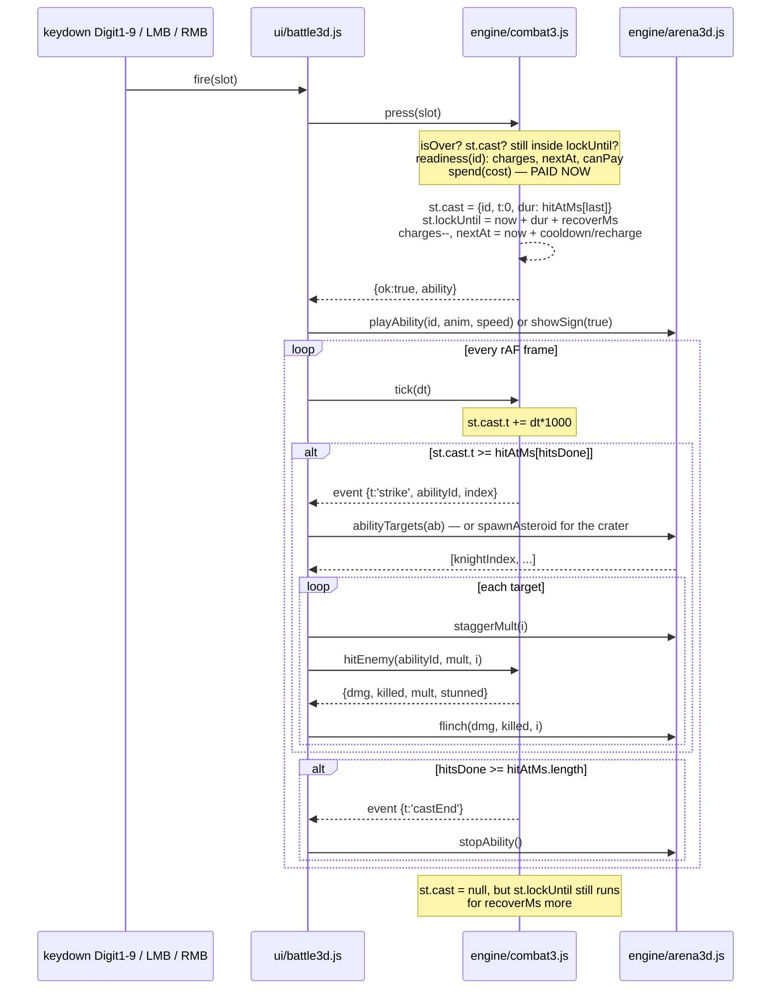
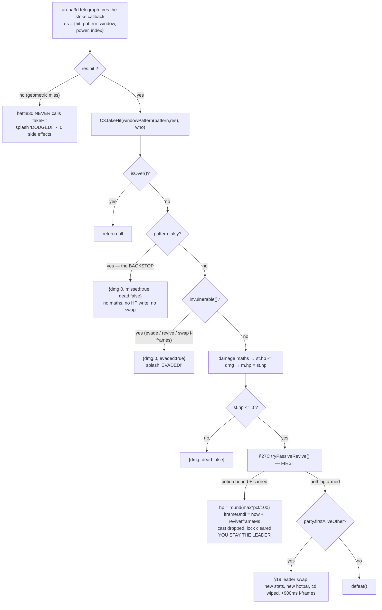

# Real-Time Combat

This page documents the **player's half** of a CHLOE fight: the resources you spend, the abilities you fire off the hotbar, how a cast turns into damage, and how a knight's swing turns into a number off your life bar. The rules live in one file — [engine/combat3.js](../game/js/engine/combat3.js) — which owns resources, cast state, cooldowns, evade windows and both damage formulas, and which touches no DOM and no Three.js. The 3D layer ([engine/arena3d.js](../game/js/engine/arena3d.js)) answers "is anyone inside this cone?" and reports "the strike connected"; the HUD ([ui/battle3d.js](../game/js/ui/battle3d.js)) renders whatever `combat3.snapshot()` returns. The knight's half — his AI, his patterns, his levelling — is [knight-ai.md](knight-ai.md) and [knight-levels.md](knight-levels.md).

> **Where spec and code disagree, the code wins.** GAME_SPEC.md §17 is the design contract, extended by §23 (pockets + asteroid stun), §25 (the miss bug + Water Wave) and §27 (mouse binds, revive potion). Every divergence found while writing this page is called out in [Spec vs code](#spec-vs-code) at the bottom rather than papered over.

---

## 1. What changed: turn-based to real-time

§16 shipped a turn-based arena. §17 replaced the player's side of it and kept everything else:

- **Kept from §16/§22**: the church, the knight, the telegraphed patterns, the dodge rules, the stagger state, `arena3d.telegraph(pattern, cb)`.
- **Replaced**: the round loop. You now stand in the church and play live — WASD, mouse look, `Shift` sprint, `Ctrl`/`C` crouch, `SPACE` evade, `1`-`9` and LMB/RMB to fire.

The turn-based system is **still in the repo and still runs** — [engine/battle.js](../game/js/engine/battle.js) (1146 lines) and [ui/battleui.js](../game/js/ui/battleui.js) drive the v2 phase/move fight, and [data/moves.js](../game/js/data/moves.js) is its content. That is a different combat system with a different data table. Nothing on this page applies to it, and vice versa: `data/abilities.js` is real-time, `data/moves.js` is turn-based, and they never mix.

The keyboard contract is one regex and one keycode in [ui/battle3d.js:1301](../game/js/ui/battle3d.js:1301):

```js
if (e.code === 'Space') { e.preventDefault(); doEvade(); return; }
var m = /^Digit([1-9])$/.exec(e.code);
if (m) { e.preventDefault(); fire(parseInt(m[1], 10) - 1); }
```

`Digit1` fires slot **0**. Slots are zero-indexed everywhere in the engine; the `+1` to a human label happens in exactly four places, and nowhere near dispatch: [combat3.js:1338](../game/js/engine/combat3.js:1338) (`resolveSlot(live[i], i, i + 1)`, the authoritative one), [ui/binds.js:69](../game/js/ui/binds.js:69) (`String(slot + 1)` on the Moves screen), and two consumers of those — the HUD's fallback when a slot carries no `key` ([battle3d.js:108](../game/js/ui/battle3d.js:108)) and the victory card's "ready on key N" line ([battle3d.js:1396](../game/js/ui/battle3d.js:1396)).

---

## 2. The four resources, and the three the arena actually tracks

§12 defines four per-character resources: **life**, **stamina**, **magic**, **faith**. All four come out of [engine/tree.js effectiveStats()](../game/js/engine/tree.js:271):

```
effStats = round(base + growth*(level-1))            [progression.statsAt]
         + tree stat grants                          [tree.statGrants]
         + ladder stat rows up to your level         [skilltree.stats]
         ; then atk += weapon.atkBonus
```

Real-time combat reads **three of the four**. `start()` snapshots them into `st.max` at [combat3.js:606](../game/js/engine/combat3.js:606):

```js
max: { hp: eff.life, mana: eff.magic, sta: eff.stamina },
```

**There is no `faith` in `engine/combat3.js` or `ui/battle3d.js` at all.** Faith is a turn-based resource: it resets to 3 at battle start, gains +1 per turn and is spent by moves declaring `cost.faith` ([battle.js:163](../game/js/engine/battle.js:163), [battle.js:471](../game/js/engine/battle.js:471)). The arena HUD draws exactly three bars ([battle3d.js:403](../game/js/ui/battle3d.js:403)). If you add a faith-costed ability to `data/abilities.js`, `spend()` will silently ignore the cost — it only reads `cost.sta` and `cost.mana` ([combat3.js:648](../game/js/engine/combat3.js:648)).

| Resource | `st` field | Source | Spent by | Regenerates |
|---|---|---|---|---|
| Life | `st.hp` | `eff.life` | knight hits | no (bandage / revive only) |
| Magic | `st.mana` | `eff.magic` | `cost.mana` | 2.5/s after 700ms idle |
| Stamina | `st.sta` | `eff.stamina` | `cost.sta`, evade, sprint | 9/s after 700ms idle (regen only — no item restores it) |
| Faith | — | `eff.faith` | turn-based moves only | not in the arena |

`st.hp` is **mirrored back onto the party member** on every write (`m.hp = st.hp`) in [takeHit](../game/js/engine/combat3.js:1010), [useItem](../game/js/engine/combat3.js:766) and [tryPassiveRevive](../game/js/engine/combat3.js:1088). `st.mana` and `st.sta` are **not** mirrored — they are fight-local. This is why [useItem](../game/js/engine/combat3.js:735) clamps against `st.max.mana` itself instead of routing through `inventory.use()`: that path clamps against the resting-full `member.mp` and would decide an energy drink was wasted while your live pool sat empty.

Chloe's numbers, for grounding ([data/characters.js:21](../game/js/data/characters.js:21), [data/weapons.js:6](../game/js/data/weapons.js:6)):

| Level | life | stamina | magic | atk (incl. +4 fret) | mag | def |
|---|---|---|---|---|---|---|
| 1 | 62 | 40 | 20 | 16 | 11 | 8 |
| 4 | 86 | 49 | 29 | 22 | 17 | 14 |
| 5 (+ladder row 5) | 106 | 58 | 32 | 24 | 19 | 16 |

Level 5 is the first ladder row that grants stats (`{ life: 12, stamina: 6 }`, [data/skilltree.js:68](../game/js/data/skilltree.js:68)); level 7 grants `{ magic: 8, mag: 2 }`.

---

## 3. The ability schema, field by field

Declared and documented at the top of [data/abilities.js](../game/js/data/abilities.js:4). Every field below is read by real code; the reader column names it.

| Field | Type | Meaning | Read by |
|---|---|---|---|
| `id` | string | must equal the table key — `press()` uses `a.id` to index `st.cd` | [combat3.js:802](../game/js/engine/combat3.js:802) |
| `name`, `icon`, `desc` | string | HUD chip, bind screen card | [battle3d.js:296](../game/js/ui/battle3d.js:296), [binds.js](../game/js/ui/binds.js) |
| `type` | one of 11 §12 types | damage type for the chart | [combat3.js:889](../game/js/engine/combat3.js:889) |
| `cost` | `{sta?, mana?}` | **paid when the cast STARTS**, not when it lands | [combat3.js:800](../game/js/engine/combat3.js:800) |
| `castMs` | ms | wind-up before the first hit. **Not used for the lock** — see below | display/intent only |
| `recoverMs` | ms | added to the lock after the LAST hit | [combat3.js:810](../game/js/engine/combat3.js:810) |
| `cooldownMs` | ms | wait before the next cast when charges remain | [combat3.js:805](../game/js/engine/combat3.js:805) |
| `charges` | int | uses before it must recharge (1 = simple) | [combat3.js:629](../game/js/engine/combat3.js:629) |
| `rechargeMs` | ms | per-charge refill; defaults to `cooldownMs` | [combat3.js:804](../game/js/engine/combat3.js:804), [combat3.js:1193](../game/js/engine/combat3.js:1193) |
| `range` | metres | radius of the hit test | [arena3d.js:2094](../game/js/engine/arena3d.js:2094) |
| `arc` | degrees, **FULL angle** | cone width; `abilityTargets` compares `cos(arc/2)` | [arena3d.js:2088](../game/js/engine/arena3d.js:2088) |
| `power` | % | `power/100` scales `atk` or `mag` **per hit** | [combat3.js:904](../game/js/engine/combat3.js:904) |
| `usesMag` | bool | `true` → scale off `mag`, `false` → off `atk` | [combat3.js:888](../game/js/engine/combat3.js:888) |
| `hits` | int | how many times one cast connects — **the engine ignores it** | no engine path; the Moves screen prints it ([binds.js:303](../game/js/ui/binds.js:303)) |
| `hitAtMs` | ms[] | the authoritative hit-window list; each entry is one damage resolution | [combat3.js:1176](../game/js/engine/combat3.js:1176) |
| `anim` | clip name | clip in `assets/3d/punch.glb` | [battle3d.js:658](../game/js/ui/battle3d.js:658) |
| `animSpeed` | float | playback rate multiplier | [battle3d.js:658](../game/js/ui/battle3d.js:658) |
| `cast` | `'sign'` | hand-sign cast pose instead of a rig clip | [battle3d.js:653](../game/js/ui/battle3d.js:653) |
| `vfx` | `'tornado'` \| `'asteroid'` \| `'wave'` | which effect the UI spawns | [battle3d.js:819](../game/js/ui/battle3d.js:819), [battle3d.js:1141](../game/js/ui/battle3d.js:1141) |
| `splash`, `splashRadius` | bool, metres | hits everyone near the crater, ignoring your facing | [battle3d.js:823](../game/js/ui/battle3d.js:823) |
| `stun` | `{ms}` | drives the §22 stagger state on every knight damaged | [combat3.js:923](../game/js/engine/combat3.js:923) |
| `shove` | `{distance, ms, lateral, breaksWindup}` | §25 lateral displacement | [battle3d.js:841](../game/js/ui/battle3d.js:841) |
| `cone` | `{reach, halfAngle}` | the same cone as `range`/`arc`, stated for the VFX | [abilities.js:178](../game/js/data/abilities.js:178) |
| `fallMs`, `fallFrom` | ms, metres | the asteroid's fall, for the VFX | [abilities.js:126](../game/js/data/abilities.js:126) |
| `grantedBy` | `'start'` \| `'tree'` | narrative label | nothing reads it |

**Three traps in this schema.**

1. **`hits` decides nothing.** `tick()` walks `a.hitAtMs` and nothing else ([combat3.js:1175](../game/js/engine/combat3.js:1175)); if `hits: 3` and `hitAtMs` has 2 entries you get 2 hits and no warning. It is not quite dead data, though — the Moves screen prints it on the ability card (`(a.hits || 1) + ' hits'`, [binds.js:303](../game/js/ui/binds.js:303)), so a mismatch is a card that lies to the player about a move they are about to bind. Keep them in step by hand.
2. **`castMs` does not gate anything.** The lock is computed from `hitAtMs[last]`, not from `castMs` ([combat3.js:807](../game/js/engine/combat3.js:807)). The asteroid is the reason: its `castMs` is 900 but its single hit lands at 1750 (900 cast + ~850 fall), so it locks you for **2210ms**, not 1360.
3. **`arc` is the FULL angle** but `cone.halfAngle` is half of it. `arc === cone.halfAngle * 2` by construction ([abilities.js:173](../game/js/data/abilities.js:173)); change one and you must change the other. `arena3d.abilityTargets` halves `arc` itself ([arena3d.js:2088](../game/js/engine/arena3d.js:2088)).

`grantedBy` is a label, not a rule. What a character may actually bind comes from [combat3.knownAbilities()](../game/js/engine/combat3.js:96), which asks the §19 ladder (`engine/skilltree.abilities(charId)`) and the legacy point-buy tree (`engine/tree.abilities(charId)`), and falls back to `['punch']` if both are empty.

---

## 4. Every ability, with its real numbers

Straight out of [data/abilities.js](../game/js/data/abilities.js). "Lock" is derived: `hitAtMs[last] + recoverMs`, the window in which you cannot cast or use an item.

| id | icon | type | mana | sta | castMs | recoverMs | **lock** | cooldownMs | charges | rechargeMs | range | arc | power | usesMag | hitAtMs | anim / cast | vfx |
|---|---|---|---|---|---|---|---|---|---|---|---|---|---|---|---|---|---|
| `punch` | ✊ | physical | — | 8 | 260 | 240 | **1000** | 700 | 1 | — | 2.6 | 70 | 45 | no | 260, 500, 760 | `Punch` ×1.35 | — |
| `hammer_fist` | 🤛 | physical | — | 26 | 620 | 420 | **1040** | 3200 | 1 | — | 2.9 | 55 | 190 | no | 620 | `Punch` ×0.55 | — |
| `ember_jab` | 🔥 | fire | 14 | 6 | 340 | 260 | **600** | 2400 | 2 | 3600 | 3.1 | 60 | 130 | yes | 340 | `Punch` ×1.15 | — |
| `fire_tornado` | 🌪 | fire | 18 | 12 | 1250 | 520 | **2820** | 12000 | 1 | — | 7.5 | 80 | 210 | yes | 1250, 1600, 1950, 2300 | `sign` | `tornado` |
| `asteroid` | ☄ | fire | 14 | 10 | 900 | 460 | **2210** | 9000 | 1 | — | 14.0 | 360 | 165 | yes | 1750 | `sign` | `asteroid` |
| `water_wave` | 🌊 | magical | 10 | 8 | 420 | 240 | **660** | 4500 | 1 | — | 6.0 | 80 | 40 | yes | 420 | `sign` | `wave` |
| `hollow_breaker` | ✨ | divine | 22 | 14 | 520 | 380 | **1140** | 6000 | 1 | — | 3.0 | 65 | 165 | yes | 520, 760 | `Punch` ×0.85 | — |

Extra blocks: `asteroid` carries `splash: true`, `splashRadius: 3.4`, `stun: {ms: 1500}`, `fallMs: 850`, `fallFrom: 11.0`. `water_wave` carries `cone: {reach: 6.0, halfAngle: 40}` and `shove: {distance: 3.2, ms: 300, lateral: true, breaksWindup: true}` — and deliberately **no** `stun` block ([abilities.js:204](../game/js/data/abilities.js:204)).

Fixed controls, not slots ([abilities.js:225](../game/js/data/abilities.js:225)):

| Control | Numbers |
|---|---|
| `abilityConfig.evade` | `cost: {sta: 22}`, `cooldownMs: 900`, `distance: 3.4`, `durationMs: 260`, `iframeMs: 220` |
| `abilityConfig.sprint` | `staPerSec: 12` |
| `abilityConfig.regen` | `staPerSec: 9`, `manaPerSec: 2.5`, `delayAfterUseMs: 700` |
| `abilityConfig` slots | `maxSlots: 9`, `baseSlots: 1` |

### What each ability is actually worth against the knight

The arena enemy is `hollow_black_knight` ([data/enemies.js:35](../game/js/data/enemies.js:35)): `type: 'occult'`, `resists: { physical: 1.0 }`. `types.multiplier(atkType, defender)` checks `defender.resists` **before** the chart, so an explicit resist entry overrides it ([elements.js:72](../game/js/data/elements.js:72)).

| Attack type | Chart row vs `occult` | Knight's `resists` | Effective | Which abilities |
|---|---|---|---|---|
| physical | **2.0** | `1.0` (override) | **1.0** | punch, hammer_fist |
| fire | 0.5 | — | **0.5** | ember_jab, fire_tornado, asteroid |
| magical | (unlisted) | — | **1.0** | water_wave |
| divine | 2.0 | — | **2.0** | hollow_breaker |

This is why `fire_tornado` carries `power: 210` and `asteroid` `power: 165` — both are halved on arrival, and the un-halved `water_wave` had to be dropped to `power: 40` so the cheapest escape in the kit does not out-damage the fire kit ([abilities.js:143](../game/js/data/abilities.js:143)). `hollow_breaker` is the only 2× in the kit; that is what its 22 magic buys.

---

## 5. The cast → hit → recover timeline

A press does **not** immediately do damage. Damage happens on a `strike` event emitted by `tick()`, one per entry in `hitAtMs`, which the UI turns into a geometric hit test and then a `hitEnemy()` call.



The exact ordering in [tick()](../game/js/engine/combat3.js:1164):

1. `st.now += dt * 1000` — the fight clock is **milliseconds accumulated from tick**, not `performance.now()`. There is no wall clock in `combat3`.
2. `syncLevels()` — per-knight levels are pulled from the 3D layer and their life is rescaled **by ratio**, never rewritten ([combat3.js:1154](../game/js/engine/combat3.js:1154)). See [knight-levels.md](knight-levels.md).
3. Cast progress: a `while` loop drains every hit window whose mark has passed, so a single frame can emit **more than one strike**. With today's numbers it never does: `dt` is clamped to 0.05s before it reaches `tick()` ([battle3d.js:1132](../game/js/ui/battle3d.js:1132)) and the tightest gaps in the whole table are 240ms (`punch` 260 → 500, `hollow_breaker` 520 → 760), so 50ms of clock can never cross two marks. The loop is a backstop for a future ability whose windows land closer than one frame apart, or for a caller that ticks with an unclamped `dt`.
4. `castEnd` fires and `st.cast = null` — **but `st.lockUntil` is untouched.** For the remaining `recoverMs` you cannot press anything, though `casting` in the snapshot has already gone null and the cast bar has already vanished.
5. Charge recovery.
6. Regen, gated on `st.now - st.lastSpendAt > delayAfterUseMs`.

**The lock is one timer shared with items.** `st.lockUntil` is written by `press()` ([combat3.js:810](../game/js/engine/combat3.js:810)) and by `useItem()` ([combat3.js:774](../game/js/engine/combat3.js:774)). That is deliberate: a bandage cannot be cancelled into a punch, and a punch cannot be cancelled into a bandage.

**Walking out mid-flurry drops the remaining hits, but not the cost.** The cost was paid at `press()`; each window independently asks `abilityTargets` and gets an empty list, which the UI renders as `splash('miss')` ([battle3d.js:866](../game/js/ui/battle3d.js:866)) and — as a side effect of the empty result — rolls a taunt from the nearest knight ([arena3d.js:2102](../game/js/engine/arena3d.js:2102)).

### Charges

Only `ember_jab` has `charges: 2`. The intent (§17: "burst uses that refill on `rechargeMs`") **is not what the code does**. [press()](../game/js/engine/combat3.js:802):

```js
c.charges = Math.max(0, c.charges - 1);
if (c.charges <= 0) c.nextAt = st.now + (a.rechargeMs || a.cooldownMs || 1000);
else c.nextAt = st.now + (a.cooldownMs || 600);
```

and [readiness()](../game/js/engine/combat3.js:705) refuses on **either** `charges <= 0` **or** `st.now < c.nextAt`. So after the first jab you hold 1 charge but are still gated by `cooldownMs: 2400`; at t=2400 the tick's charge loop refills you to 2 without advancing `nextAt` ([combat3.js:1191](../game/js/engine/combat3.js:1191)), and you are ready. `charges` therefore never reaches 0 for `ember_jab`, `rechargeMs: 3600` is **unreachable dead data**, and the ability behaves as a plain 2400ms-cooldown cast that draws a "2" charge pip. A knock-on: `cooldownPct()` divides by `a.rechargeMs || a.cooldownMs` ([combat3.js:716](../game/js/engine/combat3.js:716)), so the dial sweeps against 3600 while the real wait is 2400 — it starts the cooldown already two-thirds full.

---

## 6. The hotbar: 9 keys + 2 buttons, holding abilities or items

### The slot space

There are **eleven** addressable slots: number keys `0..slotCount-1` and two string ids — `'mouseL'` and `'mouseR'`.

- Number keys: `slotCount(charId)` = `baseSlots (1)` + ladder `slot` grants + legacy tree `abilitySlot` grants + `pocketSlots (2)`, clamped to `maxSlots (9)` ([combat3.js:134](../game/js/engine/combat3.js:134)).
- Mouse: `config.mouseSlots = ['mouseL', 'mouseR']` ([data/config.js:48](../game/js/data/config.js:48)), labelled `LMB` / `RMB` via `config.mouseSlotLabels` ([data/config.js:52](../game/js/data/config.js:52)). They are **outside** `maxSlots` and outside `slotCount()` entirely.

§27B added the two buttons by putting their ids in that one list, and that single data edit bought storage, validation, the Moves-screen row, the HUD tile, `entryAt`/`bind` and `press` — because the engine asks exactly one question, `isMouseSlot()` ([combat3.js:164](../game/js/engine/combat3.js:164)), to separate "addressed by id" from "indexed as a number key". `mouseSlotOf(side)` is the other half: it maps `0`/`'l'`/`'left'`/`'L'` → `mouseL` and `2`/`'r'`/`'right'`/`'R'` → `mouseR`, and nothing else ([combat3.js:174](../game/js/engine/combat3.js:174)).

**The ids are strings on purpose.** [data/config.js:36](../game/js/data/config.js:36) and [combat3.js:151](../game/js/engine/combat3.js:151) both spell out why: encoding the buttons as 9 and 10 would put them in the numeric key space where one off-by-one silently fires the wrong ability. `liveEntry()` refuses an out-of-range number outright rather than falling through to a button ([combat3.js:685](../game/js/engine/combat3.js:685)), and `resolvedMouseSlots()` is deliberately a **separate array** from `resolvedSlots()` so nobody can render them into the numeric hotbar and turn them into `press(9)` ([combat3.js:1342](../game/js/engine/combat3.js:1342)).

The ladder arithmetic is exact and already at the cap ([data/skilltree.js:42](../game/js/data/skilltree.js:42)): 1 base key + 6 `slot: 1` grants across levels 2, 3, 4, 6, 8, 9 = **7 ability keys by level 9**, plus 2 pockets = 9 = `maxSlots`. The generated 10-100 loop computes `keyCap = maxSlots - pocketSlots` from the real constants ([data/skilltree.js:106](../game/js/data/skilltree.js:106)) so it can never issue a "Wider Grip" row that would be eaten by the clamp.

### Bind storage

One flat array of strings per character, in run-scoped party state ([combat3.js:257](../game/js/engine/combat3.js:257)):

```
party.state.binds[charId]       = [entry|null, ...]     // number keys, index = slot
party.state.mouseBinds[charId]  = { mouseL, mouseR }    // entry|null each
```

The mouse map is rebuilt from `config.mouseSlots` on every read ([combat3.js:183](../game/js/engine/combat3.js:183)), so adding or removing a mouse id is a `data/config.js` edit and nothing else — including in `party.state`. The two keys above are the config list as it stands today, not a fixed shape: `mouseBinds()` builds a fresh object from `MOUSE_SLOTS()` each time, so an id the config no longer declares is dropped from a stored map on the next read rather than lingering in it.

An `entry` is either a bare ability id (`'punch'`) or `'item:<itemId>'` (`'item:bandage'`). The `item:` prefix is owned by `itemIdOf()` / `itemKey()` ([combat3.js:44](../game/js/engine/combat3.js:44)) and **stops at the `resolveSlot` boundary** — everything downstream sees `kind: 'item'` and a bare item id ([combat3.js:1270](../game/js/engine/combat3.js:1270)).

Three more per-character memories live alongside, and the split between them is the §27A bug fix:

| Store | Means | Written by |
|---|---|---|
| `party.state.bindsCleared[charId]` | "I emptied this off a key **on purpose**" | only `bind(charId, slot, null)` |
| `party.state.autoBound[charId]` | "this has been placed before" — **announce-only** | `autoBind`, `autoBindItems` |
| `party.state.pocketAt[charId]` | "we lent this item that slot, and may shuffle it" | `rememberPocket`; deleted on any manual bind |

`binds(charId)` **self-heals on every read** ([combat3.js:278](../game/js/engine/combat3.js:278)): any known, uncleared ability with no slot is placed while a slot is free. The old code placed each ability once *ever* and remembered it had, so rearranging keys in the Moves screen permanently stranded the displaced move. `autoBound` survives only to decide whether the victory card calls a placement "new".

`placeAbility()` ([combat3.js:403](../game/js/engine/combat3.js:403)) puts an ability in the **first free key, displacing a pocket squatting on a lower one** — the ladder promises "asteroid, key 3", and the pocket item that auto-bound to key 2 at run start (today the bandage — see [§7](#7-pockets-consumables-on-a-key)) must move right rather than push the reward to key 5. Only a pocket **we** placed (matching `pocketAt`) is moved.

### Editing binds

**[ui/binds.js](../game/js/ui/binds.js) is the Moves screen** and the only editor of the real-time hotbar. It renders the 9 keys and then every id in `config.mouseSlots` — eleven tiles in all today — in one row ([binds.js:228](../game/js/ui/binds.js:228)), plus an ability grid, a Pockets grid, and the §21 level ladder. A number key past the ladder's grant is drawn locked; a mouse slot never is, because you own your mouse from level 1. Binding is two clicks: select a slot, click a card. Every write goes through `put()` ([binds.js:147](../game/js/ui/binds.js:147)), which **binds and then reads back** — `bind()` can accept an entry and still validate it away on the next read, and only the read-back proves the key holds it. It is mounted from [ui/menu.js:218](../game/js/ui/menu.js:218).

**[ui/loadout.js](../game/js/ui/loadout.js) is NOT the hotbar editor**, despite the name. It is the Combat **v2** per-phase move loadout editor (five phases × up to five `data/moves.js` ids, stored in `party.state.loadouts`). It contains no reference to `binds` or `combat3` and it is the *fallback* rendered by the menu only when `CHLOE.ui.binds` is missing ([menu.js:223](../game/js/ui/menu.js:223)). Do not edit it expecting hotbar behaviour.

`bind(charId, slot, entry)` ([combat3.js:498](../game/js/engine/combat3.js:498)) enforces one entry per slot **across all eleven**: it clears the entry from the key array *and* the mouse map before writing, and it writes **both** stores back on every path — moving an entry from key 3 to RMB touches both lists, and writing back only the one the slot id pointed at is how half a move gets lost.

### The mouse split

[mousePress(side)](../game/js/engine/combat3.js:841) owns the room/arena boundary, and the whole protocol is one boolean:

- `handled: false` → this click is not a bind. The caller does whatever it would have done: grab in the room (§16 hands), click-to-engage in the arena.
- `handled: true` → the button fired its slot, **refusals included**, and nothing else may also happen on it.

The gate is `isOver()`, **not** `st`. A finished fight leaves its state object lying around until the next `start()`, so gating on `st` alone would mean a bound button ate the first grab of every trip home ([combat3.js:824](../game/js/engine/combat3.js:824)). On the UI side the restriction is enforced by *where the listener lives*: `wireKeys()` adds the `mousedown` capture listener when a fight begins and `unwireKeys()` removes it when it ends ([battle3d.js:1307](../game/js/ui/battle3d.js:1307)). A separate guard refuses the press while the pointer is unlocked, because an unlocked arena click is the player asking for the mouse back ([battle3d.js:1330](../game/js/ui/battle3d.js:1330)).

### Who is allowed to put something on the mouse

`combat3`'s auto-bind deliberately **never fills a mouse slot** ([combat3.js:340](../game/js/engine/combat3.js:340)): a button already has a job in the room, so the engine may offer you a key the ladder granted and must not quietly take a button you use for something else. LMB and RMB are opt-in, from the bind screen — a reward arriving mid-run lands on a number key or waits in the pool. A fresh run therefore opens with both buttons **empty**; nothing seeds them.

**Opt in with your first ability, though, and it ends up on the button *and* on key 1.** `binds()`' key-1 default fills an empty key 1 with `known[0]` unless that entry is already somewhere in the **key array** ([combat3.js:294](../game/js/engine/combat3.js:294)) — but the mouse entries it should also consult are only read nine lines later ([combat3.js:303](../game/js/engine/combat3.js:303)). So move `punch` from key 1 to LMB in the Moves screen and the next `binds()` read puts a second copy back on key 1: one entry, two slots, which is the one rule `bind()` exists to enforce. Its own comment already promises the check ("unless it is already bound elsewhere … used to leave a duplicate on key 1 and waste the key"). The fix is one condition in `binds()`.

---

## 7. Pockets: consumables on a key

§23's problem: abilities and their keys arrive together on the ladder, so every key you own is already spoken for and binding a bandage would cost you a move. The fix is that the hotbar **gains** room:

| Constant | Value | File |
|---|---|---|
| `config.pocketSlots` | `2` | [data/config.js:20](../game/js/data/config.js:20) |
| `config.itemUseMs` | `350` | [data/config.js:25](../game/js/data/config.js:25) |
| `config.itemCooldownMs` | `2500` | [data/config.js:30](../game/js/data/config.js:30) |

The two extra keys are **generic** — any slot takes either kind, and the bind screen deliberately does not draw "pocket keys" differently ([binds.js:8](../game/js/ui/binds.js:8)) because that would teach a rule that does not exist.

**What may sit on a key is a property of the item's `effect`, never of its id.** The rule lives in [data/items.js `CHLOE.data.itemRules`](../game/js/data/items.js:109) and splits in two:

| Class | Predicate | Today | Behaviour |
|---|---|---|---|
| **Pressable** | any of `COMBAT_EFFECT_KEYS = ['hp','mp']` present and `> 0` ([items.js:114](../game/js/data/items.js:114)) | `bandage` (+30 life, 15◆), `energy_drink` (+20 magic, 20◆) | you press the key, it happens |
| **Passive** | `effect.self && effect.revivePct > 0` | `revive_potion` (50%, 90◆) | armed; spends itself when you fall |
| **Bindable** | pressable **or** passive | all three | offered by the bind screen, accepted by `bind()` |

The list is two effect keys long because those are the two pools an item can put a number back into: `hp` and `mp`. Stamina is not on it, and nothing in `data/items.js` restores stamina — the bar comes back by regen alone ([§2](#2-the-four-resources-and-the-three-the-arena-actually-tracks)). Adding a third pool would be an edit at both ends: the key here, and a clamp in `useItem()`.

`combat3` keeps an inline fallback of each predicate (`eff.hp > 0 || eff.mp > 0` for pressable, [combat3.js:79](../game/js/engine/combat3.js:79)) but only reaches it when `CHLOE.data.itemRules` is absent, so the live answer always comes from `data/items.js`.

Deliberately excluded, with reasons in the file header ([items.js:89](../game/js/data/items.js:89)): `adrenaline_shot` (`revivePct` **without** `self` — it targets a fallen *other*, which needs a target picker) and the `cure:[...]` items (`antidote`, `tourniquet`, `sage_smoke` — nothing in the arena inflicts a §12 status, so a bound cure is a permanently dead key).

`useItem()` ([combat3.js:735](../game/js/engine/combat3.js:735)) is deliberately **not** the ability path — no readiness, no charges, no mana, no stamina. Its refusal order is load-bearing:

1. **Passive?** refused *first*, without touching the bag, the cooldown or the lock. A fumbled key must cost the most expensive item in the game exactly nothing.
2. **`inventory.count(id) <= 0`?** → `'None left.'` — checked **before** the cooldown, so an empty pocket says "go find one" rather than the lie "wait".
3. **`st.now < st.itemReadyAt`?** → `'Pockets cooling down'`.
4. **Would it heal 0 and restore 0?** → `'Already full.'`, refused **before** consuming. Never refund on a failed press is satisfied by never taking it.

**Step 4 reads exactly the two pools the data declares.** The clamp is written out longhand for `hp` and `mana` ([combat3.js:755-761](../game/js/engine/combat3.js:755)) — `Math.min(st.max.hp - st.hp, eff.hp || 0)` and the same for mana — and `hp <= 0 && mana <= 0` is the refusal. There is no `eff.sta` anywhere in `combat3.js`, which matches `COMBAT_EFFECT_KEYS` today; the two ends stay in step only because nobody has moved one of them.

Then: apply, mirror `m.hp`, `inv.remove(id, 1)`, set `st.lockUntil = now + itemUseMs` and `st.itemReadyAt = now + itemCooldownMs`. **`st.lastSpendAt` is deliberately untouched** ([combat3.js:776](../game/js/engine/combat3.js:776)) — an item costs no mana or stamina, so it must not stall the regen of pools it did not spend.

The 2500ms cooldown is **shared across every consumable key** and lives on `st` as a single `itemReadyAt` — it is a property of your hands, not of the item, which is also why a leader swap does not clear it (`takeHit`'s swap block resets `cd`, `cast` and `lockUntil` but not `itemReadyAt`, [combat3.js:1036](../game/js/engine/combat3.js:1036)). And the use lock grants **no i-frames**: you can be hit while you bandage, and that is the entire price of the feature.

A run starts holding **2 bandages and 1 energy drink** ([party.js:140-141](../game/js/engine/party.js:140)). `autoBindItems()` places what fits into whatever keys survive after abilities have had their pick, walking `itemRules.pressableIds()` in declaration order — `bandage`, then `energy_drink` — so no ids appear in the engine ([combat3.js:453](../game/js/engine/combat3.js:453)). Abilities always win: it runs *after* `autoBind()` and only ever writes into a `null` slot. An entry already sitting on a button is treated as bound and skipped (`onMouse.indexOf(key) !== -1 → continue`, [combat3.js:469](../game/js/engine/combat3.js:469)), so a bandage you moved to RMB does not get a second copy on a key.

**Trace it at level 1.** `slotCount` is `1 base + 0 ladder + 2 pockets = 3` keys; `knownAbilities` is `['punch']` (ladder row 1, `slot: 0` — the key it needs is `baseSlots`); both buttons are empty, because nothing seeds them. So the first `binds()` read of a fresh run resolves to:

```
key 1  punch            (the key-1 default)
key 2  item:bandage     (first pressable id, first free key)
key 3  item:energy_drink
LMB    —                RMB    —
```

That is the §23 layout exactly: one move, two pockets, nothing sacrificed to carry either consumable, and the first ladder grant at level 2 arriving with its own key rather than evicting one of them.

---

## 8. Evade

`SPACE`. [combat3.evade()](../game/js/engine/combat3.js:863) reads `abilityConfig.evade` and refuses in this order: fight over → `st.now < st.evadeReadyAt` → cannot pay `{sta: 22}` → `st.cast` is live ("Mid-swing"). On success it spends 22 stamina, sets `evadeReadyAt = now + 900`, sets `iframeUntil = now + 220`, and returns `{distance: 3.4, durationMs: 260}` for [arena3d.doEvade()](../game/js/engine/arena3d.js:2111) to dash along your WASD input, or straight away from the nearest knight if you are standing still.

Four things worth knowing:

1. **The i-frames end before the dash does.** `iframeMs: 220` < `durationMs: 260`. The last ~40ms of the dash is not invulnerable.
2. **Evade is not blocked by the recovery lock.** It checks `st.cast`, which `tick()` clears the moment the last hit window passes — but `st.lockUntil` runs on for `recoverMs`. So during recovery you can dash out but not cast. That asymmetry is intentional-looking and undocumented in the spec; treat it as the current contract.
3. **The engine's fallback disagrees with the data.** `st.iframeUntil = st.now + (cfg.iframeMs || 200)` ([combat3.js:871](../game/js/engine/combat3.js:871)) falls back to **200**, not the 220 in `abilityConfig`. Only reachable if `abilityConfig.evade` goes missing, but the two numbers should be the same.
4. **22 stamina is priced against the wave.** `water_wave` costs 8 stamina precisely so it does *not* compete with evade for the same empty bar ([abilities.js:153](../game/js/data/abilities.js:153)).

`invulnerable()` ([combat3.js:875](../game/js/engine/combat3.js:875)) is the single read of the i-frame window — `st.iframeUntil` is compared nowhere else. It is on the public surface, but inside the module today only `takeHit` and `snapshot()`'s `iframe` flag call it; no file outside `combat3.js` does. Treat the export as the seam for a test or a future consumer, not as evidence of one.

## Sprint and regen

Sprint is a **continuous drain, not a cost**: `arena3d`'s movement code calls `combat3.spendSprint(dt)` every frame while `Shift` is held and switches to walk speed when it returns `false` ([arena3d.js:2653](../game/js/engine/arena3d.js:2653), [combat3.js:664](../game/js/engine/combat3.js:664)). It burns `sprint.staPerSec = 12`, i.e. faster than the 9/s regen, so sprinting is always net negative.

Regen ([combat3.js:1199](../game/js/engine/combat3.js:1199)):

```js
if (st.now - st.lastSpendAt > (rg.delayAfterUseMs || 700)) {
  st.sta  = Math.min(st.max.sta,  st.sta  + (rg.staPerSec  || 9)   * dt);
  st.mana = Math.min(st.max.mana, st.mana + (rg.manaPerSec || 2.5) * dt);
}
```

`lastSpendAt` is pushed forward by `spend()` (any ability, and evade) and by `spendSprint()` — **not** by `useItem()`. Both pools share one delay timer: casting a spell also stalls stamina regen and vice versa. At 2.5 magic/s a `water_wave` (10 magic) is bought back in 4s, which is why its 4500ms cooldown and its price were tuned to arrive together ([abilities.js:162-168](../game/js/data/abilities.js:162)).

---

## 9. The damage formula, as actually implemented

There are **two** formulas, both in `combat3.js`, and neither is shared.

### You hit the knight — `hitEnemy(abilityId, mult, target)`

[combat3.js:880](../game/js/engine/combat3.js:880). Called by the UI once per knight per hit window.

```js
var base  = a.usesMag ? eff.mag : eff.atk;
var chart = types().multiplier(a.type, st.enemyDef);
var rand  = 0.9 + Math.random() * 0.2;
var def   = (e.stats && e.stats.def) || (st.enemyStats && st.enemyStats.def)
            || (st.enemyDef.stats && st.enemyDef.stats.def) || 0;
var dmg = Math.max(1, Math.round(
  base * ((a.power || 50) / 100) * chart * (mult || 1) * rand - def * 0.5));
```

- `base` = **your** `eff.mag` or `eff.atk`, re-read from `party.effStats(m)` on every hit — so a level-up mid-fight applies immediately.
- `chart` — `st.enemyDef` is passed as the **defender object**, so its `resists` map overrides the 11×11 chart ([elements.js:63](../game/js/data/elements.js:63)).
- `mult` — the caller's positional/state bonus. Today it is exclusively `arena3d.staggerMult(i)` = `staggerTakeMult: 1.5` while that knight is reeling ([battle3d.js:886](../game/js/ui/battle3d.js:886), [arena3d.js:3497](../game/js/engine/arena3d.js:3497)). This multiplier **must** cross the boundary here: the 3D layer knows he is reeling but not what a hit is worth, and `combat3` owns the damage sum but knows nothing about his footing.
- `def` — read off the knight **that was actually hit** (`e.stats.def`), falling back to the round's block and then the flat `data/enemies.js` value. A level-1 knight standing next to a level-7 one must not be as hard to cut ([combat3.js:894](../game/js/engine/combat3.js:894)).
- `Math.max(1, ...)` — every connecting hit is worth at least 1.
- `def * 0.5`, not a percentage — flat-halved defence subtraction, matching §17's stated formula exactly.

Return: `{dmg, killed, mult: chart, index, cleared, stunned, stunMs}`. `mult` in the **return** is the chart multiplier, not the input `mult` — the HUD prints `SUPER` when `res.mult >= 2` ([battle3d.js:892](../game/js/ui/battle3d.js:892)).

Worked example, punch at level 4 vs a level-2 knight (`atk` 22, power 45, chart 1.0, knight `def` 5): `22 × 0.45 × 1.0 × 1.0 × 1.0 − 2.5 ≈ 7` per hit, ×3 hits ≈ 22 for 8 stamina. One `water_wave` tick at the same level is `17 × 0.40 × 1.0 − 2.5 ≈ 4` — the escape loses to the free move it sits next to, on purpose ([abilities.js:179](../game/js/data/abilities.js:179)).

### The knight hits you — `takeHit(pattern, index)`

[combat3.js:970](../game/js/engine/combat3.js:970).

```js
var chart = types().multiplier(atkType, { type: cdef.type || cdef.element, resists: cdef.resists || null });
var rand  = 0.9 + Math.random() * 0.2;
var dmg = Math.max(1, Math.round(
  (es.atk || 8) * (patternPower(pattern) / 100) * chart * rand - eff.def * 0.5));
// then, tree resist nodes are PERCENT cuts applied AFTER the chart:
if (cut) dmg = Math.max(1, Math.round(dmg * (1 - Math.min(90, cut) / 100)));
```

- `es` = the **striker's own** stat line: `st.enemies[index].stats` when the caller names an index, else `strikerIndex()` which asks `arena3d.striker()` for whichever knight is mid-strike-callback *right now*. `arena3d` clears that the instant the callback returns, so a deferred caller gets `-1` and the round baseline rather than a stale knight ([combat3.js:961](../game/js/engine/combat3.js:961), [arena3d.js:2998](../game/js/engine/arena3d.js:2998)).
- `atkType` is `st.enemyDef.type || st.enemyDef.element` — the **enemy's own type**, not the pattern's. Patterns in [data/arena3d.js](../game/js/data/arena3d.js:321) carry no type at all.
- The defender object is built from `data/characters.js` (`type`, `resists`), which is `{}` at base — resists come from the tree.
- Tree resist nodes are **percent cuts applied after the chart**, capped at 90%, exactly as §16 specifies and `battle.js` mirrors.
- Pattern powers today ([data/arena3d.js](../game/js/data/arena3d.js:324)): `slash` 110 (weight 4), `overhead` 145 (weight 3), `charge` 170 (weight 2), `thrust_combo` 70/70/95 per window (lunge on the third), `ground_slam` 190 (weight 2).

**Multi-hit patterns state power per window.** `takeHit` only reads `pattern.power`, so the UI hands it a **shallow copy carrying this window's number** via `windowPattern(p, res)` ([battle3d.js:992](../game/js/ui/battle3d.js:992)) — without that, `thrust_combo`'s heavy 95 third stab quietly lands for a 70 jab.

---

## 10. §25: a miss must cost nothing

### The bug that existed

`ui/battle3d.js` used to call `C3.takeHit(res.hit ? windowPattern(pattern, res) : null)` — passing `null` on a **geometric** miss so "the miss went through one path". `takeHit()` guarded only `isOver()` and `invulnerable()`. With no null-pattern guard the `null` fell straight through into the damage maths, was priced at the old `(pattern && pattern.power) || 100` fallback, and `Math.max(1, ...)` guaranteed at least one point off the bar — while the UI, branching on its own `res.hit` flag, printed "DODGED!" and "The blade splits empty air". **The feedback and the health bar disagreed and every clean dodge quietly cost life.** Only the 220ms evade i-frames ever really prevented damage.

### The fix, at both ends



Three changes, all present in the current code:

1. **[combat3.js:984](../game/js/engine/combat3.js:984)** — `if (!pattern) return { dmg: 0, missed: true, dead: false };` placed **before any maths, any HP write and any leader-swap check**, so a miss has no side effects at all.
2. **[battle3d.js:1057](../game/js/ui/battle3d.js:1057)** — `var out = res.hit ? C3.takeHit(windowPattern(pattern, res), who) : null;` The engine is not asked at all on a miss; the dodge feedback is rendered from `res.hit` alone.
3. **[combat3.js:942 `patternPower()`](../game/js/engine/combat3.js:942)** — the `|| 100` fallback was "a lie by omission" that made a data bug look like a design choice. It now `console.warn`s **once per pattern id** (guarded by a `warnedPower` map, because this runs inside the swing loop and a warn per hit would bury the console) and *then* returns 100 anyway, because a bad row in `data/arena3d.js` must not be able to stop a fight mid-round.

Defence in depth is the point: **either fix alone leaves the trap armed for the next caller.** The UI comment names the two outcomes apart deliberately ([battle3d.js:1044](../game/js/ui/battle3d.js:1044)):

- **DODGED!** — his blade never reached you. Footwork won it; it cost nothing but ground.
- **EVADED!** — it *would* have landed and the i-frames ate it. You paid 22 stamina and the timing was yours.

Regression test the spec asks for: `takeHit(null)` leaves `hp` byte-identical.

---

## 11. Control effects: the asteroid stun and the wave shove

These are the two abilities that do something other than damage, and the difference between them is deliberate.

### Asteroid → the §22 stagger state

`asteroid` carries `stun: { ms: 1500 }`. **This is not a new status.** It drives the existing §22 `stagger` state, so the reeling pose, the "cannot attack / cannot turn" rules and the `staggerTakeMult: 1.5` damage bonus are the ones the knight already has ([abilities.js:117](../game/js/data/abilities.js:117), [arena3d.js:3084](../game/js/engine/arena3d.js:3084)).

It is applied **inside `hitEnemy`**, not at the splash call site ([combat3.js:923](../game/js/engine/combat3.js:923)):

```js
var stunMs = (a.stun && a.stun.ms) || 0;
if (stunMs && !killed) {
  var a3d = CHLOE.engine.arena3d;
  if (a3d && typeof a3d.stun === 'function') a3d.stun(idx, stunMs / 1000);
}
```

Reasons, all in the source comments: this is the only place that knows *both* which knight was damaged *and* by what; it reads the ability's own `stun` block so a future splash weapon inherits it by being data; it is a one-way, fully-guarded poke that degrades to nothing on the no-WebGL surface; **seconds, not ms**, because `arena3d`'s timers are all seconds. A knight the hit **killed** is never stunned — the death animation owns that body.

`arena3d.stun(index, seconds)` ([arena3d.js:3102](../game/js/engine/arena3d.js:3102)) **refreshes, never stacks**: `staggerT = max(staggerT, s)`. Two rocks a beat apart would otherwise add up to three seconds of a knight standing still, which stops being a punish window and becomes a delete button. It also tracks `stunT` alongside on the same clock, purely so the HUD can float "STUNNED" where a damage stagger reads "STAGGERED!". It calls `clearAttack(k)` (he drops the swing mid-arc) but deliberately **does not** call the pending telegraph callback, and it must **never** touch `staggerMeter` — banking the stun into the buildup meter would hand the very next chip hit a free second stagger and break "chip damage never accumulates into a stun".

The rock is worth one of nine keys against a squad **because of the stun, not the damage** — at chart 0.5 its damage alone loses to `fire_tornado`.

### Water Wave → lateral displacement, no stun

`water_wave` carries `shove: { distance: 3.2, ms: 300, lateral: true, breaksWindup: true }` and **no `stun` block**. That absence is the design: duplicating the stun would make the cheapest ability in the kit the best lockdown in it, and the asteroid would have no job ([abilities.js:204](../game/js/data/abilities.js:204)).

**The displacement is lateral, not backward.** Each caught knight is thrown perpendicular to *your* facing, toward whichever side he is already nearest, so the wave **parts** the line rather than pushing it back as a wall — pushing straight back just re-forms the same wall three metres away and leaves you still cornered. 3.2m is sized off the geometry: player body 0.35m + knight 0.55m + `arena.knightMinDist` 1.3m means a knight dead ahead must end ~2.2m off your centre line to stop blocking it, and 3.2m clears that with ~1m of slack for the containment clamp to eat ([abilities.js:189](../game/js/data/abilities.js:189)).

Its damage still goes through the ordinary arc path — `abilityTargets(ab)` ([battle3d.js:831](../game/js/ui/battle3d.js:831)), the same cone every other reach/arc ability is priced by; `a3d.spawnWave(ab)` is the sheet of water and nothing else. Order of operations in [resolveStrike](../game/js/ui/battle3d.js:837) matters and is commented as such: build the shove **plan** from the pre-wave floor → apply damage → throw the survivors. Nobody's position is read after he has started moving, and nobody is thrown after he has been killed. `arena3d.shove` owns containment (clamp and stop short, never teleport out of the world) and owns `clearAttack`; both halves are feature-detected independently, so on the no-WebGL stub the wave still casts, still damages and still reads on screen — it simply moves nobody.

### Splash targeting

`asteroid` has `arc: 360` and `range: 14.0`, and it does **not** go through `abilityTargets`. The UI branches on `ab.vfx === 'asteroid'`, calls `a3d.spawnAsteroid(cb)` and resolves damage in the fall callback against `a3d.asteroidTargets(splashRadius)` ([battle3d.js:819](../game/js/ui/battle3d.js:819)) — so the damage lands where the rock lands, at the frame it lands, regardless of where you are looking by then. Its single `hitAtMs: [1750]` is what keeps the engine's lock in step with that fall.

---

## 12. §27C: the revive potion you never press

`revive_potion` — `effect: { revivePct: 50, self: 1 }`, price 90 ([items.js:45](../game/js/data/items.js:45)). `self: 1` is what separates it from `adrenaline_shot`: that one is aimed at a body already on the floor, this one is drunk by the body the knight is currently hunting.

**The ordering is the feature.** [takeHit](../game/js/engine/combat3.js:1020):

```js
var revived = (st.hp <= 0) ? tryPassiveRevive() : null;
// ... only then the §19 leader swap
```

Swap first and the potion could only ever be poured over a body that has already lost the fight — it would save the corpse. Revive first and the leader stays the leader: her level, her hotbar, her cooldowns, the run intact. That single line of sequencing is what the 90 shards buy.

[tryPassiveRevive()](../game/js/engine/combat3.js:1069) is reached **only** from the killing-blow branch, which makes "never consumed on a survivable hit" true by construction rather than by a check that could drift. It scans `allEntries(charId)` — **every slot there is: the number keys and both buttons** ([combat3.js:214](../game/js/engine/combat3.js:214), which is `binds().concat(mouseEntries())` and therefore grows with `config.mouseSlots` by itself) — because the potion works by being *bound*, and which slot is the player's business. First bound, carried, passive item wins. Then:

- `st.hp = max(1, round(st.max.hp * pct / 100))`, and `m.hp` mirrored.
- `st.iframeUntil = st.now + (config.reviveIframeMs || 900)` — a breath, not a reset. Without it the very next hit window of the swing that just killed you kills you again and the potion bought one frame ([data/config.js:60](../game/js/data/config.js:60)).
- `st.cast = null; st.lockUntil = 0` — you were mid-animation when you died and finishing it would read as a rewind. **Resources are not restored**: you are alive, not fresh.
- A guarded, DOM-free `CHLOE.ui.toast(...)` and a read-and-clear `takeRevive()` feed for the HUD splash.

Because it puts `hp` back above zero, the next fall is a genuinely new fall and takes a second potion — **one per fall, exactly, with no counter to keep in step**.

**A passive is never pressable.** [useItem](../game/js/engine/combat3.js:743) refuses it first, `resolveSlot` returns `passive: true, armed: count > 0, ready: false, cdPct: 0` so nothing that draws a pressable key lights it up ([combat3.js:1283](../game/js/engine/combat3.js:1283)), the HUD paints an `armed` class instead of `ready`/`cooling` ([battle3d.js:360](../game/js/ui/battle3d.js:360)), and `fire()` refuses it again in the UI before the click even reaches the bag ([battle3d.js:629](../game/js/ui/battle3d.js:629)). Four refusals for one key, and all four are wanted: a fumbled press must cost the most expensive item in the game exactly nothing.

**The i-frame constant is duplicated.** `config.reviveIframeMs` is 900, and the §19 leader swap sets `st.iframeUntil = st.now + 900` as a **literal** ([combat3.js:1039](../game/js/engine/combat3.js:1039)). `config.js`'s own comment says they are "deliberately the same 900ms the leader swap already grants" — true today, but editing `reviveIframeMs` silently desyncs them.

---

## 13. Statuses and buildup — not in this fight

§12 defines seven buildup statuses, keyed off damage type in [elements.js:37](../game/js/data/elements.js:37):

| Type | Status | Effect (§12, as coded in [battle.js:101](../game/js/engine/battle.js:101)) |
|---|---|---|
| fire | `burn` | 3 turns, 8% max life per tick |
| lightning | `shock` | 2 turns, ×0.75 speed, 30% skip chance |
| blood | `bleed` | 2 turns, 15% instant + 5% per tick |
| poison | `poisoned` | 5 turns, 5% per tick |
| occult | `curse` | 3 turns, ×0.80 mag, faith gain stopped |
| virus | `infection` | 3 turns, ×0.5 healing, ×0.85 atk |
| ghost | `haunt` | 2 turns, 20% whiff chance |

Buildup meters run 0-100, decay 10 per own turn, are blocked by `statusImmune` and reduced by tree `statusResist`. **All of that lives in [engine/battle.js](../game/js/engine/battle.js) and is rendered by [ui/battleui.js](../game/js/ui/battleui.js) — the turn-based system.** `engine/combat3.js` has no status state, no buildup meters and no `statusImmune` check, and no ability in `data/abilities.js` declares a `buildup` block. `data/items.js` says as much when explaining why cure items are not bindable: "§12 statuses come from enemies that do not exist in the arena", so a bound cure would be a permanently dead key ([items.js:94](../game/js/data/items.js:94)).

If you add statuses to real-time combat, the type→status map and the seven effect definitions already exist; what does not exist is a per-second tick, a meter on `st`, or any HUD for it.

---

## 14. Traps, ordering constraints and silent failure modes

**Load order is load-bearing.** [game/index.html](../game/index.html) is a hand-ordered list of classic `<script>` tags. [data/skilltree.js](../game/js/data/skilltree.js:102) reads `CHLOE.data.abilityConfig` and `CHLOE.data.config` **at load time** inside its IIFE to compute `keyCap`. So `config.js` (line 30) and `abilities.js` (line 46) must both precede `skilltree.js` (line 47). Move `skilltree.js` up and `keyCap` silently degrades to `maxSlots - 0` and the ladder hands out a tenth key. `combat3.js` (line 72) reads its data lazily through accessor functions (`ABIL()`, `CFG()`, `GCFG()`, `ITEMS()`) and is therefore order-tolerant — that indirection is why.

**Slot 0 is not "key 1" in any API.** Four places add the `+1` and all four are labels: `resolveSlot` ([combat3.js:1338](../game/js/engine/combat3.js:1338)), the Moves screen ([binds.js:69](../game/js/ui/binds.js:69)), the HUD's fallback for a slot with no `key` ([battle3d.js:108](../game/js/ui/battle3d.js:108)) and the victory card ([battle3d.js:1396](../game/js/ui/battle3d.js:1396)). Nothing that dispatches a press ever sees the `+1` — the keydown handler subtracts it back off (`fire(parseInt(m[1], 10) - 1)`).

**A mouse slot has no number, and adding the `+1` to one would be a lie.** `resolveSlot` is handed `mouseLabel(id)` (`LMB`/`RMB`) as its `key`, never an index ([combat3.js:1354](../game/js/engine/combat3.js:1354)). The victory card is the one place that still does raw `pl.slot + 1` arithmetic; it is safe only because `autoBind` never places onto a mouse slot.

**`liveSlots()` re-reads binds every frame.** `st.slots` is snapshotted at `start()` and then never used for dispatch — `press()` goes through `liveEntry()` → `binds(charId)` ([combat3.js:677](../game/js/engine/combat3.js:677)), because a snapshot taken at `start()` meant rebinding during a fight silently did nothing. This also means the §27A self-heal runs on every press.

**`mousePress` gates on `isOver()`, never on `st`.** See §6. Gating on `st` eats the first grab of every trip back to the room.

**`arena3d.abilityTargets` is a query with a side effect.** It rolls a taunt from the nearest knight when it returns an empty list ([arena3d.js:2097](../game/js/engine/arena3d.js:2097)). Calling it twice to "check first, then hit" would double-roll the taunt. Use `abilityHits()` only when you want that side effect too.

**`arena3d.striker()` is valid for exactly one call stack.** It is set immediately before the telegraph callback and cleared in a `finally` ([arena3d.js:2987](../game/js/engine/arena3d.js:2987)). Any deferred `takeHit` gets `-1` and the round baseline. Pass the index explicitly when you have it — [battle3d.js:1057](../game/js/ui/battle3d.js:1057) does.

**The recovery lock outlives the cast bar.** `st.cast` is nulled at the last hit window; `st.lockUntil` runs on. `snapshot().casting` therefore goes null while presses are still refused with `'Recovering.'`.

**Regen has one shared delay for two pools.** Casting a spell stalls stamina regen. `useItem` is exempt by design.

**Every knight-facing engine call is guarded and degrades to nothing.** `combat3` reaches into `arena3d` in exactly three places — `stun`, `striker`, `knightLevels` — and each is `typeof x === 'function'` checked, so the no-WebGL surface ([arena3d.js:77](../game/js/engine/arena3d.js:77)) keeps the fight running. Preserve that shape if you add a fourth.

**`bind()` must write both stores.** It edits `list` and `mouse` on every path and writes both back ([combat3.js:546](../game/js/engine/combat3.js:546)). Writing back only the store the slot id pointed at is how half a move gets lost when it moves between a key and a button.

---

## 15. Spec vs code

Found while writing this page. **The code is what runs.**

| Claim | Where | Reality |
|---|---|---|
| "`charges` > 1 gives burst uses that refill on `rechargeMs`" (§17) | [GAME_SPEC.md §17](../GAME_SPEC.md) | `readiness()` gates on `nextAt` **as well as** `charges`, and `press()` sets `nextAt = cooldownMs` while charges remain. `ember_jab` therefore cannot burst; its `charges: 2` never drops to 0 and its `rechargeMs: 3600` is unreachable. See [§5](#charges). |
| "the 3D layer tests reach+arc (`arena3d.abilityHits`)" (§17) | [GAME_SPEC.md §17](../GAME_SPEC.md) | The UI calls `abilityTargets(ab)` (an index list) instead; `abilityHits` is a thin boolean wrapper nothing in the fight path uses ([arena3d.js:2108](../game/js/engine/arena3d.js:2108)). |
| "Resources … life, magic, stamina" per §17 vs "4 resources" per §12 | [GAME_SPEC.md §12/§17](../GAME_SPEC.md) | Correct as written, but worth stating loudly: **faith does not exist in real-time combat.** `spend()` ignores `cost.faith` silently. |
| §23 names the pocket auto-bind order as "`bandage` then `energy_drink`" | [GAME_SPEC.md §23](../GAME_SPEC.md) | True today, but not because the engine says so: `pressableIds()` walks `data/items.js` in declaration order ([items.js:164](../game/js/data/items.js:164)) and `bandage` happens to be declared first. Reordering the table reorders the pockets, and no ids are named in the engine — which is the intended shape, but it means the spec sentence is a description of the data, not a rule anything enforces. |
| §17's ability schema omits `cast`, `vfx`, `splash`, `splashRadius`, `stun`, `shove`, `cone`, `fallMs`, `fallFrom` | [GAME_SPEC.md §17](../GAME_SPEC.md) | All nine are real fields added by §18/§21/§23/§25 and read by live code. The §17 schema line is stale; [data/abilities.js](../game/js/data/abilities.js:4) is the current one. |
| "`LMB` and `RMB` join keys 1-9 as bind targets: **11 slots**" (§27B) | [GAME_SPEC.md §27B](../GAME_SPEC.md), echoed by the headers in [binds.js:11](../game/js/ui/binds.js:11) and [combat3.js:148](../game/js/engine/combat3.js:148) | Accurate: `config.mouseSlots` is exactly `['mouseL', 'mouseR']`, so the live count is 9 + 2 = 11 and all three agree. None of the three is the *source* of it, though — nothing in the engine counts slots by hand; `slotIds()`, `allEntries()`, the Moves row and the HUD strip all walk the config list. The three "11"s are prose, and prose is what would have to be corrected by hand if that list ever grew. |

**Three things that look like genuine bugs**, distinct from spec drift.

1. **`st.hpMax` is never assigned.** `victory()` writes `hpMax: Math.round(st.hpMax || st.hp)` into every trophy ([combat3.js:1225](../game/js/engine/combat3.js:1225)), but nothing in `combat3.js` ever sets `st.hpMax` — the field is `st.max.hp`. Every trophy therefore records `hpMax === hpLeft`, and the dressing-room board prints "round N fell to Chloe — 47/47 life left" no matter how close it was ([displays.js:248](../game/js/engine/displays.js:248)). One-character fix: `st.max.hp`.
2. **The `ember_jab` charge system, above.** Either `readiness()` should not gate on `nextAt` while charges remain, or `charges: 2` / `rechargeMs: 3600` should be dropped from the data so the ability stops advertising a burst it does not have.
3. **Your first ability ends up on a button *and* on key 1.** `binds()`' key-1 default checks the key array for a duplicate but not the mouse map ([combat3.js:294](../game/js/engine/combat3.js:294)), so binding `punch` to LMB from the Moves screen gets you a second copy back on key 1 on the very next read — the one-entry-one-slot rule `bind()` enforces, undone by the default that runs before the mouse entries are consulted. One condition.

Minor: `evade()`'s `cfg.iframeMs || 200` fallback disagrees with `abilityConfig.evade.iframeMs: 220`, and the 900ms leader-swap i-frame is a literal where the revive path reads `config.reviveIframeMs`.

---

## Where to change what

| I want to… | Edit |
|---|---|
| Retune an ability's cost, timing, reach, power, hit windows | [game/js/data/abilities.js](../game/js/data/abilities.js) |
| Add a new ability | [game/js/data/abilities.js](../game/js/data/abilities.js), then grant it from a ladder row in [game/js/data/skilltree.js](../game/js/data/skilltree.js) — **with a `slot` on the same row** |
| Change evade cost / i-frames / dash distance, sprint drain, regen rates | `CHLOE.data.abilityConfig` at the foot of [game/js/data/abilities.js](../game/js/data/abilities.js:225) |
| Change the hotbar width, pocket count, item use-lock or item cooldown, mouse slot ids/labels, revive i-frames | [game/js/data/config.js](../game/js/data/config.js) (`pocketSlots`, `itemUseMs`, `itemCooldownMs`, `mouseSlots`, `mouseSlotLabels`, `reviveIframeMs`) and `maxSlots`/`baseSlots` in [game/js/data/abilities.js](../game/js/data/abilities.js:225) |
| Change type effectiveness, add/rename a damage type, change the status-per-type map | [game/js/data/elements.js](../game/js/data/elements.js) — the chart is 11×11 and closed; adding a row means 22 new multipliers |
| Change what the knight resists, or his flat stat floor | [game/js/data/enemies.js](../game/js/data/enemies.js) (`hollow_black_knight.resists` / `.stats`) |
| Change the player damage formula | `hitEnemy()` at [combat3.js:880](../game/js/engine/combat3.js:880) |
| Change the incoming damage formula, or the miss/evade/revive/swap ordering | `takeHit()` at [combat3.js:970](../game/js/engine/combat3.js:970) |
| Change cast/cooldown/charge/lock rules | `press()` at [combat3.js:790](../game/js/engine/combat3.js:790) and `tick()` at [combat3.js:1164](../game/js/engine/combat3.js:1164) |
| Change which items may sit on a key, or add a new passive class | `CHLOE.data.itemRules` in [game/js/data/items.js](../game/js/data/items.js:109) — never a list of ids in the engine |
| Add an item, change a price, an effect or a description | [game/js/data/items.js](../game/js/data/items.js) |
| Change auto-bind / self-heal / pocket-shuffle behaviour | `binds()`, `autoBind()`, `autoBindItems()`, `placeAbility()` in [combat3.js:278-484](../game/js/engine/combat3.js:278) |
| Change what a **new run** starts holding | the `inventory.add` block in `newGame()`, [game/js/engine/party.js](../game/js/engine/party.js:139) — what gets auto-placed into the pockets from it is `pressableIds()`' business, not this block's |
| Change the bind screen (slot row, ability cards, pocket cards, ladder) | [game/js/ui/binds.js](../game/js/ui/binds.js) |
| Change the arena HUD — bars, hotbar chips, cooldown sweeps, splashes, the centre line | [game/js/ui/battle3d.js](../game/js/ui/battle3d.js) |
| Change key/mouse bindings for the arena | `wireKeys()` at [battle3d.js:1297](../game/js/ui/battle3d.js:1297) |
| Change the hit-test cone, evade dash, stun, or shove | [game/js/engine/arena3d.js](../game/js/engine/arena3d.js) — `abilityTargets`, `doEvade`, `stun`, `shove` |
| Change knight patterns and their per-window powers | [game/js/data/arena3d.js](../game/js/data/arena3d.js:321) |
| Change the **turn-based** fight (phases, moves, statuses, faith) | [game/js/engine/battle.js](../game/js/engine/battle.js), [game/js/data/moves.js](../game/js/data/moves.js), [game/js/ui/battleui.js](../game/js/ui/battleui.js), [game/js/ui/loadout.js](../game/js/ui/loadout.js) — **not** this system |

---

**See also:** [architecture.md](architecture.md) · [run-loop.md](run-loop.md) · [knight-ai.md](knight-ai.md) · [knight-levels.md](knight-levels.md) · [difficulty-scaling.md](difficulty-scaling.md) · [knight-rig.md](knight-rig.md) · [progression.md](progression.md) · [world-room.md](world-room.md) · [stages.md](stages.md) · [data-reference.md](data-reference.md) · [tooling.md](tooling.md) · [debugging.md](debugging.md)
