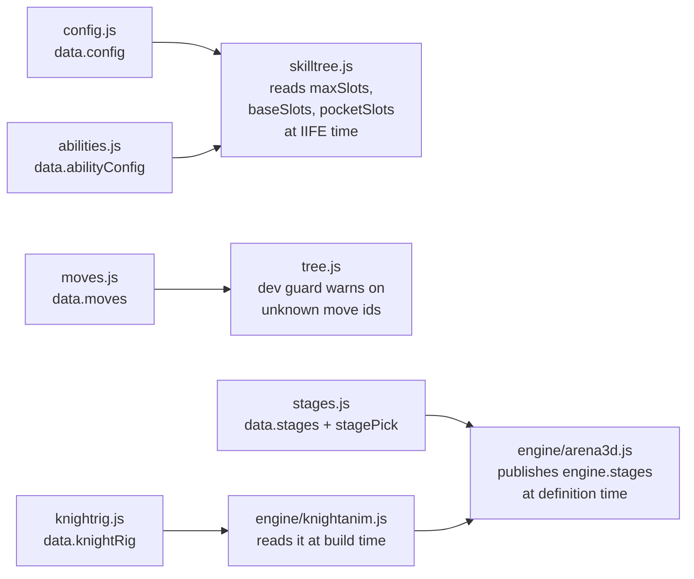
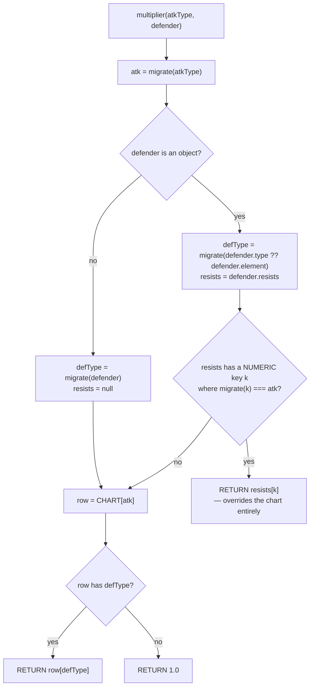

# Data Reference

`game/js/data/` is the content layer of CHLOE: twenty classic `<script>` files that do
nothing but hang plain objects off `window.CHLOE.data`. No module system, no build, no
imports — each file starts with `window.CHLOE=window.CHLOE||{}; CHLOE.data=CHLOE.data||{};`
and then assigns one or two properties. Engines (`game/js/engine/`) read those objects and
UI (`game/js/ui/`) draws them; neither ever writes back. That means most content work —
a new ability, a new item, a new stage, a harder knight — is an edit to exactly one file
in this directory plus, if the file is new, one `<script>` tag. This page is the reference
card for all twenty: what each publishes, what a real record looks like, and what will
silently break if you get it wrong. See [architecture](architecture.md) for the layering
rules and [tooling](tooling.md) for the generators.

> **Method note.** Every number, field name and path below was read out of the file it is
> cited from. Where a header comment or `GAME_SPEC.md` disagrees with the code, the code
> is documented and the disagreement is called out inline.

---

## The namespace, and who reads it

| File | Publishes | Primary consumers |
|---|---|---|
| [data/config.js](../game/js/data/config.js) | `CHLOE.data.config` | `engine/combat3.js`, `engine/progression.js`, `engine/arena.js`, `engine/battle.js`, `ui/binds.js`, `ui/dialog.js` |
| [data/version.js](../game/js/data/version.js) | `CHLOE.data.version` | `ui/title.js`, `ui/menu.js`, `engine/records.js` |
| [data/elements.js](../game/js/data/elements.js) | `CHLOE.data.types`, `CHLOE.data.elements` | `engine/combat3.js`, `engine/battle.js`, `engine/arena.js`, `ui/battle3d.js`, `ui/battleui.js`, `ui/menu.js` |
| [data/portraits.js](../game/js/data/portraits.js) | `CHLOE.data.portraits` | `ui/ui.js` (`portraitSrc`) |
| [data/characters.js](../game/js/data/characters.js) | `CHLOE.data.characters` | `engine/progression.js`, `engine/party.js`, `engine/combat3.js`, `engine/battle.js`, `engine/arena.js` |
| [data/moves.js](../game/js/data/moves.js) | `CHLOE.data.moves` | `engine/progression.js`, `ui/battleui.js`, `ui/loadout.js`, `ui/menu.js` — **legacy 2D only** |
| [data/weapons.js](../game/js/data/weapons.js) | `CHLOE.data.weapons` | `engine/party.js`, `engine/tree.js` |
| [data/items.js](../game/js/data/items.js) | `CHLOE.data.items`, `CHLOE.data.itemRules` | `engine/combat3.js`, `engine/inventory.js`, `engine/shop.js`, `ui/binds.js` |
| [data/enemies.js](../game/js/data/enemies.js) | `CHLOE.data.enemies` | `engine/combat3.js`, `engine/arena.js`, `engine/battle.js`, `engine/displays.js`, `ui/room3d.js` |
| [data/tree.js](../game/js/data/tree.js) | `CHLOE.data.trees` | `engine/tree.js`, `ui/loadout.js` (owned-node → move-id lookup only) — **legacy point-buy, unreachable** |
| [data/room3d.js](../game/js/data/room3d.js) | `CHLOE.data.room3d` | `engine/world3d.js`, `ui/room3d.js` |
| [data/arena3d.js](../game/js/data/arena3d.js) | `CHLOE.data.arena3d` | `engine/arena3d.js`, `engine/arena.js`, `engine/combat3.js`, `engine/displays.js`, `ui/battle3d.js` |
| [data/arena-nav.js](../game/js/data/arena-nav.js) | `CHLOE.data.arenaNav` | `engine/arena3d.js` only |
| [data/stages.js](../game/js/data/stages.js) | `CHLOE.data.stages`, `CHLOE.data.stagePick` | `engine/arena3d.js`, `engine/world3d.js`, `engine/displays.js`, `ui/battle3d.js` |
| [data/abilities.js](../game/js/data/abilities.js) | `CHLOE.data.abilities`, `CHLOE.data.abilityConfig` | `engine/combat3.js`, `engine/arena3d.js`, `engine/displays.js`, `ui/battle3d.js`, `ui/binds.js` |
| [data/skilltree.js](../game/js/data/skilltree.js) | `CHLOE.data.skilltree` | `engine/skilltree.js`, `ui/binds.js` — **the live ladder** |
| [data/knighttree.js](../game/js/data/knighttree.js) | `CHLOE.data.knighttree` | `engine/knighttree.js` |
| [data/knightrig.js](../game/js/data/knightrig.js) | `CHLOE.data.knightRig` | `engine/knightanim.js` only — **generated** |
| [data/story.js](../game/js/data/story.js) | `CHLOE.data.dialogs`, `CHLOE.data.story` | `ui/dialog.js`, `ui/scene.js`, `engine/party.js`, `main.js` |
| [data/scenes.js](../game/js/data/scenes.js) | `CHLOE.data.scenes` | `ui/scene.js` — **legacy 2D only** |

### Load order is load-bearing

The `<script>` list in [game/index.html:30-55](../game/index.html:30) is hand-ordered. Two data
files read *other data files at load time* — inside an IIFE, not lazily inside a function —
and one engine file reads a data file while it is defining its own exports. Get the order
wrong and all three silently degrade instead of throwing.



Three specific traps, each documented in the HTML itself:

1. **`stages.js` must precede every engine file** — `engine/arena3d.js` publishes
   `CHLOE.engine.stages` and immediately fills `S.order = orderList()` at definition time,
   which reads `CHLOE.data.stagePick` / `CHLOE.data.stages`
   ([game/index.html:43-44](../game/index.html:43),
   [engine/arena3d.js:170](../game/js/engine/arena3d.js:170); the accessors themselves are the
   lazy pair at [engine/arena3d.js:159-160](../game/js/engine/arena3d.js:159)). `S.forRound`
   re-derives the order on every call, so the stale value only survives in `S.order`.
2. **`config.js` must precede `skilltree.js`** — the ladder's key-cap arithmetic runs
   inside an IIFE at load ([data/skilltree.js:102-106](../game/js/data/skilltree.js:102)).
   Note the failure is *ordering*, not absence: with `config.js` gone entirely both halves
   degrade to 0 pockets and stay in agreement
   ([data/skilltree.js:100-101](../game/js/data/skilltree.js:100),
   [engine/combat3.js:130-133](../game/js/engine/combat3.js:130)). It is `config.js` loading
   **after** `skilltree.js` that breaks: the IIFE sees `pockets 0`, `keyCap` becomes 9, the
   loop generates `Wider Grip` at levels 12 and 16 — and then `combat3.slotCount` clamps
   `7 + 2 + 2` back to `maxSlots 9`
   ([engine/combat3.js:134-144](../game/js/engine/combat3.js:134)), so two rows promise a key
   and deliver nothing. `abilities.js` belongs before it for the same reason, but that half
   is currently harmless: `maxSlots`/`baseSlots` fall back to exactly the 9/1 they already
   hold ([data/skilltree.js:104-108](../game/js/data/skilltree.js:104)).
3. **A new data file with no `<script>` tag is a feature shipped dead.** §24 did exactly
   that, and three comment blocks exist to stop it recurring:
   [game/index.html:43-44](../game/index.html:43) (stages),
   [game/index.html:49-52](../game/index.html:49) (knightrig) and
   [game/index.html:74-77](../game/index.html:74) (knightanim). Both `knightrig.js` and
   `knightanim.js` fail *silently* — the knight loads and stands still.

---

## config.js

**Job:** every global gameplay knob that is not per-entity tuning.

```js
// CHLOE.data.config — one object, one level of grouping at most.
CHLOE.data.config = {
  version: 2,            // DATA-FORMAT version (v3 migration marker). NOT the game
                         // version — that is CHLOE.data.version. Nothing reads it today.
  levelCap: 100,         // engine/progression.js:51
  fleeChance: 0.7,       // engine/arena.js:290, engine/battle.js:1041
  typewriterMs: 16,      // ui/dialog.js:80 — ms per character
  pocketSlots: 2,        // §23: extra generic hotbar keys, granted from level 1
  itemUseMs: 350,        // cast-lockout while drinking (combat3.js:774)
  itemCooldownMs: 2500,  // SHARED across every consumable key — a property of the
                         // hands, not the item (combat3.js:775, 1295)
  // §27B: LMB and RMB join the number keys as bind targets — string ids on
  // purpose, and the order is HUD draw order (config.js:32-47).
  mouseSlots: ['mouseL', 'mouseR'],
  mouseSlotLabels: { mouseL: 'LMB', mouseR: 'RMB' },   // hotbar + bind-screen captions
  reviveIframeMs: 900    // §27C grace after a passive revive (combat3.js:1092)
};
```

**Gotchas**

- `config.version: 2` and `CHLOE.data.version` are unrelated. The first is a schema
  marker from the v3 migration ([GAME_SPEC.md:255](../GAME_SPEC.md:255)); the second is the
  on-screen build number.
- `mouseSlots` holds **strings**, deliberately, so a mouse bind can never be arithmetic'd
  into a number key — encoding the buttons as slots 9 and 10 would put them in the same
  numeric space as the keys, where one off-by-one silently fires the wrong ability, so a
  caller that gets it wrong gets nothing instead of the wrong
  ability ([data/config.js:36-41](../game/js/data/config.js:36)). The hotbar is therefore
  **9 keys + 2 buttons = 11 slots**, and the header says exactly that
  ([data/config.js:32-34](../game/js/data/config.js:32)). Neither button is counted against
  `abilityConfig.maxSlots`: that cap is only about how many **number keys** the ladder may
  hand out, and the mouse ids are addressed by name via `combat3.isMouseSlot()` rather than
  indexed into the numeric array ([data/config.js:43-47](../game/js/data/config.js:43),
  [engine/combat3.js:164](../game/js/engine/combat3.js:164),
  [engine/combat3.js:199-205](../game/js/engine/combat3.js:199)). The labels are prose for
  the same reason — never "10" and "11", which would be a lie about how you press them
  ([data/config.js:50-52](../game/js/data/config.js:50)).
- `pocketSlots` is read in two places that must agree: `combat3.slotCount()` adds it on
  top of granted keys ([engine/combat3.js:141](../game/js/engine/combat3.js:141)), and
  `skilltree.js` **subtracts** it from `maxSlots` before deciding it may grant another key
  ([data/skilltree.js:106](../game/js/data/skilltree.js:106)). Both degrade to 0 when config
  is absent, so they stay in agreement even when they are wrong.
- **`apiUrl` is deliberately absent.** [engine/records.js:230](../game/js/engine/records.js:230)
  reads `config.apiUrl`; nothing defines it, so the record board is local-only and never
  makes a request. That is the shipped state per [GAME_SPEC.md:636](../GAME_SPEC.md:636) —
  adding the key is the one-line switch documented in `worker/README.md`. Do not "fix"
  the missing field.

## version.js

**Job:** one source of truth for the version string painted on the title screen.

```js
CHLOE.data.version = {
  major: 0,              // 0 until the game is called finished
  minor: 30,             // tracks the GAME_SPEC.md section this build implements
  build: 2,              // bumped on EVERY push — expect this number to be stale here
  label: 'Seniority',    // prose — the ONLY field meant to be hand-edited
  date: '2026-08-25',
  string: function () { return 'v' + this.major + '.' + this.minor + '.' + this.build; },
  full:   function () { return this.string() + (this.label ? ' — ' + this.label : ''); }
};
```

**Gotchas**

- `build` and `date` are owned by `tools/bump-version.js`, run by the pre-commit hook.
  Hand-editing them will be overwritten ([data/version.js:12-14](../game/js/data/version.js:12)).
- `string`/`full` are **methods**, called as `CHLOE.data.version.string()` so `this` binds.
  They are kept as functions rather than a baked string precisely so the bumper only ever
  rewrites three numeric lines and can never corrupt display logic.
- `minor` is the spec section: v0.30.x *is* "the game as of §30". Bump it when a new
  `GAME_SPEC.md` section lands. See [debugging](debugging.md) for using it to tell which
  build a player is on.

## elements.js

**Job:** the 11 damage types, the 11×11 effectiveness chart, and the v1/v2 → v3 name
migration.

```js
CHLOE.data.types = {
  list:  ['physical','magical','lightning','fire','occult','blood','poison',
          'divine','virus','ghost','biological'],
  CHART: { /* sparse: CHART[attacker][defender]; anything missing = 1.0 */ },
  OLDMAP: { none:'physical', ember:'fire', volt:'lightning',
            shadow:'occult', light:'divine', frost:'magical' },
  STATUS_OF_TYPE: { fire:'burn', lightning:'shock', blood:'bleed', poison:'poisoned',
                    occult:'curse', virus:'infection', ghost:'haunt' },
  labels, icons, colors,          // per-type UI strings, all 11 keys
  migrate:    function (t) {},    // any old/new/unknown name -> canonical type
  multiplier: function (atkType, defender) {}   // -> 2.0 | 1.0 | 0.5 | an override
};
```

### The chart

Rows = attacker, columns = defender. `2` = 2.0×, `½` = 0.5×, `·` = 1.0×. Transcribed from
[data/elements.js:22-34](../game/js/data/elements.js:22); the same table with per-type
rationale lives in [tools/typechart.md](../tools/typechart.md).

| atk \ def | PHY | MAG | LIT | FIR | OCC | BLD | PSN | DIV | VIR | GHO | BIO |
|---|---|---|---|---|---|---|---|---|---|---|---|
| **physical**   | · | ½ | 2 | · | 2 | ½ | · | · | · | ½ | · |
| **magical**    | 2 | · | · | · | · | · | · | ½ | ½ | 2 | · |
| **lightning**  | 2 | · | · | · | ½ | 2 | · | ½ | · | · | · |
| **fire**       | · | · | · | · | ½ | ½ | 2 | · | 2 | · | 2 |
| **occult**     | · | 2 | · | · | · | · | · | 2 | ½ | · | ½ |
| **blood**      | ½ | · | · | 2 | · | · | · | 2 | 2 | ½ | · |
| **poison**     | ½ | · | · | · | · | 2 | · | · | · | ½ | 2 |
| **divine**     | ½ | · | · | · | 2 | · | · | · | 2 | 2 | ½ |
| **virus**      | ½ | · | · | ½ | · | 2 | · | ½ | · | · | 2 |
| **ghost**      | 2 | · | · | · | ½ | · | · | ½ | · | 2 | · |
| **biological** | ½ | · | · | · | · | · | 2 | · | · | ½ | 2 |

`ghost→ghost` and `biological→biological` at 2.0 are **intentional**, not typos — the only
non-1.0 mirror matches in the chart ("the dead touch the dead", `tools/typechart.md`
design notes).

### The multiplier lookup



**Gotchas**

- `migrate()` maps **anything unknown, null or empty to `'physical'`**
  ([data/elements.js:53-57](../game/js/data/elements.js:53)). A typo'd type never throws — it
  quietly becomes physical damage. This is the single most likely silent failure when
  adding content.
- An enemy's `resists` key is itself migrated before comparison, so
  `resists: { ember: 0.5 }` and `resists: { fire: 0.5 }` behave identically.
- A `resists` entry **replaces** the chart value rather than multiplying it. That is how
  `hollow_black_knight`'s `resists: { physical: 1.0 }` cancels the chart's occult-takes-2×-
  physical ([data/enemies.js:44](../game/js/data/enemies.js:44)).
- The override is guarded by `typeof resists[k] === 'number'`
  ([data/elements.js:74](../game/js/data/elements.js:74)), so a value authored as a **string**
  (`resists: { physical: '1.0' }`) is skipped silently and the chart wins. Another quiet
  failure worth knowing about.
- **Only 7 of 11 types carry a status.** `physical`, `magical`, `divine` and `biological`
  are absent from `STATUS_OF_TYPE`, so they build no meter regardless of a move's
  `buildup` block.
- `CHLOE.data.elements` is a back-compat **shim**, not a second table. Its `labels`/`icons`
  carry *both* old and new keys, but its `list` is `types.list` — the eleven **new** names.
  A v1 caller iterating `elements.list` expecting `ember`/`volt` gets nothing.
  `labels.none = '—'` and `icons.none = '·'` are assigned last so neutral basic attacks
  keep their old look ([data/elements.js:111](../game/js/data/elements.js:111)).

## portraits.js

**Job:** two face plates, resolved at use rather than at load.

```js
CHLOE.data.portraits = {
  chloe: 'assets/chloe/Chloe073.jpg',   // waist-up under the red grid ceiling
  ash:   'assets/chloe/Chloe004.jpg'    // tightest framing on Ash in the set
};
```

**Gotchas**

- Paths are relative to `game/index.html`, like every other asset path in this directory.
- Characters reference these by `portraitKey`, never by path, and the lookup happens in
  `CHLOE.ui.portraitSrc(key)` ([ui/ui.js:46-50](../game/js/ui/ui.js:46)) at draw time. A
  missing key returns `null` and `portraitNode` falls back to a styled initial avatar — it
  never 404s a broken ``.
- The 111-image catalog contains **no solo closeups** (`portrait:false` throughout), so
  these are half-shots the UI is expected to crop/center-top
  ([data/portraits.js:3-5](../game/js/data/portraits.js:3)).

## characters.js

**Job:** the two playable characters — base stats, growth curves, and the legacy 2D
learnset.

```js
CHLOE.data.characters = {
  chloe: {
    id: 'chloe', name: 'Chloe',
    type: 'fire',                    // v3 damage type
    element: 'ember',                // back-compat alias (OLDMAP: ember -> fire)
    portraitKey: 'chloe',            // -> CHLOE.data.portraits.chloe
    weaponId: 'crimson_fret',        // -> CHLOE.data.weapons
    base:   { life: 62, stamina: 40, magic: 20, faith: 3,   atk: 12, def: 8, spd: 9, mag: 11 },
    growth: { life: 8,  stamina: 3,  magic: 3,  faith: 0.2, atk: 2,  def: 2, spd: 1, mag: 2 },
    resists: {},                     // empty at base — the tree grants type resists
    learnset:        { 1: [...], 2: [...], /* ... */ 10: ['halo_reprise'] },  // LEGACY 2D
    defaultLoadouts: { neutral: [...], aggressive: [...], guarded: [...],
                       staggered: [...], charged: [...] },                     // LEGACY 2D
    desc: 'Street musician. Razor guitar, sharper temper. Fire burns in every chord.'
  },
  ash: { /* type 'lightning', element 'volt', weaponId 'livewire', ... */ }
};
```

Stats at level *L* are `base + growth * (L - 1)`, computed in
[engine/progression.js:93-102](../game/js/engine/progression.js:93).

**Gotchas**

- **Spec/code contradiction — the code wins.** The header at
  [data/characters.js:7-8](../game/js/data/characters.js:7) says fractional growth is
  `Math.floor(base + growth*(level-1))`. `statsAt` actually uses **`Math.round`**
  ([engine/progression.js:97](../game/js/engine/progression.js:97)). With `faith` growth 0.2,
  a level-4 Chloe has faith `round(3.6) = 4`, not the `3` the comment promises. Document
  behaviour off the code, not the comment.
- `learnset` and `defaultLoadouts` feed the **legacy 2D turn-based battle only**. The live
  real-time fight builds its hotbar from `data/skilltree.js` via `combat3.knownAbilities`.
  Adding a learnset entry changes nothing in the shipped game — see
  [combat](combat.md) and [progression](progression.md).
- `resists: {}` is intentionally empty, and the header at
  [data/characters.js:10](../game/js/data/characters.js:10) says "the skill tree provides
  resists". **Today no player has one.** The only grantor is a `data/tree.js`
  `{passive:{resist:{...}}}` node, and no code path ever buys one — see the three-trees
  section below. The live ladder grants `ability` / `slot` / `stat` / `ally` and never a
  resist ([data/skilltree.js:53-78](../game/js/data/skilltree.js:53)).
- `learnset` also accepts the v1 name `skillsByLevel`
  ([engine/progression.js:146](../game/js/engine/progression.js:146)); do not add new data
  under the old name.

## moves.js — **LEGACY (2D turn-based)**

**Job:** the 49 moves of the phase-based, turn-based combat system from spec §10/§12.
**This is not the live combat system.** The shipped game runs the real-time arena
(`data/abilities.js` + `engine/combat3.js`); `main.js:5-6` states the 2D scene flow "stays
as a fallback but is no longer routed", and `startNew()` short-circuits into
`CHLOE.ui.room3d.enter()` before it ever touches a scene
([main.js:39](../game/js/main.js:39)). Keep the file working; do not treat an edit here as a
gameplay change.

```js
CHLOE.data.moves = {
  power_chord: {
    id:'power_chord', name:'Power Chord',
    cat:'attack',                 // 'attack' | 'defense' | 'stance' | 'status'
    type:'fire', element:'ember', // v3 type + LEGACY alias
    power:160,                    // % of atk, or of mag when usesMag
    usesMag:true, accuracy:0.95,
    cost:{ mp:5 },                // v3 resources: sta | mp | faith; {} = free failsafe
    mpCost:5,                     // LEGACY alias == (cost.mp||0). Never add a bare mpCost.
    usableIn:['neutral','aggressive','charged'],   // the 5 phases
    buildup:{ status:'burn', amount:20 },          // §12 status meter, amount 20-40
    desc:'Chloe rakes the Crimson Fret — the riff ignites mid-air.'
  }
};
```

Other record shapes, all from the schema header at
[data/moves.js:1-30](../game/js/data/moves.js:1):

| Field | Applies to | Meaning |
|---|---|---|
| `blocks:{cats:[],elements:[]}` | `cat:'defense'` | what the block stops; `elements` uses **v3 type names** |
| `stanceTo` | `cat:'stance'` | `'aggressive'`\|`'guarded'`\|`'charged'`\|`'neutral'` (last only on `recover`) |
| `effect.hpPct` | status/defense | instant heal, % of max life |
| `effect.buff` / `effect.debuff` | status | `{stat, amount (percent), turns}` |
| `effect.dot` | status | `{amount (flat life/turn), turns}` |
| `effect.cleanse` | status | clears all statuses **and** buildup |
| `effect.lifesteal` | attack | attacker heals n% of damage dealt |
| `failsafe:true` | `struggle`, `recover` | always in the menu, always free |
| `treeOnly:true` | 15 moves | granted only by `data/tree.js` nodes; never in a learnset — and since no node can be bought today, unobtainable |

**Gotchas**

- The five phases are the fixed set `neutral | aggressive | guarded | staggered | charged`.
  A `usableIn` entry outside that set makes the move unselectable in every phase.
- New-world types (`ghost`/`blood`/`poison`/`virus`/`biological`) have **no legacy element
  name**, so they all alias to `element:'none'`
  ([data/moves.js:8-9](../game/js/data/moves.js:8)). Anything reading `element` sees them as
  neutral; anything reading `type` sees the truth.
- `mpCost` must be kept in sync with `cost.mp` by hand — it is a duplicated field, not
  derived.
- `shadow_slip` is the only move whose `blocks.elements` is non-empty
  (`['fire','magical','lightning']`, [data/moves.js:176-181](../game/js/data/moves.js:176)),
  and it is written in v3 names.

## weapons.js

**Job:** four weapons, referenced from `characters.weaponId`.

```js
CHLOE.data.weapons = {
  crimson_fret: {
    id: 'crimson_fret', name: 'Crimson Fret',
    atkBonus: 4,          // flat, added in engine/tree.js effectiveStats
    element: 'ember',     // legacy element name; null = neutral
    price: 0,             // 0 = not purchasable (starting gear)
    desc: "Chloe's razor guitar. Strings tuned to burn."
  }
};
```

**Gotchas**

- Weapons are **not** in `CHLOE.data.items`, so `engine/shop.js` never stocks them —
  `price: 90` on `mirror_shard_pick` is aspirational, not wired to a vendor.
- `element` here is still a **legacy** name (`ember`/`volt`/`frost`/`null`), not a v3
  `type`. It is migrated by `types.migrate()` wherever it is used for damage.
- Only `atkBonus` exists — there is no defence or magic bonus field.

## items.js

**Job:** the consumable table, plus the *rule* that decides what may sit on a hotbar key.

```js
CHLOE.data.items = {
  revive_potion: {
    id: 'revive_potion', name: 'Revive Potion',
    effect: { revivePct: 50, self: 1 },   // §27C: revive the DRINKER, automatically
    price: 90, icon: '🧿',
    desc: 'Bind it and forget it. The moment a killing blow lands it drinks ' +
          'itself and puts you back on your feet at half life. One per fall.'
  }
};
```

Effect conventions ([data/items.js:2-7](../game/js/data/items.js:2)):

| Effect | Meaning | Bindable? |
|---|---|---|
| `{ hp: n }` | restore n life | **PRESSABLE** — bindable, auto-placed into pockets |
| `{ mp: n }` | restore n magic | **PRESSABLE** — bindable, auto-placed into pockets |
| `{ revivePct: n, self: 1 }` | revive the drinker automatically | **PASSIVE** — bindable, but pressing it does nothing |
| `{ revivePct: n }` (no `self`) | revive a fallen *other* member | not bindable — needs a target picker |
| `{ cure: [...] }` | clear the listed §12 statuses and their meters | not bindable — a bound cure would be a dead key |

The seven shipped items, in declaration order (that order is load-bearing — see below):

| id | effect | price | notes |
|---|---|---|---|
| `bandage` | `{hp:30}` | 15 | dropped by `the_hollow`, `hollow_black_knight`, `neon_wisp`, `mirror_shade` |
| `energy_drink` | `{mp:20}` | 20 | dropped by `static_ghoul` |
| `adrenaline_shot` | `{revivePct:50}` | 60 | guaranteed `promoter` drop, plus `mirror_shade` at 0.15 |
| `revive_potion` | `{revivePct:50, self:1}` | 90 | shop only; the §27C passive |
| `antidote` | `{cure:['poisoned','infection']}` | 25 | shop-reserved, no drop source |
| `tourniquet` | `{cure:['bleed','burn']}` | 25 | dropped by `hollow_black_knight` at 0.25 |
| `sage_smoke` | `{cure:['curse','haunt','shock']}` | 40 | dropped by `the_hollow` at 0.25 |

`CHLOE.data.itemRules` publishes the predicates — `isPressable`, `isPassiveCombat`,
`isCombatUsable`, `combatUsableIds`, `pressableIds`, `passiveReviveIds`, `revivePctOf`,
`COMBAT_EFFECT_KEYS` ([data/items.js:176-185](../game/js/data/items.js:176)).

**Gotchas**

- Bindability is a property of the **effect, never the id**. Adding a bigger potion is a
  data edit and nothing else — do not add id checks in engines
  ([data/items.js:86-87](../game/js/data/items.js:86)). The whole pressable rule is the
  two-word list `COMBAT_EFFECT_KEYS = ['hp', 'mp']`
  ([data/items.js:112-114](../game/js/data/items.js:112)), and the bind screen, the pocket
  queue and `combat3.bind()` all follow from it. Adding a **third pool key** is the one
  edit that is not free from the data file alone: `combat3.useItem` clamps `hp` and `mana`
  only ([engine/combat3.js:755-761](../game/js/engine/combat3.js:755)), so a new-pool item
  would be bindable, pressable, and then refused as "Already full."
- `isPressable` tests `eff[key] > 0`, not mere presence: `{hp: 0}` is *not* pressable,
  because a key that fires and does nothing reads as a bug
  ([data/items.js:125-134](../game/js/data/items.js:125)).
- The `itemRules` members are **mirrored onto `CHLOE.data.items` as non-enumerable
  properties** ([data/items.js:188-200](../game/js/data/items.js:188)). So
  `CHLOE.data.items.isCombatUsable(id)` works, *and* `for-in` / `Object.keys` over the
  table still sees only real items. `engine/shop.js` and every drop table depend on that —
  a function showing up as a purchasable "item" would be a nasty bug to chase.
- **Shop stock is derived, not listed.** `engine/shop.js` stocks anything with
  `price > 0` unless the def sets `noShop: true`
  ([engine/shop.js:54-58](../game/js/engine/shop.js:54)). No item currently uses `noShop` —
  it is grepped only from `shop.js` itself. Rows are sorted cheapest-first, then
  alphabetically, so adding an item never reshuffles the shelf under the cursor
  ([engine/shop.js:93-96](../game/js/engine/shop.js:93)).
- `pressableIds()` walks the table **in declaration order**
  ([data/items.js:161-164](../game/js/data/items.js:161)), and that order *is* the §23
  auto-bind queue: today exactly `bandage`, then `energy_drink`
  ([engine/combat3.js:453-459](../game/js/engine/combat3.js:453)) — the two things a run
  starts holding, and with `pocketSlots: 2` they are exactly what the pockets fit.
  Reordering the table changes what lands there.
- **Known overlap, flagged in the source itself:** `engine/inventory.js`'s out-of-battle
  `use()` predates these rules and branches on `eff.revivePct` alone
  ([engine/inventory.js:56](../game/js/engine/inventory.js:56)), so the Items menu will also
  pour a `revive_potion` into a fallen ally between fights
  ([data/items.js:97-103](../game/js/data/items.js:97)). Strictly weaker than its real use,
  and harmless — but it is a real inconsistency, not an oversight.
- **Stale header, code wins.** [data/items.js:51-53](../game/js/data/items.js:51) says
  "antidote + tourniquet are SHOP-RESERVED for a future vendor: no drop table or pickup
  grants them yet". `hollow_black_knight` has dropped a `tourniquet` at 0.25 since §16
  ([data/enemies.js:50](../game/js/data/enemies.js:50)). Only `antidote` is genuinely
  drop-less.

## enemies.js

**Job:** the six turn-based enemy definitions, plus the stat block the real-time knight is
built from.

```js
CHLOE.data.enemies = {
  hollow_black_knight: {
    id: 'hollow_black_knight', name: 'Hollow Black Knight',
    image: 'assets/gen/enemy-the-hollow.jpg',
    type: 'occult', element: 'shadow',       // v3 type + legacy alias
    level: 2, boss: false,
    stats: { life: 48, stamina: 99, magic: 10, faith: 3, atk: 10, def: 5, spd: 6, mag: 6 },
    resists: { physical: 1.0 },              // plate armor: cancels the chart's 2x
    statusImmune: ['bleed', 'poisoned'],     // blocks those meters entirely
    moveset: ['shade_touch', 'dead_air', 'hollow_stare'],   // legacy 2D-battle compat
    ai: 'phased',
    rewards: { xp: 16, shards: 12,
               drops: [ { itemId: 'bandage', chance: 0.5 },
                        { itemId: 'tourniquet', chance: 0.25 } ] },
    desc: 'Empty plate armor that still keeps its vigil. The church remembers who it buried.'
  }
};
```

| id | type | level | life / atk / def | boss | resists |
|---|---|---|---|---|---|
| `the_hollow` | ghost | 1 | 44 / 6 / 4 | – | `occult 0.5` |
| `hollow_black_knight` | occult | 2 | 48 / 10 / 5 | – | `physical 1.0` |
| `neon_wisp` | occult | 1 | 32 / 7 / 3 | – | `lightning 0.5` |
| `static_ghoul` | lightning | 2 | 55 / 11 / 6 | – | `lightning 0.5` |
| `mirror_shade` | magical | 3 | 82 / 14 / 8 | – | `magical 0.5`, `poison 0.5` |
| `promoter` | occult | 4 | 175 / 16 / 10 | **yes** | `occult 0.5`, `physical 0.5` |

**Gotchas**

- `hollow_black_knight` is the **only enemy that matters in the shipped game** — it is
  `room3d.enemy.id` ([data/room3d.js:21](../game/js/data/room3d.js:21)), and its `stats` are
  the base that `engine/knighttree.stats(level, baseDef)` multiplies. Its `moveset` is
  legacy-2D dead weight; its real offense is `data/arena3d.js` `patterns`
  ([data/enemies.js:48-49](../game/js/data/enemies.js:48)). See [knight-ai](knight-ai.md).
- `stamina: 99` on every enemy is a flat sentinel — enemies are not stamina-limited in v3
  ([data/enemies.js:6-7](../game/js/data/enemies.js:6)).
- `statusImmune` blocks **buildup**, not just the status: an immune enemy's meter never
  fills at all.
- Drop `chance` is 0–1. `promoter`'s `adrenaline_shot` at `1.0` is a guaranteed drop.
- `main.js`'s cross-reference sanity check for enemy movesets is **dead code**: it reads
  `e.skills` against `d.skills` ([main.js:77-78](../game/js/main.js:77)), both v1 names that
  no current data file publishes. Its character-side twin is dead the same way — it walks
  `c.skillsByLevel` against `d.skills` ([main.js:68-71](../game/js/main.js:68)) while
  characters publish `learnset` and moves live on `CHLOE.data.moves`. Of the four
  cross-reference loops only two still fire: the `weaponId` check
  ([main.js:67](../game/js/main.js:67)) and the drop-table check
  ([main.js:80-83](../game/js/main.js:80)). A typo in a `moveset` or a `learnset` is caught by
  nothing at load.

---

## The three trees — which one is live

The names are genuinely confusable. Two of the three are live — one for the player, one for
the knight — and only the third is dead weight.

| File | Publishes | Status | What it is |
|---|---|---|---|
| [data/skilltree.js](../game/js/data/skilltree.js) | `CHLOE.data.skilltree` | **LIVE** | The shared 1–100 unlock ladder every player character walks. Reaching a level grants that level's row. No points, no clicking. |
| [data/knighttree.js](../game/js/data/knighttree.js) | `CHLOE.data.knighttree` | **LIVE** | The Hollow Black Knight's own ladder — his stat multipliers and which attack patterns he has learned. |
| [data/tree.js](../game/js/data/tree.js) | `CHLOE.data.trees` | **LEGACY, UNREACHABLE** | Per-character point-buy skill trees (Chloe 67 nodes, Ash 60). `engine/tree.js` can still spend points into it, but nothing calls `tree.buy()` any more — see below. |

`combat3.knownAbilities()` unions both sources — the live ladder first, then "legacy
point-buy nodes still count if a save/tree granted them"
([engine/combat3.js:96-115](../game/js/engine/combat3.js:96)) — which is why `data/tree.js` is
kept alive rather than deleted.

**Be precise about how dead it is, because two half-truths circulate.** Points *are* still
awarded: `progression.js` hands out **+1 skill point per level gained** and banks it in
`party.state.skillPoints[charId]`
([engine/progression.js:292-303](../game/js/engine/progression.js:292)), and `ui/sheet.js`
still reads the balance. What is gone is the **screen**: §21 removed the Skill Tree tab
from the menu, because the ladder grants rows automatically and there was nothing left to
choose ([ui/menu.js:4-7](../game/js/ui/menu.js:4)). `ui/loadout.js` is the *loadout editor*,
not a tree drawer — it touches `CHLOE.data.trees` only to resolve **already-owned** node
ids into granted move ids ([ui/loadout.js:161-195](../game/js/ui/loadout.js:161)). Grep finds
no caller of `engine/tree.buy()` anywhere outside `engine/tree.js`, so in a shipped run no
node is ever owned, `tree.abilities()` returns nothing, and every `grant` in this file —
abilities, keybind slots, stat bumps, resist passives — is inert.

### tree.js — LEGACY

```js
CHLOE.data.trees = {
  chloe: {
    name: "Chloe — Setlist of the Pyre",
    branches: {
      trunk: { name:'Trunk', color:'#8a8f98', blurb:'Shared fundamentals. Every road starts backstage.' },
      pyre:  { name:'Pyre',  color:'#ff5533', blurb:'Fire and fury. Burn buildup, raw spell damage.' },
      voice: { name:'Voice', color:'#ffd166', blurb:'Divine support. Faith, healing, cleansing hymns.' },
      steel: { name:'Steel', color:'#9db4c0', blurb:'Physical grit. Defense, stamina, standing back up.' }
    },
    nodes: [
      { id:'c_p5', branch:'pyre', name:'Fireproof Nerves',
        desc:'You have stood inside worse. Fire damage taken -15%.',
        cost:2,                    // 1 stat | 2 move/passive | 3 keystone
        requires:['c_p2'],         // ANY-OF; [] = root
        pos:{x:20,y:41},           // percent layout, hand-placed
        kind:'passive',            // 'stat'|'move'|'passive'|'keystone'
        grant:{passive:{resist:{fire:15}}} }
    ]
  },
  ash: { /* branches: trunk, storm, veil, toxin */ }
};
```

Grant shapes seen in the file: `{stat:{...}}`, `{move:'moveId'}`, `{passive:{...}}`,
`{abilitySlot:1}`, `{ability:'abilityId'}`. Counted across both characters (127 nodes
total) by `kind`: 66 `stat`, 36 `passive`, 19 `move`, 6 `keystone`. By grant shape: 66
`stat`, 39 `passive`, 15 `move`, 4 `ability`, 3 `abilitySlot` — `kind` and `grant` do not
line up one-to-one, because the `c_v3_*` ability nodes are `kind:'move'` carrying a
`grant.ability`, and the keystones carry `grant.passive`.

**Gotchas**

- **Stale header.** [data/tree.js:10](../game/js/data/tree.js:10) claims "60 nodes / 90 points
  per character". That is still exactly right for Ash (60 nodes, 90 points) and stale for
  Chloe, who has **67 nodes / 103 points** — the seven `c_v3_*` Combat-v3 nodes
  ([data/tree.js:36-49](../game/js/data/tree.js:36)) were added on top. Ash has no `a_v3_*`
  nodes at all: all 4 `ability` grants and all 3 `abilitySlot` grants in the file are
  Chloe's, so the legacy tree would give Ash no abilities and no hotbar keys even if it
  were reachable.
- The file ends with a **dev guard** that `console.warn`s (never throws) on a `move` node
  granting an unknown move id, or a `requires` naming a node not in the same tree
  ([data/tree.js:323-340](../game/js/data/tree.js:323)). It runs at load, so a bad edit
  announces itself in the console — but only if `data/moves.js` loaded first.
- `requires` is **ANY-OF**, not all-of. `c_v1` requires `['c_t3','c_t4']` and unlocks when
  *either* is taken.
- `pos` is percent-of-panel and hand-placed. There is no layout engine; a new node with no
  `pos` stacks at the origin.

### skilltree.js — LIVE

**Job:** one shared 1–100 unlock ladder. Reaching a level grants that level's row
automatically. Every character walks it on their **own** level, so a level-1 party member
has only punch while a level-12 leader has the whole early kit.

```js
// Row shape — all fields optional; a row may carry any subset.
//   ability:'id'  -> adds an ability to the bindable pool
//   slot:1        -> +1 usable number key
//   stat:{...}    -> permanent stat grant (life/magic/stamina/atk/def/spd/mag)
//   ally:'id'     -> a party member joins at this level
//   name, desc    -> what the level screen shows
4: { ally: 'ash', ability: 'water_wave', slot: 1, name: 'Ash, and the Water Wave',
     desc: 'Your sister catches up — she fights at her own level, and if you fall she ' +
           'takes the lead. You also learn to shove a wall of water out in front of you: ' +
           'it throws them aside instead of back, so there is a lane to leave by. Key 4.' }

CHLOE.data.skilltree = {
  name: 'The Long Night',
  blurb: 'One road, walked by everyone. Reach the level, gain the row — nothing to spend.',
  maxLevel: 100,
  rows: rows          // 1..100, 1-9 authored + 10-100 generated
};
```

The authored nine ([data/skilltree.js:53-78](../game/js/data/skilltree.js:53)):

| Lvl | name | grants |
|---|---|---|
| 1 | Fists | `ability:'punch'`, `slot:0` |
| 2 | Fire Tornado | `ability:'fire_tornado'`, `slot:1` |
| 3 | Asteroid | `ability:'asteroid'`, `slot:1` |
| 4 | Ash, and the Water Wave | `ally:'ash'`, `ability:'water_wave'`, `slot:1` |
| 5 | Roadworn | `stat:{life:12, stamina:6}` |
| 6 | Hammer Fist | `ability:'hammer_fist'`, `slot:1` |
| 7 | Open Channel | `stat:{magic:8, mag:2}` |
| 8 | Ember Jab | `ability:'ember_jab'`, `slot:1` |
| 9 | Hollow Breaker | `ability:'hollow_breaker'`, `slot:1` |

Levels 10–100 are generated in the loop at
[data/skilltree.js:115-127](../game/js/data/skilltree.js:115), skipping any level `rows`
already has:

| Condition | Row |
|---|---|
| `L % 4 === 0 && slotsSoFar < keyCap` | `Wider Grip` — `slot:1` |
| `L % 5 === 0` | `Harder to Kill` — `stat:{life:10, stamina:4}` |
| `L % 5 === 2` | `Deeper Well` — `stat:{magic:5, mag:1}` |
| otherwise | `Seasoned` — `stat:{atk:1, def:1, spd:1}` |

**Gotchas**

- **The `Wider Grip` branch never fires today, and that is correct.**
  `keyCap = maxSlots(9) − pocketSlots(2) = 7`, and levels 1–9 already reach
  `slotsSoFar = baseSlots(1) + 6 = 7`. So the hotbar is full at level 9 and levels 10–100
  are pure stats: per five levels, one *Harder to Kill*, one *Deeper Well*, three
  *Seasoned* ([data/skilltree.js:112-113](../game/js/data/skilltree.js:112)).
- The counter is **counted, not written down** — a literal `6`/`9` here was wrong the
  moment level 4 started granting a key, and the failure mode is silent (the ladder
  quietly hands out a tenth key)
  ([data/skilltree.js:84-101](../game/js/data/skilltree.js:84)).
- **Latent trap:** the pre-loop only sums `slot` over levels **1–9**
  ([data/skilltree.js:109-111](../game/js/data/skilltree.js:109)). An authored row above 9
  carrying `slot:1` would not be counted. Harmless today (`slotsSoFar === keyCap` already),
  but it becomes a real over-grant the moment `maxSlots` rises or `pocketSlots` falls.
- Abilities and their keys arrive **together** on purpose. Granting a move with nowhere to
  bind it reads as a bug, not a reward.
- **Do not renumber levels 1–9.** They are referenced by level number throughout
  `GAME_SPEC.md` (§21's table, §23's "level 3 is already correct"). §25 put Water Wave on
  row 4 alongside Ash rather than inserting a row, for exactly this reason
  ([data/skilltree.js:36-40](../game/js/data/skilltree.js:36)).
- A new authored `rows[L]` for L ≥ 10 automatically overrides the generated entry — the
  loop's first line is `if (rows[L]) continue;`.

### knighttree.js — LIVE

**Job:** the knight's own ladder. His stats are **multipliers** over `data/enemies.js`
`hollow_black_knight`, and his attack patterns unlock by level.

```js
// Row shape (all fields optional):
//   pattern:'id'   -> unlocks one of data/arena3d.js `patterns`
//   life, atk, def -> MULTIPLIERS on the base stats (1 = unchanged)
//   name, desc     -> what the room's poster shows
5: { pattern: 'ground_slam', life: 1.62, atk: 1.24, def: 1.10,
     name: 'Heavier',
     desc: 'He has worked out that you live inside his guard. The floor answers for it.' }

CHLOE.data.knighttree = {
  name: 'What The Armour Learns',
  maxLevel: 100,
  levelPerRound: 1,     // the ROUND BASELINE knob
  growth: { trigger: 'aliveSeconds', startLevel: 1, secondsPerLevel: 6.0,
            rate:      { aggressive: 0.70, cautious: 1.00, brute: 1.45 },  // bigger = SLOWER
            baseBonus: { aggressive: 0,    cautious: 0,    brute: 1 },
            overCap: 2, tellMs: 800 },
  rows: rows
};
```

| Lvl | pattern | life | atk | def | name |
|---|---|---|---|---|---|
| 1 | `slash` | 1.00 | 1.00 | 1.00 | Vigil |
| 2 | `overhead` | 1.15 | 1.06 | 1.00 | Remembering |
| 3 | `thrust_combo` | 1.30 | 1.12 | 1.05 | Quicker |
| 4 | `charge` | 1.45 | 1.18 | 1.05 | Hunting |
| 5 | `ground_slam` | 1.62 | 1.24 | 1.10 | Heavier |
| 6 | – | 1.80 | 1.32 | 1.12 | Practised |
| 7 | – | 2.00 | 1.40 | 1.16 | Patient |
| 8 | – | 2.22 | 1.50 | 1.20 | Certain |
| 9 | – | 2.46 | 1.60 | 1.24 | The Hollow |
| 10–100 | – | `2.46 + n*0.20` | `1.60 + n*0.055` | `1.24 + n*0.030`, where `n = L − 9` | Deeper Still |

**Gotchas**

- **Every pattern in `data/arena3d.js` must appear on a row here.** This table is the only
  thing that unlocks them — `ui/battle3d.js` rolls the swing out of
  `knighttree.patterns(level)`, so a pattern nobody's row names is content that ships and
  is never once thrown ([data/knighttree.js:23-28](../game/js/data/knighttree.js:23)).
  All five currently have a row.
- Multipliers are **absolute, not cumulative**: `engine/knighttree.mults(L)` takes the
  *last* row that set each key, so the table reads as "what he is at level N"
  ([engine/knighttree.js:172-183](../game/js/engine/knighttree.js:172)).
- His level is **per knight**, not per round. Each spawns at his own seniority
  (`spawnLevel`), climbs on seconds alive at a personality-scaled rate, and is capped
  `overCap` past **his own** opening level — not the round's
  ([engine/knighttree.js:112-143](../game/js/engine/knighttree.js:112)). A round-5 squad
  spawns `[5,5,3,2,2]` and tops out at `[7,7,5,4,4]`. See
  [knight-levels](knight-levels.md) and [difficulty-scaling](difficulty-scaling.md).
- If a late round feels thin, the knobs are `growth.rate` or `growth.overCap` — **not**
  the knight count (that is the §20 contract) and **not** `levelPerRound` (which moves the
  whole ladder) ([data/knighttree.js:106-109](../game/js/data/knighttree.js:106)).
- The generated rows use `.toFixed(2)` on `life` but `.toFixed(3)` on `atk`/`def`
  ([data/knighttree.js:62-64](../game/js/data/knighttree.js:62)). Cosmetic, but do not
  "normalise" it without checking nothing string-compares these.

---

## room3d.js

**Job:** the first-person dressing room — dimensions, spawns, texture/model paths,
furniture list, light rig. Consumed by `engine/world3d.js`. See [world-room](world-room.md).

Room is centred on origin: `x ∈ [-w/2, w/2]`, `z ∈ [-d/2, d/2]`. North wall `-z`, south
`+z`, west `-x`, east `+x`. `rotY` rotates the object's front (`+z` local) around Y.

```js
CHLOE.data.room3d = {
  size: { w: 8, d: 6, h: 3 },
  playerSpawn: { x: -2.2, z: 2, yaw: -0.885 },
  enemySpawn:  { x: 2.2,  z: -1.6 },
  enemy: { id: 'hollow_black_knight' },        // engaging the ghost pulls into the arena
  pickups: [                                   // two of them, y = resting height
    { itemId: 'bandage',      label: 'Bandage',      x: -1.1, y: 1.02, z: -2.55 },
    { itemId: 'energy_drink', label: 'Energy Drink', x: 3.25, y: 0.52, z: 1.15 }
  ],
  textures: { carpet:'assets/gen/tex/carpet.jpg', /* wall, ceiling, couch, door, mirror,
                tv_static, poster, enemy, enemyFallback */ },
  hdri: 'assets/hdri/creepy_bathroom_1k.hdr',
  models: { sofa:'assets/models/sofa/Sofa_01_1k.gltf', /* tv, lamp, vanity, chair,
              clutter1, clutter2 */ },
  tvScreen: { model:    { x:0, y:0.55, z:0.26, w:0.42, h:0.32 },
              fallback: { x:0, y:0.73, z:0.24, w:0.62, h:0.38 } },
  furniture: [
    // kind drives mesh composition + collidability in world3d.js.
    // model = manifest id (null = always a textured box); targetH = uniform-scale
    // target height in metres. id = a NAME the engine matches on, never array order.
    { kind: 'giftbox', id: 'gift_shop', x: 1.6, z: 1.35,
      w: 0.62, d: 0.52, h: 0.5, rotY: 0.35, tex: null, model: null }
  ],
  lights: { ambient:{...}, pointCeiling:{...}, lamp:{...}, enemy:{...}, tv:{...} }
};
```

**Gotchas**

- **Collidable kinds:** `vanity`, `couch`, `tv`, `lamp`, `chair`, `giftbox`. Wall-flush
  planes are covered by the wall colliders instead
  ([data/room3d.js:69-73](../game/js/data/room3d.js:69)) — the header comment names `mirror`,
  `door`, `poster` and `frame_records`, and predates the fourth,
  `poster_stage` ([data/room3d.js:100](../game/js/data/room3d.js:100)). The `clutter` pieces
  are non-collidable too.
- **The engine picks canvases by `id`/`kind`, never by array position.** `poster_knight`,
  `poster_stage` and `frame_records` all carry distinct `kind` *and* `id` precisely so
  reordering the array cannot silently swap two panels that would both still look
  plausible on the wall ([data/room3d.js:92-98](../game/js/data/room3d.js:92)).
- `playerSpawn.x = -2.2` is not arbitrary: the TV's scaled AABB reaches `x -2.70` and the
  player body radius is 0.35, so anything west of `-2.35` overlaps
  ([data/room3d.js:15-16](../game/js/data/room3d.js:15)).
- Missing textures and models are **safe** — `world3d` falls back to flat coloured
  materials and textured boxes per item. A 404 does not break the room.
- `frame_records` is the only wall prop that authors its own `y` (1.52), because it does
  not share the posters' height ([data/room3d.js:114-123](../game/js/data/room3d.js:114)).
- Model paths are verified against `tools/model-manifest.json` `entryFile` values minus the
  leading `game/`.

## arena3d.js

**Job:** the 3D battle arena — model paths, spawn placement, lights, fog, the knight's
**brain** (every state-machine tunable), and his **attack patterns**. Distances in metres,
arena centred on origin.

Yaw convention, shared with `stages.js`: camera forward is `(-sin yaw, -cos yaw)`, so
`yaw 0` looks down `-Z` and `yaw -PI/2` looks toward `+X`.

```js
CHLOE.data.arena3d = {
  assetVersion: 6,        // loaders append ?v=N — bump when ANY .glb here is rebuilt
  models: { church:'assets/3d/church.glb', knight:'assets/3d/knight.glb',
            punch:'assets/3d/punch.glb', tornado:'assets/3d/firetornado.glb',
            handsign:'assets/3d/handsign.glb', asteroid:'assets/3d/asteroid.glb' },
  asteroid: { size:1.5, spin:[1.9,2.7,-1.4], trailCount:14, impactMs:620, glow:0xff6a18 },
  tornado:  { height:3.6, spin:[2.2,-3.1,4.4], riseMs:420, holdMs:1500, fadeMs:500 },
  handSign: { x:0.30, y:-0.34, z:-0.58, scale:1.25, rotY:-0.55, rotX:-0.25 },
  hdri: 'assets/hdri/afrikaans_church_interior_1k.hdr',
  arena: { cx:0, cz:0, radius:9.0, knightMinDist:1.3,
           bounds:{ minX:-9.7, maxX:7.9, minZ:-9.1, maxZ:7.7 }, colliders:[] },
  playerSpawn: { x:-6.0, z:-5.4, yaw:-Math.PI/2 },
  knight: { x:5.0, z:-5.4, targetHeight:2.15, name:'Hollow Black Knight',
            walkSpeed:1.6, keepDistance:2.0, dashSpeed:9.5,      // §18 FALLBACK numbers
            dashTime:0.42, dashCooldown:6.0, dashRange:5.0,
            brain: { /* the real tuning surface — see below */ } },
  church: { rotY: Math.PI/2, x:0, y:34.04, z:-7.5 },
  eye: { stand:1.6, crouch:0.85 },
  firstPerson: { x:0, y:-0.06, z:0.12, rotY:Math.PI, height:1.8 },
  lights: { ambient, moon, altar, knight, key, key2, candles:[...] },
  fog: { color:0x0d1018, near:14, far:70 },
  patterns: { /* five, see below */ }
};
```

### `knight.brain` — the state machine's tunables

Keys are deliberately **flat**: a personality is applied as a *shallow copy* over this
object, and a nested group would need a deep merge nobody would remember to write
([data/arena3d.js:100-106](../game/js/data/arena3d.js:100)). Ranges in the source comments are
"the band that still feels like a fight".

| Group | Key | Value | Comment range |
|---|---|---|---|
| speeds (m/s) | `walkSpeed` | 1.6 | 1.2–2.0 |
| | `strafeSpeed` | 1.35 | 1.0–1.7, must be `< walkSpeed` |
| | `backpedalSpeed` | 1.1 | 0.8–1.4 |
| | `dashSpeed` | 9.5 | 8–11 |
| | `turnRate` | 3.4 rad/s | 2.5–4.5 |
| | `recoverTurnRate` | 1.1 rad/s | slow turn **is** the punish window |
| ranges (m) | `keepDistance` | 2.0 | 1.8–2.4 |
| | `dashRange` | 5.0 | 4.5–7.0 |
| | `repositionDist` | 4.5 | 3.5–5.5 |
| | `tooCloseDist` | 1.4 | 1.2–1.6 |
| | `crowdDist` | 1.8 | 1.5–2.5 |
| timings (ms) | `arcHoldMs` | 1400 | 900–2000 |
| | `arcBias` | 0.55 rad | sign flips per knight |
| | `strafeHoldMs` | 1100 | 700–1800 |
| | `repositionMs` | 900 | 600–1400 |
| | `dashTellMs` | 380 | 300–500 — this is what makes the lunge dodgeable |
| | `dashCooldownMs` | 6000 | staggered at spawn so a squad never lunges in unison |
| | `attackCooldownMs` | 900 | 700–1400 |
| | `pressSwayMs` | 800 | 600–1100 |
| | `turnThreshold` | 0.7 rad | 0.5–1.0 |
| | `tauntChance` | 0.22 | 0.1–0.35 |
| | `deathMs` | 1600 | 1200–2200 |
| | `hitFlashMs` | 160 | 120–220 |
| weights | `pressWeight` / `strafeWeight` / `repositionWeight` / `stalkWeight` | 4 / 2 / 1 / 2 | relative pulls, engine normalises |
| stagger | `staggerDamage` | 90 | 70–120 |
| | `staggerBuildup` | 210 | 150–300 |
| | `staggerDecay` | 55 /s | 40–90 |
| | `staggerMs` | 1200 | 900–1600 |
| | `staggerTakeMult` | 1.5 | 1.35–1.8; 2.0 makes stunlock the only tactic |

Three personalities, each listing **only what it changes**
([data/arena3d.js:157-182](../game/js/data/arena3d.js:157)):

| | aggressive | cautious | brute |
|---|---|---|---|
| `walkSpeed` | 1.85 | 1.45 | 1.3 |
| `strafeSpeed` | – | 1.5 | – |
| `keepDistance` | 1.8 | 2.1 | – |
| `attackCooldownMs` | 700 | 1200 | – |
| `dashCooldownMs` | 4500 | – | 5000 |
| `dashRange` / `dashSpeed` / `dashTellMs` | – | – | 7.0 / 10.5 / 480 |
| `turnRate` | – | – | 2.4 |
| `strafeHoldMs` / `repositionDist` | – | 1500 / 5.2 | – |
| `pressWeight` / `strafeWeight` / `repositionWeight` | 6 / 1 / 0.5 | 2 / 4 / 2.5 | 5 / 0.5 / – |
| `staggerDamage` / `staggerBuildup` | – | – | 130 / 300 |
| `tauntChance` | 0.3 | – | – |

`brain.roundSpeed` is the §28 A2 round ramp
([data/arena3d.js:216-221](../game/js/data/arena3d.js:216)):

```js
roundSpeed: { fromRound: 5, perRound: 0.06, max: 1.35, telegraphFloorMs: 900 }
```

| round | 1–4 | 5 | 6 | 7 | 8 | 9 | 10+ |
|---|---|---|---|---|---|---|---|
| multiplier | 1.00 | 1.06 | 1.12 | 1.18 | 1.24 | 1.30 | 1.35 (max) |

Movement speeds are **multiplied** by it; `telegraphMs`, every `hits[].atMs` and
`recoverMs` are **divided** by it. `telegraphFloorMs: 900` is the readability guarantee and
is the one number here nobody may quietly lower — a wind-up you cannot see is not a hard
attack, it is an unfair one. Only `thrust_combo` (1100 ms) reaches the floor: its own
multiplier is held at 1.22 rather than 1.35.

### `patterns` — the five swings

| id | name | hint | telegraphMs | recoverMs | volume | power | weight | feint |
|---|---|---|---|---|---|---|---|---|
| `slash` | Wide Slash | CROUCH! | 1500 | 700 | `reach: 2.2` | 110 | 4 | 0.20 / 320 ms |
| `overhead` | Overhead Ruin | SIDESTEP! | 1700 | 900 | `width 1.7 × length 2.1` | 145 | 3 | 0.30 / 420 ms |
| `charge` | Hollow Charge | MOVE! | 1900 | 1100 | `width 1.9 × length 2.6` | 170 | 2 | 0.18 / 300 ms |
| `thrust_combo` | Hollow Thrust | SIDESTEP! | 1100 | 850 | `width 1.0 × length 2.1` (+ a vestigial `reach: 2.1`) | 70 (per hit) | 3 | 0.25 / 260 ms |
| `ground_slam` | Ground Ruin | GET BACK! | 2100 | 1300 | `radius: 4.2` (radial) | 190 | 2 | **none** |

`thrust_combo` is the only multi-hit pattern:

```js
hits: [
  { atMs: 1100, power: 70 },              // jab
  { atMs: 1400, power: 70 },              // jab, same lane
  { atMs: 1850, power: 95, lunge: 1.6 }   // steps 1.6m through on the third
],
totalMs: 1850,   // last hit — recoverMs starts from HERE, not from telegraphMs
```

**Gotchas**

- **`reach` / `length` / `radius` are measured from the KNIGHT'S OWN ORIGIN to the
  PLAYER'S CENTRE**, and they are *derived*, not felt: `tipReach + 0.35` (the player body
  radius), rounded to one decimal. The source's own measured table
  ([data/arena3d.js:292-297](../game/js/data/arena3d.js:292)) is the receipt — and it has two
  documented exceptions, so do not read the formula as universal:

  | pattern | tipReach | + 0.35 | shipped | why it differs |
  |---|---|---|---|---|
  | `slash` | 1.85 | 2.20 | **2.2** | exact |
  | `overhead` | 1.78 | 2.13 | **2.1** | rounded down |
  | `thrust_combo` | 1.77 | 2.12 | **2.1** | rounded down |
  | `charge` | 1.90 | 2.25 | **2.6** | **plus the lunge he is still carrying** ([data/arena3d.js:338](../game/js/data/arena3d.js:338)) |
  | `ground_slam` | n/a | n/a | **4.2** | radial; the ring is the hit test, not the blade |

  §28 B2 cut `charge` from 7.5 to 2.6 — a 65% nerf, and the source calls it the biggest
  single nerf in this file's history
  ([data/arena3d.js:277-318](../game/js/data/arena3d.js:277)). The **widths are unchanged** on
  purpose; what was wrong was lane length, not how far you must step aside.
- `ground_slam` keeps 4.2 because its volume is not the blade — the ring `spawnShock` draws
  **is** the hit test.
- A `feint`'s hold **must not damage**. A feint that hits mid-hold is just an unreadable
  attack. `ground_slam` has no feint because its whole read is "get out of the circle".
- `telegraphMs` on `thrust_combo` equals its **first** hit, so a code path that only knows
  `telegraphMs`/`power` still lands one honest stab. `power: 70` at the top level is that
  path's fallback.
- `thrust_combo` is also the one pattern that declares **two** volume kinds — `width` +
  `length` *and* a `reach: 2.1`. The source marks the `reach` vestigial: sidestep patterns
  test the lane, so nothing reads it
  ([data/arena3d.js:356](../game/js/data/arena3d.js:356)). Do not copy the pair into a new
  pattern.
- **`knight.walkSpeed` / `keepDistance` / `dashSpeed` / `dashTime` / `dashCooldown` /
  `dashRange` are duplicated** at the top of `knight` as §18 fallbacks *and* inside
  `brain`. Retune both or the two code paths disagree about how fast he walks
  ([data/arena3d.js:90-98](../game/js/data/arena3d.js:90)).
- **Bump `assetVersion` whenever a `.glb` here is rebuilt.** Loaders append `?v=N`; a
  cached all-black church looked like "no textures" long after the fix shipped
  ([data/arena3d.js:11-14](../game/js/data/arena3d.js:11)). It also feeds the navgrid key —
  see below.
- Keep `lights.ambient` **neutral**. A purple-blue ambient plus the red altar accent turns
  grey steel mauve.
- `arena.bounds` is **measured, not guessed** — the bounding box of the flood-filled
  navgrid. It is used **only** on the fallback path where the church (and therefore the
  grid) failed to load. `radius: 9.0` is kept for code paths that predate `bounds`.

## arena-nav.js

**Job:** the precomputed walkable floor of the church, shipped as a packed bitfield.

```js
CHLOE.data.arenaNav = {
  key: '6|0|34.04|-7.5|1.5708',   // assetVersion | church.x | .y | .z | .rotY
  cell: 0.4,                      // metres per cell
  minX: -9.7, minZ: -13.5,
  nx: 50, nz: 70,                 // 3500 cells
  walkable: 1563,                 // 250 m² of real stone vs the 160 m² the old box guessed
  b64: 'AAAA/P8DAAAAAACA//8B…'    // 584 chars -> 438 bytes -> 3504 bits
};
```

Bit *i* is cell `(i / nz | 0, i % nz)`; `1` = you can stand there. Cell centre is
`(minX + i*cell, minZ + j*cell)`. The engine decodes it into a `Uint8Array` indexed
`i * nz + j` ([engine/arena3d.js:4861-4866](../game/js/engine/arena3d.js:4861),
[engine/arena3d.js:2418](../game/js/engine/arena3d.js:2418)) — **verified**: the shipped
payload decodes to exactly 1563 set bits, matching `walkable`.

**Why it is data and not computed:** three.js r128 ships no BVH, so probing 3500 cells
against the church's 37 meshes walks every triangle 7000 times — about **50 seconds of
frozen main thread**. Baked once, it decodes in under a millisecond
([data/arena-nav.js:4-7](../game/js/data/arena-nav.js:4)).

**Gotchas**

- **`key` pins the grid to the church placement it was measured against.** Move or replace
  the model — or bump `arena3d.assetVersion` — and the key stops matching;
  `engine/arena3d.loadShippedNav` `console.warn`s and returns `null`, and containment falls
  back to the `bounds` rectangle ([engine/arena3d.js:4857-4860](../game/js/engine/arena3d.js:4857)).
  It refuses a stale grid rather than blocking open floor. The current key's comment notes
  assetVersion 6 added `asteroid.glb` while the *church* stayed byte-identical, so only the
  version half of the key moved.
- **To re-bake:** open the game, enter the arena, wait for `churchLoaded`, run
  `JSON.stringify(CHLOE.engine.arena3d._bakeExport())` (the tab freezes for about a
  minute — expected), and paste the result over the object
  ([data/arena-nav.js:14-18](../game/js/data/arena-nav.js:14)).
- The bake **already flood-filled from the player spawn**, so isolated side chapels read as
  0. There is exactly one connected region.
- `A._probeAt(x, z)` is the companion dev tool: what is at a cell and why the bake accepted
  or rejected it ([engine/arena3d.js](../game/js/engine/arena3d.js)). See
  [debugging](debugging.md).

## stages.js

**Job:** *where* the fight happens. One entry per stage, plus the stage-selection module.
See [stages](stages.md).

Division of labour, and it matters: `data/arena3d.js` stays the source for **models,
attack patterns and the knight brain**; this file owns the **place** — spawns, containment,
light rig, fog, and (for a procedural stage) the pieces to build.

```js
CHLOE.data.stages = {
  church: {
    id: 'church', name: 'The Church',
    blurb: 'Cold stone, close pillars, and nowhere clean to stand.',
    shape: 'model',      // 'model' = load a glb and use the BAKED navgrid
    model: 'church',     // a KEY into CHLOE.data.arena3d.models, not a path
    nav: 'baked',
    playerSpawn: { x: -6.0, z: -5.4, yaw: -Math.PI / 2 },
    knightSpawn: { x: 5.0, z: -5.4 },
    arena: { cx:0, cz:0, radius:9.0, knightMinDist:1.3,
             bounds:{ minX:-9.7, maxX:7.9, minZ:-9.1, maxZ:7.7 }, colliders:[] },
    area: 250,           // WALKABLE m², from the flood fill — not the bounds box (~296)
    hdri: 'assets/hdri/afrikaans_church_interior_1k.hdr',
    lights: { ambient, moon, altar, knight, key, key2, candles },
    fog: { color: 0x0d1018, near: 14, far: 70 }
  },
  ring: {
    id: 'ring', name: 'The Ring',
    blurb: 'A lit circle in the dark. Nowhere for him to hide.',
    shape: 'round', model: null, nav: null,   // no glb, no bake -> radius/bounds fallback
    playerSpawn: { x: -6.5, z: 0, yaw: -Math.PI / 2 },
    knightSpawn: { x: 6.5, z: 0 },            // 13.0m apart
    arena: { cx:0, cz:0, radius:14, knightMinDist:1.3, bounds:null, colliders:[] },
    area: 616,                                 // pi * 14^2, ~2.5x the church
    hdri: null,                                // null is MEANINGFUL, not missing
    lights: { ambient, moon, key, rim, knight },   // no altar/key2/candles
    fog: { color: 0x05060a, near: 18, far: 52 },
    build: { envClamp: true,
             textures: { floor:'assets/gen/tex/wall.jpg', kerb:'assets/gen/tex/wall.jpg' },
             floor:  { radius:16.5, segments:96, tex:'floor', repeat:10,
                       color:0x6d6a66, roughness:0.95, metalness:0.0 },
             kerb:   { inner:14.4, outer:14.95, height:0.9, segments:96,
                       tex:'kerb', repeat:24, color:0x4a4744, roughness:0.9 },
             pylons: { count:12, radius:15.6, height:2.6, postRadius:0.16, capRadius:0.26,
                       color:0x1a1a1e, emissive:0xff6a18, emissiveIntensity:1.6,
                       litEvery:3, litPhase:0 },
             void:   { color:0x05060a, radius:90 } }
  }
};
```

`CHLOE.data.stagePick` is the pure half of stage selection
([data/stages.js:237-303](../game/js/data/stages.js:237)):

| Member | Behaviour |
|---|---|
| `order` | `['ring', 'church']` |
| `cycleForRound(n)` | `ORDER[(n-1) % 2]`; 1-based, junk or `< 1` resolves to the first stage |
| `chosen()` | the player's board pick, or `null` if it names a stage that no longer exists |
| `choose(id)` | sets the pick if `id` resolves; returns `chosen()` |
| `forRound(n)` | `chosen() \|\| cycleForRound(n)` — **the single question** both the board and the fight ask |
| `peek(dir, n)` | what an arrow *would* give, stepping from what the board is currently announcing |
| `cycle(dir, n)` | one arrow click: `choose(peek(dir, n))` |
| `clear()` | back to the deterministic cycle |
| `byId(id)` / `stageForRound(n)` | resolved stage object |

**Gotchas**

- **Spec/code disagreement — the code wins, and the spec supersedes itself.**
  [GAME_SPEC.md:565](../GAME_SPEC.md:565) (§24) states the default order is
  `['church','ring']`. The code ships `['ring','church']`
  ([data/stages.js:240](../game/js/data/stages.js:240)) because §26 deliberately opens the run
  on the Ring — a lit blank circle is where the fight is legible, and the church, with its
  pillars and baked navgrid, is the complication you walk into second. Later sections
  supersede earlier ones, so §26 wins over §24 and the code is right.
- **`church` RESTATES `arena3d.js` values.** `bounds`, `knightMinDist`, `playerSpawn`,
  `knightSpawn`, `lights` and `fog` are copies, kept because the numbers are *measured*
  (§22's flood fill), not chosen. **Change one file and not the other and the two disagree
  about where the player stands — that is a bug, not a preference**
  ([data/stages.js:11-16](../game/js/data/stages.js:11)).
- The Ring's light keys are kept **parallel** to the church's (`ambient`/`moon`/`key`/
  `knight`) so one engine path applies either — but it has `rim` and no
  `altar`/`key2`/`candles`. An engine that assumes the church's exact key set will throw.
  Read what the stage declares ([data/stages.js:134-137](../game/js/data/stages.js:134)).
- `bounds: null` on the Ring is deliberate: an engine that prefers `bounds` when present
  would otherwise square the circle.
- `hdri: null` is meaningful — a lit church interior probe over a void reads as a grey dome
  on the horizon.
- Every material the Ring builds must set `userData.envClamp = true`. Arriving from the
  church leaves the env map resolved, and `applyEnvIntensity` would flatten the Ring floor
  to white plastic ([data/stages.js:170-172](../game/js/data/stages.js:170)).
- Only every 3rd pylon carries a real `PointLight` (4 of 12). Twelve point lights would
  force three.js r128 to recompile every material in the scene
  ([data/stages.js:197-201](../game/js/data/stages.js:197)).
- `engine/arena3d.js` re-derives the order itself only when `stagePick` is absent, and
  refuses a pick that does not name a real stage — a typo'd order would otherwise resolve
  to `undefined` and `setStage` would quietly keep the previous stage for the rest of the
  run ([engine/arena3d.js:176-188](../game/js/engine/arena3d.js:176)).

## abilities.js

**Job:** the **live** real-time combat kit — seven abilities bound to number keys, plus the
hotbar/evade/sprint/regen config. See [combat](combat.md).

```js
CHLOE.data.abilities = {
  asteroid: {
    id: 'asteroid', name: 'Asteroid', icon: '☄',
    type: 'fire',                    // damage type, via data/elements.js chart
    desc: 'Call a burning rock down out of the roof. It falls where you aim and ' +
          'everything near the crater takes it.',
    cost: { mana: 14, sta: 10 },     // paid when the cast STARTS
    castMs: 900,                     // wind-up before the hit lands (0 = instant)
    recoverMs: 460,                  // locked out of other casts after the hit
    cooldownMs: 9000,
    charges: 1,                      // uses before recharge (1 = simple)
    range: 14.0, arc: 360,           // metres / FULL degrees of the hit test
    power: 165,                      // % of atk, or of mag when usesMag
    usesMag: true,
    hits: 1, hitAtMs: [1750],        // 900 cast + ~850 fall from the vault
    cast: 'sign',                    // hand-sign cast pose (§18)
    vfx: 'asteroid',
    splash: true, splashRadius: 3.4,
    stun: { ms: 1500 },              // drives the §22 `stagger` state, NOT a new status
    fallMs: 850, fallFrom: 11.0,     // metres above the floor it starts
    grantedBy: 'tree'                // 'start' = known at level 1
  }
};
```

| id | type | cost | cast / recover / cd (ms) | charges | range / arc | power | scales | hits @ ms |
|---|---|---|---|---|---|---|---|---|
| `punch` | physical | sta 8 | 260 / 240 / 700 | 1 | 2.6 / 70 | 45 | atk | 3 @ 260, 500, 760 |
| `hammer_fist` | physical | sta 26 | 620 / 420 / 3200 | 1 | 2.9 / 55 | 190 | atk | 1 @ 620 |
| `ember_jab` | fire | mana 14 + sta 6 | 340 / 260 / 2400 | 2 (`rechargeMs` 3600) | 3.1 / 60 | 130 | mag | 1 @ 340 |
| `fire_tornado` | fire | mana 18 + sta 12 | 1250 / 520 / 12000 | 1 | 7.5 / 80 | 210 | mag | 4 @ 1250, 1600, 1950, 2300 |
| `asteroid` | fire | mana 14 + sta 10 | 900 / 460 / 9000 | 1 | 14.0 / 360 | 165 | mag | 1 @ 1750 |
| `water_wave` | magical | mana 10 + sta 8 | 420 / 240 / 4500 | 1 | 6.0 / 80 | 40 | mag | 1 @ 420 |
| `hollow_breaker` | divine | mana 22 + sta 14 | 520 / 380 / 6000 | 1 | 3.0 / 65 | 165 | mag | 2 @ 520, 760 |

```js
CHLOE.data.abilityConfig = {
  maxSlots: 9,       // NUMBER keys only — the two mouse binds live outside this
  baseSlots: 1,
  evade:  { name:'Evade', cost:{ sta:22 }, cooldownMs:900,
            distance:3.4, durationMs:260, iframeMs:220 },   // a fixed control, not a slot
  sprint: { staPerSec: 12 },
  regen:  { staPerSec: 9, manaPerSec: 2.5, delayAfterUseMs: 700 }
};
```

**Gotchas**

- **`grantedBy` is documentation only.** Grep confirms no engine or UI reads it — the real
  grant is a `skilltree.js` row's `ability:` field. Changing `grantedBy` changes nothing.
- **`vfx` is only *sometimes* the dispatch key.** `ui/battle3d.resolveStrike` branches on
  `ab.vfx === 'asteroid'` ([ui/battle3d.js:819](../game/js/ui/battle3d.js:819)) and
  `ab.vfx === 'tornado'` ([ui/battle3d.js:1141](../game/js/ui/battle3d.js:1141)) — but the
  wave path is gated on **`ab.shove`**, not on `vfx === 'wave'`
  ([ui/battle3d.js:841](../game/js/ui/battle3d.js:841)). `water_wave`'s `vfx: 'wave'` is
  therefore never read. A new spell that sets only `vfx` and expects visuals will get none.
- `arc` is the **FULL** angle — `arena3d.abilityTargets` compares against `cos(arc/2)`.
  `water_wave` states its cone twice, `arc: 80` **and** `cone:{reach:6.0, halfAngle:40}`,
  because two consumers read different fields: the hit test reads `range`/`arc`, and the
  VFX and the shove read `cone`. `arc === cone.halfAngle * 2` by construction — **change
  one, change both** ([data/abilities.js:170-178](../game/js/data/abilities.js:170)).
- `stun` is **not a new status**: it drives the §22 `stagger` state, reusing its pose, its
  "cannot attack / cannot move" rules and its `staggerTakeMult`. Callers must **refresh,
  not stack** (`staggerT = max(current, ms/1000)`), or two rocks lock a knight out for
  three seconds ([data/abilities.js:117-124](../game/js/data/abilities.js:117)).
- `shove.lateral: true` means displacement is **perpendicular to your facing**, toward
  whichever side each knight is already nearest — so the wave *parts* the line rather than
  pushing it back as a wall. `breaksWindup: true` is the §25 `clearAttack`: a knight
  mid-swing drops it. There is deliberately **no `stun` block** on the wave.
- Balance intent (§17): **punch is the floor** — free, spammable, weak. Everything the
  ladder grants must beat it in damage-per-stamina or in reach. `water_wave` is the
  deliberate exception: at power 40 it loses to a punch, because the displacement *is* the
  ability.
- `fire_tornado`'s power 210 exists because the chart **halves** fire against the knight's
  `occult` type — a "normal" number would make the signature move worse than a free punch.
- The split is **melee vs. ranged, not physical vs. magical**. Four of the seven reuse the
  `punch` rig at a different `animSpeed` — `punch` 1.35, `ember_jab` 1.15 (fire),
  `hollow_breaker` 0.85 (divine), `hammer_fist` 0.55 — whatever their damage type. Only the
  three thrown/aimed spells (`fire_tornado`, `asteroid`, `water_wave`) use `cast: 'sign'`
  and carry no `anim`.

## knightrig.js — **GENERATED, DO NOT HAND-EDIT**

**Job:** the rigid bone hierarchy for `assets/3d/knight.glb`, which ships with `skins: 0`.
Produced by `tools/build-knight-rig.js`; read only by
[engine/knightanim.js:101](../game/js/engine/knightanim.js:101). See
[knight-rig](knight-rig.md).

```js
CHLOE.data.knightRig = {
  bones: [
    { "id": "root",     "parent": null,       "pivot": [0.0091, -0.001,  0],       "from": "ground" },
    { "id": "hips",     "parent": "root",     "pivot": [0.0006,  1.1567, -0.0387], "from": "waist" },
    { "id": "sword",    "parent": "forearmR", "pivot": [-0.2587, 0.8952, -0.123],  "from": "grip" }
    // 11 bones total: root, hips, torso, head, armL, forearmL, armR, forearmR,
    // sword, legL, legR
  ],
  meshes: {
    "sword": [ "Merged_Sword_Sides_low1:Group28594", /* … */ ]
    // 103 mesh node names across 10 groups; every mesh in the glb is assigned
  }
};
```

`from` records which measuring rule produced each pivot: `ground` (the floor between the
boots), `knee` (top of the boot cluster), `waist` (where skirt and shirt meet), `grip` (the
right fist, on the sword's axis), and `neck`/`shoulder`/`elbow` (where two plate groups
meet).

**Gotchas**

- **Every pivot is measured from the vertices of the meshes its own bone owns — none is
  remembered.** The §28 B2 grip fix is the cautionary tale: the hand-authored
  `[-0.28, 0.95, 0]` sat 0.139 m from the fist and 0.129 m off the sword's own axis, so the
  blade coned around a point beside itself. It is now 0.0033 m from the fist centroid
  ([data/knightrig.js:10-12](../game/js/data/knightrig.js:10)).
- **No `<script>` tag = a silent failure.** `knightanim`'s fallback for "no rig data" is
  "stay static", so the knight loads and then stands there
  ([game/index.html:50-53](../game/index.html:50)).
- All 103 mesh names are assigned. `forearmL` alone owns 24 of them (the glove plates), and
  `legL`/`legR` own eight `Boot_Toe_low1`/`low2` groups each — the group suffixes
  (`_low1` vs `_low2`) are how left and right are distinguished, so do not dedupe them.
- Regenerate with `tools/build-knight-rig.js` after any change to `knight.glb`, and bump
  `arena3d.assetVersion` in the same commit.

## story.js

**Job:** every dialog line, plus the story entry points and the flag glossary.

```js
CHLOE.data.dialogs = {
  intro: [
    { speaker: 'chloe',            // 'chloe' | 'ash' | '???' | any display name
      portrait: 'chloe',           // key into CHLOE.data.portraits; omit for '???'
      text: 'Ow. Okay. Floor of the dressing room. …' }
  ]
  // 35 keys total: intro, door_locked, room_victory, first_victory,
  // and 31 dlg_* examine beats
};

CHLOE.data.story = {
  startScene: 'the_room',
  introDialog: 'intro',
  onFirstVictoryDialog: 'room_victory',
  flags: { mirrorFaced: '…', roomCleared: '…', firstWispDown: '…',
           ghoulSilenced: '…', shadeShattered: '…', promoterDown: '…',
           foundBandage: '…' }     // documentation only, one line per flag
};
```

**Gotchas**

- A `{speaker:'???'}` entry has **no `portrait`** on purpose, so `ui/ui.portraitNode` falls
  back to the initial avatar.
- `story.flags` is a **glossary, not state** — it documents every flag set or required
  anywhere in `scenes.js` ([data/story.js:203-212](../game/js/data/story.js:203)). The runtime
  flag store lives in `engine/party.js`. Add a flag to a scene and it will work without an
  entry here; add the entry anyway, because this is the only index of them.
- `first_victory` is explicitly kept "for the legacy 2D flow, which is unrouted but must
  not break" ([data/story.js:201](../game/js/data/story.js:201)); the live first-victory beat
  is `room_victory`, which is what `story.onFirstVictoryDialog` names
  ([data/story.js:202](../game/js/data/story.js:202)).
- `main.js` warns (never throws) if `story.startScene` names a scene `data/scenes.js` does
  not define ([main.js:85-87](../game/js/main.js:85)).
- Typewriter speed is `config.typewriterMs` (16 ms/char), not a per-line field.

## scenes.js — **LEGACY (2D point-and-click)**

**Job:** Act 1 of the 2D adventure layer — 13 scenes of background image + hotspot
rectangles. Unrouted in the shipped game (see the `moves.js` note above), kept working.

```js
CHLOE.data.scenes = {
  the_room: {
    id: 'the_room',
    name: 'The Dressing Room',
    bg: 'assets/gen/room-dressing.jpg',
    intro: 'Red emergency light. A dead mirror. A door that was open a second ago. …',
    hotspots: [
      // x/y/w/h are PERCENT (0-100) of the image box, not pixels
      { x: 37, y: 24, w: 25, h: 28, label: 'Something in the mirror',
        action: { type: 'battle', enemyId: 'the_hollow',
                  once: true, setsFlag: 'roomCleared', requiresFlag: 'mirrorFaced' } }
    ]
  }
};
```

Scenes: `the_room`, `stage`, `club_floor`, `bar`, `dressing_room`, `alley`, `corridor_a`,
`corridor_loop`, `corridor_b`, `backstage_between`, `between_depths`, `mirror_hall`,
`vip_room`.

Action types (the complete set): `dialog` (`dialogId`), `goto` (`scene`), `battle`
(`enemyId`), `heal`, `pickup` (`itemId`). Every action also accepts `once: true`,
`setsFlag: 'name'` and `requiresFlag: 'name'` — the latter negatable as `'!name'`.

**Gotchas**

- The **flag-swap idiom**: two hotspots occupy the same rectangle with opposite
  `requiresFlag` values, so one replaces the other. `the_room`'s mirror and door both do
  this ([data/scenes.js:25-33](../game/js/data/scenes.js:25)). Order in the array is not what
  selects between them — the flags are.
- Coordinates are **percent**, hand-mapped in `tools/room-manifest.json`. A pixel value
  here silently lands in the top-left corner.
- Background images are verified against `tools/catalog/*.json`
  ([data/scenes.js:3](../game/js/data/scenes.js:3)).
- The Act 1 gating chain is documented at the head of the file
  ([data/scenes.js:5-11](../game/js/data/scenes.js:5)):
  `firstWispDown` → opens `corridor_loop`→`corridor_b`; `ghoulSilenced` → opens
  `backstage_between`→`mirror_hall`; `shadeShattered` → opens `corridor_b`→`vip_room`.

---

## Adding content — cookbook

Each checklist names **every** file that must change. If a step adds a new file, the
`<script>` tag is a step, not an afterthought.

### 1. Add an ability

1. **[data/abilities.js](../game/js/data/abilities.js)** — add the record to
   `CHLOE.data.abilities`. Required: `id`, `name`, `icon`, `type` (one of the eleven in
   `data/elements.js`), `desc`, `cost`, `castMs`, `recoverMs`, `cooldownMs`, `charges`,
   `range`, `arc`, `power`, `usesMag`, `hits`, `hitAtMs`.
2. Choose the presentation: either `anim: 'Punch'` + `animSpeed` (reuses the punch rig), or
   `cast: 'sign'` + `vfx: '<key>'` for a spell.
3. If it needs new visuals, **[ui/battle3d.js](../game/js/ui/battle3d.js)** `resolveStrike` —
   add the branch. Remember it currently branches on `vfx === 'asteroid'`,
   `vfx === 'tornado'` and `ab.shove`; pick one convention and follow it, and add the
   spawner in **[engine/arena3d.js](../game/js/engine/arena3d.js)**.
4. **[data/skilltree.js](../game/js/data/skilltree.js)** — put `ability: '<id>'` on a row, or
   nobody will ever have it. If the ability needs its own key, add `slot: 1` to the same
   row *and* re-check the cap arithmetic (see step 5).
5. Verify the cap: `keyCap = abilityConfig.maxSlots − config.pocketSlots` = 7 today, and
   levels 1–9 already grant exactly 7. Adding an 8th `slot: 1` needs `maxSlots` raised in
   **[data/abilities.js](../game/js/data/abilities.js)** `abilityConfig` first.
6. `hitAtMs.length` should equal `hits`. `hitAtMs` is measured from cast start, so the last
   entry may exceed `castMs` (the asteroid's does — 900 cast + 850 fall).
7. Sanity-check the type against the chart **and against the knight's `resists`**, which
   override it. Versus `hollow_black_knight` (`occult`): `fire` is chart-halved to 0.5;
   `magical` reads 1.0; `divine` reads 2.0; and `physical` is charted at 2.0 but is pulled
   back to **1.0** by the knight's own `resists: { physical: 1.0 }`
   ([data/enemies.js:44](../game/js/data/enemies.js:44)) — so a new physical ability gets no
   bonus at all against the only enemy in the shipped game.

### 2. Add a knight attack pattern

1. **[data/arena3d.js](../game/js/data/arena3d.js)** `patterns` — add the record with `id`,
   `name`, `hint`, `telegraphMs`, `recoverMs`, `power`, `weight`, `evade`, and a volume:
   `reach` (crouch patterns), `width` + `length` (sidestep lanes), or `radius` (radial).
   Pick **one** kind — `thrust_combo` carries both `width`/`length` and a `reach`, and the
   source marks that second one vestigial
   ([data/arena3d.js:356](../game/js/data/arena3d.js:356)).
2. Derive the volume, do not feel it: `arena3d._rigProbe(i).tipReach` at the strike frame,
   **plus 0.35** for the player body, rounded to one decimal. Three of the five shipped
   patterns are exactly that; `charge` adds the lunge it is still carrying and
   `ground_slam` is radial and exempt — see the volume table in the `arena3d.js` section
   above before assuming the formula is universal.
3. Optional `feint: {chance, holdMs}` — the hold **must not damage**. Optional
   `hits: [{atMs, power, lunge?}]` + `totalMs` for a multi-hit pattern (then `recoverMs`
   starts from `totalMs`, not `telegraphMs`).
4. Re-balance `weight` across all patterns. The shipped mix is out of 14: slash 4,
   overhead 3, thrust_combo 3, charge 2, ground_slam 2.
5. **[data/knighttree.js](../game/js/data/knighttree.js)** — put `pattern: '<id>'` on a row.
   **This table is the only unlock path**; a pattern with no row is content that is never
   thrown. Levels 1–5 are taken; 6–9 are free.
6. **[engine/knightanim.js](../game/js/engine/knightanim.js)** — add the pose pair to the
   `PATTERN_POSES` map (e.g. `thrust_combo: ['thrust_wind', 'thrust_strike']`) and author
   both poses into `POSES`
   ([engine/knightanim.js:396-402](../game/js/engine/knightanim.js:396),
   [engine/knightanim.js:245](../game/js/engine/knightanim.js:245)). A pattern with no entry
   falls back to `slash`'s pair rather than freezing, so a missing row is silent. No new
   bones, no new assets — build from the existing 103-piece rig.
7. **[ui/battle3d.js](../game/js/ui/battle3d.js)** — if `evade` is a new *kind*, extend
   `EVADE_HINT` ([ui/battle3d.js:932-936](../game/js/ui/battle3d.js:932)). The pattern's own
   `hint` wins, but the kind map is the floor under it: a pattern that reaches the HUD
   without either used to print "Ground Slam — undefined".
8. Check `telegraphMs` against `brain.roundSpeed.telegraphFloorMs` (900). Anything under
   `900 × 1.35 ≈ 1215 ms` hits the floor **by round 10** — the round the 1.35 ceiling is
   reached — and has its whole schedule held back with it. `thrust_combo` (1100) is the
   only shipped pattern that does; its multiplier caps at 1.22.

### 3. Add an item

1. **[data/items.js](../game/js/data/items.js)** — add the record: `id`, `name`, `effect`,
   `price`, `icon`, `desc`. Use an existing effect convention (`hp`, `mp`, `revivePct`
   [+ `self`], `cure:[...]`) — a new convention means editing `itemRules` too.
2. That is the whole shop change: `engine/shop.js` stocks anything with `price > 0` unless
   the def sets `noShop: true`. Nothing else to register.
3. If it should sit on a hotbar key, make sure its effect passes
   `itemRules.isPressable` (either of `hp` or `mp` **> 0** — the whole of the
   `COMBAT_EFFECT_KEYS` list) or `isPassiveCombat` (`self` **and** `revivePct > 0`).
   Bindability is a property of the effect, never the id — do not add id checks anywhere.
   A brand-new pool key means editing `COMBAT_EFFECT_KEYS` **and** `combat3.useItem`, which
   clamps `hp` and `mana` only; the data half alone buys a key that answers every press
   with "Already full."
4. Position matters for pockets: `pressableIds()` walks the table in declaration order, and
   that order is the §23 auto-bind order. Put a new pressable **after** `bandage` and
   `energy_drink` unless you intend to displace them — with `pocketSlots: 2` those two
   already fill the pockets.
5. To make it drop, add `{ itemId: '<id>', chance: 0..1 }` to an enemy's `rewards.drops` in
   **[data/enemies.js](../game/js/data/enemies.js)**. This is the one cross-reference
   `main.js` still checks at load ([main.js:80-83](../game/js/main.js:80)).
6. To make it a room pickup, add it to `room3d.pickups` in
   **[data/room3d.js](../game/js/data/room3d.js)** with `x`/`y`/`z` (`y` = resting height).
7. If a new `cure` status is involved, confirm it exists in
   `types.STATUS_OF_TYPE` — only seven of the eleven types produce one.

### 4. Add a stage

1. **[data/stages.js](../game/js/data/stages.js)** — add the entry with `id`, `name`, `blurb`
   (one line, must stay one line on the board), `shape`, `model`, `nav`, `playerSpawn`,
   `knightSpawn`, `arena`, `area`, `hdri`, `lights`, `fog`.
2. Pick a containment strategy: `shape:'model'` + `nav:'baked'` needs a glb **and** a baked
   navgrid; `shape:'round'` + `nav:null` falls to the `arena.radius` clamp and needs
   neither. Set `bounds: null` explicitly on a round stage or an engine that prefers
   `bounds` will square the circle.
3. Spawns go far apart, inside the containment, with room for a round-6 squad to fan
   perpendicular to the approach. There is no single stated minimum — the Ring's 13.0 m is
   justified as "≥ the 12 m the fight wants to open at"
   ([data/stages.js:105-106](../game/js/data/stages.js:105)) while the church ships at
   **11.00 m** against an "8 m minimum"
   ([data/arena3d.js:78-83](../game/js/data/arena3d.js:78)). Treat 11–13 m as the shipped
   band, not 12 as a hard floor. Yaw convention: `-PI/2` looks toward `+X`.
4. Keep `lights` key names **parallel** to the church rig (`ambient`/`moon`/`key`/`knight`)
   so one engine path can apply either; extra keys are fine, missing ones must be tolerated.
5. If the stage is procedural, add a `build` block and set `envClamp: true` — every material
   it creates must set `userData.envClamp = true`, or arriving from a stage with an HDRI
   flattens it to white plastic.
6. **[data/stages.js](../game/js/data/stages.js)** `stagePick` — add the id to `ORDER`. It is
   the only list; `peek`, `cycle` and `cycleForRound` all index it. Changing the order
   changes which floor round 1 opens on.
7. If the stage loads a model, add its path to
   **[data/arena3d.js](../game/js/data/arena3d.js)** `models` (stages reference it by *key*,
   not path) and **bump `assetVersion`**.
8. If it uses a baked navgrid, bake it (`CHLOE.engine.arena3d._bakeExport()`) into a new
   data file and give that file a `<script>` tag in
   **[game/index.html](../game/index.html)** — before any engine file.
9. Verify: round 1 resolves to your intended stage with nobody touching the board; a board
   click changes both the canvas and what `stagePick.forRound(round)` answers; switching
   stages between rounds leaves no geometry, lights, colliders or navgrid behind.

### 5. Add a ladder row (player level 10–100, or an authored one)

1. **[data/skilltree.js](../game/js/data/skilltree.js)** — add `rows[L] = { … }` inside the
   IIFE, **above** the generation loop. The loop's first line is `if (rows[L]) continue;`,
   so an authored row automatically overrides the generated one for that level.
2. Choose fields: `ability`, `slot`, `stat`, `ally`, `name`, `desc`. A row may carry any
   subset — level 4 carries `ally` + `ability` + `slot` together.
3. **Do not renumber levels 1–9.** They are referenced by number throughout
   `GAME_SPEC.md`. Add a second grant to an existing row instead, exactly as §25 did.
4. If the row carries `slot: 1` at a level **above 9**, fix the counter first: the pre-loop
   only sums `slot` over levels 1–9
   ([data/skilltree.js:109-111](../game/js/data/skilltree.js:109)), so a high row's key is
   invisible to the cap check.
5. If the row grants `ability`, the id must exist in
   **[data/abilities.js](../game/js/data/abilities.js)** — `combat3.knownAbilities` filters
   against that table and silently drops unknown ids.
6. If the row grants `ally`, the id must exist in
   **[data/characters.js](../game/js/data/characters.js)**;
   `engine/skilltree.alliesAt(level)` reads it off the leader's level.
7. Verify the bind array at levels 4, 9, 12 and 100 — the levels §25 names as the ones that
   catch cap arithmetic errors.

For the **knight's** ladder, the same shape applies to
[data/knighttree.js](../game/js/data/knighttree.js) `rows`, with `pattern` / `life` / `atk` /
`def` instead. Remember multipliers there are absolute, not cumulative, and that an
authored row above 9 overrides the generated `Deeper Still` entry.

---

## Where to change what

| I want to… | File |
|---|---|
| Retune a global (flee chance, level cap, pocket count, item cooldown, typewriter speed) | [data/config.js](../game/js/data/config.js) |
| Rename a build ("label") | [data/version.js](../game/js/data/version.js) — never `build`/`date` |
| Change a type matchup, add a status↔type link, or add a UI colour for a type | [data/elements.js](../game/js/data/elements.js) + [tools/typechart.md](../tools/typechart.md) |
| Swap a character face plate | [data/portraits.js](../game/js/data/portraits.js) |
| Change a player's base stats or growth | [data/characters.js](../game/js/data/characters.js) |
| Edit a turn-based move (**legacy 2D only**) | [data/moves.js](../game/js/data/moves.js) |
| Change a weapon's attack bonus | [data/weapons.js](../game/js/data/weapons.js) |
| Add a consumable, change a price, change what the shop stocks | [data/items.js](../game/js/data/items.js) |
| Change what an item may be bound to | [data/items.js](../game/js/data/items.js) `itemRules` |
| Change the knight's base stats, or an enemy's drops | [data/enemies.js](../game/js/data/enemies.js) |
| Change a point-buy tree node (**legacy, and nothing can buy it today**) | [data/tree.js](../game/js/data/tree.js) |
| Change what a player level grants (**the live ladder**) | [data/skilltree.js](../game/js/data/skilltree.js) |
| Change what the knight learns, or how fast he levels mid-fight | [data/knighttree.js](../game/js/data/knighttree.js) |
| Move furniture, add a room prop or pickup, retune room lights | [data/room3d.js](../game/js/data/room3d.js) |
| Retune the knight's AI (speeds, ranges, weights, stagger, personalities) | [data/arena3d.js](../game/js/data/arena3d.js) `knight.brain` |
| Retune an attack pattern's timing, volume, power or feint | [data/arena3d.js](../game/js/data/arena3d.js) `patterns` |
| Change the round difficulty ramp | [data/arena3d.js](../game/js/data/arena3d.js) `brain.roundSpeed` |
| Add or rebuild a `.glb` (and bust its cache) | [data/arena3d.js](../game/js/data/arena3d.js) `models` + `assetVersion` |
| Re-bake the church walkable floor | [data/arena-nav.js](../game/js/data/arena-nav.js) via `arena3d._bakeExport()` |
| Add a stage, change spawns/containment/light rig, change the stage cycle | [data/stages.js](../game/js/data/stages.js) |
| Add or retune a real-time ability; change hotbar size, evade, sprint or regen | [data/abilities.js](../game/js/data/abilities.js) |
| Fix the knight's bones or sword pivot | `tools/build-knight-rig.js`, then regenerate [data/knightrig.js](../game/js/data/knightrig.js) |
| Write dialog, or document a story flag | [data/story.js](../game/js/data/story.js) |
| Edit a 2D scene, hotspot or gating flag (**legacy**) | [data/scenes.js](../game/js/data/scenes.js) |
| Register any **new** data file | [game/index.html](../game/index.html) — before every engine file |
