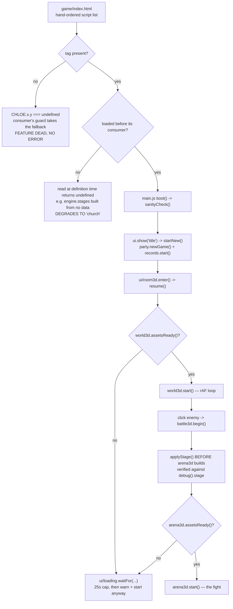
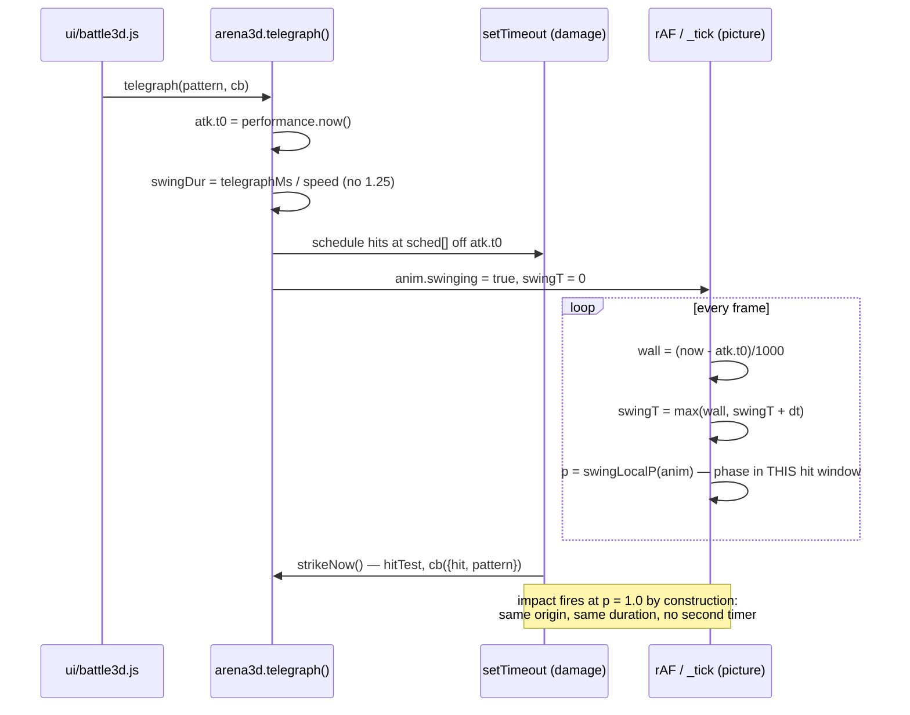

# Debugging & Verification

CHLOE has no build step, no test runner and no assertion library — it is classic `<script>` tags
and a global `window.CHLOE` namespace. What it has instead is a **debug contract**: every module
that owns state nobody outside it can see publishes a plain-object snapshot of that state, plus a
handful of `_`-prefixed hooks that let a caller drive the simulation without a keyboard, a mouse or
even a working `requestAnimationFrame`. Those exports are not leftovers. They are the only way a
change to the arena, the knight or the room can be *proved* rather than eyeballed, and GAME_SPEC.md
attaches an explicit acceptance block to the sections that need one for exactly that reason. Where
those blocks actually are, counted: §13 and §14 (the latter titled "Debug contract (extended,
mandatory)", [GAME_SPEC.md:213](../GAME_SPEC.md), [:236](../GAME_SPEC.md)), then §22, §23, §24, §26, §27,
§30 as "Verification hooks" and §25, §28 as "Verification". **§15-§21 have none** — §17 names its
test hooks in a "Contracts" block instead, and the rest are covered only by the sections that
supersede them. This page is the map: every hook that exists, what it publishes, what each recent
spec section expects a change to prove, and the six ways this codebase silently reports success
while doing nothing at all.

---

## Opening the game

```bash
./dev.ps1                       # http://localhost:8080/  — the game is at /game/
npx http-server -p 8080 .       # equivalent, any static server works
python -m http.server 8080      # fallback if node is absent
```

`dev.ps1` prefers `npx http-server -p 8080 -c-1` (the `-c-1` disables its cache) and falls back to
Python ([dev.ps1:9-13](../dev.ps1:9)). **The game lives at `http://localhost:8080/game/`**, not at the
root — the root is the landing page.

A real HTTP server is required, not `file://`. Browsers block GLTF/HDR loads over `file://`, and the
3D layers are written to *degrade* rather than crash when that happens — so `file://` gives you a
church-shaped fallback and a "totem" knight while every `console.warn` explains why
([engine/arena3d.js:590](../game/js/engine/arena3d.js:590),
[engine/arena3d.js:708](../game/js/engine/arena3d.js:708)). That degrade path is a feature, and it is
also the most convincing way to fool yourself into thinking a broken asset change works.

The build you are looking at names itself. `CHLOE.data.version.string()` →
`v<major>.<minor>.<build>`, where `minor` tracks the GAME_SPEC section the build implements — so
`v0.30.x` *is* "the game as of §30" ([data/version.js:18-29](../game/js/data/version.js:18); the tree
is on `minor: 30, build: 3, label: 'Seniority'` as of this page). `build` moves on **every** push,
so the third number changes constantly and is not a section marker. It is printed on the title
screen and in the menu card. If the number on screen is not the one you just committed, you are
looking at a cached build, not your change.

**Loading a data file headlessly** works because every file opens `window.CHLOE = window.CHLOE || {}`
and then references the bare global `CHLOE` ([data/version.js:15-18](../game/js/data/version.js:15)) —
so under Node you need `global.window = global`, not `global.window = {}`.

---

## The debug() contract

Three rules hold everywhere:

1. **A debug export is a read, never a write.** `debug()` and `snapshot()` allocate a fresh object
   from live state; nothing in the game branches on having been asked.
2. **It publishes the thing that cannot be seen from outside.** `debug().stage.nav` exists because
   "which containment rule is live" is invisible from a screenshot
   ([engine/arena3d.js:4599-4605](../game/js/engine/arena3d.js:4599)). `knightBrain[i].shoveMoved`
   exists because the gap between what the wave *owed* a knight and what the arena *let* him have is
   the containment clamp doing its job, and nothing on screen shows it
   ([engine/arena3d.js:4567-4575](../game/js/engine/arena3d.js:4567)).
3. **Two readings where one would be a lie.** `roundLevel` (what the round is worth) sits next to
   `knightLevels[]` (what each knight is *now*), because a verifier watching those two diverge over a
   fight is watching §28/§30 work ([engine/arena3d.js:4534-4541](../game/js/engine/arena3d.js:4534)).
   `_rigProbe` publishes `heightAtSpawn` *and* `heightNow` for the same reason
   ([engine/arena3d.js:4930-4941](../game/js/engine/arena3d.js:4930)).

### Every debug / verification export, by module

| Module | Export | What it publishes |
|---|---|---|
| [engine/arena3d.js:4522](../game/js/engine/arena3d.js:4522) | `debug()` | The whole arena: player pose, squad state, per-knight brain + stagger, levels/seniority, stage + containment. Table below. |
| [engine/arena3d.js:4633](../game/js/engine/arena3d.js:4633) | `_stageCount()` | §24 leak check, counted off the live scene graph: `{stage, epoch, objects, meshes, lights, sceneChildren, stageObjects, stageLights, candles, rims, shocks, knights, listeners, colliders, nav, navCells, churchCached, churchAttached, gpu:{geometries,textures}}`. `sceneChildren` must not grow by one group per round. |
| [engine/arena3d.js:4662](../game/js/engine/arena3d.js:4662) | `_teleport(x, z)` | Move the player, zero velocity. Keyboard-free positioning. |
| [engine/arena3d.js:4663](../game/js/engine/arena3d.js:4663) | `_setCrouch(bool)` | Force the crouch flag. |
| [engine/arena3d.js:4664](../game/js/engine/arena3d.js:4664) | `_look(yaw, pitch)` | Set the camera angles directly. Aim-dependent abilities (asteroid, water wave) score off yaw. |
| [engine/arena3d.js:4667](../game/js/engine/arena3d.js:4667) | `_tick(dt)` | Advance the world one step **without rAF** — player, knight, mixer, sign/tornado, FX — and return `A.debug()`. The single most useful hook in the repo. |
| [engine/arena3d.js:4707](../game/js/engine/arena3d.js:4707) | `_simKnight(seconds, dt, opts)` | §22's mandatory hook: drive the knight AI headless and *measure* it. Returns `{personality, statesEntered, stateFrames, stateShare, distinctStates, topState, topShare, animFrames, transitions, hitsApplied, staggers, staggerMeter, pathLength, distances:{min,max,avg}, positions[], playerAt}`. `opts` takes `{index, sampleMs, hitEveryMs, hitDamage}` — hits go through the real `A.flinch`, so stagger buildup is measured, not asserted. |
| [engine/arena3d.js:4800](../game/js/engine/arena3d.js:4800) | `_wallScan(step)` | Raycast the real church interior over the declared `arena.bounds`: `{bounds, walkable, blocked, blockedSample}`. Checks bounds against geometry instead of guessing. |
| [engine/arena3d.js:4870](../game/js/engine/arena3d.js:4870) | `_bakeExport(cell, pad, tol)` | Dev tool — regenerates the packed navgrid printed into `data/arena-nav.js`. Freezes the tab for ~a minute. |
| [engine/arena3d.js:4888](../game/js/engine/arena3d.js:4888) | `_probeAt(x, z)` | What is under and over one cell, with mesh and material names — and why the bake accepted or rejected it. |
| [engine/arena3d.js:4909](../game/js/engine/arena3d.js:4909) | `_nav()` | Navgrid summary `{cell, nx, nz, minX, minZ, walkable, total, area}` plus a live `free(x, z, r)` predicate. `null` means no grid loaded and the fallback rectangle is doing containment. |
| [engine/arena3d.js:4923](../game/js/engine/arena3d.js:4923) | `_rigProbe(index)` | §28's acceptance surface: per-bone `pivots`/`rot`/`lever`/`meshes`, `heightAtSpawn`, `heightNow`, `rootScale`, `swingP`, `swingDur`, `sched`, `feintHold`, `dropped`, and the sword's `tip`/`tipReach`/`bladeLen`/`gripAt`. |
| [engine/arena3d.js:5007](../game/js/engine/arena3d.js:5007) | `_diag()` | Scene/material forensics: church bounds, floor + ceiling raycasts with mesh names, floor material (type, colour, map, roughness, `envMapIntensity`), `envMap`, the first four knight materials, and every light as `type:intensity`. This is the "why is everything black / white plastic" hook. |
| [engine/arena3d.js:5056](../game/js/engine/arena3d.js:5056) | `_renderOnce()` | Draw one frame on demand, so a screenshot is possible where rAF is throttled. |
| [engine/arena3d.js:2030](../game/js/engine/arena3d.js:2030) | `_fpPlace(x,y,z,rotY,scale)` | Live placement tuning for the first-person arms rig. |
| [engine/arena3d.js:2043](../game/js/engine/arena3d.js:2043) | `_animSeek(seconds)` | Scrub the current clip to an absolute time. |
| [engine/arena3d.js:2054](../game/js/engine/arena3d.js:2054) | `_fpBones(names)` | Bone world positions — because `Box3` on a `SkinnedMesh` returns un-posed bind bounds. |
| [engine/arena3d.js:413](../game/js/engine/arena3d.js:413) | `assetProgress()` / `assetsReady()` | `{done, total, warm}`, and the gate `ui/loading.js` polls. `assetsReady()` triggers the shader+texture warm-up on first true. |
| [engine/world3d.js:1860](../game/js/engine/world3d.js:1860) | `debug()` | The room: pose, grounded, hover targets, panels, models, colliders. Table below. |
| [engine/world3d.js:1808](../game/js/engine/world3d.js:1808) | `_renderOnce()` | As arena3d's. |
| [engine/world3d.js:1814](../game/js/engine/world3d.js:1814) | `_look(y, p)` | Set yaw/pitch. |
| [engine/world3d.js:1815](../game/js/engine/world3d.js:1815) | `_teleport(x, z)` | Move the player, zero velocity — the room's twin of the arena hook. |
| [engine/world3d.js:1817](../game/js/engine/world3d.js:1817) | `assetProgress()` / `assetsReady()` | Same contract as the arena; `assetsReady()` compiles and draws one frame before returning true. |
| [engine/world3d.js:1836](../game/js/engine/world3d.js:1836) | `releaseLock()` / `isLocked()` | §21: the same handles the arena exposes, so a caller never special-cases which 3D scene is up. |
| [engine/world3d.js:1844](../game/js/engine/world3d.js:1844) | `refreshPanels()` | Repaint mirror, poster, stage board, trophies and the record board together. The single hook the room router calls on entry. |
| [engine/world3d.js:1858](../game/js/engine/world3d.js:1858) | `tvChapter()` | Which how-to chapter the TV is on. |
| [engine/combat3.js:1360](../game/js/engine/combat3.js:1360) | `snapshot()` | Everything the HUD renders. **Returns `null` outside a fight.** Table below. |
| [engine/combat3.js:1265](../game/js/engine/combat3.js:1265) | `slots()` (`resolvedSlots`) | §23's hook: the hotbar as it actually resolves, item entries included — "ONE builder for the HUD and for tests, so what a test asserts is exactly what ui/battle3d.js draws". |
| [engine/combat3.js:1415](../game/js/engine/combat3.js:1415) | `mouseSlots()` | §27B: the two mouse binds, resolved the same way. |
| [engine/combat3.js:1428](../game/js/engine/combat3.js:1428) | `readiness(id)` | Per-ability readiness outside the snapshot; `{ready:false}` with no fight running. |
| [engine/records.js:607](../game/js/engine/records.js:607) | `debug()` | `{key, schema, cap, source, count, best, elapsedMs, running, apiUrl, promptOpen}` — the storage key, whether the board is local or remote, and whether the run clock is still going. |
| [engine/records.js:595](../game/js/engine/records.js:595) | `prompt(...)` returns `{el, input, accept, cancel}` | Handed back "so a test can drive the flow without synthetic mouse events". |
| [engine/knightanim.js:862](../game/js/engine/knightanim.js:862) | `poseIds()` | Every id `pose()` will resolve — the §28 C acceptance list a test walks. LOCO first, because it shadows POSES on a name clash. |
| [engine/knightanim.js:872](../game/js/engine/knightanim.js:872) | `_poses` / `_loco` / `_patterns` | The raw pose tables, for asserting a pose exists and what it returns at a phase. |
| [engine/displays.js:423](../game/js/engine/displays.js:423) | `stageArrows()` | §26: the normalised 0..1 arrow rects the poster is painted with — the room hit-tests the poster's own UV against this table, so picture and hit box are the same numbers ([engine/world3d.js:543](../game/js/engine/world3d.js:543)). |
| [engine/shop.js:165](../game/js/engine/shop.js:165) | `shards()` / `priceOf(id)` / `isStocked(id)` | "small reads the UI (and tests) want without reaching into party.state". |
| [ui/battle3d.js:1512](../game/js/ui/battle3d.js:1512) | `_fire`, `_press`, `_evade`, `_swing`, `_active`, `_mouse(button)` | Drive the fight through the same code paths a key or click reaches. |
| [ui/battle3d.js:1519](../game/js/ui/battle3d.js:1519) | `_prompt()` / `_hint(kind)` | What the centre line is actually saying (`''` = nothing), so "a multi-hit pattern never leaves a stale dodge warning up" is a measurement. |
| [ui/battle3d.js:1528](../game/js/ui/battle3d.js:1528) | `_hits(...)` | The damage+stun resolve for one hit window — exported because everything leading to it runs off rAF. |
| [ui/battle3d.js:1536](../game/js/ui/battle3d.js:1536) | `_slots()` | What the hotbar **rendered**: mirrors the DOM, not the engine — `{slot, key, kind, id, count, ready, mouse, passive, armed, badge, cls, dim, out}`. |
| [ui/battle3d.js:1568](../game/js/ui/battle3d.js:1568) | `_wavePlan(ab, targets)` / `_waveShove(ab, plan)` | §25's two halves, so a squad can be stood up in a stub arena with no canvas and each caught knight's thrown side read back. |
| [ui/battle3d.js:1578](../game/js/ui/battle3d.js:1578) | `_stunFloats()` | How many "STUNNED" labels are on screen — distinct element and class from §22's "STAGGERED!". |
| [ui/battle3d.js:1585](../game/js/ui/battle3d.js:1585) | `_finish(result)` | The victory/defeat card and the mode switch, reachable without rAF. |
| [ui/room3d.js:474](../game/js/ui/room3d.js:474) | `_pause`, `_resume`, `_engage` | "exposed for tests/debugging" — and `_resume` is load-bearing in production, see below. |
| [ui/loading.js:127](../game/js/ui/loading.js:127) | `waitFor(test, tick, done, timeoutMs)` / `isShown()` | The gate itself. Times out at 25s and starts anyway with a warn. |

### `arena3d.debug()` — fields

| Field | Meaning |
|---|---|
| `x`, `z`, `yaw`, `pitch`, `eye`, `crouch`, `locked` | Player pose and input state. |
| `knightDist` | `nearestKnightDist()`, coerced to `0` when non-finite. |
| `mode` | `knight.atk.mode` — **the leader's** attack mode. Four live values: `idle` ([:2760](../game/js/engine/arena3d.js:2760)), `telegraph` ([:2873](../game/js/engine/arena3d.js:2873)), **`strike`** ([:2938](../game/js/engine/arena3d.js:2938)) and `recover` ([:2960](../game/js/engine/arena3d.js:2960)). `strike` is the window `strikeNow` holds for a fixed 220 ms before handing over to `recover`, so a test that only knows three values will misread it. The dead API answers a fifth, `'dead'` ([:33](../game/js/engine/arena3d.js:33)). |
| `knightAlive`, `squad`, `squadAlive` | Leader alive; squad size; how many still stand. |
| `churchLoaded`, `knightLoaded`, `envMap` | Asset truth. All three false with a real renderer means loading failed, not that WebGL is missing. |
| `knightRig` | `knight.rigInfo`. On success `{rigged:true, moved, missing, counts, nativeH, scale, height}` ([:866-868](../game/js/engine/arena3d.js:866)) — `height` is the §28 acceptance number, the leader's measured crown height. On failure it is the *other* shape, `{rigged:false, reason:'no meshes matched the manifest'\|'knightanim missing'}` ([:823](../game/js/engine/arena3d.js:823)), with **no `height` key at all** — so an absent `height` is the signal, not a zero. |
| `roundLevel`, `levelCap` | `knighttree.level()` and `capForRound(round)` — the round's baseline and ceiling. Note `levelCap` is the **round's** ceiling; §30's per-knight ceiling is `capForKnight` ([engine/knighttree.js:112](../game/js/engine/knighttree.js:112)) and is not published here. |
| `knightLevels[]`, `knightLevelT[]` | Per-knight level now, and `k.levelT` — **total seconds alive in this fight**, to 1dp. It is a monotonic accumulator (`k.levelT += dt`, [:3620](../game/js/engine/arena3d.js:3620)), reset only at spawn ([:3609](../game/js/engine/arena3d.js:3609)); it is **not** a countdown or a progress bar toward the next level. `knighttree.levelFor()` maps those seconds to a level, so `levelT` never drops when `knightLevels[i]` steps up. |
| `knightSeniority[]`, `knightJoinRound[]` | §30: what each knight *opened* at and why. Without these, `knightLevels` shows the numbers but not that index 0 earned his. |
| `roundSpeed` | §28 A2's round multiplier, to 3dp. |
| `knightState`, `knightDashCd`, `knightPos` | Leader only. |
| `knightBrain[]` | Per knight: `{state, anim, personality, alive, t, hold, entered, dashCd, atkCd, staggerT, stunT, shoveT, shoveLeft, shoveMoved, hitFlash, arcSign, strafeSign, wantsAttack}`. `state` is the **decision**; `anim` is only the pose that decision picked, and two decisions can wear the same pose ([engine/arena3d.js:4684](../game/js/engine/arena3d.js:4684)). |
| `staggerMeter[]` | Per knight: `{meter, needs, oneHit, staggered, stunned, takeMult}` — the buildup and the thresholds it is racing, so "why did he not stagger" is answerable. `stunned` separates an ability-granted reel (§23's rock) from an earned one. |
| `arenaArea` | The measured open floor, as an **object**, not a number: `{cells, m2, minX, maxX, minZ, maxZ, stand:{player, knight}}` — a flood-fill from the player spawn, plus the same fill re-run at the player's and the knight's body radius ([:2516-2520](../game/js/engine/arena3d.js:2516), [:2523-2544](../game/js/engine/arena3d.js:2523)). `null` has **two** causes: the navgrid never loaded (`if (!nav) return null`), or it loaded and the spawn was off it — the second warns `player spawn is not on the navgrid`, the first does not. Either way the fight is on the fallback `arena.bounds` rectangle, the only state in which that rectangle matters. |
| `stage` | `{id, name, shape, nav}` plus **either** `bounds:{minX,maxX,minZ,maxZ}` **or** `radius`+`cx`+`cz`. Only the clamp actually in play is reported. `nav:false` on a `round` stage is the design; `nav:false` on a `model` stage is a bug ([engine/arena3d.js:4610](../game/js/engine/arena3d.js:4610)). |

### `world3d.debug()` — fields

| Field | Meaning |
|---|---|
| `x`, `y`, `z`, `yaw`, `pitch`, `locked`, `grounded`, `crouch`, `eye` | Player pose. `y` is `eyeH + yOff` (the jump offset). |
| `enemyDist`, `enemyAlive`, `enemyHovered` | The engage target. `enemyHovered` is the ray hit, not distance — `ui/room3d.js` follows the aim signal because distance alone shows "CLICK TO ENGAGE" while clicks do nothing ([ui/room3d.js:180-183](../game/js/ui/room3d.js:180)). |
| `tvOn`, `tvHover` | §14's TV. |
| `stageArrow` | §26: `{which:'left'\|'right', id, name}` or `null` — the arrow under the crosshair and the floor it would pick. |
| `stageBoard` | §24: `{id, name, round, knights}` straight off the last paint, not re-resolved — a test proving the board names the stage the next fight uses has to read the wall, not ask the question twice. `null` = it fell back to the knight dossier. |
| `pickupHover`, `giftHover` | `{label, dist}`-shaped hover edges, so one hint line consumes either. |
| `shopReady` | Whether `CHLOE.ui.shop.open` exists. **Zero consumers** — see below. |
| `recordBoard` | `'live'` (records module present) / `'inert'` (frame painted but no `engine/records.js`) / `null` (prop not in `data/room3d.js` at all). |
| `envMap`, `handsVisible`, `hands` | Pipeline + hands rig; `hands` is `{l, r, grabbing}`. |
| `pickupsLeft`, `modelsLoaded`, `colliders[]` | Untaken items, per-model load truth, and every AABB as `{kind, minX, maxX, minZ, maxZ}`. |

### `combat3.snapshot()` — fields

`{hp, mana, sta, max, enemy, slots, mouseSlots, casting, evade, iframe, over, result}`, where
`enemy` is `{life, max, count, alive, each[], roundLevel, levels[], name}` and each entry of `each`
is `{life, max, alive, level, seniority}` ([engine/combat3.js:1367-1390](../game/js/engine/combat3.js:1367)).
`casting` is `{id, pct}` or `null`; `evade` is `{ready, pct, cost}`.

`snapshot()` returns **`null` when no fight is running** — the first line is `if (!st) return null`.
A verifier that calls it from the room gets `null`, not an empty fight.

---

## The dead API — what a machine with no WebGL answers

`arena3d` and `world3d` both check `window.THREE` at module scope and, if it is missing, call
`disableAPI(reason)` and `return` before any of the live code runs
([engine/arena3d.js:197](../game/js/engine/arena3d.js:197),
[engine/world3d.js:39](../game/js/engine/world3d.js:39); the stub bodies themselves are
[engine/arena3d.js:60-131](../game/js/engine/arena3d.js:60) and
[engine/world3d.js:31-37](../game/js/engine/world3d.js:31)).

The stubs are not decoration. `shove()` is called **unguarded** from the wave path
([ui/battle3d.js:801](../game/js/ui/battle3d.js:801)); `stun()` is called from the damage path
([engine/combat3.js:926](../game/js/engine/combat3.js:926)) and from the splash
([ui/battle3d.js:898](../game/js/ui/battle3d.js:898)); `staggerMult()` prices the punish window
([ui/battle3d.js:886](../game/js/ui/battle3d.js:886)). §21 records that this list had drifted so far
that `stopAbility` alone was being called unguarded, and a machine with no WebGL *threw its way
through the fight* instead of degrading (GAME_SPEC.md §21, "A note on `disableAPI`").
**Every function added to the live API must be added here in the same commit.**

> **Read the code comment, not the attribution.** The comment above the `staggerMult` stub
> ([engine/arena3d.js:66-70](../game/js/engine/arena3d.js:66)) says a missing multiplier "multiplies
> damage into `NaN`". That is the *reason the stub was written*, not what happens today: the one
> live call site is `var mult = a3d.staggerMult ? (a3d.staggerMult(ti) || 1) : 1;`
> ([ui/battle3d.js:886](../game/js/ui/battle3d.js:886)) — belt **and** braces. `shove()` at
> [ui/battle3d.js:801](../game/js/ui/battle3d.js:801) is the one with no belt, so it is the stub that
> is genuinely load-bearing right now. Do not delete a stub because its call site happens to guard;
> the guard is the thing most likely to be removed by someone tidying.

Three stubs carry real logic rather than returning a constant:

- `knightLevels(n)` answers with the §30 **seniority ladder**, computed as pure arithmetic over the
  squad index — `kt.spawnLevel('', kt.seniorityFor(i, count))`
  ([engine/arena3d.js:111-118](../game/js/engine/arena3d.js:111)). N copies of the round baseline would
  make the no-WebGL floor *harder* than the real game, "the one direction a degrade path must never
  fail in".
- `setStage(id)` still **records** the choice, because the board and round counter read
  `CHLOE.engine.stages.current()` and a machine with no renderer must still say which stage the
  fight is nominally on ([engine/arena3d.js:124-128](../game/js/engine/arena3d.js:128)).
- `deadDebug()` answers `stage: deadStage()`, resolved out of the stage data, so a caller reading
  `debug().stage` never has to branch on whether WebGL exists or whether `init()` has run
  ([engine/arena3d.js:31-59](../game/js/engine/arena3d.js:31)).

> **Trap — "the entire public surface" is not what `disableAPI` covers.** It stubs the *game-facing*
> API and the handful of `_`-hooks a headless fight needs, and nothing else. Counted off the source:
> `arena3d` exports **57** names live, of which **48** have stubs (and no stub names anything the
> live module no longer exports, so the drift is one-directional). The nine with none are all dev
> probes — `_animSeek`, `_bakeExport`, `_diag`, `_fpBones`, `_fpPlace`, `_nav`, `_probeAt`,
> `_rigProbe`, `_wallScan`. (`_look`, `_renderOnce`, `_setCrouch`, `_simKnight`, `_stageCount`,
> `_teleport` and `_tick` *are* stubbed.) `world3d` is thinner still: **20** live exports, **11**
> stubs, leaving `_look`, `_renderOnce`, `_teleport`, `assetProgress`, `assetsReady`, `isLocked`,
> `refreshPanels`, `releaseLock` and `tvChapter` undefined on a no-WebGL box. Nothing throws today
> only because every one of those call sites guards
> (`if (load && w.assetsReady && !w.assetsReady())` — [ui/room3d.js:275](../game/js/ui/room3d.js:275);
> `if (w && typeof w.refreshPanels === 'function')` — [ui/room3d.js:457](../game/js/ui/room3d.js:457)).
> **Consequence for a verifier:** on a machine with no `THREE`, `arena3d._rigProbe(0)` and
> `world3d.assetsReady()` are not inert — they are `undefined`, and calling them raises
> `TypeError: ... is not a function`. Feature-test before you call, and never read a thrown probe as
> "the feature is broken".

> **Trap — `deadDebug()` is a strict subset, and nothing enforces it.** `A.debug()` returns
> `deadDebug()` whenever `!inited`, on *any* machine. The dead object carries 14 keys; the live one
> carries 30. Absent from it: `knightAlive`, `envMap`, `knightRig`, `roundLevel`, `levelCap`,
> `knightLevels`, `knightLevelT`, `knightSeniority`, `knightJoinRound`, `roundSpeed`,
> `knightState`, `knightDashCd`, `knightPos`, `knightBrain`, `staggerMeter`, `arenaArea`. World3d's
> dead object likewise omits `pickupHover`, `giftHover`, `shopReady`, `recordBoard`, `tvHover`,
> `enemyHovered`, `crouch`, `eye`, `pickupsLeft` and `hands`. A check that reads
> `debug().knightSeniority` before `init()`, or on a no-WebGL box, gets `undefined` — not a wrong
> number, an *absent* one, which `undefined == null` guards swallow. Add any new `debug()` field to
> **both** objects.
>
> **And the fallback is only half a fallback.** "Read the ladder from `arena3d.knightLevels(n)`
> instead" is correct on a **no-WebGL** box, where that name is the pure stub —
> `kt.spawnLevel('', kt.seniorityFor(i, count))` for every index
> ([engine/arena3d.js:111-118](../game/js/engine/arena3d.js:111)). It is **not** correct merely
> *before `init()`* on a machine that has `THREE`: there `A.knightLevels` is the live one
> ([engine/arena3d.js:982-995](../game/js/engine/arena3d.js:982)), which emits
> `knights[i].level` for every knight that already exists and only **pads the tail** from seniority.
> `knights` is never empty — `makeKnightState()` pushes the leader at module scope with
> `level: 1` ([:283](../game/js/engine/arena3d.js:283), [:290-291](../game/js/engine/arena3d.js:290)) — so
> a pre-`spawnSquad` `knightLevels(5)` answers `[1, 4, 3, 2, 1]`: the veteran slot reads **1**, not
> **5**. The ladder only becomes real once `initBrain` has set `k.seniority`/`k.level`
> ([:3606-3608](../game/js/engine/arena3d.js:3606)). Assert the pure ladder against
> `knighttree.spawnLevel`/`seniorityFor` directly, or against `debug().knightSeniority` **after** a
> spawn.

---

## Load-bearing "debug" exports (§28 D)

Two entries in the codebase look like cruft and are not. §28 D exists purely to say so.

**`ui/room3d._resume`.** Labelled "exposed for tests/debugging"
([ui/room3d.js:474](../game/js/ui/room3d.js:474)), but `ui/shop.js` depends on it in production:
`ui/room3d.js` keeps `pause()`/`resume()` private and the file is owned by another session, so the
shop calls `_pause` when the overlay opens and `_resume` when it closes
([ui/shop.js:83-95](../game/js/ui/shop.js:83)). **Tidying `_resume` away freezes the room after a
purchase** — the world is stopped, the overlay closes, and nothing ever restarts the loop. The shop
does carry a fallback (`world3d.stop()` directly) for the *pause* half only; the resume half has no
fallback at all, because a headless harness with no room around it should not be starting a render
loop. `resumeWorld()` also bails when `ui.current() !== 'room3d'` — the router moved on, so the loop
is not the shop's to restart ([ui/shop.js:91-95](../game/js/ui/shop.js:91)) — and `close()` skips the
resume entirely if someone has wrapped `CHLOE.ui.shop.close`, or the loop would start twice
(`if (!closeIsWrapped()) resumeWorld();` — [ui/shop.js:127-129](../game/js/ui/shop.js:127); the
predicate itself is [ui/shop.js:98-100](../game/js/ui/shop.js:98)).

**`world3d.debug().shopReady`.** Published at
[engine/world3d.js:1907](../game/js/engine/world3d.js:1907) and read by **nothing** — grepping the repo
for `shopReady` returns exactly two hits: that definition, and the §28 D paragraph in GAME_SPEC.md
that says it has no consumers. It is kept as a documented gate for the day the shop becomes optional,
with §28 D stating where the gate would then belong: on the giftbox glow **and both click paths**,
never on the hint caption — a caption-only gate leaves an unlabelled lit prop that still eats clicks
and still hides the pickup behind it.

---

## What a change must prove before it ships

GAME_SPEC.md attaches a verification block to each recent section. These are the acceptance criteria
a change to that area is expected to demonstrate — not aspirations.

| § | Must be proved | Hook to prove it with |
|---|---|---|
| §13 | Movement, collision and turning are measurable; the keyboard fallback alone reaches and engages the enemy without pointer lock. | `world3d.debug()`, `_look`, `_teleport` |
| §14 | `debug()` carries `{x,y,z,yaw,pitch,locked,grounded,enemyDist,enemyAlive,tvOn,envMap,handsVisible,modelsLoaded,colliders}` — mandatory, extended. | `world3d.debug()` |
| §17 | Every ability contract holds with no DOM and no THREE; the arena exposes `_renderOnce/_look/_animSeek/_fpBones/_fpPlace/_diag`. | `combat3.snapshot()`, arena3d `_`-hooks |
| §22 | "He no longer only walks straight at you" as a **distribution of states entered**, not an opinion. | `_simKnight(seconds, dt, opts)` |
| §23 | Asteroid castable **twice** on a level-3 pool; every knight in the splash stunned and unable to attack for the duration; a bandage restores life, decrements the bag, locks the shared cooldown, and does not refund a failed press. | `combat3.slots()`, `battle3d._hits`, `_stunFloats`, `debug().staggerMeter[].stunned` |
| §24 | The Ring clamps the player at its rim from 8 compass directions; a squad spawns inside and every §22 state still occurs; church→Ring→church leaves **no** orphan geometry, lights or colliders; the board canvas names the stage the next fight uses. | `debug().stage`, `_stageCount()`, `world3d.debug().stageBoard` |
| §25 | A dodged swing leaves HP **byte-identical** — all five patterns, geometric miss *and* i-frame path; the wave throws knights sideways, breaks the wind-up, respects both stages' containment, and opens a walkable lane; the hotbar never exceeds 9 keys. | `combat3.takeHit(null)`, `battle3d._wavePlan`/`_waveShove`, `debug().knightBrain[].shoveMoved` |
| §26 | Round 1 resolves to the Ring untouched; the painted-left arrow **is** the on-screen left arrow (UV mapping, not a guess); the middle of the board is not clickable; a click changes both the canvas and `stages.forRound(round)`; the fight lands on the picked floor. | `world3d.debug().stageArrow`, `displays.stageArrows()`, `CHLOE.engine.stages.forRound(n)` (the namespace, published from `arena3d.js` — there is no `engine/stages.js`, see trap 1) |
| §27 | Every known ability is bound at every level and after a rebuild; LMB/RMB fire in the arena and still grab in the room; a bound revive potion resurrects **before** any leader swap and is consumed exactly once; the giftbox moves Shards and stock; a record run prompts for a name and appears with the right patch and time; the board survives a reload while granting no run progress. | `battle3d._slots`/`_mouse`, `combat3.passiveItem`/`takeRevive`, `shop.shards()`, `records.debug()` |
| §28 | 103/103 meshes reparent with on-screen height unchanged at **2.15m**; all five attack patterns and all six §22 locomotion/reaction states play on the new rig; the sword tracks the elbow and the hips move; impact frames still land on the strike timer; a squad's levels visibly diverge. | `_rigProbe()`, `knightanim.poseIds()`, `debug().knightLevels` |
| §30 | Round N spawns `[N, N-1, … 1]` **before any tick**; the ladder is not flattened by the per-frame sync; a long fight ends on a ladder, not a flat squad; the no-WebGL stub returns the same shape; the HUD range matches the living knights. | `debug().knightSeniority`/`knightJoinRound`, `snapshot().enemy.each[].seniority`, `arena3d.knightLevels(n)` |

*(GAME_SPEC.md has no §29 — the headings run `## 28.` then `## 30.` with nothing between, and no
line in the file explains the gap. Read it as the numbering, not a missing file: §27 opens with the
matching convention, "§26 is the other session's stage picker — do not renumber it"
([GAME_SPEC.md:614](../GAME_SPEC.md)), so sections are claimed by parallel sessions rather than
allocated in sequence.)*

---

## The probe that cannot fail loudly

The most expensive failure mode in this repo is not a wrong answer. It is a **plausible** one,
returned by a probe that had no way to report that it had failed. Across one day of parallel work
on this codebase it happened seven times, to four different people, through six different
mechanisms — and every single time the output was a clean, readable number that looked exactly
like a measurement.

This codebase is unusually prone to it, for reasons that are all deliberate elsewhere:

- **Every consumer degrades rather than throws** (see trap 1). A missing module leaves an
  `undefined` namespace slot and the call site guards it, so nothing anywhere raises.
- **The engines default rather than refuse.** `knighttree` treats an unknown personality as the
  plain baseline on purpose — "a knight who cannot level is worse than one who levels dully"
  ([engine/knighttree.js:84](../game/js/engine/knighttree.js:84)) — so a typo in a personality
  string produces a real level, not an error.
- **The debug surfaces are pure reads.** They answer correctly whether or not anything is running,
  which is what makes them safe to call and dangerous to trust.

### The six mechanisms, and the tell for each

| Mechanism | What it returns | How to catch it |
|---|---|---|
| A function that does not exist | `undefined`, then whatever your own fallback does | Assert the name resolves before calling: `typeof CHLOE.engine.knighttree.levelFor === 'function'` |
| An argument in the wrong position | A real answer computed from the wrong values | Read the signature off the source, never off memory. `levelFor(personality, seconds, round, seniority)` takes seniority **fourth** |
| An accessor defaulting on the wrong shape | The stub, not the state | `arena3d.debug()` is `deadDebug()` before `init()`; `combat3.snapshot()` is `null` outside a round |
| A synthetic test object | The unknown-input path, silently | A hand-built knight with no `brain` is not a knight; drive `spawnSquad` instead |
| A table read above its override | The wrong row | `mults()` returns the **last** row that set a value — rows are absolute, not cumulative ([engine/knighttree.js:172](../game/js/engine/knighttree.js:172)) |
| A frozen `requestAnimationFrame` | The world exactly as it was at `init()` | Trap 6 below — prove the clock moved before believing anything |

### A worked example, because the general rule is easy to nod at

Probing the §30 seniority ladder by calling `spawnLevel(p, seniorityFor(i, 5))` with a single
personality returns `[5, 4, 3, 2, 1]`. It is plausible, it is self-consistent, and it matches the
number [GAME_SPEC.md §30](../GAME_SPEC.md) prints. It is also a squad the game cannot deal.

Personalities are **dealt round-robin from a random seed**, not chosen
([engine/arena3d.js:3558](../game/js/engine/arena3d.js:3558)), so five consecutive indices always
contain at least one `brute` — and the brute's `baseBonus` of +1 rides on top of his own rung. The
three reachable openings at round 5 are `[5,4,4,2,1]`, `[5,5,3,2,2]` and `[6,4,3,3,1]`. The middle
one is where §30's own measured figure came from.

The probe was not wrong about `spawnLevel`. It was wrong about what it had modelled — it asked a
question the game never asks. Nothing in the answer said so.

### The rule

**Before believing a probe, make it fail on purpose.** Feed it an input you know is broken — a
misspelled personality, an out-of-range index, a function name with a typo — and confirm it
complains. A probe that returns a plausible number for deliberately broken input is not measuring
anything, and you have no way to tell its output from a real one.

Two corollaries worth keeping:

- **A number that matches the spec is not confirmation.** The spec is layered by supersession and
  can be behind the code — that is why the wiki's second convention exists. Two sources agreeing
  is only evidence when they are independent.
- **Report what the probe actually established**, not what it appeared to. "`spawnLevel` returns
  the seniority ladder" was true; "round 5 fields `[5,4,3,2,1]`" did not follow from it.

---

## The traps

### 1. A new module with no `<script>` tag is a whole feature shipped dead — silently

`game/index.html` lists every file by hand, in a fixed order, and there is no bundler to notice an
omission. A module that never loads leaves its namespace slot `undefined`, and **every consumer in
this codebase is written to degrade rather than throw** — so the game boots, plays, and quietly does
not have the feature.

**§24 did exactly this**, and the codebase now carries the scar in three places as a warning:
`engine/stages.js` was never created — §24's stage selection lives inside `engine/arena3d.js`
instead, with the reasoning stated in the code: *"index.html lists every script by hand, and adding a
file nobody wires up is a file that silently never loads"*
([engine/arena3d.js:141-155](../game/js/engine/arena3d.js:141)). §24 allows "an equivalent named export
— state it in the code"; that comment is the statement.

The script tags themselves carry the same warning twice more:

- [game/index.html:63-67](../game/index.html:63) — *"A new module with no script tag is a whole feature
  shipped dead — §24 did exactly that — so these three tags are as load-bearing as the code they pull
  in"*. The comment says *three*; only **two** tags follow it, `engine/shop.js` and
  `engine/records.js` ([:68-69](../game/index.html:68)) — the §27D/E third, `ui/shop.js`, sits at
  [:94](../game/index.html:94) under its own note, because it has to load after `ui/ui.js`. Count the
  tags, not the comment.
- [game/index.html:74-77](../game/index.html:74) — the same, for `engine/knightanim.js`, *"and this one
  would be silent about it: arena3d degrades to a static knight rather than throwing."*
- [game/index.html:49-52](../game/index.html:49) — without `data/knightrig.js`, *"the knight loads and
  then stands there, because knightanim's own fallback is 'no rig data, stay static'"*
  ([engine/knightanim.js:102](../game/js/engine/knightanim.js:102)).

**Symptom:** the feature is absent, nothing errors, and the console shows at most a single `warn`.
**Fix:** add the tag, and put it in the right place — order is a contract, not a formality. Data
before engine (`data/stages.js` must precede any engine file, because `arena3d.js` reads
`CHLOE.data.stages` at *definition* time to publish `CHLOE.engine.stages` —
[game/index.html:43-45](../game/index.html:43)); `knightanim.js` before `arena3d.js`;
`ui/shop.js` after `ui/ui.js` and `engine/shop.js` ([game/index.html:92-94](../game/index.html:92)).

That "definition time" is a real line, not a figure of speech: `S.order = orderList()` runs at module
scope ([engine/arena3d.js:170](../game/js/engine/arena3d.js:170)), above the `THREE` guard
([:197](../game/js/engine/arena3d.js:197)) so the room's board can paint from data with no renderer.
Everything else on `S` reads the table lazily, and `forRound`/`next` even re-derive `S.order` on
each call ([:176](../game/js/engine/arena3d.js:176), [:191](../game/js/engine/arena3d.js:191)) — so a
late-loading `data/stages.js` self-heals for those two while the published `S.order` property stays
`['church']` until something calls one of them. That asymmetry is why the tag order is the fix and
"it seems to work" is not evidence.



### 2. Stale assets after an asset change — `assetVersion`

Every model and HDRI URL is loaded through `versioned(path)`, which appends `?v=N` from
`CHLOE.data.arena3d.assetVersion` ([engine/arena3d.js:364-368](../game/js/engine/arena3d.js:364);
currently `assetVersion: 6` at [data/arena3d.js:15](../game/js/data/arena3d.js:15)). §17 titles this
section *"why the church looked broken for so long"*: browsers happily served a cached, all-black
church long after the fix shipped, **which reads as "no textures"** — a rendering bug that is
actually a cache bug.

**Symptom:** a rebuilt `.glb` looks unchanged, or black, or has the previous mesh's UVs.
**Fix:** bump `assetVersion` in the same commit as any `.glb` rebuild. Two side effects to know:

- The baked navgrid is keyed to `assetVersion` **plus** the church placement
  ([engine/arena3d.js:4848-4852](../game/js/engine/arena3d.js:4848)). A bump therefore invalidates the
  grid unless `data/arena-nav.js`'s `key` is updated too — the loader refuses a stale grid rather
  than blocking open floor, warning `baked navgrid key mismatch` and falling back to the rectangle
  ([engine/arena3d.js:4858](../game/js/engine/arena3d.js:4858)). `data/arena-nav.js` records that v6
  added `asteroid.glb` while the church stayed byte-identical, so the key was hand-carried
  ([data/arena-nav.js:28](../game/js/data/arena-nav.js:28)).
- `?v=` busting is a *browser* cache mechanism. It does not necessarily reach a CDN edge that omits
  the query string from its cache key — judge a live deploy from `Last-Modified` / `Age` response
  headers against the deploy time.

### 3. Two clocks — the pose driver and the strike timer

§21 records a fight lost to this, and it is worth reading in full. `swingDur` used to be
`telegraphMs * 1.25`, so at the damage instant the visual swing sat at `p = 0.800` for *every*
pattern — the blade still 375-475ms from its lowest point, **roughly twice the entire 220ms i-frame
window**. A player who dodged when the blade *looked* like it landed was guaranteed to be hit; the
picture and the health bar disagreed and the picture was the one lying.

The rule now: **one clock, and it is `atk.t0`.**

- `atk.t0 = performance.now()` is stamped once, when the telegraph arms
  ([engine/arena3d.js:2876](../game/js/engine/arena3d.js:2876)).
- Damage stays on `setTimeout` — §16's contract, because headless checks have no rAF.
- `swingDur = (pattern.telegraphMs || 1500) / 1000 / speed` — **exactly** `telegraphMs`, no
  multiplier ([engine/arena3d.js:2893](../game/js/engine/arena3d.js:2893)), so impact is `p = 1.0` by
  construction.
- The pose phase is measured off the same stamp:
  `wall = (performance.now() - atk.t0) / 1000; st.swingT = (wall > st.swingT) ? wall : st.swingT + dt`
  ([engine/arena3d.js:4173-4174](../game/js/engine/arena3d.js:4173)). rAF snaps to the wall clock;
  `_tick(dt)` scrubs by `dt`, because `_tick` advances `elapsed` but not the wall clock.
- §28 A2's round speed-up is **one scalar** (`patternSpeed(pattern)`) applied to `swingDur`, the hit
  schedule, `recoverDur` and the damage `setTimeout` together, so "the picture and the damage
  shorten together or not at all"
  ([engine/arena3d.js:2878-2894](../game/js/engine/arena3d.js:2878)). The pattern object is never
  mutated — it is shared data, and scaling it in place would compound every round.
  **One term is deliberately outside the scalar:** the fixed **220 ms** strike window. It is added
  after the division in `recoverDur = ((pattern.recoverMs || 800) / speed + 220) / 1000`
  ([:2894](../game/js/engine/arena3d.js:2894)) and fired as a bare `setTimeout(..., 220)` in
  `strikeNow` ([:2963](../game/js/engine/arena3d.js:2963)) — same number, both places. A round-9
  knight's wind-up and recover shorten; his strike window does not. If you change one, change both,
  or `recoverDur` stops describing the pose the driver is playing.



**Symptom of a regression:** the blade visually lands before or after the damage; dodging on the
visual cue fails. **Check:** `_rigProbe().swingP` at the moment the damage callback fires. Anything
other than ≈1.0 means a second clock has been reintroduced.

### 4. `Box3` lies about skinned meshes — measure from the skeleton

`THREE.Box3.setFromObject()` on a `SkinnedMesh` returns **un-posed bind bounds**. §17 hit this
fitting the first-person punch rig: it gave the wrong up-axis *and* the wrong scale. The rig is now
fitted from the bones — measured inside a detached group with an identity transform so bone world
positions **are** rig-local, then the head bone is anchored to the camera
([engine/arena3d.js:1519-1523](../game/js/engine/arena3d.js:1519)). `_fpBones(names)` exists to read
those positions ([engine/arena3d.js:2054](../game/js/engine/arena3d.js:2054)).

§28 escalates it to a whole class of bug, with three rules for the knight rig
([engine/arena3d.js:745-767](../game/js/engine/arena3d.js:745)):

1. The model is rigged **before** it is parented to `k.group` and **before** any scale — because a
   rig measured in world coordinates and written into model-local ones is what put the leader's
   shoulder pivot **5.9m from his own hand** while a clone's sat at 2.0m, so a squad read as one
   windmilling leader and N-1 statues.
2. The normalising scale goes on `rig.root`, never on the model — scaling the meshes first leaves
   1.83m of bones inside 2.15m of plate.
3. He is grounded and centred on the `root` **bone**, not a bounding box — the drawn sword drags a
   full-body bbox 0.11m across and 0.15m back.

So the height is **asserted after every rig change**, and the assert is real: `crownHeight(rig)`
walks the head bone's own vertices against the rig's ground plane
([engine/arena3d.js:772](../game/js/engine/arena3d.js:772)), and a deviation over **0.02m** warns
`knight measures Xm on screen, not 2.15m — the rig and the model are in different spaces`
([engine/arena3d.js:869-871](../game/js/engine/arena3d.js:869)). The tolerance is 20mm against a known
4mm bias, deliberately: `s` is still derived from the model's own inflated `Box3` (1.8329 vs a true
crown of 1.8296), and re-deriving it would move every hit volume in `data/arena3d.js` by 4mm.

> **Two heights, and reading the wrong one is the same mistake one level up.**
> `_rigProbe().heightAtSpawn` is the acceptance number — measured once, at rest, right after
> reparenting. `_rigProbe().heightNow` is the **live** box of a *posed* body, and a mid-stride
> measurement legitimately reads ~1.94m because the raised boot is the lowest point of the box and it
> is 0.08m off the floor ([engine/arena3d.js:4930-4941](../game/js/engine/arena3d.js:4930)). Assert
> against `heightAtSpawn`.
>
> **Code-vs-comment note:** the block at
> [engine/arena3d.js:760](../game/js/engine/arena3d.js:760) says the height is "published as
> `_rigProbe().height`". There is no `height` key on `_rigProbe()`'s return — it is
> `heightAtSpawn` (and the same value survives at `_rigProbe().counts.height`, and at
> `debug().knightRig.height`). **The code wins**; a check written against `_rigProbe().height` reads
> `undefined` and will pass vacuously against a loose comparison.

### 5. `disableAPI` — what it is for

Both 3D modules answer `if (!window.THREE) { disableAPI(reason); return; }` at module scope
([engine/arena3d.js:197](../game/js/engine/arena3d.js:197),
[engine/world3d.js:39](../game/js/engine/world3d.js:39)), which replaces the game-facing public surface
with stubs and logs one warning ([engine/arena3d.js:60-131](../game/js/engine/arena3d.js:60),
[engine/world3d.js:31-37](../game/js/engine/world3d.js:31)) — but **not** the dev probes; see the
coverage trap above for exactly which nine names each module leaves undefined. It exists so a
machine without WebGL — or a
build where `vendor/three.min.js` is missing — **degrades instead of throwing**: `ui/battle3d.js`
calls into the arena from the damage path, the input path and the HUD refresh, mostly unguarded,
because guarding all of it at every call site is the alternative. The dead `telegraph()` even fakes a
result after 300ms so a fight still resolves.

Read §21's note before touching it. The rule it states: **keep it in step whenever the API grows** —
and the three stubs that carry logic (`knightLevels`, `setStage`, `deadDebug`→`deadStage`) are there
because a constant would have been *wrong*, not merely inert. See also the subset trap above.

### 6. A frozen `requestAnimationFrame` reports a passing test while nothing has advanced a frame

This is the most dangerous failure mode in the repo, because it produces green.

`debug()` and `snapshot()` are pure reads of live state. They answer correctly whether or not the
render loop is running. In any environment where rAF does not fire — a background tab, a headless
browser that is not compositing, an embedded pane — `arena3d.start()` schedules a `loop` that is
never called, so `updatePlayer`, `updateKnight`, the mixer and every FX timer **never run**, and
`debug()` cheerfully returns the world exactly as it was at `init()`. A check that reads a plausible
object concludes the feature works.

**Treat a test that never ticks as a failing test.** Concretely:

- Prove the clock moved before believing anything: sample `debug().knightBrain[0].t` (or
  `elapsed`-driven `knightLevelT`) twice and require a delta.
- Advance the world explicitly with `arena3d._tick(dt)`
  ([engine/arena3d.js:4667](../game/js/engine/arena3d.js:4667)), which runs the same update calls the
  rAF loop does and hands back `A.debug()`. For AI behaviour use `_simKnight(seconds, dt, opts)` —
  it steps `updateKnight` at a fixed `dt` with no rendering and no player input.
- Screenshot with `_renderOnce()` (both modules) rather than waiting for a frame.
- Reach the resolve paths directly: `battle3d._hits`, `_finish`, `_waveShove`, `_stunFloats` are all
  exported precisely because "everything that leads here runs off rAF, which is frozen in any tab
  that is not compositing" ([ui/battle3d.js:1525-1528](../game/js/ui/battle3d.js:1525)).
- If you shim rAF onto `setTimeout`, restart the loop afterwards (`stop()` then `start()`) — an
  already-scheduled callback will not re-enter through the shim on its own.

Two more things that make a frozen environment lie in the other direction:

- **`document.hidden` returns a mercy miss.** `strikeNow` deliberately scores a miss while the tab is
  hidden, because "the player physically cannot dodge (rAF frozen)"
  ([engine/arena3d.js:2942-2943](../game/js/engine/arena3d.js:2942)). Every hit test reports a miss and
  no damage is ever dealt. Pin `document.hidden = false` before testing hit volumes.
- **`_simKnight` is not a dry run.** It advances the real world state — but *not* the same set
  `_tick` does: the loop is `elapsed += dt; updateKnight(dt);` and nothing else
  ([engine/arena3d.js:4739-4765](../game/js/engine/arena3d.js:4739)), where `_tick` also runs
  `updatePlayer`, the FP mixer, `updateSignAndTornado` and `updateFx`
  ([:4667-4677](../game/js/engine/arena3d.js:4667)). So the knight, his brain and his levels move; the
  player, the tornado and the FX timers do not. It also
  calls `clearAttack()` on the whole squad first — because a telegraph ends on a `setTimeout`, no
  timer can fire inside a synchronous loop, and a knight who was mid-wind-up would stay rooted in
  `attack` for the entire run. A measured 60s call once returned `{attack: 1.0}` with `pathLength 0`,
  "which is exactly the reading this hook exists to DISPROVE"
  ([engine/arena3d.js:4718-4727](../game/js/engine/arena3d.js:4718)).

### 7. Bonus trap — the leader-only fields

`var knight = makeKnightState(); knights.push(knight);`
([engine/arena3d.js:290-291](../game/js/engine/arena3d.js:290)) — `knight` **is** `knights[0]`, the same
object, and `spawnSquad` deliberately reuses it across rounds so index 0 is literally the body that
fought round 1 ([engine/arena3d.js:894](../game/js/engine/arena3d.js:894)). Therefore `debug().mode`,
`knightState`, `knightDashCd`, `knightPos`, `knightAlive` and `knightRig` describe **only the
leader**. Squad-wide facts live in the arrays: `knightBrain[]`, `staggerMeter[]`, `knightLevels[]`,
`knightSeniority[]`, `knightJoinRound[]`. `ui/battle3d.js` notes the same thing where it uses the
position: *"debug() publishes the LEADER's position and only his, so it is exact for index 0"*
([ui/battle3d.js:557-561](../game/js/ui/battle3d.js:557)).

---

## Console warnings, and what each one means

### From `main.js sanityCheck()`

`sanityCheck()` runs first in `boot()` and **warns, never crashes**
([main.js:55](../game/js/main.js:55)). Every message is prefixed `[CHLOE] `.

| Warning | Meaning |
|---|---|
| `data/scenes.js not loaded yet (STORY agent) — scenes will fall back.` | `CHLOE.data.scenes` missing. Only affects the unrouted 2D flow. ([main.js:58](../game/js/main.js:58)) |
| `data/story.js dialogs not loaded yet (STORY agent) — dialogs will be skipped.` | `CHLOE.data.dialogs` missing ([data/story.js:5](../game/js/data/story.js:5)). |
| `data/story.js not loaded yet (STORY agent) — using fallback start.` | `CHLOE.data.story` missing; `startNew()` routes to `'__missing__'` in 2D mode. |
| `data/portraits.js not loaded yet (STORY agent) — using initial-letter avatars.` | Portrait paths missing; the UI draws letters instead. |
| `character <id> has unknown weaponId <w>` | A `characters.js` entry names a weapon absent from `weapons.js`. Live check. |
| `character <id> references unknown skill <s>` | **Vestigial.** It walks `c.skillsByLevel`, a v1 schema field §10 replaced with `learnset` — no character has it, so the loop never runs ([main.js:69-73](../game/js/main.js:69)). |
| `enemy <id> references unknown skill <s>` | **Vestigial** for the same reason: `e.skills` was replaced by `moveset` ([data/enemies.js:2](../game/js/data/enemies.js:2)). |
| `enemy <id> drops unknown item <i>` | Live and useful: a `rewards.drops[].itemId` absent from `items.js`. |
| `story.startScene "<s>" not found in scenes.` | `story.startScene` (`'the_room'`) has no matching scene entry. |

> The two "unknown skill" checks are dead code, not a passing test: nothing today validates a
> `learnset` or a `moveset` id. A typo in either reaches the battle engine unreported.

### From the engines — the ones that matter

| Warning | Meaning |
|---|---|
| `[arena3d] disabled: <reason>` / `[world3d] disabled: <reason>` | `window.THREE` missing. Everything below is stubs; the fight will "resolve" without a renderer. |
| `[arena3d] church.glb failed to load — fallback nave` / `knight.glb failed to load — fallback totem` | Almost always `file://` or a bad `assetVersion` path. The game keeps running on primitives. |
| `[arena3d] knight measures X m on screen, not 2.15 m — the rig and the model are in different spaces` | Trap 4. A rig change was measured in the wrong space, or the scale went on the model instead of `rig.root`. |
| `[arena3d] N manifest mesh(es) missing from the GLB — rerun tools/build-knight-rig.js` | `data/knightrig.js` is out of date with `knight.glb`. Regenerate; do not hand-patch the generated file. |
| `[knightanim] data/knightrig.js missing — knight stays static` | Trap 1: the script tag. |
| `[knightanim] no meshes matched — knight stays static` | The rig manifest and the GLB disagree entirely. |
| `[arena3d] baked navgrid key mismatch (A vs B)` | Trap 2: `assetVersion` or the church placement moved; the stale grid is refused and the fallback rectangle takes over. Confirm by reading `debug().arenaArea` — it **will be `null`**, because `measureArena()` opens with `arenaArea = null; if (!nav) return null;` ([:2523-2525](../game/js/engine/arena3d.js:2523)). A non-null `arenaArea` means the grid did load and this warning is not your problem. |
| `[arena3d] no baked navgrid for this church` | Same outcome, no key at all. |
| `[arena3d] player spawn is not on the navgrid — arenaArea unmeasured` | Spawn point drifted outside walkable floor. |
| `[arena3d] unknown stage "<id>" — staying on <current>` | `setStage` was handed an id absent from `data/stages.js`; the previous stage stays up. |
| `[battle3d] stage "<id>" did not take — arena reports "<got>"` | §24's verification firing in production: `applyStage` set the stage and then re-read `debug().stage` to confirm ([ui/battle3d.js:1209-1220](../game/js/ui/battle3d.js:1209)). The board is about to promise a floor the fight is not on. |
| `CHLOE combat3: knight pattern "<id>" reached takeHit() with no 'power' — pricing this swing at 100. Fix the row in data/arena3d.js.` | §25 point 3: the old `|| 100` fallback made a data bug look like a design choice. Warned **once per pattern**, then still returns 100 so a bad row cannot stop a round ([engine/combat3.js:942-951](../game/js/engine/combat3.js:942)). |
| `[loading] gave up waiting after 25000ms — starting anyway` | The asset gate timed out; `done(false)` runs and the scene starts half-built ([ui/loading.js:135](../game/js/ui/loading.js:135)). |
| `[world3d] ui/shop.js not loaded — the giftbox stays shut.` | Trap 1 again, this time announced. |
| `[CHLOE] engine/world3d.js not loaded — the room stays dark.` | Trap 1, from the UI side ([ui/room3d.js:209](../game/js/ui/room3d.js:209)). |
| `[arena3d] render error` / `[world3d] render error — falling back to flat materials` | Warned once, then suppressed (`renderFailed`), so a broken frame does not flood the console. |

---

## Quick recipes

Everything below runs in the browser console at `http://localhost:8080/game/`.

```js
// Is the world actually advancing, or is rAF frozen?
const a = CHLOE.engine.arena3d;
// knightBrain[i].t only exists once brainOf() has built the brain — before the
// first updateKnight the entry is just {state, personality}. Fall back to
// knightLevelT[0], which is on the plain `elapsed` accumulator.
const t0 = a.debug().knightBrain[0].t;
setTimeout(() => console.log('delta', a.debug().knightBrain[0].t - t0), 500);
// delta 0 => nothing ticked; drive it yourself:
for (let i = 0; i < 60; i++) a._tick(1/60);

// §30: did round N spawn the ladder [N, N-1, ... 1]?
a.debug().knightSeniority;   // [5,4,3,2,1] — always, seniorityFor = count - index
a.debug().knightLevels;      // opening levels at t=0 (a brute opens +1, so [5,5,3,2,2] is normal)
// The PURE ladder, independent of anything on the floor:
const kt = CHLOE.engine.knighttree;
[0,1,2,3,4].map(i => kt.spawnLevel('', kt.seniorityFor(i, 5)));
// NOT arena3d.knightLevels(5) on a live build: that reports the knights that
// actually exist and only pads the tail. It is the pure ladder ONLY on the
// no-WebGL stub.

// §22: is he actually fighting, or walking in a straight line?
a._simKnight(20, 1/60, { index: 0, sampleMs: 200 });  // distinctStates, topShare, pathLength

// §24: did the stage switch leave anything standing?
const before = a._stageCount(); a.setStage('church'); const after = a._stageCount();
// sceneChildren must not grow per round

// §28: is the rig still the right height, and is he holding the grip?
a._rigProbe(0);   // heightAtSpawn ~2.146, gripAt vs the hand cluster, tipReach vs the pattern reach

// §27E: is the run clock running, and where do records live?
CHLOE.engine.records.debug();   // {key, source, count, best, elapsedMs, running, apiUrl}

// What is the HUD actually drawing right now?
CHLOE.ui.battle3d._slots();     // rendered DOM state, not the engine's opinion
CHLOE.ui.battle3d._prompt();    // the centre line, '' when clear
```

---

## Where to change what

| Task | File |
|---|---|
| Add a field to the arena's debug surface | [engine/arena3d.js:4522](../game/js/engine/arena3d.js:4522) — **and** `deadDebug()` at [engine/arena3d.js:31](../game/js/engine/arena3d.js:31) |
| Add a field to the room's debug surface | [engine/world3d.js:1860](../game/js/engine/world3d.js:1860) — **and** `deadDebug()` at [engine/world3d.js:23](../game/js/engine/world3d.js:23) |
| Add anything to the arena's public API | [engine/arena3d.js](../game/js/engine/arena3d.js) — **and** `disableAPI()` at [engine/arena3d.js:60](../game/js/engine/arena3d.js:60), same commit |
| Add a headless AI measurement | `_simKnight` at [engine/arena3d.js:4707](../game/js/engine/arena3d.js:4707) |
| Add a HUD field a test must see | `snapshot()` at [engine/combat3.js:1360](../game/js/engine/combat3.js:1360), rendered via [ui/battle3d.js:400](../game/js/ui/battle3d.js:400) |
| Add a hotbar field | `resolveSlot()` at [engine/combat3.js:1270](../game/js/engine/combat3.js:1270) (one builder for HUD and tests), mirrored by `_slots()` at [ui/battle3d.js:1536](../game/js/ui/battle3d.js:1536) |
| Ship a new module | create the file **and** add its `<script>` tag in [game/index.html](../game/index.html) at the right position |
| Bump the asset cache-buster | `assetVersion` at [data/arena3d.js:15](../game/js/data/arena3d.js:15) (then check `data/arena-nav.js`'s `key`) |
| Re-bake the navgrid | run `arena3d._bakeExport()` in the console, paste into [data/arena-nav.js](../game/js/data/arena-nav.js) |
| Change the boot-time data checks | `sanityCheck()` at [main.js:55](../game/js/main.js:55) |
| Change the asset gate / its timeout | [ui/loading.js:127](../game/js/ui/loading.js:127) and the `assetsReady()` pair in both engines |
| Change what the shop does to the room loop | [ui/shop.js:83](../game/js/ui/shop.js:83) — never remove `ui/room3d._resume` |
| Change the run clock | `start`/`stop`/`elapsed` at [engine/records.js:86](../game/js/engine/records.js:86); the call site is [main.js:37](../game/js/main.js:37) |
| Change the on-screen version | `--minor` / `--label` via `tools/bump-version.js`; never hand-edit `build`/`date` in [data/version.js](../game/js/data/version.js) |
| Start the local server | [dev.ps1](../dev.ps1) |

---

**See also:** [architecture](architecture.md) · [run-loop](run-loop.md) · [combat](combat.md) ·
[knight-ai](knight-ai.md) · [knight-levels](knight-levels.md) ·
[difficulty-scaling](difficulty-scaling.md) · [knight-rig](knight-rig.md) ·
[progression](progression.md) · [world-room](world-room.md) · [stages](stages.md) ·
[data-reference](data-reference.md) · [tooling](tooling.md)
