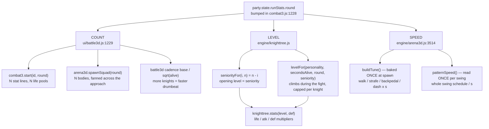
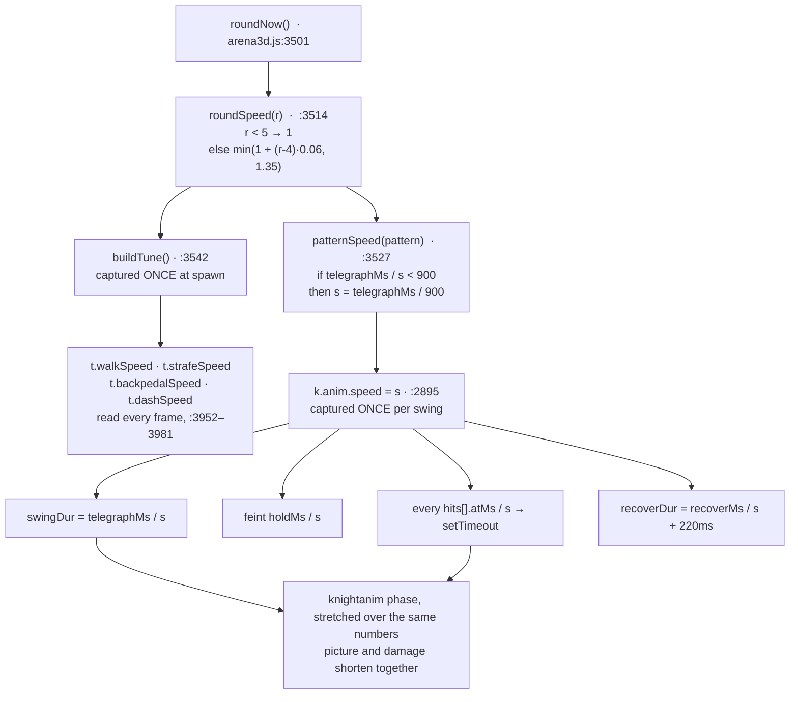

# Difficulty Scaling

A CHLOE run is a ladder of **rounds** (`party.state.runStats.round`, bumped by one the moment a floor is cleared — [engine/combat3.js:1228](../game/js/engine/combat3.js:1228)). That single integer is the only difficulty dial in the game: there is no difficulty setting anywhere in the data, and no player-side number is a function of the round. The player does still grow — but on XP, and the round reaches that only through squad size (`xp = enemyXp(def) * squad`, [engine/combat3.js:1232](../game/js/engine/combat3.js:1232), paid out at [:1236–1241](../game/js/engine/combat3.js:1236)), never as a stat the round scales directly. The round number is read by three independent code paths that compose into "how hard tonight is" — **COUNT** (round N puts N knights on the floor), **LEVEL** (each knight opens at a level set by how many rounds he has been coming, then climbs while he is alive), and **SPEED** (from round 5 on, every knight gains one multiplier that makes him move faster and swing sooner). They are genuinely independent: they are computed in three different functions, captured at three different moments, and two of them can be retuned without touching the third. This page is mostly about the third, because it is the one that has no number on screen anywhere.



---

## Axis 1 — COUNT: round N fields N knights

This is the §20 contract and the spec says so twice ([GAME_SPEC.md §20](../GAME_SPEC.md), §30). It is implemented in exactly two calls, both in `begin()`:

```js
var round = (party.state.runStats && party.state.runStats.round) || 1;
var s = C3.start(enemyId, round);      // N stat lines
...
if (a3d.spawnSquad) a3d.spawnSquad(round);   // N bodies
```
— the round is read at [ui/battle3d.js:1229](../game/js/ui/battle3d.js:1229), spent on `C3.start` at [:1230](../game/js/ui/battle3d.js:1230) and on `spawnSquad` at [:1243](../game/js/ui/battle3d.js:1243). The room's board predicts the same number ahead of the fight: `nextStagePlan()` returns `{ def, round, knights: round }` at [engine/world3d.js:503](../game/js/engine/world3d.js:503).

`spawnSquad(n)` is at [engine/arena3d.js:884](../game/js/engine/arena3d.js:884). What it actually does, in order:

1. Bails and queues into `pendingSquad` if the knight GLB has not landed yet ([:885](../game/js/engine/arena3d.js:885)); the queue is drained after the load at [:677](../game/js/engine/arena3d.js:677) — but the drain is guarded `if (pendingSquad > 1)`, so a queued squad of **one** is never spawned at all. That is survivable rather than correct: `knights[0]` already exists and `A.reset()` has already given it a brain (and therefore a baked scalar), so round 1 behind a slow load gets a knight who simply never walked to his fan position.
2. Splices every knight above index 0 off the end of `knights[]` and removes their groups ([:887–890](../game/js/engine/arena3d.js:887)). **`knights[0]` is never destroyed** — it is literally the same object that fought round 1, which is what makes the squad index a join date for the level axis below.
3. For `i > 0`, clones `knightProto`, clones its materials so a flinch flashes one body only, and calls `mountKnight` **before** parenting the clone to its group ([:908–912](../game/js/engine/arena3d.js:908)) — parenting first would bake the spawn offset into every bone.
4. `initBrain(k, i, n)` ([:928](../game/js/engine/arena3d.js:928)) — deals the personality, bakes the tune (including the speed scalar), and sets `seniority` / `joinRound` / `level`.
5. Staggers dash cooldowns by `i * 1.2` seconds ([:930](../game/js/engine/arena3d.js:930)) so a squad never lunges in unison.
6. Fans them **perpendicular to the approach vector** with `spread = 1.6` m ([:892](../game/js/engine/arena3d.js:892), [:932–944](../game/js/engine/arena3d.js:932)), then snaps each to a legal cell with `navNearest(sx, sz, KNIGHT_RADIUS)` ([:945](../game/js/engine/arena3d.js:945)).

Count also drives the swing drumbeat, which is a separate thing from the speed axis and is easy to confuse with it:

```js
var alive = Math.max(1, C3.aliveCount ? C3.aliveCount() : 1);
var base  = 1700 + Math.random() * 1300;
nextSwingAt = now + Math.max(650, base / Math.sqrt(alive));
```
— [ui/battle3d.js:919–921](../game/js/ui/battle3d.js:919). **This is not round-scaled.** Squad size decides how *often* a swing comes; the round decides how fast each swing *is*. A round-10 fight is faster on both counts, but through two unrelated formulas.

| squad alive | mean gap between swings | floor |
| --- | --- | --- |
| 1 | 2350 ms | 650 ms |
| 3 | 1357 ms | 650 ms |
| 5 | 1051 ms | 650 ms |
| 10 | 743 ms | 650 ms |

(Mean of the `1700 + rand*1300` band divided by `sqrt(alive)`. The 650 ms floor can bite from **7** living knights on the fastest roll — `1700 / sqrt(7) = 643` — and not until **22** on the slowest, `3000 / sqrt(22) = 640`.)

---

## Axis 2 — LEVEL: the seniority ladder

Round N fields knights at opening levels `[N, N-1, … 1]`: `seniorityFor(index, count) = count - index` ([engine/knighttree.js:75](../game/js/engine/knighttree.js:75)) turns the squad index into a join date, and `spawnLevel(personality, seniority) = startLevel + baseBonus[personality] + (seniority - 1) * levelPerRound` ([engine/knighttree.js:90](../game/js/engine/knighttree.js:90)) turns that into an opening level. Each living knight then climbs from his own opening level on seconds alive, at a rate his §22 personality sets (`secondsPerLevel: 6.0` scaled by `rate: { aggressive: 0.70, cautious: 1.00, brute: 1.45 }` — [data/knighttree.js:130–132](../game/js/data/knighttree.js:130)), capped at `min(his opening level + overCap, capForRound)` by `capForKnight` ([engine/knighttree.js:112](../game/js/engine/knighttree.js:112)). Level buys stat multipliers off the rows in [data/knighttree.js:35–68](../game/js/data/knighttree.js:35) and unlocks attack patterns, so a junior knight both hits softer and knows fewer swings.

Full detail — the rows, the personality rates, the cap arithmetic, the in-fight tell, and how `combat3` reprices the squad every tick — is in **[Knight levels](knight-levels.md)**. The only thing this page needs from it is the opening ladder and the life multipliers, used in the worked examples below.

---

## Axis 3 — SPEED (§28 A2): from round 5, the knights get faster

This is the round's own contribution to threat, added because §28/§30 made a round-N squad *open* softer than the old flat level-N squad. It is one scalar, `s`, and the spec's requirement on it is explicit: it must touch "walk/strafe/dash speed and swing wind-up" while leaving §21's one-clock rule intact, and it must state a telegraph floor ([GAME_SPEC.md §28 A2](../GAME_SPEC.md)).

### The constants

Authored in `knight.brain.roundSpeed` at [data/arena3d.js:216–221](../game/js/data/arena3d.js:216):

| key | value | meaning |
| --- | --- | --- |
| `fromRound` | `5` | the first round that scales at all; everything below it gets a hard `1` |
| `perRound` | `0.06` | added per round past `fromRound - 1` |
| `max` | `1.35` | ceiling |
| `telegraphFloorMs` | `900` | no pattern's wind-up may be scaled below this |

The engine carries the identical four numbers as `SPEED_DEFAULT` at [engine/arena3d.js:3508](../game/js/engine/arena3d.js:3508):

```js
var SPEED_DEFAULT = { fromRound: 5, perRound: 0.06, max: 1.35, telegraphFloorMs: 900 };
```

`speedCfg()` ([:3509–3513](../game/js/engine/arena3d.js:3509)) merges them key-by-key with a `typeof === 'number'` guard, so a stripped or half-written data file degrades to these four rather than producing `NaN`. **The data and the engine agree exactly today** — verified value for value — so `SPEED_DEFAULT` is a floor, not a second source of truth. If you retune `data/arena3d.js`, you do *not* have to touch the engine; but if you delete a key from data, the engine's number silently takes over.

### The formula

[engine/arena3d.js:3514–3520](../game/js/engine/arena3d.js:3514):

```js
function roundSpeed(r) {
  var c = speedCfg();
  r = (r == null) ? roundNow() : r;
  if (r < c.fromRound) return 1;
  var m = 1 + (r - (c.fromRound - 1)) * c.perRound;
  return m > c.max ? c.max : m;
}
```

So: **rounds below `fromRound` get a hard `1`** (not `1 + 0`, an early return — nothing about rounds 1–4 moves at all), and otherwise `s = min(1 + (r - (fromRound - 1)) * perRound, max)`. With the shipped constants that is `s = min(1 + (r - 4) * 0.06, 1.35)`.

`roundNow()` ([:3501](../game/js/engine/arena3d.js:3501)) reads `knighttree.round()`, which reads `party.state.runStats.round`, defaulting to `1` if the ladder module is absent.

| round | raw `1 + (r-4)*0.06` | `s` after the clamp |
| ---: | ---: | ---: |
| 1 | — (early return) | **1.00** |
| 2 | — | **1.00** |
| 3 | — | **1.00** |
| 4 | — | **1.00** |
| 5 | 1.06 | **1.06** |
| 6 | 1.12 | **1.12** |
| 7 | 1.18 | **1.18** |
| 8 | 1.24 | **1.24** |
| 9 | 1.30 | **1.30** |
| 10 | 1.36 | **1.35** (clamped) |
| 11 | 1.42 | **1.35** |
| 12 | 1.48 | **1.35** |

Note the ceiling is reached at round 10 **by the clamp**, not by the arithmetic: the raw value at round 10 is 1.36 and `max` cuts 0.01 off it. The data comment's table at [data/arena3d.js:203](../game/js/data/arena3d.js:203) prints `10+ → 1.35 (max)`, which is the clamped output and therefore correct; the comment `max: 1.35 // ceiling; reached at round 10` is correct in the same sense. There is no round at which the raw curve lands exactly on `1.35`.

`debug().roundSpeed` publishes the live value, rounded to three places, at [engine/arena3d.js:4548](../game/js/engine/arena3d.js:4548). It is the **only** surface the scalar has — no HUD element, no poster, no log line names it.

### What `s` actually touches

Exactly two places, and the engine comment at [:3503–3507](../game/js/engine/arena3d.js:3503) says so: "applied in exactly two places — the movement speeds below and the swing schedule in `telegraph()`".

**(a) Four movement speeds, multiplied, once, at spawn.** [engine/arena3d.js:3541–3552](../game/js/engine/arena3d.js:3541):

```js
var SPED_KEYS = ['walkSpeed', 'strafeSpeed', 'backpedalSpeed', 'dashSpeed'];
function buildTune(personality) {
  ... BRAIN_DEFAULTS, then data, then the personality overlay ...
  var sp = roundSpeed();
  if (sp > 1) for (var i = 0; i < SPED_KEYS.length; i++) t[SPED_KEYS[i]] *= sp;
  t.roundSpeed = sp;
  return t;
}
```

The multiply happens **after** the personality overlay, so an aggressive knight's `walkSpeed: 1.85` is what gets scaled, not the 1.6 default. The state machine then reads the already-scaled numbers every frame with no further arithmetic — `t.walkSpeed` at [:3952–3953](../game/js/engine/arena3d.js:3952) (stalk) and [:3958](../game/js/engine/arena3d.js:3958) (press), `t.strafeSpeed` at [:3962–3964](../game/js/engine/arena3d.js:3962), `t.backpedalSpeed` at [:3967](../game/js/engine/arena3d.js:3967) (reposition) and [:3981](../game/js/engine/arena3d.js:3981) (stagger reel), `t.dashSpeed` at [:3971](../game/js/engine/arena3d.js:3971).

Default brain, m/s, by round:

| round | `s` | walk | strafe | backpedal | dash | dash distance (× `dashTime` 0.42 s) |
| ---: | ---: | ---: | ---: | ---: | ---: | ---: |
| 1–4 | 1.00 | 1.600 | 1.350 | 1.100 | 9.500 | 3.99 m |
| 5 | 1.06 | 1.696 | 1.431 | 1.166 | 10.070 | 4.23 m |
| 6 | 1.12 | 1.792 | 1.512 | 1.232 | 10.640 | 4.47 m |
| 7 | 1.18 | 1.888 | 1.593 | 1.298 | 11.210 | 4.71 m |
| 8 | 1.24 | 1.984 | 1.674 | 1.364 | 11.780 | 4.95 m |
| 9 | 1.30 | 2.080 | 1.755 | 1.430 | 12.350 | 5.19 m |
| 10+ | 1.35 | 2.160 | 1.823 | 1.485 | 12.825 | 5.39 m |

For scale: the player walks at `WALK = 3.2` m/s, sprints at `5.4`, and **crouches at `3.2 × 0.55 = 1.76` m/s** ([engine/arena3d.js:206](../game/js/engine/arena3d.js:206), [:2655–2656](../game/js/engine/arena3d.js:2655)). A default knight out-walks a crouching player from round 6 onward, and the `slash` pattern's answer is *crouch*.

**(b) Every time in one swing, divided.** [engine/arena3d.js:2885–2902](../game/js/engine/arena3d.js:2885), inside `A.telegraph`:

```js
var speed = patternSpeed(pattern);
...
stA.swingDur   = (pattern.telegraphMs || 1500) / 1000 / speed;
stA.recoverDur = ((pattern.recoverMs  ||  800) / speed + 220) / 1000;
stA.speed      = speed;
var holdS = (fe && fe.chance > 0 && Math.random() < fe.chance) ? (fe.holdMs || 0) / 1000 / speed : 0;
var sched = hitSchedule(pattern, holdS, speed);
```

`hitSchedule` ([:2783–2800](../game/js/engine/arena3d.js:2783)) divides every `hits[].atMs` — or the single `telegraphMs` fallback — by the same `speed`, then adds the (already-divided) feint hold. Each entry's `fireAt` becomes a `setTimeout` in `atk.timers` ([:2927–2931](../game/js/engine/arena3d.js:2927)). The post-strike recover timer reads the swing's own stored scalar, not a fresh one ([:2958–2963](../game/js/engine/arena3d.js:2958)):

```js
var rsp = k.anim.speed || 1;
window.setTimeout(function () {
  if (atk.mode === 'strike') { atk.mode = 'recover'; }
  window.setTimeout(function () { if (atk.mode === 'recover') clearAttack(k); },
    ((pattern && pattern.recoverMs) || 800) / rsp);
}, 220);
```

Note the **220 ms is a flat constant and is not scaled** — in both the anim's `recoverDur` and the strike path — so the two agree by construction and the post-strike settle never collapses to nothing.

**What `s` does NOT touch.** Verified by grep: `roundSpeed()` has exactly three call sites — `buildTune` ([:3548](../game/js/engine/arena3d.js:3548)), `patternSpeed` ([:3528](../game/js/engine/arena3d.js:3528)) and `debug()` ([:4548](../game/js/engine/arena3d.js:4548)) — so outside `SPED_KEYS` and `telegraph()` the scalar is only ever *reported*, never applied:

| untouched | value | where | consequence |
| --- | --- | --- | --- |
| `dashTellMs` | 380 ms (brute 480) | [data/arena3d.js:128](../game/js/data/arena3d.js:128), used at [engine/arena3d.js:3669](../game/js/engine/arena3d.js:3669) | the coil warning before a lunge stays the same length at every round |
| `knight.dashTime` | 0.42 s | [data/arena3d.js:96](../game/js/data/arena3d.js:96), read at [engine/arena3d.js:3670](../game/js/engine/arena3d.js:3670) | dash *speed* scales but dash *duration* does not, so the lunge covers 35% more ground at round 10 (3.99 m → 5.39 m). Note where it is read from: §18's **fallback** block, not `brain` — there is no `brain.dashTime` and no `BRAIN_DEFAULTS.dashTime`, so the fallback block's own instruction "if you retune, retune both" ([data/arena3d.js:89–92](../game/js/data/arena3d.js:89)) cannot be followed for this key |
| charge lunge velocity | 7.6 / 5.5 m·s⁻¹ | [engine/arena3d.js:4100–4107](../game/js/engine/arena3d.js:4100) | hardcoded, and gated on the last 25% of a *shorter* wind-up, so the charge's approach actually covers **less** ground at high rounds |
| `arcHoldMs`, `strafeHoldMs`, `repositionMs`, `dashCooldownMs`, `attackCooldownMs`, `pressSwayMs`, `deathMs`, `hitFlashMs` (and `staggerMs` at [:150](../game/js/data/arena3d.js:150)) | — | [data/arena3d.js:124–135](../game/js/data/arena3d.js:124) | every other brain timer is round-invariant |
| `turnRate`, `recoverTurnRate` | 3.4 / 1.1 rad·s⁻¹ | [data/arena3d.js:113–114](../game/js/data/arena3d.js:113) | he closes faster but turns at the same rate, so circling him stays a valid answer |
| swing cadence | `base / sqrt(alive)` | [ui/battle3d.js:921](../game/js/ui/battle3d.js:921) | frequency is the count axis, not the speed axis |
| hit volumes | `reach` / `length` / `radius` | [data/arena3d.js:319–377](../game/js/data/arena3d.js:319) | the blade never gets longer; only sooner |
| `windowWaitMs` | pattern times + hold + 900 | [ui/battle3d.js:969–976](../game/js/ui/battle3d.js:969) | the HUD warning's staleness cap is computed from **unscaled** data, so at high rounds it is over-long rather than short — safe, because the strike callback normally retires it first |
| everything about the player | `WALK` / `SPRINT` / `CROUCH_SPEED` | [engine/arena3d.js:206](../game/js/engine/arena3d.js:206) — the evade and every ability cooldown live in [data/abilities.js](../game/js/data/abilities.js) (`evade`: `cooldownMs: 900`, [:230](../game/js/data/abilities.js:230)), which this file never reads | difficulty is entirely on the knight side |

### The readability floor

`telegraphFloorMs: 900` is described in its own data comment as the readability guarantee and "the one number here nobody may quietly lower" ([data/arena3d.js:206](../game/js/data/arena3d.js:206)); the key's inline comment is `// no wind-up ever scales below this` ([:220](../game/js/data/arena3d.js:220)). The reasoning it records: a wind-up you cannot see is not a hard attack, it is an unfair one.

The implementation is **not** a clamp on `telegraphMs`. It is a reduction of the scalar itself, per pattern — [engine/arena3d.js:3527–3534](../game/js/engine/arena3d.js:3527):

```js
function patternSpeed(pattern, r) {
  var m = roundSpeed(r);
  if (m <= 1) return 1;
  var floor = speedCfg().telegraphFloorMs;
  var tel = (pattern && pattern.telegraphMs) || 1500;
  if (tel / m < floor) m = tel / floor;
  return m < 1 ? 1 : m;
}
```

This is the load-bearing detail and the comment above it spells out why: clamping `telegraphMs` alone would shorten the wind-up but leave `hits[].atMs` and `recoverMs` on the full multiplier, i.e. **two clocks**, which is the §21 bug that cost a fight. Holding back the scalar instead means the whole schedule — telegraph, feint hold, every hit window, the recover — is divided by one number, so the picture and the damage shorten by exactly the same factor or neither does. `patternSpeed` is called exactly once, at [:2885](../game/js/engine/arena3d.js:2885).

Because the floor is per pattern, patterns diverge from round 8. Effective wind-up (ms), computed from the shipped constants:

| pattern | `telegraphMs` | r 1–4 | r 5 | r 6 | r 7 | r 8 | r 9 | r 10+ | its `s` at r 10+ |
| --- | ---: | ---: | ---: | ---: | ---: | ---: | ---: | ---: | ---: |
| `thrust_combo` | 1100 | 1100 | 1038 | 982 | 932 | **900** | **900** | **900** | **1.222** (held) |
| `slash` | 1500 | 1500 | 1415 | 1339 | 1271 | 1210 | 1154 | 1111 | 1.35 |
| `overhead` | 1700 | 1700 | 1604 | 1518 | 1441 | 1371 | 1308 | 1259 | 1.35 |
| `charge` | 1900 | 1900 | 1792 | 1696 | 1610 | 1532 | 1462 | 1407 | 1.35 |
| `ground_slam` | 2100 | 2100 | 1981 | 1875 | 1780 | 1694 | 1615 | 1556 | 1.35 |

`thrust_combo` is the only pattern that ever reaches the floor, exactly as the data comment predicts: at the 1.35 ceiling it would want `1100 / 1.35 = 814.8` ms, so its own multiplier is held at `1100 / 900 = 1.2222`. **The comment says this happens "at the 1.35 ceiling"; the code makes it happen at round 8**, where `s = 1.24` already pushes `1100 / 1.24 = 887 ms` under 900. From round 8 onward `thrust_combo` stops getting faster entirely while every other pattern keeps accelerating for two more rounds — the fastest attack in the set is the first one to stop.

And because the hold applies to the *whole* schedule, the combo's later stabs and its recover freeze with it:

| `thrust_combo` window | authored | r 7 (`s` = 1.18) | r 8+ (`s` = 1.222) |
| --- | ---: | ---: | ---: |
| jab 1 (`telegraphMs`, `hits[0].atMs`) | 1100 ms | 932 ms | 900 ms |
| jab 2 (`hits[1].atMs`) | 1400 ms | 1186 ms | 1145 ms |
| step-through (`hits[2].atMs`, `lunge: 1.6`) | 1850 ms | 1568 ms | 1514 ms |
| recover (`recoverMs`) | 850 ms | 720 ms | 695 ms |

That last row is `recoverMs / s` only. The settle the player actually gets is 220 ms longer at every round, because the flat 220 rides on top unscaled in both halves of the code — `recoverDur = (recoverMs / s + 220) / 1000` ([:2894](../game/js/engine/arena3d.js:2894)) and, on the strike path, a 220 ms timer before `mode = 'recover'` and only then `recoverMs / rsp` ([:2958–2963](../game/js/engine/arena3d.js:2958)). So the real windows are 1070 / 940 / 915 ms.

### One clock, one capture

The scalar is resolved **once per swing** and stored on the knight's anim as `k.anim.speed` ([engine/arena3d.js:267–270](../game/js/engine/arena3d.js:267)):

```js
/* §28 A2: the round-speed scalar THIS swing was armed with. Held on the
   anim rather than recomputed, so the recover timer cannot end up on a
   different round's multiplier from the wind-up that preceded it. */
speed: 1,
```

This is the same rule as §21's one clock, applied to the multiplier rather than to the timestamp. The pose driver measures phase off `atk.t0` and stretches the pose pairs over `swingDur` / `sched` / `recoverDur` ([:3270–3305](../game/js/engine/arena3d.js:3270), [:3393–3400](../game/js/engine/arena3d.js:3393)), and the swing clock resyncs to wall time each frame — `st.swingT = (wall > st.swingT) ? wall : st.swingT + dt` at [:4174](../game/js/engine/arena3d.js:4174), taking whichever of the wall clock and the integrated `dt` has moved further so that a headless `_tick` scrub and a real rAF frame both work. If `speed` were re-read per frame, a round boundary (or any future mid-fight change to the round) would land halfway through a swing and the pose would be playing at one rate while the strike `setTimeout` — already scheduled at arm time — fired at another. Holding it on the swing makes that impossible rather than merely unlikely.

The same discipline is why the movement half is baked in `buildTune` at spawn: a per-frame merge of `BRAIN_DEFAULTS` + data + personality + scalar for every knight in a round-10 squad is pure garbage collection, and a squad spawns once per round, so "the round it was spawned for is the round it fights in" ([:3536–3540](../game/js/engine/arena3d.js:3536)).



---

## How the three compose

Worked from the shipped tables. Life multipliers come from the rows in [data/knighttree.js:36–68](../game/js/data/knighttree.js:36); the base life for `hollow_black_knight` is **48** ([data/enemies.js:43](../game/js/data/enemies.js:43)); per-knight HP is `round(48 × lifeMult)` via `knighttree.stats()` ([engine/knighttree.js:185–194](../game/js/engine/knighttree.js:185)).

| | round 1 | round 5 | round 10 |
| --- | ---: | ---: | ---: |
| knights on the floor | 1 | 5 | 10 |
| opening levels (`combat3` ladder) | `[1]` | `[5, 4, 3, 2, 1]` | `[10, 9, 8, 7, 6, 5, 4, 3, 2, 1]` |
| life multipliers | 1.00 | 1.62 / 1.45 / 1.30 / 1.15 / 1.00 | 2.66 / 2.46 / 2.22 / 2.00 / 1.80 / 1.62 / 1.45 / 1.30 / 1.15 / 1.00 |
| **total life multiplier** | **1.00×** | **6.52×** | **17.66×** |
| total squad HP at t=0 | 48 | 313 | 848 |
| speed multiplier `s` | **1.00** | **1.06** | **1.35** |
| default knight walk | 1.60 m/s | 1.696 m/s | 2.160 m/s |
| `slash` wind-up | 1500 ms | 1415 ms | 1111 ms |
| `thrust_combo` wind-up | 1100 ms | 1038 ms | 900 ms (floored) |
| mean gap between swings | 2350 ms | 1051 ms | 743 ms |
| patterns the veteran knows | `slash` | all five | all five |
| patterns the newcomer knows | `slash` | `slash` | `slash` |

The round-5 total of **6.52×** is the number §30 balanced against and the spec states it out loud: the pre-§28 flat squad was 8.10×, §28's all-level-1 opening was 5.00×, §30 is 6.52× ([GAME_SPEC.md §30](../GAME_SPEC.md), and the same arithmetic in [data/knighttree.js:100–106](../game/js/data/knighttree.js:100)). The round grows in threat more slowly than it grows in number, and the threat concentrates in one veteran instead of smearing across five equals.

Two caveats that make the table honest:

- **The opening levels above are `combat3`'s, not the brain's.** `start()` builds `st.enemies` with `kt.spawnLevel('', sen)` — an *empty* personality string — because temperaments are dealt by the 3D layer, which does not exist yet when `start()` runs ([engine/combat3.js:594–604](../game/js/engine/combat3.js:594)). The brute's `baseBonus` of +1 is therefore missing at t=0 and arrives on the first `syncLevels()` tick ([engine/combat3.js:1143–1162](../game/js/engine/combat3.js:1143)), which pulls `arena3d.knightLevels()` and reprices by ratio. Personalities are **dealt round-robin from a random start** (`personaSeed`, [engine/arena3d.js:3557–3563](../game/js/engine/arena3d.js:3557)), so which indices are brutes changes every page load — a round-5 squad has one or two of them.
- **The level axis keeps moving during the fight; the speed axis does not.** By ~35 s of a round-5 fight the squad has climbed to something like `[7,7,5,4,4]` (measured, and recorded at [data/knighttree.js:124](../game/js/data/knighttree.js:124)), while `s` has been 1.06 since the first frame and will be 1.06 on the last. Round 6's crossover — easier at t=0 than the old flat squad, harder after ~30 s — is described at [data/arena3d.js:310–318](../game/js/data/arena3d.js:310) and is the measurement to re-take if either half is retuned. **Read that comment with its date on it:** it says "Combined with §28 A's level-1 spawns", i.e. it was written when a round-6 squad opened at six times ×1.00 = 6.00×. §30 opens the same squad on the seniority ladder at 1.80 + 1.62 + 1.45 + 1.30 + 1.15 + 1.00 = **8.32×**, against the old flat level-6 squad's 6 × 1.80 = 10.80×. The direction the comment names is still right — easier at t=0, harder later — but the t=0 easing it was written about (4.80× of life removed) is about **twice** the easing that actually ships (2.48×), and the crossover number itself has not been re-taken since §30.

A fourth thing changes with the round but is not a difficulty axis in this sense: §24 rotates the **stage** (the church, the Ring, …) on a round cycle, which changes the floor's size and shape rather than the knights' numbers. See [Stages](stages.md).

---

## Traps

- **Two capture times for one scalar.** Movement is baked at spawn (`buildTune`); the swing schedule reads `roundNow()` live on every `telegraph()` call. They agree only because `spawnSquad` runs once per round, immediately after `runStats.round` is read in `begin()` ([ui/battle3d.js:1229](../game/js/ui/battle3d.js:1229) → [:1243](../game/js/ui/battle3d.js:1243)). Anything that changes the round mid-fight would give a knight round-N legs and round-N+1 swings. `A.reset()` does re-run `initBrain` for every knight ([engine/arena3d.js:2232](../game/js/engine/arena3d.js:2232)) and so re-bakes the movement half — but it is not a repair mechanism, because none of its three call sites ever runs mid-fight: `A.init` ([:2193](../game/js/engine/arena3d.js:2193)), `A.setStage` ([:1493](../game/js/engine/arena3d.js:1493)) and `begin()` ([ui/battle3d.js:1242](../game/js/ui/battle3d.js:1242)), all of them ahead of `spawnSquad` in the same entry into the fight. What actually keeps the two halves in step is that `runStats.round` only ever moves between fights ([engine/combat3.js:1228](../game/js/engine/combat3.js:1228), on the floor-cleared path). The re-bake in `reset()` matters only on the load-gated path above, where `spawnSquad` bailed and `reset()` was the last thing to build a brain.
- **`brainOf()` builds a brain lazily** for a knight that never went through `spawnSquad` ([engine/arena3d.js:3648](../game/js/engine/arena3d.js:3648)), calling `initBrain(k, i)` with no `n`, which falls back to `knights.length`. Correct today; it is the path that would silently mis-price a squad if anything ever telegraphed before the spawn.
- **`t.roundSpeed` (set at [:3550](../game/js/engine/arena3d.js:3550)) has no reader.** Grep for `roundSpeed` across `game/`, `tools/` and `worker/` returns only `data/arena3d.js` and `engine/arena3d.js`. It is diagnostic state; do not delete it assuming it is dead, and do not assume something consumes it.
- **`deadDebug()` publishes no `roundSpeed`** ([engine/arena3d.js:31–44](../game/js/engine/arena3d.js:31)). A headless verifier reading `debug().roundSpeed` on a machine with no WebGL gets `undefined`, not `1`. The disabled `A.telegraph` stub is a flat `setTimeout(cb, 300)` regardless of round ([:63](../game/js/engine/arena3d.js:63)), so the speed axis simply does not exist on that path. The **level** axis is the one `disableAPI` reproduces faithfully — `A.knightLevels(n)` rebuilds the seniority ladder out of pure arithmetic ([:111–118](../game/js/engine/arena3d.js:111)). The **count** axis it does not reproduce at all: `A.spawnSquad` is a `noop` and `A.squadSize()` answers a flat `1` ([:76](../game/js/engine/arena3d.js:76)). Count survives on that path only because it never lived in the arena — `combat3.start(enemyId, round)` builds N entries in `st.enemies` with no help from WebGL ([engine/combat3.js:594–604](../game/js/engine/combat3.js:594)), and that is the array `knightLevels(n)` is asked to pad.
- **`spawnSquad` splices, it does not rebuild.** `knights[0]` survives every round. The level axis depends on that (`seniority` is synthesised from the index), and so does material identity — clones get cloned materials at [:900–907](../game/js/engine/arena3d.js:900), `knights[0]` keeps the ones `mountKnight` gave it.
- **The `>2.4 he outruns you` band comment is written about the authored value.** `aggressive.walkSpeed` is 1.85 ([data/arena3d.js:160](../game/js/data/arena3d.js:160)); at round 10 the scalar takes it to **2.4975**, past the ceiling its own comment names ([data/arena3d.js:109](../game/js/data/arena3d.js:109)). He still does not outrun a standing player (3.2 m/s), but he does outrun a crouching one (1.76 m/s) — and `slash`, the most common pattern, is answered by crouching. Every band comment in `brain` is pre-scalar; read them that way.
- **A separate, pre-existing inversion in the same block:** `cautious` sets `strafeSpeed: 1.5` above its own `walkSpeed: 1.45` ([data/arena3d.js:172](../game/js/data/arena3d.js:172)), which the `strafeSpeed` comment at [:110](../game/js/data/arena3d.js:110) says must never happen. The scalar multiplies both equally, so the inversion is preserved, not caused, by this axis.
- **Scaling the pattern object in place would compound.** `patterns` in `data/arena3d.js` is shared data read by every knight and every round; `telegraph()` never writes to it and the comment at [:2882–2884](../game/js/engine/arena3d.js:2882) says why. Any "optimisation" that pre-multiplies the pattern is a round-on-round decay of every wind-up in the game.

---

## The knobs, and the ones that are contracts

**Safe to turn:**

| knob | file | effect |
| --- | --- | --- |
| `roundSpeed.perRound` | [data/arena3d.js:218](../game/js/data/arena3d.js:218) | how steeply the night speeds up; every round from 5 moves together |
| `roundSpeed.fromRound` | [data/arena3d.js:217](../game/js/data/arena3d.js:217) | when speed starts contributing at all; rounds below it are untouched |
| `roundSpeed.max` | [data/arena3d.js:219](../game/js/data/arena3d.js:219) | the ceiling, and therefore which round the curve flattens on |
| `growth.rate` / `growth.secondsPerLevel` | [data/knighttree.js:130–132](../game/js/data/knighttree.js:130) | the in-fight climb — the spec names this as the knob for a thin late round |
| `growth.overCap` | [data/knighttree.js:135](../game/js/data/knighttree.js:135) | how far past his opening level a knight may climb |
| per-knight `life` / `atk` / `def` rows | [data/knighttree.js:36–68](../game/js/data/knighttree.js:36) | the level ladder's stat curve; multipliers are absolute per row, not cumulative |
| swing cadence band `1700 + rand*1300`, floor `650` | [ui/battle3d.js:920–921](../game/js/ui/battle3d.js:920) | how often the squad swings, independent of round |

**Contracts — do not turn:**

| do not change | why | source |
| --- | --- | --- |
| `roundSpeed.telegraphFloorMs: 900` | the readability guarantee. A wind-up under the floor is not a hard attack, it is an unfair one. Lowering it is the one change this data file explicitly forbids. | [data/arena3d.js:206](../game/js/data/arena3d.js:206), [GAME_SPEC.md §28 A2](../GAME_SPEC.md) |
| round N fields N knights | the §20 contract. Rewards, seniority levels, the room's board and the fan geometry all derive from it. The spec names it twice as the thing to leave alone when a round feels thin. | [GAME_SPEC.md §20](../GAME_SPEC.md), [GAME_SPEC.md §30](../GAME_SPEC.md) |
| `knighttree.levelPerRound: 1` | it moves the whole ladder — baseline, seniority openings and caps — at once. | [data/knighttree.js:150](../game/js/data/knighttree.js:150), [GAME_SPEC.md §30](../GAME_SPEC.md) |
| one scalar per swing (`patternSpeed`, `k.anim.speed`) | §21's one-clock rule. A per-window or per-frame scalar lets the damage and the picture drift apart, which is the bug that cost a fight. | [engine/arena3d.js:3521–3526](../game/js/engine/arena3d.js:3521), [:267](../game/js/engine/arena3d.js:267) |
| the pattern objects being read-only in `telegraph()` | shared data; scaling in place compounds every round. | [engine/arena3d.js:2882](../game/js/engine/arena3d.js:2882) |
| hit volumes (`reach` / `length` / `radius`) | derived in §28 B2 from the measured blade tip plus the player's 0.35 m body. They are not a difficulty knob and the speed axis deliberately leaves them alone. | [data/arena3d.js:277–318](../game/js/data/arena3d.js:277) |

---

## Where spec and code differ

The code wins in all four cases below; none is a defect in the code.

| claim | where | what the code does |
| --- | --- | --- |
| "only `thrust_combo` ever reaches the floor — at the 1.35 ceiling … held at 1.22" | [data/arena3d.js:210–215](../game/js/data/arena3d.js:210) | correct about *which* pattern and *what* the held value is (1.2222), but it first reaches the floor at **round 8** (`s` = 1.24), not at the 1.35 ceiling. |
| "`max: 1.35 // ceiling; reached at round 10`" | [data/arena3d.js:219](../game/js/data/arena3d.js:219) | the raw curve at round 10 is **1.36**; 1.35 is what the clamp returns. The printed table `10+ → 1.35` is the clamped output and is accurate. |
| §28 A: "every knight spawns at level 1" | [GAME_SPEC.md §28](../GAME_SPEC.md) | superseded by §30 and the spec says so in its own banner: a knight opens at his **seniority**. The code implements §30. |
| "Combined with §28 A's level-1 spawns this is a real easing of round 6 at t=0" | [data/arena3d.js:315–317](../game/js/data/arena3d.js:315) | written before §30 and never re-measured against it. Under the shipped seniority ladder a round-6 squad opens at **8.32×** life, not the 6.00× that sentence assumes, so the easing it describes is roughly double what actually ships. The *direction* still holds. |

---

## Where to change what

| task | file |
| --- | --- |
| Change how fast the night speeds up, or when it starts | [data/arena3d.js](../game/js/data/arena3d.js) — `knight.brain.roundSpeed` (line 216) |
| Change the readability floor (don't — see contracts) | [data/arena3d.js](../game/js/data/arena3d.js) — `roundSpeed.telegraphFloorMs` (line 220) |
| Change the speed formula or the clamp order | [engine/arena3d.js](../game/js/engine/arena3d.js) — `roundSpeed()` (3514) / `patternSpeed()` (3527) |
| Change **which** brain keys the scalar multiplies | [engine/arena3d.js](../game/js/engine/arena3d.js) — `SPED_KEYS` (3541) inside `buildTune()` |
| Change which swing times the scalar divides | [engine/arena3d.js](../game/js/engine/arena3d.js) — `A.telegraph` (2885–2902) and `hitSchedule()` (2783) |
| Change a pattern's authored wind-up, hits or recover | [data/arena3d.js](../game/js/data/arena3d.js) — `patterns` (319) |
| Change how many knights a round fields | it is the §20 contract; the call sites are [ui/battle3d.js:1229–1243](../game/js/ui/battle3d.js:1229) and [engine/world3d.js:503](../game/js/engine/world3d.js:503) |
| Change squad spacing / spawn fan | [engine/arena3d.js](../game/js/engine/arena3d.js) — `spawnSquad()` (884), `spread` (892) |
| Change how often the squad swings | [ui/battle3d.js](../game/js/ui/battle3d.js) — `scheduleSwing()` (916) |
| Change opening levels or the in-fight climb | [data/knighttree.js](../game/js/data/knighttree.js) — `growth` (127); maths in [engine/knighttree.js](../game/js/engine/knighttree.js) (75–143) |
| Change per-level stat multipliers or pattern unlocks | [data/knighttree.js](../game/js/data/knighttree.js) — `rows` (35) |
| Change the knight's base stat block | [data/enemies.js](../game/js/data/enemies.js) — `hollow_black_knight` (36) |
| Change how a levelled knight is repriced mid-fight | [engine/combat3.js](../game/js/engine/combat3.js) — `syncLevels()` (1143) |
| Add a diagnostic for the speed axis | [engine/arena3d.js](../game/js/engine/arena3d.js) — `debug()` (4548) and `deadDebug()` (31) |
| Change the movement personalities the scalar multiplies | [data/arena3d.js](../game/js/data/arena3d.js) — `brain.personalities` (157) |

**See also:** [Architecture](architecture.md) · [Run loop](run-loop.md) · [Combat](combat.md) · [Knight AI](knight-ai.md) · [Knight levels](knight-levels.md) · [Knight rig](knight-rig.md) · [Progression](progression.md) · [World room](world-room.md) · [Stages](stages.md) · [Data reference](data-reference.md) · [Tooling](tooling.md) · [Debugging](debugging.md)
