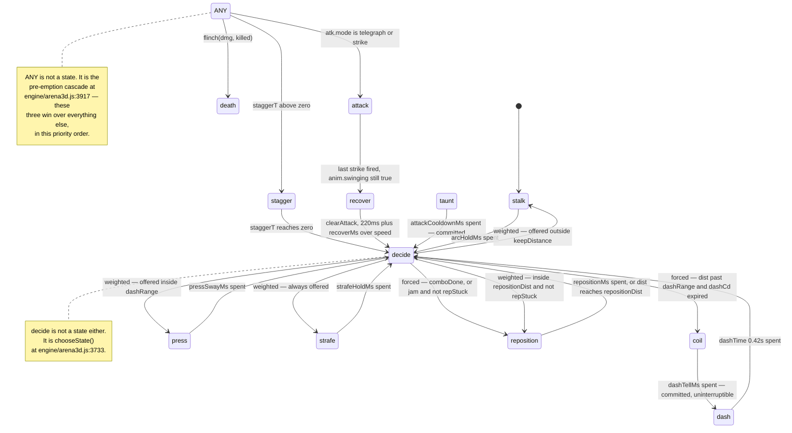
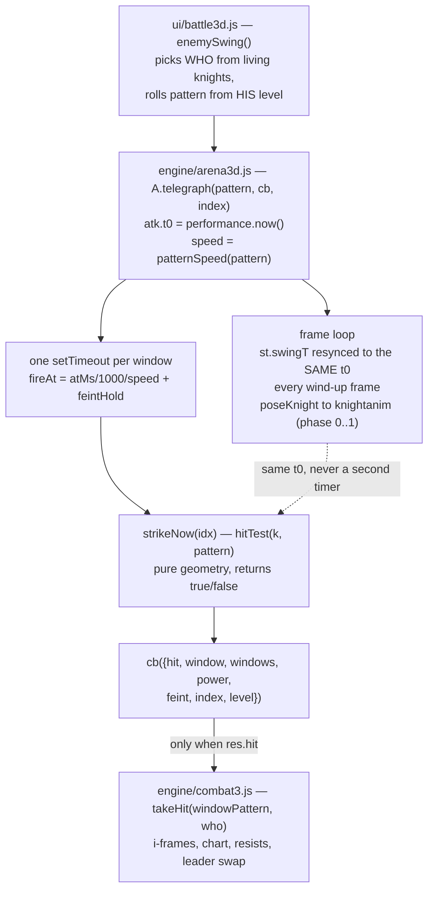

# The Hollow Black Knight — Behaviour

The knight is two machines sharing one body. A **brain** decides where he stands — a weighted state machine (`stalk · press · strafe · reposition · coil · dash · attack · recover · stagger · taunt · death`) whose tunables live in `knight.brain` in [data/arena3d.js:107](../game/js/data/arena3d.js:107). That is §22's "no magic numbers in the engine" rule, and it holds with exactly two exceptions the code still carries: the `dash` hold reads `knight.dashTime` outside `brain` (§2.2) and the charge's two lunge speeds are hard-coded (§10). Separately, a **swing scheduler** in [ui/battle3d.js:1000](../game/js/ui/battle3d.js:1000) decides when somebody attacks and rolls one of five patterns; [engine/arena3d.js:2856](../game/js/engine/arena3d.js:2856) plays that pattern's telegraph, arms one `setTimeout` per hit window, and at each window answers exactly one question — *is the player inside this volume?* — while [engine/combat3.js:970](../game/js/engine/combat3.js:970) turns that boolean into damage. The two machines are deliberately loosely coupled: the brain never schedules a swing, and the swing never asks the brain for permission. This page is the behaviour half. The bones and the pose maths are [knight-rig](knight-rig.md); the per-knight level ladder is [knight-levels](knight-levels.md); the round-by-round difficulty curve is [difficulty-scaling](difficulty-scaling.md).

Spec basis: GAME_SPEC §18 (hunting AI, [GAME_SPEC.md:354](../GAME_SPEC.md:354)) superseded by §22 ([GAME_SPEC.md:483](../GAME_SPEC.md:483), state machine at [GAME_SPEC.md:492](../GAME_SPEC.md:492)) and extended by §23 ([GAME_SPEC.md:523](../GAME_SPEC.md:523)), §25 (the shove) and §28 A2 (round speed). **Where this page and GAME_SPEC disagree, the code is what shipped and this page follows the code**; each such divergence is called out inline.

---

## 1. Two `state` fields, and they are not the same thing

This is the first thing to get right, because both are called `state` and both appear in `debug()`.

| Field | Owner | Values | What it means |
|---|---|---|---|
| `k.brain.state` | the brain | `stalk` `press` `strafe` `reposition` `coil` `dash` `attack` `recover` `stagger` `taunt` `death` | the **decision** he made this frame |
| `k.anim.state` | the movement block | `idle` `walk` `strafe` `backpedal` `dash` `coil` `taunt` `turnInPlace` `stagger` `death` | the **pose** that decision picked |

Two different decisions can wear the same pose (`attack` and `recover` both render `idle`; a §25 shove renders `backpedal` from whatever state he was in), which is why the headless probe counts the brain name and not the pose name — see `knightStateName` at [engine/arena3d.js:4684](../game/js/engine/arena3d.js:4684). `debug().knightBrain[i]` publishes both side by side ([engine/arena3d.js:4562](../game/js/engine/arena3d.js:4562)).

**Divergence from spec.** §22 lists six states — `stalk · press · strafe · reposition · recover · stagger` ([GAME_SPEC.md:493](../GAME_SPEC.md:493)). The shipped brain has eleven: `coil` and `dash` are separate states (the spec describes `dash` in prose at [GAME_SPEC.md:500](../GAME_SPEC.md:500) but omits it from the list), and `attack`, `taunt` and `death` are brain states too. The engine's own header comment ([engine/arena3d.js:3471](../game/js/engine/arena3d.js:3471)) lists nine and still misses `taunt` and `death`, both of which are set directly — `taunt` by `setState` in `A.taunt` ([engine/arena3d.js:3222](../game/js/engine/arena3d.js:3222)), `death` by a raw write in `A.flinch` ([engine/arena3d.js:3030](../game/js/engine/arena3d.js:3030)) and again every frame in `updateDeath` ([engine/arena3d.js:3824](../game/js/engine/arena3d.js:3824)).

---

## 2. The movement state machine

One knight is updated by `updateOneKnight` ([engine/arena3d.js:3864](../game/js/engine/arena3d.js:3864)), called for every knight from `updateKnight` ([engine/arena3d.js:4204](../game/js/engine/arena3d.js:4204)). Each frame runs in a fixed order: **rescue off-grid → his own level tick (`updateLevel`, [engine/arena3d.js:3878](../game/js/engine/arena3d.js:3878)) → timers → who owns him → one movement step → separation → the two lunges → containment → facing → swing clock → pose**.



### 2.1 The pre-emption cascade

Evaluated top-down every frame at [engine/arena3d.js:3917](../game/js/engine/arena3d.js:3917). The first clause that matches owns him:

1. `b.staggerT > 0` → `stagger` (bleeds `staggerT` and `stunT` by `dt` first).
2. `atk.mode === 'telegraph' || atk.mode === 'strike'` → `attack`.
3. `k.anim.swinging` (and no live swing) → `recover` — the follow-through and the settle to guard.
4. `b.state === 'coil'` → hold until `b.t >= b.hold`, then `dash`. **Uninterruptible by anything below this line** — no hold expiry and no crowding re-decides him. It is not uninterruptible outright: clauses 1–3 still outrank it, so a stagger or a §23 stun ends a coil the frame it lands. `A.shove` is the only thing that breaks it *by hand*, and it has to, because the water does not stagger him ([engine/arena3d.js:3198](../game/js/engine/arena3d.js:3198)).
5. `b.state === 'taunt' && b.t < b.hold` → hold. Also uninterruptible, and the comment at [engine/arena3d.js:3931](../game/js/engine/arena3d.js:3931) records why: left interruptible it was cut on its first frame every time a squadmate wandered inside `crowdDist`, so the pose existed and was never once seen.
6. `b.state === 'reposition' && dist >= repositionDist` → re-decide early; he got the room he wanted.
7. `UNCHOSEN[b.state]` (`stagger` `attack` `recover` `death`, [engine/arena3d.js:3657](../game/js/engine/arena3d.js:3657)) **or** `b.t >= b.hold` **or** crowded within `crowdDist` (excluding `reposition` and `dash`) → re-decide.

`setState` is a no-op when the name has not changed; `restate` re-picks the same name as a *fresh* decision — it zeroes `b.t`, re-reads the hold, and re-runs `onEnterState` ([engine/arena3d.js:3696](../game/js/engine/arena3d.js:3696)–3714).

### 2.2 How long each chosen state lasts

`stateHold` ([engine/arena3d.js:3663](../game/js/engine/arena3d.js:3663)) — all of it from data, deliberately, so retuning never means editing the engine.

| State | Hold source | Default |
|---|---|---|
| `stalk` | `brain.arcHoldMs` | 1400 ms |
| `press` | `brain.pressSwayMs` | 800 ms |
| `strafe` | `brain.strafeHoldMs` | 1100 ms |
| `reposition` | `brain.repositionMs` | 900 ms |
| `coil` | `brain.dashTellMs` | 380 ms |
| `dash` | `knight.dashTime` (**not** in `brain`) | 0.42 s |
| `taunt` | `brain.attackCooldownMs` | 900 ms |
| `attack` `recover` `stagger` `death` | 0 — clocks live elsewhere | — |

`dash` is the one hold that still reads the §18 fallback block rather than `brain` ([engine/arena3d.js:3670](../game/js/engine/arena3d.js:3670)). See the trap in §11.

### 2.3 The movement step

One state, one velocity, applied for `dt` at [engine/arena3d.js:3943](../game/js/engine/arena3d.js:3943). `u` is the unit vector knight→player, `p` is `(-u.z, u.x)` — his right-hand side.

| Brain state | Velocity | Pose (`anim.state`) |
|---|---|---|
| `stalk` | `rot(u, arcBias * arcSign) * walkSpeed` | `walk` |
| `press` | `u * clamp(dist - keepDistance, ±walkSpeed)` | `walk` if \|radial\| > 0.06, else `idle` |
| `strafe` | `p * strafeSign * strafeSpeed + u * clamp(dist - keepDistance, ±strafeSpeed)` | `strafe` |
| `reposition` | `-u * backpedalSpeed` | `backpedal` |
| `dash` | `dashDir * dashSpeed` (heading frozen at launch) | `dash` |
| `stagger` | `-u * backpedalSpeed * min(1, staggerT / (staggerMs/1000))` | `stagger` |
| `coil` | zero — planted; the crouch **is** the warning | `coil` |
| `taunt` | zero | `taunt` |
| `attack` / `recover` | zero — the swing owns him | `idle` |

`press` is a proportional controller with a gain of 1/s clamped to his own pace: metres of error in, metres per second out ([engine/arena3d.js:3956](../game/js/engine/arena3d.js:3956)). It closes *and* backs off, which is why a `repStuck` knight can escape a hug faster by pressing than by backpedalling — `walkSpeed` 1.6 against `backpedalSpeed` 1.1.

After the state's own step, in this order: a §25 shove zeroes his gait and pays out owed metres ([engine/arena3d.js:4042](../game/js/engine/arena3d.js:4042)); squad separation pushes him to `crowdDist` ([engine/arena3d.js:4066](../game/js/engine/arena3d.js:4066)); `arena.knightMinDist` (1.3 m, [data/arena3d.js:65](../game/js/data/arena3d.js:65)) stops him standing inside the player; the charge and `thrust_combo` lunges are added; and **only then** does `containKnight` clamp the result ([engine/arena3d.js:4127](../game/js/engine/arena3d.js:4127)). That ordering is load-bearing — the comment records that containment used to run *above* the two lunges, so the only displacements in the frame that were not arena-checked were the two that move him furthest.

### 2.4 Arc-biased approach

The one line that separates a fighter from a homing missile ([engine/arena3d.js:3950](../game/js/engine/arena3d.js:3950), inside the `stalk` branch that opens at [3945](../game/js/engine/arena3d.js:3945)):

```js
var a = t.arcBias * b.arcSign;
var ca = Math.cos(a), sa = Math.sin(a);
mvx = (ux * ca - uz * sa) * t.walkSpeed;
mvz = (ux * sa + uz * ca) * t.walkSpeed;
```

A plain 2-D rotation of the player-direction vector by `arcBias` (0.55 rad ≈ 31.5°), so he arrives off your centre line from a side you have to turn to meet. The sign varies two ways:

- **Per knight, at spawn.** `arcSign = (i % 2) ? 1 : -1` ([engine/arena3d.js:3572](../game/js/engine/arena3d.js:3572)), so neighbours arc opposite ways and a line of them folds around you instead of converging on one point.
- **Over time.** Flipped every `arcHoldMs` by the timer block at [engine/arena3d.js:3895](../game/js/engine/arena3d.js:3895), independently of the `stalk` hold — so a single long stalk still changes side mid-approach.

`strafe` has its own independent sign, re-rolled on every entry into the state and given a fresh budget of two stone-reversals (`strafeFlips`, [engine/arena3d.js:3680](../game/js/engine/arena3d.js:3680)). The reversal budget is a genuine deadlock fix, not polish: with stone on both sides he flipped and re-zeroed `b.t` every other frame, so `b.t` never reached `b.hold`, the cascade never released him, and he orbited a wall for the rest of the fight. Measured: `strafeSign` flipping every 2 frames with `b.t` pinned at 0.00/0.02 for 40 s and `pathLength` climbing 85 m without him moving 5 cm ([engine/arena3d.js:4022](../game/js/engine/arena3d.js:4022); the budget itself is spent at [4029](../game/js/engine/arena3d.js:4029)).

### 2.5 The decision — `chooseState`

[engine/arena3d.js:3733](../game/js/engine/arena3d.js:3733). Two forced answers, then a weighted roll.

1. **Settle `repStuck` first.** If he is leaving `reposition`, `repStuck = (dist - repFrom) < KNIGHT_RADIUS` (0.55 m). This lives at the decision point, not in `setState`, because re-choosing `reposition` goes through `restate` — which never changes the name and so never ran a leave hook. A knight re-choosing it every 0.9 s was therefore never once judged, and stayed pinned.
2. **`comboDone`** (set by `strikeNow` when a multi-window pattern finishes, [engine/arena3d.js:2953](../game/js/engine/arena3d.js:2953)) → `reposition`, unconditionally, and the flag is consumed.
3. **`jam`** = `dist < tooCloseDist` **or** (`repCd <= 0` and a squadmate within `crowdDist` and `dist < keepDistance + tooCloseDist`). A knight who is *not* jammed has `repStuck` cleared on the spot ([engine/arena3d.js:3756](../game/js/engine/arena3d.js:3756)), so the flag only ever suppresses a retreat while the pocket is still closed. If `jam && !repStuck` → `reposition`.
4. **`dist > dashRange && anim.dashCd <= 0`** → `coil`.
5. Otherwise a weighted roll over whatever is currently offered:

| Option | Offered when | Default weight |
|---|---|---|
| `stalk` | `dist > keepDistance` | 2 |
| `press` | `dist <= dashRange` | 4 |
| `strafe` | always | 2 |
| `reposition` | `dist < repositionDist && !repStuck` | 1 |

Weights are relative pulls, normalised by the engine — data reads as "presses forward twice as often as he circles". If nothing is offered the fallback is `dist > keepDistance ? 'stalk' : 'press'`.

The `repStuck` escape hatch exists because `arena.knightMinDist` (1.3) sits **inside** `brain.tooCloseDist` (1.4): a knight held at the minimum by five squadmates is permanently "too close" and can never retreat out of it. Measured at squad 6, one knight spent 100% of a 60 s run walking backwards ([engine/arena3d.js:3757](../game/js/engine/arena3d.js:3757)). Squad separation pushes to `crowdDist` — the brain's own number — for the mirror-image reason: it used to push to a hard 1.5 while the brain called anything under 1.8 crowded, so separation settled them at 1.5, the brain read that as crowded and ordered a reposition, and 52% of a 60 s run was spent backpedalling ([engine/arena3d.js:4071](../game/js/engine/arena3d.js:4071)).

### 2.6 Facing

At [engine/arena3d.js:4140](../game/js/engine/arena3d.js:4140), and it is §18's rule with §22's costs:

- **`stagger` → no turning at all.** Not slow: the `easeYaw` call is skipped entirely.
- **Mid-swing** (`telegraph`/`strike`) → eases toward `atk.lockYaw`, so the telegraph never lies about where the strike lands.
- **`recover`** → eases toward the player at `recoverTurnRate` **1.1 rad/s** instead of `turnRate` 3.4. Being slow to come round *is* the punish window; a knight who snaps back has no back to get behind.
- **Everything else** → eases toward the player at `turnRate`.
- **Planted pivot.** If he is not travelling (speed below `backpedalSpeed`), not swinging, not staggered, not taunting, and `|yawErr| > turnThreshold` (0.7 rad), the pose is overridden to `turnInPlace` ([engine/arena3d.js:4159](../game/js/engine/arena3d.js:4159)). The "travelling" test is against `backpedalSpeed` and not against zero, because `press` drifts a few cm/s holding its range and would otherwise never plant a pivot.

`easeYaw` is an **exponential approach**, not an angular cap — `rotation.y += d * (1 - exp(-rate*dt))` ([engine/arena3d.js:1015](../game/js/engine/arena3d.js:1015)). A cap would put a constant angular velocity back on the body and undo what §21 bought.

---

## 3. Personalities

Dealt round-robin from a random start rather than rolled, so a squad of three is three different fighters instead of three coin flips that can all land the same way (`personaFor`, [engine/arena3d.js:3558](../game/js/engine/arena3d.js:3558)). Resolved **once, at spawn**, by `buildTune` ([engine/arena3d.js:3542](../game/js/engine/arena3d.js:3542)): `BRAIN_DEFAULTS` → every numeric key in `knight.brain` → every numeric key in the chosen personality → the round-speed multiplier baked onto the four speed keys. A per-frame merge for a round-6 squad would be pure garbage collection.

The merge is **shallow and numbers-only** (`typeof src[key] === 'number'`), which is exactly why `brain`'s keys are flat and why `personalities` and `roundSpeed` — being objects — are skipped by the copy loop rather than corrupting the tune.

Every value a personality changes, against the defaults in [data/arena3d.js:107](../game/js/data/arena3d.js:107) / [engine/arena3d.js:3486](../game/js/engine/arena3d.js:3486):

| Key | Default | `aggressive` | `cautious` | `brute` |
|---|---|---|---|---|
| `walkSpeed` (m/s) | 1.6 | **1.85** | **1.45** | **1.3** |
| `strafeSpeed` (m/s) | 1.35 | — | **1.5** | — |
| `backpedalSpeed` (m/s) | 1.1 | — | — | — |
| `dashSpeed` (m/s) | 9.5 | — | — | **10.5** |
| `turnRate` (rad/s) | 3.4 | — | — | **2.4** |
| `recoverTurnRate` (rad/s) | 1.1 | — | — | — |
| `keepDistance` (m) | 2.0 | **1.8** | **2.1** | — |
| `dashRange` (m) | 5.0 | — | — | **7.0** |
| `repositionDist` (m) | 4.5 | — | **5.2** | — |
| `tooCloseDist` (m) | 1.4 | — | — | — |
| `crowdDist` (m) | 1.8 | — | — | — |
| `strafeHoldMs` | 1100 | — | **1500** | — |
| `dashTellMs` | 380 | — | — | **480** |
| `dashCooldownMs` | 6000 | **4500** | — | **5000** |
| `attackCooldownMs` | 900 | **700** | **1200** | — |
| `tauntChance` | 0.22 | **0.30** | — | — |
| `pressWeight` | 4 | **6** | **2** | **5** |
| `strafeWeight` | 2 | **1** | **4** | **0.5** |
| `repositionWeight` | 1 | **0.5** | **2.5** | — |
| `stalkWeight` | 2 | — | — | — |
| `staggerDamage` | 90 | — | — | **130** |
| `staggerBuildup` | 210 | — | — | **300** |

Read as behaviour: **aggressive** lives in your face — closes fastest, presses six times for every one circle, barely gives ground, and gloats most. **cautious** fights at the edge of your reach — circles four times for every two presses, backs off further, holds a circle 36% longer (1500 ms against 1100), and is the only one who circles *faster than he walks*. **brute** is slow and heavy but crosses the whole nave: the longest dash range (7 m) at the highest dash speed (10.5 m/s) behind the longest tell (480 ms), and he needs a 130-damage hit or a 300-point meter to stagger where everyone else needs 90/210.

Personality also seeds the level ladder — see [knight levels](knight-levels.md).

> **Data inconsistency worth knowing about.** `brain.strafeSpeed`'s own comment says it "must be < `walkSpeed` or he orbits faster than he closes" ([data/arena3d.js:110](../game/js/data/arena3d.js:110)). `cautious` sets `strafeSpeed: 1.5` against `walkSpeed: 1.45` ([data/arena3d.js:172](../game/js/data/arena3d.js:172)) and breaks that rule. The effect is intentional-looking (a knight who circles rather than commits) but it is not what the constraint says, and the round-speed multiplier scales both keys identically so the inversion survives every round.

---

## 4. The five attack patterns

All five live in `CHLOE.data.arena3d.patterns` ([data/arena3d.js:319](../game/js/data/arena3d.js:319)). Times are milliseconds off `atk.t0`; distances are metres from the **knight's own origin** to the **player's centre**.

| id | name | hint | `evade` | `telegraphMs` | hit windows (`atMs` / `power`) | `recoverMs` | volume | `weight` | feint |
|---|---|---|---|---|---|---|---|---|---|
| `slash` | Wide Slash | `CROUCH!` | `crouch` | 1500 | 1500 / 110 | 700 | `reach` 2.2 — **radial** | 4 (29%) | 20% × 320 ms |
| `overhead` | Overhead Ruin | `SIDESTEP!` | `sidestep` | 1700 | 1700 / 145 | 900 | lane `length` 2.1 × `width` 1.7 | 3 (21%) | 30% × 420 ms |
| `charge` | Hollow Charge | `MOVE!` | `sidestep` | 1900 | 1900 / 170 | 1100 | lane `length` 2.6 × `width` 1.9 | 2 (14%) | 18% × 300 ms |
| `thrust_combo` | Hollow Thrust | `SIDESTEP!` | `sidestep` | 1100 | 1100 / 70 · 1400 / 70 · 1850 / 95 (`lunge: 1.6`) | 850 | lane `length` 2.1 × `width` 1.0 | 3 (21%) | 25% × 260 ms |
| `ground_slam` | Ground Ruin | `GET BACK!` | `backoff` | 2100 | 2100 / 190 | 1300 | `radius` 4.2 — **radial** | 2 (14%) | none |

The weight mix (out of 14) is tuned so no single answer carries a whole fight: roughly half the swings want a sidestep, which is what keeps the fight mobile ([data/arena3d.js:268](../game/js/data/arena3d.js:268)).

### 4.1 What the player physically does

| Pattern | The answer | Why it works, mechanically |
|---|---|---|
| `slash` | **Crouch** (Ctrl / C), or be past 2.2 m | The crouch branch is the *only* escape inside `reach`; `isCrouching()` is sampled live at the strike frame ([engine/arena3d.js:3011](../game/js/engine/arena3d.js:3011)) |
| `overhead` | **Sidestep** out of the 1.7 m-wide lane | Lateral offset > 0.85 m from the locked aim line, or beyond 2.1 m along it |
| `charge` | **Move** — it is aimed where you stood | Same lane test, but the lane's *origin* travels with him: he is already lunging through the last quarter of the wind-up. The speed is a cubic ramp, `7.6 * easeIn(seg(p, 0.75, 1.00))` ([engine/arena3d.js:4102](../game/js/engine/arena3d.js:4102)) — so 7.6 m/s is the value at the impact frame, not a constant, and the ramp covers ≈0.9 m before the window opens |
| `thrust_combo` | **Sidestep, three times** | Only 1.0 m wide, but the lane is re-aimed after each stab (§4.4) — one step off the line does not buy the whole combo |
| `ground_slam` | **Back off past 4.2 m** | Radial from his feet; facing does not save you and neither does crouching. The expanding ring *is* the hit test drawn |

Player body radius is `RADIUS = 0.35` ([engine/arena3d.js:200](../game/js/engine/arena3d.js:200)); eye height is 1.6 standing, 0.85 crouched ([data/arena3d.js:226](../game/js/data/arena3d.js:226)). The evade dash (SPACE) is a separate answer: 3.4 m over 260 ms with **220 ms of i-frames** ([data/abilities.js:229](../game/js/data/abilities.js:229)), consumed by `combat3.invulnerable()` inside `takeHit` ([engine/combat3.js:985](../game/js/engine/combat3.js:985)) — geometry-independent, so it is the answer when footwork has already failed. The HUD names the two apart: **DODGED!** means the blade never reached you, **EVADED!** means it would have landed and the i-frames ate it ([ui/battle3d.js:1044](../game/js/ui/battle3d.js:1044)).

### 4.2 The volumes are measured, not felt

§28 B2 rederived every reach from `arena3d._rigProbe(i).tipReach` — where the point of the sword actually is at the strike frame ([engine/arena3d.js:4999](../game/js/engine/arena3d.js:4999)) — plus the 0.35 m player body ([data/arena3d.js:286](../game/js/data/arena3d.js:286)):

| Pattern | measured tip reach | + body | was | now | change |
|---|---|---|---|---|---|
| `slash` | 1.85 | 2.20 | 3.4 | **2.2** | −35% |
| `overhead` | 1.78 | 2.13 | 4.4 | **2.1** | −52% |
| `charge` | 1.90 | 2.25 | 7.5 | **2.6** | −65% |
| `thrust_combo` | 1.77 | 2.12 | 3.6 | **2.1** | −42% |
| `ground_slam` | n/a | n/a | 4.2 | **4.2** | none |

**The widths were not touched.** What was wrong was the lane length, not how far you must step aside — narrowing the arcs as well would have made sidestep a free answer. `ground_slam` keeps 4.2 because its volume is not the blade: the ring `spawnShock` draws is the hit test, and the blade only has to reach the floor to justify it (measured tip finishes at y 0.166 — on the flags).

This is also the reason `cautious.keepDistance` was cut from 2.4 to 2.1: the furthest any swing puts the tip is 1.90 m from his origin, so a knight holding 2.4 m was standing outside his own reach and every swing he threw from `press` whiffed by a third of a metre ([data/arena3d.js:166](../game/js/data/arena3d.js:166)).

### 4.3 The hit tests — exactly what is asked

All of it is `hitTest` ([engine/arena3d.js:3000](../game/js/engine/arena3d.js:3000)), which is pure geometry and returns a boolean. In priority order:

```js
if (pattern.radius) return dist <= pattern.radius;              // ground_slam
if (pattern.evade === 'crouch')
  return dist <= (pattern.reach || 3.4) && !isCrouching();      // slash
var fwd = dx * atk.lockDir.x + dz * atk.lockDir.z;              // overhead / charge /
var lat = dx * -atk.lockDir.z + dz * atk.lockDir.x;             //   thrust_combo
return fwd >= 0 && fwd <= (pattern.length || 4.4) &&
       Math.abs(lat) <= (pattern.width || 1.7) / 2;
```

Three things follow that are not obvious from the data:

- **`slash` is a circle, not an arc.** The comment says "horizontal arc at chest height", and the pose sweeps one, but the test does not consult `lockDir` at all. A player standing directly *behind* the knight within 2.2 m at the strike frame is hit unless they are crouching. Distance and crouch are the whole rule.
- **`thrust_combo.reach: 2.1` is vestigial.** Its `evade` is `sidestep`, so it takes the lane branch and `reach` is never read. The data says as much at [data/arena3d.js:356](../game/js/data/arena3d.js:356).
- **The `|| 3.4` and `|| 4.4` fallbacks are the pre-§28-B2 numbers.** A new pattern that omits `reach` silently gets the old, far-too-long 3.4 m, and one that omits `length` gets 4.4 m. (`|| 1.7` is different in kind: §28 B2 left every width alone, so 1.7 is simply `overhead`'s current width serving as the default.) Always author the volume.

`document.hidden` forces a miss ([engine/arena3d.js:2943](../game/js/engine/arena3d.js:2943)) — with rAF frozen the player physically cannot dodge, so the swing is a mercy miss rather than an unavoidable hit.

### 4.4 `thrust_combo` — three windows, and the lane moves

`hitSchedule` ([engine/arena3d.js:2783](../game/js/engine/arena3d.js:2783)) turns `hits[]` into `{at, power, lunge, fireAt}` in seconds, and `A.telegraph` arms **one `setTimeout` per window**, all held in `atk.timers` so `clearAttack` can disarm every one of them ([engine/arena3d.js:2924](../game/js/engine/arena3d.js:2924)). Dropping one and leaving the rest armed is how a knight who has been killed, or staggered out of his swing, still stabs you twice.

For every window **except the last**, `strikeNow` puts `atk.mode` back to `telegraph` and **re-takes `lockDir` from where the player is now** ([engine/arena3d.js:2969](../game/js/engine/arena3d.js:2969)–2975): "a combo you can dodge by stepping aside once is one attack with three animations, not a combo."

> The data comment on the second jab reads `// jab, same lane` ([data/arena3d.js:360](../game/js/data/arena3d.js:360)). **The code contradicts it** — stab 2 is aimed from the player's position at stab 1's strike frame, and stab 3 from the player's position at stab 2's. The engine comment is the accurate one.

The third stab carries `lunge: 1.6`. That is *metres owed*, paid off at `dashSpeed` one frame at a time inside the containment lane ([engine/arena3d.js:4111](../game/js/engine/arena3d.js:4111)) — never teleported, so stone still stops him. The pose is handed only a capped **lean** (`min(0.28, lunge * 0.18)`), never the metre count, because a root that also walked the full 1.6 m would be a step no stone could block ([engine/arena3d.js:3414](../game/js/engine/arena3d.js:3414)).

`totalMs: 1850` in the data is **documentation only** — no engine or UI code reads it. The real "when does recover start" comes from `swingEnd(st)`, the last entry of `anim.sched`.

### 4.5 Feints

Optional `feint: { chance, holdMs }` on four of the five patterns. `A.telegraph` rolls once per swing ([engine/arena3d.js:2897](../game/js/engine/arena3d.js:2897)):

```js
var holdS = (fe && fe.chance > 0 && Math.random() < fe.chance) ? (fe.holdMs || 0) / 1000 / speed : 0;
```

The hold is **added to every window's `fireAt`** by `hitSchedule`, and `swingClock` freezes the pose clock at the apex for the same duration ([engine/arena3d.js:3278](../game/js/engine/arena3d.js:3278)). So "a feinted swing must never damage during the hold" is true *by construction* rather than by a guard someone could forget to write. The apex is `swingDur * SWING_APEX_P` where `SWING_APEX_P = 0.78` ([engine/arena3d.js:3258](../game/js/engine/arena3d.js:3258)) — a contract shared by three things that must agree: where the feint freezes, where the telegraph pose ends and the strike pose begins, and the fact that impact stays pinned at phase 1.0 either way.

Note the hold is also divided by the round-speed scalar, so a faster round shortens the lie by exactly as much as it shortens everything else.

**No feint on `ground_slam`**, and the reason is stated in the data ([data/arena3d.js:265](../game/js/data/arena3d.js:265)): its whole read is "get out of the circle", and pausing the drop only makes the ring land later. Notably `charge`'s hold is kept short (300 ms) because he is *already lunging* in the last quarter of the wind-up — a longer hold reads as a stumble.

The callback reports `feint: !!k.anim.feintHold` to the HUD ([engine/arena3d.js:2990](../game/js/engine/arena3d.js:2990)), and `windowWaitMs` adds the hold to the warning's lifetime so a feinted swing does not retire its own prompt early ([ui/battle3d.js:969](../game/js/ui/battle3d.js:969)).

### 4.6 Which patterns he even knows

`data/knighttree.js` gates patterns by knight level — one new swing per level, 1 through 5:

| Level | Pattern unlocked |
|---|---|
| 1 | `slash` |
| 2 | `overhead` |
| 3 | `thrust_combo` |
| 4 | `charge` |
| 5 | `ground_slam` |

`knighttree.patterns(L)` returns everything unlocked up to `L`, defaulting to `['slash']` so a knight is never moveless ([engine/knighttree.js:163](../game/js/engine/knighttree.js:163)). `ui/battle3d.js` picks **who swings first**, then rolls from *that knight's* level ([ui/battle3d.js:1015](../game/js/ui/battle3d.js:1015)) — §30's fix for the gap where `ground_slam`, the only `backoff` pattern, could not be downgraded and so the newest knight on the floor threw the heaviest swing in the game. `patternForKnight` ([engine/arena3d.js:2841](../game/js/engine/arena3d.js:2841)) remains the backstop, and it may only substitute a pattern that **shares the evade** (the hint is a promise about which way to move) and has **no more hit windows** than the request (or one warning would fire three damage callbacks). Details in [knight levels](knight-levels.md).

---

## 5. Stagger — the punish window

Earned in `A.flinch` ([engine/arena3d.js:3022](../game/js/engine/arena3d.js:3022)) — the damaging branch opens at [3041](../game/js/engine/arena3d.js:3041) and the two thresholds are tested together at [3048](../game/js/engine/arena3d.js:3048):

| Route | Condition | Default |
|---|---|---|
| One heavy hit | `dmg >= staggerDamage` | 90 (brute 130) |
| Accumulated | `staggerMeter >= staggerBuildup` | 210 (brute 300) |
| Meter bleed | `staggerDecay` per second, every frame | 55 /s |
| Reel length | `staggerMs` | 1200 ms |
| Damage taken while reeling | `staggerTakeMult` | ×1.5 |
| Flinch on *any* damaging hit | `hitFlashMs` | 160 ms |

The decay is what makes it a window you *earn*: chip damage must never bank into a stagger, or the punish window stops being something a charged move buys you and becomes a metronome ([engine/arena3d.js:3892](../game/js/engine/arena3d.js:3892)). The meter is zeroed on the frame it fires, and `clearAttack(k)` drops whatever swing he was winding.

While reeling he **cannot attack** (`A.telegraph` returns `{hit:false, staggered:true}` immediately, [engine/arena3d.js:2864](../game/js/engine/arena3d.js:2864)), **cannot turn** (the `easeYaw` call is skipped entirely), and drifts backwards at `backpedalSpeed × min(1, staggerT / (staggerMs/1000))` so the recoil eases out instead of releasing him in one frame.

The damage bonus crosses module boundaries at exactly one point ([ui/battle3d.js:886](../game/js/ui/battle3d.js:886)): the 3D layer knows he is reeling but not what a hit is worth, `combat3` owns the damage sum but knows nothing about his footing, so `a3d.staggerMult(ti)` is read and passed into `C3.hitEnemy(abilityId, mult, ti)`. Without that crossing the punish window is a pose with no payoff — which is exactly what it was.

### 5.1 Stagger vs stun vs shove

Three different things drive some of the same machinery. Keeping them apart is deliberate:

| | earns / grants | touches `staggerMeter`? | stacks? | pose |
|---|---|---|---|---|
| **stagger** (§22) | damage — one heavy hit or a full meter | yes, and zeroes it | `max(current, staggerMs)` | `stagger` |
| **stun** (§23, asteroid) | granted outright by an ability, 1500 ms | **no** — banking it would hand the next chip hit a free stagger | refreshes: `max(current, seconds)` | `stagger`, HUD says "STUNNED" |
| **shove** (§25, Water Wave) | a mobility tool, not control | **no** — no `staggerT`, no `stunT` | a fresh wave *replaces* an in-flight one | `backpedal` |

`A.stun` ([engine/arena3d.js:3102](../game/js/engine/arena3d.js:3102)) writes `staggerT = max(staggerT, s)` and tracks the granted portion separately as `stunT` — same clock, two labels. The `max` is load-bearing: a plain write meant the asteroid's own damage-stagger cut its 1.5 s stun down to 1.2 s the instant it landed. **A stagger may extend a reel, never shorten one** — and the same clamp appears twice more, in the reel movement ([engine/arena3d.js:3980](../game/js/engine/arena3d.js:3980)) and in the reel pose ([engine/arena3d.js:3371](../game/js/engine/arena3d.js:3371)), because an un-clamped `staggerT / staggerMs` above 1 would make him reel backwards faster than his own backpedal.

`A.shove` ([engine/arena3d.js:3152](../game/js/engine/arena3d.js:3152)) zeroes his gait rather than inventing a seventh state — the comment is explicit that §22's states are what the HUD, the pose library and `_simKnight` all read, and a new one would have to be taught to every one of them. It does take a committed lunge off him by hand: `coil` and `dash` are the two the cascade will not cut short *mid-hold* — neither can be crowd-interrupted, and `coil` never even reaches the re-decide clause ([engine/arena3d.js:3928](../game/js/engine/arena3d.js:3928), [3937](../game/js/engine/arena3d.js:3937)) — so a knight thrown mid-coil would otherwise stand planted through the whole flight and then launch from a place he never chose. (`taunt` is protected the same way, which is why §10 names *it* alongside `coil`; `dash` differs only in that its own 0.42 s hold does release it.)

### 5.2 Taunt

Rolled on `tauntChance` (0.22, aggressive 0.30) and refused unless he is completely free — not staggered, not swinging, not in `coil` or `dash` ([engine/arena3d.js:3216](../game/js/engine/arena3d.js:3216)). Two triggers:

1. **After a kill** — from `ui/battle3d.js` on a leader swap, deliberately **delayed** by `recoverMs + 320` ([ui/battle3d.js:1092](../game/js/ui/battle3d.js:1092)), because `a3d.taunt` refuses a knight who is still mid-swing, which is every knight at the instant his blow lands. Rolled immediately it would never once succeed.
2. **After a whiffed player attack** — inside `A.abilityTargets`, when the ability's arc catches nobody ([engine/arena3d.js:2102](../game/js/engine/arena3d.js:2102)). That is a query with a side effect, and the comment owns it: the alternative is every caller of a hit test remembering to report the whiff.

---

## 6. The ONE CLOCK rule

**The picture and the damage must never run on two clocks.** This is §21's rule and it is enforced by construction rather than by discipline, in three linked places.

**(1) One timestamp.** `atk.t0 = performance.now()` is stamped once in `A.telegraph` ([engine/arena3d.js:2876](../game/js/engine/arena3d.js:2876)). The strike `setTimeout`s count from it, and the pose phase is measured off `st.swingT`, which is re-synced to that same wall clock on **every frame of a wind-up** — the branch is gated on `atk.mode === 'telegraph'`:

```js
if (atk.mode === 'telegraph' && atk.pattern) {
  var wall = (performance.now() - atk.t0) / 1000;
  st.swingT = (wall > st.swingT) ? wall : st.swingT + dt;
}
```

Take whichever has moved further — rAF snaps to the wall, the headless `_tick`/`_simKnight` hook scrubs by `dt` ([engine/arena3d.js:4172](../game/js/engine/arena3d.js:4172)–4174).

Be precise about the scope: **only the wind-up is wall-locked.** Once a window fires, `atk.mode` is `strike` and the clock falls through to `st.swingT += dt` ([engine/arena3d.js:4179](../game/js/engine/arena3d.js:4179)), which carries the follow-through and the settle to guard. That is the correct trade — the frame that must not drift is the impact frame, and it is the last frame of the wind-up. A combo re-arms the guarantee for each stab, because `strikeNow` puts the mode back to `telegraph` between windows. The failure this replaced is recorded in the same comment: the old code integrated `dt` over `1.25 × telegraphMs`, parking the visual hit a permanent 20% late — 375–475 ms, roughly **twice** the whole 220 ms i-frame window, so a player who dodged when the blade *looked* like it landed was guaranteed to be hit.

**(2) Normalised phase, stretched over the data's own timings.** `swingDur` is `telegraphMs / 1000 / speed` **exactly** — no multiplier ([engine/arena3d.js:2893](../game/js/engine/arena3d.js:2893)). `swingLocalP(st)` returns the phase *inside the current hit window*, where **1.0 is that window's impact frame by definition** ([engine/arena3d.js:3300](../game/js/engine/arena3d.js:3300)). `poseKnight` then hands `knightanim` a 0..1 number and a phase name, never a duration:

| Phase clock | Range | Handed to |
|---|---|---|
| `telegraph` | `lp / 0.78` for `lp <= 0.78` | `KA.phase(rig, 'telegraph', …)` |
| `hold` (feint) | frozen at the apex for `feintHold` | `KA.phase(rig, 'hold', 1, …)` |
| `strike` | `(lp − 0.78) / 0.22` | `KA.phase(rig, 'strike', …)` |
| `recover` | `(clk − swingEnd) / recoverDur` | `KA.phase(rig, 'recover', …)` |

A single-hit pattern has `sched = [swingDur]` and reduces exactly to the pre-§22 maths; a combo replays the whole envelope inside each of its three slices.

**(3) One scalar for the whole schedule.** `patternSpeed(pattern)` ([engine/arena3d.js:3527](../game/js/engine/arena3d.js:3527)) returns **one** number per swing, and `telegraphMs`, every `hits[].atMs`, `feint.holdMs`, `recoverMs` and the `setTimeout` delays are all divided by it. A *per-window* scalar would let jab two arrive on a different clock from the picture of jab two. The pattern object itself is never mutated — it is shared data, and scaling it in place would compound every round.



Round-speed scaling and the `telegraphFloorMs` 900 ms readability guarantee are covered in [difficulty scaling](difficulty-scaling.md); the short version is that from round 5 one multiplier both speeds his feet up and shortens his wind-up, capped at 1.35 at round 10, and `thrust_combo` (1100 ms telegraph) is the only pattern that ever hits the floor — held at 1.22 so the fastest attack in the set is the first to stop getting faster.

---

## 7. Who owns what — the exact contract

| Concern | Owner | Surface |
|---|---|---|
| **When** anybody swings, and **who** | `ui/battle3d.js` | `scheduleSwing` → `nextSwingAt`, then `enemySwing()` ([ui/battle3d.js:916](../game/js/ui/battle3d.js:916), [1000](../game/js/ui/battle3d.js:1000)) |
| **Which** pattern | `ui/battle3d.js` `pickPattern(level)` over `knighttree.patterns(level)` ([ui/battle3d.js:1118](../game/js/ui/battle3d.js:1118)) | weighted pool, one entry per `weight` point |
| The HUD warning and its lifetime | `ui/battle3d.js` | `warnSwing` / `windowWaitMs` ([ui/battle3d.js:969](../game/js/ui/battle3d.js:969)) |
| Where the knight stands, and his pose state | `engine/arena3d.js` (the brain) | `updateOneKnight` |
| Telegraph timing, hit windows, feint, lunges | `engine/arena3d.js` | `A.telegraph` / `strikeNow` |
| **"Did the strike land?"** | `engine/arena3d.js` | `hitTest` — geometry only, returns a boolean, prices nothing |
| Stagger state and its multiplier | `engine/arena3d.js` | `A.flinch`, `A.stun`, `A.staggerMult`, `A.isStaggered`, `A.isStunned` |
| **Damage, i-frames, resists, leader swap** | `engine/combat3.js` | `takeHit(pattern, index)` ([engine/combat3.js:970](../game/js/engine/combat3.js:970)) |
| Rendering the rig | `engine/knightanim.js` via `poseKnight` | phase name + 0..1, never a duration |

Three rules hold that boundary:

- **Damage is only ever requested on a true hit test.** `ui/battle3d.js` calls `C3.takeHit` only when `res.hit`; `combat3` keeps its own `if (!pattern) return {missed:true}` guard as the backstop, and neither end relies on the other ([ui/battle3d.js:1057](../game/js/ui/battle3d.js:1057), reasoning at [1036](../game/js/ui/battle3d.js:1036); [engine/combat3.js:984](../game/js/engine/combat3.js:984)). The bug this fixed: a `null` pattern fell through to the damage maths, priced the swing at the `|| 100` fallback, and `Math.max(1, …)` guaranteed at least a point off the bar while the HUD printed that the blade split empty air.
- **Per-window power crosses as a shallow copy.** `combat3.takeHit` prices off `pattern.power`, which is only the single-window fallback, so `windowPattern(p, res)` clones the pattern carrying *this* window's number ([ui/battle3d.js:992](../game/js/ui/battle3d.js:992)). Without it `thrust_combo`'s 95-power step-through would quietly land for 70.
- **The striker is named for exactly the length of the callback.** `strikerIndex` is set before `cb` and cleared in `finally` ([engine/arena3d.js:2987](../game/js/engine/arena3d.js:2987)), so a caller that defers its `takeHit` reads `-1` and prices off the round baseline rather than silently billing the wrong knight. `ui/battle3d.js` passes `who` explicitly anyway.

> **`engine/arena.js` is not in this path.** It is loaded ([game/index.html:71](../game/index.html:71)) and it contains a full turn-based round loop — `pickPattern`, `enemyStrike`, `startRound`, `victory`/`defeat` — but **nothing in the repo calls `CHLOE.engine.arena`**. It is §16's turn-based ruleset, superseded by §17's real-time `combat3` and kept unrouted. Its `pickPattern` ([engine/arena.js:197](../game/js/engine/arena.js:197)) also rolls from *all five* patterns with no level gate, so treating it as live would reintroduce the §30 bug it predates. Edit `engine/combat3.js` and `ui/battle3d.js` for anything about live damage or cadence.

---

## 8. Cadence — how often he actually swings

`scheduleSwing` ([ui/battle3d.js:916](../game/js/ui/battle3d.js:916)) is the entire drumbeat:

```js
var alive = Math.max(1, C3.aliveCount ? C3.aliveCount() : 1);
var base = 1700 + Math.random() * 1300;
nextSwingAt = now + Math.max(650, base / Math.sqrt(alive));
```

So 1700–3000 ms between swings solo, divided by `sqrt(aliveCount)` and floored at 650 ms: more knights means a faster drumbeat but never all of them winding up on the same frame. The gate is one line in the rAF loop — `if (!C3.isOver() && now >= nextSwingAt) { scheduleSwing(now); enemySwing(); }` ([ui/battle3d.js:1153](../game/js/ui/battle3d.js:1153)) — so the next beat is booked before the swing is even thrown. `who` is then chosen **uniformly at random** from the living ([ui/battle3d.js:1015](../game/js/ui/battle3d.js:1015)).

> **The per-knight attack cooldown is not enforced.** `brain.attackCooldownMs` is described in data as "floor between his own swings" ([data/arena3d.js:130](../game/js/data/arena3d.js:130)) and personalities lean it hard (aggressive 700, cautious 1200). `A.telegraph` does set `bs.atkCd = attackCooldownMs / 1000` ([engine/arena3d.js:2877](../game/js/engine/arena3d.js:2877)) and the frame loop bleeds it — but the only reader is `b.wantsAttack` ([engine/arena3d.js:3941](../game/js/engine/arena3d.js:3941)), and the only reader of `wantsAttack` is `debug()`. **Nothing gates a swing on either.** `attackCooldownMs` does still do two real jobs — it is the `taunt` hold and it sets `repCd`, the cooldown that stops a squad oscillating between backpedal and re-approach — but the aggressive/cautious swing-rate difference the data advertises does not exist in play. Closing this means having `enemySwing` filter `living` by `debug().knightBrain[i].wantsAttack` (or a new `a3d.readyToSwing(i)`), which is what the comment at [engine/arena3d.js:4005](../game/js/engine/arena3d.js:4005) already assumes happens.

---

## 9. Verification hooks

`A._simKnight(seconds, dt, opts)` ([engine/arena3d.js:4707](../game/js/engine/arena3d.js:4707)) is §22's mandatory measurement hook: it steps N seconds of real knight AI headless, with no rendering and no player input, and reports what he actually did — `statesEntered` (counted on **transition**, because 600 frames of `walk` and one entry of `walk` are the same fact), `stateFrames` (the dwell side: a state entered 40 times for one frame each is a flicker bug, not variety), `stateShare`, `distinctStates`, `topState`/`topShare`, `pathLength`, `distances {min,max,avg}` and sampled `positions`. `opts.hitEveryMs` / `opts.hitDamage` drive real `A.flinch` calls so the meter, the threshold and the flinch are measured rather than asserted.

It calls `clearAttack()` on **every** knight before the first step, and the reason is a trap worth carrying: the loop is synchronous, so no `setTimeout` can fire inside it. A knight who was mid-wind-up when the probe started would stay in `attack`, rooted, for the entire run — a measured 60 s call once came back `{attack: 1.0}, pathLength 0`, which is exactly the reading this hook exists to disprove.

`A.debug()` publishes, in squad order so indices line up with the ones `ui/battle3d.js` addresses knights by: `knightBrain[]` (state, anim, personality, `t`/`hold`/`entered`, `dashCd`, `atkCd`, `staggerT`, `stunT`, `shoveT`/`shoveLeft`/`shoveMoved`, `hitFlash`, `arcSign`, `strafeSign`, `wantsAttack`) at [engine/arena3d.js:4558](../game/js/engine/arena3d.js:4558), and `staggerMeter[]` with the thresholds it is racing (`meter`, `needs`, `oneHit`, `staggered`, `stunned`, `takeMult`) at [engine/arena3d.js:4583](../game/js/engine/arena3d.js:4583) — because "why did he not stagger" is otherwise unanswerable from outside. `A._rigProbe(i)` reports `swingP`, `sched`, `feintHold` and the measured sword `tipReach` the volumes were reconciled against. More in [debugging](debugging.md).

---

## 10. Traps

- **`coil` and `taunt` are uninterruptible.** They are the only two chosen states the cascade refuses to release early. Anything that must break them (`A.shove`) has to do it by hand, including putting the dash back on cooldown and calling `restate` — otherwise he stands planted through the whole flight and launches from a place he never chose.
- **Containment must stay last.** Everything that moved him this frame — gait, squad separation, the player push, a shove, the charge lunge, the thrust step-through — is settled before `containKnight` reads the result, so there is exactly one rule and it always wins ([engine/arena3d.js:4117](../game/js/engine/arena3d.js:4117)). Moving a displacement below it silently lets that displacement walk through stone.
- **`clearAttack` must disarm *all* timers.** `atk.timers` is an array for exactly this reason ([engine/arena3d.js:2756](../game/js/engine/arena3d.js:2756)).
- **The knight hard-snaps to face you at wind-up start.** `A.telegraph` calls `faceKnightTo` — a hard assignment, not an ease — and does it *twice*, two lines apart ([engine/arena3d.js:2920](../game/js/engine/arena3d.js:2920) and [2922](../game/js/engine/arena3d.js:2922); nothing between them moves the player, so the second call is redundant). This is the one place §21's "turn, do not teleport" rule is bypassed, and it is what makes the locked lane honest.
- **The charge's lunge speeds are the only movement magic numbers left in the engine.** `7.6` — the peak of a cubic ramp over the last quarter of the telegraph, not a constant — and a flat `5.5` on the follow-through are hard-coded at [engine/arena3d.js:4102](../game/js/engine/arena3d.js:4102) and [4104](../game/js/engine/arena3d.js:4104), not in `brain`. They are unrelated to `dashSpeed` (the `thrust_combo` step-through, one block below, *does* use `t.dashSpeed`). §22's "no magic numbers in the engine" does not hold here.
- **The pose `take` ramp restarts per hit window, not per attack.** It used to run off `st.swingT`, so by the second stab of a combo it was pinned at 1 — and each new window opens near idle, so taken straight the blade retracted from full extension to guard in a single frame. Measured: the sword tip moved **2.35 m between two consecutive frames**, twice per combo, against a 0.31 m worst case anywhere else ([engine/arena3d.js:3380](../game/js/engine/arena3d.js:3380)).
- **The `swinging` safety net is load-bearing for headless tests.** `anim.swinging` is normally cleared by `clearAttack` riding a `setTimeout`; a callback path that dies — or a headless test stepping `dt` with no timers running — used to leave him frozen in guard forever ([engine/arena3d.js:3908](../game/js/engine/arena3d.js:3908)).
- **The strafe reversal budget (2) must survive any refactor of the stone bounce.** Without it a wedged knight buys a fresh hold every other frame and never re-decides. See §2.4.
- **`brain` keys are flat on purpose.** A personality is a shallow merge; a nested group would need a deep merge nobody would remember to write ([data/arena3d.js:100](../game/js/data/arena3d.js:100)).

---

## 11. Data keys that look live and are not

| Key | Where | Status |
|---|---|---|
| `knight.walkSpeed`, `keepDistance`, `dashSpeed`, `dashCooldown`, `dashRange` | [data/arena3d.js:93](../game/js/data/arena3d.js:93) | **Dead.** The data comment claims "any engine path that has not moved onto the §22 state machine still reads these" — no such path exists. Every one of them is shadowed by the `brain` key of the same name |
| `knight.dashTime` | [data/arena3d.js:96](../game/js/data/arena3d.js:96) | **Live** — the *only* survivor of the §18 block, read by `stateHold('dash')` |
| `thrust_combo.reach: 2.1` | [data/arena3d.js:356](../game/js/data/arena3d.js:356) | Vestigial; `sidestep` patterns take the lane branch |
| `thrust_combo.totalMs: 1850` | [data/arena3d.js:363](../game/js/data/arena3d.js:363) | Documentation only; nothing reads it |
| `brain.attackCooldownMs` | [data/arena3d.js:130](../game/js/data/arena3d.js:130) | Partially live — drives `taunt` hold and `repCd`, but **not** the swing rate it claims to (see §8) |
| `knight.rotY` (read by `yawTo`) | [engine/arena3d.js:999](../game/js/engine/arena3d.js:999) | Read but never authored in any data file; the term is always 0 |

---

## Where to change what

| I want to… | Edit |
|---|---|
| Retune how fast/close/aggressive he moves | `knight.brain` in [game/js/data/arena3d.js](../game/js/data/arena3d.js) — never the engine |
| Add or rebalance a personality | `knight.brain.personalities` in [game/js/data/arena3d.js](../game/js/data/arena3d.js); numbers only, flat keys, shallow merge |
| Change a swing's timing, power, reach or feint | `patterns.<id>` in [game/js/data/arena3d.js](../game/js/data/arena3d.js) |
| Add a **new** attack pattern | 1) a row in `patterns` (`data/arena3d.js`) · 2) a pose pair keyed by the same id in [game/js/engine/knightanim.js](../game/js/engine/knightanim.js) · 3) a `pattern:` row in [game/js/data/knighttree.js](../game/js/data/knighttree.js) to unlock it · 4) if it needs a new `evade` kind, extend `EVADE_HINT` at [ui/battle3d.js:932](../game/js/ui/battle3d.js:932) |
| Change the hit *geometry* (arc vs lane vs radial) | `hitTest` at [engine/arena3d.js:3000](../game/js/engine/arena3d.js:3000) — the only place the question is answered |
| Change **who** the brain picks next, or the weights logic | `chooseState` at [engine/arena3d.js:3733](../game/js/engine/arena3d.js:3733) |
| Change when a state is pre-empted or released | the cascade at [engine/arena3d.js:3917](../game/js/engine/arena3d.js:3917) and `stateHold` at [engine/arena3d.js:3663](../game/js/engine/arena3d.js:3663) |
| Change how often the knights swing | `scheduleSwing` at [ui/battle3d.js:916](../game/js/ui/battle3d.js:916) — not `attackCooldownMs` |
| Change **which** knight swings | `enemySwing` at [ui/battle3d.js:1000](../game/js/ui/battle3d.js:1000) |
| Change the on-screen warning text or its lifetime | `EVADE_HINT` / `evadeHint` / `windowWaitMs` / `warnSwing`, [ui/battle3d.js:932](../game/js/ui/battle3d.js:932)–985 |
| Change what a landed hit costs the player | `takeHit` at [engine/combat3.js:970](../game/js/engine/combat3.js:970) |
| Change i-frames / evade distance | `abilityConfig.evade` at [data/abilities.js:229](../game/js/data/abilities.js:229) |
| Change stagger thresholds, reel length, or the damage bonus | `brain.stagger*` in [game/js/data/arena3d.js](../game/js/data/arena3d.js); the earn logic is `A.flinch` at [engine/arena3d.js:3022](../game/js/engine/arena3d.js:3022) |
| Change the asteroid stun | `A.stun` at [engine/arena3d.js:3102](../game/js/engine/arena3d.js:3102) and the ability's `stun.ms` in [game/js/data/abilities.js](../game/js/data/abilities.js) |
| Change the ground-slam ring's look | `makeShock` / `updateShocks` at [engine/arena3d.js:4216](../game/js/engine/arena3d.js:4216) — but the radius **is** `pattern.radius`, keep them one number |
| Change which pattern unlocks at which level | `rows` in [game/js/data/knighttree.js](../game/js/data/knighttree.js) — see [knight levels](knight-levels.md) |
| Change how the wind-up *looks* | [game/js/engine/knightanim.js](../game/js/engine/knightanim.js) — see [knight rig](knight-rig.md) |
| Change round-5+ speed scaling | `brain.roundSpeed` in [game/js/data/arena3d.js](../game/js/data/arena3d.js) — see [difficulty scaling](difficulty-scaling.md) |
| Measure whether any of this worked | `A._simKnight` / `A.debug()` — see [debugging](debugging.md) |
