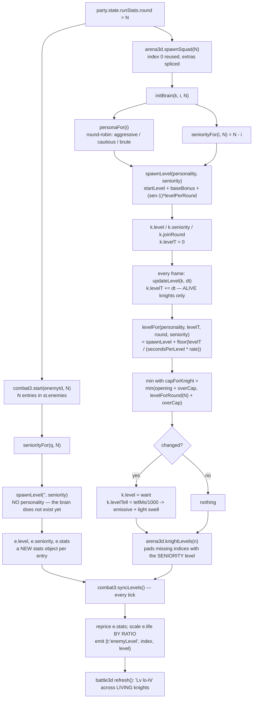

# The Hollow Black Knight — Level System

The Hollow Black Knight does not earn XP. His level is decided for him, by arithmetic, three times over: once when the squad is built, once every frame he stays alive, and once more by a ceiling that keeps a long fight from turning into a flat wall of identical armour. A level buys him two things at once — stat *multipliers* on the flat block in `data/enemies.js`, and *attack patterns*, because the level table is the only thing in the game that unlocks them. This page documents the rule that is live today (§30 seniority), the two rules it replaced, and every layer that has to agree with it or the ladder quietly collapses.

The whole system is two files plus the four layers that read them:

| File | Role |
|---|---|
| [game/js/data/knighttree.js](../game/js/data/knighttree.js) | Pure content: the level rows 1-9, the generated 10-100 curve, and the `growth` block (rates, bonuses, cap, tell). No logic. |
| [game/js/engine/knighttree.js](../game/js/engine/knighttree.js) | Pure functions of a level. No state, nothing to save or de-sync (§15). |
| [game/js/engine/arena3d.js](../game/js/engine/arena3d.js) | Owns the knight instances: deals personality, sets seniority, runs the per-frame climb, publishes `knightLevels()`. |
| [game/js/engine/combat3.js](../game/js/engine/combat3.js) | Owns the stat lines and the health bars; pulls `knightLevels()` every tick and reprices. |
| [game/js/ui/battle3d.js](../game/js/ui/battle3d.js) | Rolls each swing from the *swinger's* level; names the living range on the HUD plate. |
| [game/js/engine/displays.js](../game/js/engine/displays.js) | The room's poster, which still names the ROUND baseline. |

Load order is hand-maintained in [game/index.html:48](../game/index.html) (data) and [game/index.html:59](../game/index.html) (engine) — data before engine, as everywhere in CHLOE.

---

## 1. Three rules, in order

The code carries all three because each one is still legible in the comments, and because the spec sections that wrote them are still binding for everything they did not supersede. GAME_SPEC.md numbers jump from §28 straight to §30 — **there is no §29**.

| | Rule | Where | What it produced at round 5 |
|---|---|---|---|
| **§21** | A knight's level is a **pure function of the round**. | [GAME_SPEC.md §21 "The knight levels too"](../GAME_SPEC.md) | Five identical level-5 knights. Nothing changed during the fight. |
| **§28 A** | Every knight **spawns at level 1** and climbs on seconds alive, at a rate his §22 personality sets. | [GAME_SPEC.md §28 A](../GAME_SPEC.md) | `[1,1,1,1,1]` in `combat3`'s `st.enemies` — but `[1,1,2,…]` on the knights themselves, because §28 already applied the brute's +1 at spawn. Both converge on `[7,7,7,7,7]` in a long fight. |
| **§30** | A knight **opens at his SENIORITY** — the number of rounds he has been coming — and climbs from there, under his own ceiling. | [GAME_SPEC.md §30](../GAME_SPEC.md) | `[5,5,3,2,2]` at t=0 on the measured deal (`[5,4,3,2,1]` is the ladder *before* the brute bonus), ending `[7,7,5,4,4]`. |

**§30 is the live rule.** §28's in-fight climb is *kept* and composes with it; only §28's opening rule and its round-baseline ceiling were replaced.

Why each change happened, stated plainly:

1. **§21 → §28 A.** A round-6 squad was six copies of one stat block. The squad grew in *number* every round, so §20 already made rounds longer; making them uniformly harder as well turned a fight into a chore rather than a threat. §28 broke the uniformity by giving every knight his own clock — see the trigger comment at [data/knighttree.js:70](../game/js/data/knighttree.js).
2. **§28 A → §30.** Opening every knight at 1 made round 6 at t=0 *dramatically* easier (total life multiplier fell from 8.10x to 5.00x at round 5), and pushed all the danger into growth. Worse, §28's ceiling was measured from the *round*, so a long fight erased the spread it had just created. §30 restored a real ladder without restoring the flat wall: the danger is now concentrated in one veteran instead of smeared over N equals — [data/knighttree.js:94](../game/js/data/knighttree.js).

> **Spec vs. code.** GAME_SPEC.md §28 A still reads "every knight spawns at level 1" in its body text; it carries its own supersession note at the top, and **the code wins** — [engine/knighttree.js:90](../game/js/engine/knighttree.js) applies seniority. Four source comments are also still written in §28's voice and are stale in the same way: the seconds-per-level table at [data/knighttree.js:83](../game/js/data/knighttree.js) ("starts at 1 / 1 / 2") is only true for a *newcomer* now, and its "reaches lv 6" column names a level no newcomer can reach under `capForKnight` at all; the crossover paragraph directly under it ([data/knighttree.js:88](../game/js/data/knighttree.js)) computes a 12.6 s "level clear" the same ceiling forbids (both worked through in §4); the section header at [engine/knighttree.js:48](../game/js/engine/knighttree.js) says "he spawns at 1 (a brute at 2)"; and [engine/arena3d.js:278](../game/js/engine/arena3d.js) says levels are "capped against the round's baseline", which `capForKnight` replaced. The functions immediately below each of them do the §30 thing.

---

## 2. Seniority — a join date synthesised from the squad index

```js
function seniorityFor(index, count) {
  var n = Math.max(1, Math.floor(count || 1));
  var i = Math.max(0, Math.min(n - 1, Math.floor(index || 0)));
  return n - i;
}
```
— [engine/knighttree.js:75](../game/js/engine/knighttree.js)

**1-based and clamped.** A knight arriving this round has seniority `1`, never `0`. `index` is clamped into `[0, n-1]` and `count` floored at 1, so no caller can produce a negative or zero answer.

There is no knight *identity* across rounds to look this up from — `spawnSquad` rebuilds the squad every round. Synthesising seniority from the index is legitimate rather than a fudge, and the argument is a chain of three facts:

1. Round N fields exactly N knights — §20's contract, enforced at [ui/battle3d.js:1229](../game/js/ui/battle3d.js), which reads `runStats.round` and passes it as both `C3.start(enemyId, round)` and `a3d.spawnSquad(round)`.
2. Each round therefore adds exactly one knight, so the index *is* a join date.
3. `spawnSquad` splices the extras off the **end** and reuses `knights[0]` — [engine/arena3d.js:887](../game/js/engine/arena3d.js) drops `knights[d]` for `d` from `length-1` down to `1`, and [engine/arena3d.js:894](../game/js/engine/arena3d.js) is literally `var k = (i === 0) ? knights[0] : makeKnightState();`.

So index 0 is not "a knight standing where the oldest knight would stand" — it is the *same JavaScript object* that fought round 1. The arithmetic names something the code was already doing.

**Round 5, before any tick:**

| Index | `seniorityFor(i, 5)` | Opening level (no personality bonus) | `joinRound` |
|---|---|---|---|
| 0 | 5 | 5 | 1 |
| 1 | 4 | 4 | 2 |
| 2 | 3 | 3 | 3 |
| 3 | 2 | 2 | 4 |
| 4 | 1 | 1 | 5 |

`joinRound` is derived, not stored independently: `Math.max(1, roundNow() - k.seniority + 1)` — [engine/arena3d.js:3607](../game/js/engine/arena3d.js).

---

## 3. `spawnLevel` — where he opens

```js
function spawnLevel(personality, seniority) {
  var g = growth();
  var s = Math.max(1, Math.floor(seniority || 1));
  return clamp((g.startLevel || 1) + (g.baseBonus[personality] || 0) +
               (s - 1) * (T().levelPerRound || 1));
}
```
— [engine/knighttree.js:90](../game/js/engine/knighttree.js)

With the shipped data (`startLevel: 1`, `levelPerRound: 1`, `baseBonus: { aggressive: 0, cautious: 0, brute: 1 }`):

| personality | seniority 1 | 2 | 3 | 4 | 5 |
|---|---|---|---|---|---|
| aggressive / cautious | 1 | 2 | 3 | 4 | 5 |
| brute | 2 | 3 | 4 | 5 | **6** |

Two properties that are load-bearing:

- **Omitting `seniority` reproduces §28's number exactly.** `seniority || 1` makes the absent argument a newcomer, so `spawnLevel('brute')` is still 2 and `spawnLevel('')` is still 1. This is why every §28-era caller kept working through the §30 change without being touched.
- **The brute's +1 rides on top of seniority, not instead of it.** A brute veteran at index 0 of round 5 opens at **6** — one above the round baseline. That is deliberate (§30 keeps §28's bonus so temperament still separates two knights who joined the same night), and it is the single reason `capForKnight` needs its round clamp at all (see §5).

Personality is *dealt*, not rolled: `personaFor(i)` is round-robin from one random seed, `names[(personaSeed + i) % names.length]` — [engine/arena3d.js:3558](../game/js/engine/arena3d.js). Names come from `for (n in ps)` over the object literal in [data/arena3d.js:157](../game/js/data/arena3d.js), so the order is `aggressive, cautious, brute` and a knight is a brute when `(seed + i) % 3 === 2`. In a round-5 squad that lands on **one or two** indices depending on the seed, which is why the measured spawn recorded in the spec and the source is `[5,5,3,2,2]` and not `[5,4,3,2,1]` — it is a two-brute deal (seed % 3 === 1, brutes at indices 1 and 4).

Worth stating plainly, because both the spec and the source comment print `[5,4,3,2,1]` as if it were the round-5 spawn: **five consecutive indices always contain at least one brute**, so `[5,4,3,2,1]` is a deal `personaFor` cannot produce at round 5. Three deals exist, one per value of `personaSeed % 3` — one brute at index 2 → `[5,4,4,2,1]`; brutes at 1 and 4 → `[5,5,3,2,2]`; brutes at 0 and 3 → `[6,4,3,3,1]`. The bare seniority ladder is the *floor* of what the game deals, not the deal itself (see §9).

---

## 4. The in-fight climb

```js
function levelFor(personality, seconds, r, seniority) {
  var g = growth();
  var per = Math.max(0.1, (g.secondsPerLevel || 6) * (g.rate[personality] || 1));
  var lv = spawnLevel(personality, seniority) +
           Math.floor(Math.max(0, seconds || 0) / per);
  return Math.min(capForKnight(personality, seniority, r), clamp(lv));
}
```
— [engine/knighttree.js:137](../game/js/engine/knighttree.js)

**Trigger: `aliveSeconds`** — declared as data at [data/knighttree.js:128](../game/js/data/knighttree.js), and realised as `k.levelT`, which `updateLevel` advances only for living knights ([engine/arena3d.js:3617](../game/js/engine/arena3d.js), reached from its one call site at [engine/arena3d.js:3878](../game/js/engine/arena3d.js) *after* the `if (!k.alive) { updateDeath(k, dt); return; }` guard at [engine/arena3d.js:3875](../game/js/engine/arena3d.js)). A corpse stops earning — which is also what stops a cleared floor quietly climbing behind the victory card while the render loop keeps turning.

**Floor, not round.** `Math.floor` means a knight is what he has *finished* earning, so the tell fires on a boundary the player can be shown rather than halfway through one.

**Rate is a multiplier on `secondsPerLevel`, and bigger is SLOWER** — [data/knighttree.js:131](../game/js/data/knighttree.js).

| personality | `rate` | seconds per level | `baseBonus` | *uncapped* time to lv 6 (§28's figure) |
|---|---|---|---|---|
| aggressive | 0.70 | **4.2 s** | 0 | 21.0 s |
| cautious | 1.00 | **6.0 s** | 0 | 30.0 s |
| brute | 1.45 | **8.7 s** | +1 | 34.8 s |

> **That last column is §28's number, and §30 no longer lets it happen.** It is the source comment's own table ([data/knighttree.js:83](../game/js/data/knighttree.js)) and it is the raw climb with no ceiling on it. A *newcomer* — seniority 1 — is capped by `capForKnight` at `min(opening + 2, round + 2)`, which is **3** for an aggressive or cautious newcomer at every round and **4** for a brute newcomer from round 2 on. He reaches his own ceiling at 8.4 s / 12.0 s / 17.4 s and stops there; he never sees level 6 at all. Only seniority buys the higher numbers, and only a knight whose opening is 4 or more can ever stand on one.

An unknown personality (or the empty string, which is what `combat3` and the no-WebGL stub pass) falls through `g.rate[personality] || 1` to the cautious rate and `g.baseBonus[personality] || 0` to no bonus. Deliberate: "a knight who cannot level is worse than one who levels dully" — [engine/knighttree.js:81](../game/js/engine/knighttree.js).

**The crossover arithmetic**, as the source states it at [data/knighttree.js:88](../game/js/data/knighttree.js): the brute is *slowest from a harder base*. Two newcomers side by side, one aggressive and one brute:

- t = 0: aggressive 1, brute 2 — the brute already knows the overhead while the other only knows the slash.
- t = 8.4 s: aggressive `1 + floor(8.4/4.2)` = **3**; brute `2 + floor(8.4/8.7)` = **2**. The aggressive knight *overtakes* him.
- t = 12.6 s, **as the comment computes it**: aggressive `1 + 3` = 4; brute `2 + 1` = 3 (he took his first level at 8.7 s) — the "level clear" it claims.

> **What §30's ceiling does to that last line.** Both of these are newcomers, so `capForKnight` pins the aggressive knight at **3** from 8.4 s onward and the brute at **4**. The overtake is real but it lasts 0.3 s: the brute draws level at 8.7 s, they sit together at 3, and at 17.4 s the brute takes a ceiling the aggressive knight cannot reach and finishes the fight **one level above him** — the reverse of what the comment describes. That paragraph is §28-era text that was not rewritten when the ceiling moved off the round baseline; the `capForKnight` call at [engine/knighttree.js:142](../game/js/engine/knighttree.js) is what actually runs. The crossover as written is only true between knights whose own openings leave them room, i.e. veterans.

**The tell.** When `levelFor` returns something new, `k.level` is assigned and `k.levelTell` is set to `kt.tellMs() / 1000` — [engine/arena3d.js:3634](../game/js/engine/arena3d.js). `tellMs` is **800** ([data/knighttree.js:139](../game/js/data/knighttree.js)), and the length is reasoned: *long enough to notice across the nave, short enough that a knight levelling mid-swing does not read as a second attack starting*. The tell is not a pose, on purpose — a pose would interrupt whatever he is doing, and a knight who freezes to celebrate is a free hit. Two things happen instead, and they compose rather than overwrite:

1. Every cloned material's `emissive` goes to `0xffb038` at `emissiveIntensity 1.4`, restored by a `setTimeout(…, kt.tellMs())` closure over that knight — [engine/arena3d.js:3635-3646](../game/js/engine/arena3d.js).
2. His own point light gains `2.6 * tf * tf * LIGHT_SCALE` on top of whatever the light was already doing, with `tf = levelTell / (tellMs/1000)` — [engine/arena3d.js:4187](../game/js/engine/arena3d.js). Additive with its own decay timer, so it reads mid-swing as well as mid-stroll and the next frame's state restore does not stomp it.

Materials are cloned per knight at spawn ([engine/arena3d.js:899-907](../game/js/engine/arena3d.js)), which is what makes the flash belong to one body instead of the squad.

---

## 5. The ceilings — the subtle part

Two functions, and the difference between them is the whole of §30's second half.

```js
function capForRound(r) {
  return clamp(levelForRound(r) + (growth().overCap || 0));
}
function capForKnight(personality, seniority, r) {
  var g = growth();
  var base = spawnLevel(personality, seniority);
  return Math.min(clamp(base + (g.overCap || 0)),
                  clamp(capForRound(r == null ? round() : r) ));
}
```
— [engine/knighttree.js:101](../game/js/engine/knighttree.js) and [engine/knighttree.js:112](../game/js/engine/knighttree.js)

`overCap` is **2** ([data/knighttree.js:135](../game/js/data/knighttree.js)). `levelForRound(r) = clamp(1 + (r - 1) * levelPerRound)`, i.e. round 5 → 5 ([engine/knighttree.js:28](../game/js/engine/knighttree.js)).

**Why the per-knight ceiling was needed.** §28 capped *everyone* at `round + overCap`. In a round-5 fight that meant every knight — the veteran who opened at 5 and the newcomer who opened at 1 — could climb to 7. Given enough seconds, they all did. The spread evaporated *precisely when the fight had run long enough for it to matter*, which is the opposite of what §28 was for. Measuring the ceiling from a knight's own opening level keeps the shape.

**Why the round clamp is still the second half.** A plain veteran's opening level *is* the round, so `min(round + 2, round + 2)` leaves his §28 ceiling unchanged. The clamp only bites on one case: a **brute veteran**, who opens one above the round. At round 5 he opens at 6, and without the clamp his ceiling would be 8 — one past the round's own ceiling. With it, every knight still stops at `capForRound` at the latest.

**The measured round-5 fight** (spawn `[5,5,3,2,2]` from the two-brute deal above, [GAME_SPEC.md §30](../GAME_SPEC.md) and [data/knighttree.js:124](../game/js/data/knighttree.js)):

| idx | personality | sen | opens | s/level | own cap | round cap | **effective cap** | levels at |
|---|---|---|---|---|---|---|---|---|
| 0 | cautious | 5 | 5 | 6.0 | 7 | 7 | **7** | 6 @ 6.0s, 7 @ 12.0s |
| 1 | brute | 4 | 5 | 8.7 | 7 | 7 | **7** | 6 @ 8.7s, 7 @ 17.4s |
| 2 | aggressive | 3 | 3 | 4.2 | 5 | 7 | **5** | 4 @ 4.2s, 5 @ 8.4s |
| 3 | cautious | 2 | 2 | 6.0 | 4 | 7 | **4** | 3 @ 6.0s, 4 @ 12.0s |
| 4 | brute | 1 | 2 | 8.7 | 4 | 7 | **4** | 3 @ 8.7s, 4 @ 17.4s |

Ends `[7,7,5,4,4]`. Under §28's rule it ended `[7,7,7,7,7]`.

Note the shape of the middle of that fight: the aggressive junior finishes climbing at **8.4 s** and is pinned at 5, while the cautious veteran does not reach 7 until **12.0 s**. The ladder briefly narrows and then re-widens as the veterans finish — the fast junior is the one who stops first.

**A round-1 fight you refuse to end** still produces a level-3 knight and never a level-9 one: `capForRound(1) = 3`, and `capForKnight` mins against it regardless of seniority. This is also why the header comment's worked example holds — at round 5 `levelFor('brute', 120)` (seniority omitted, so a newcomer opening at 2) answers **4**, where §28 answered 7; at round 1 both answer 3 ([engine/knighttree.js:129](../game/js/engine/knighttree.js)).

---

## 6. How a level is computed



---

## 7. What the level buys

Rows live in [data/knighttree.js:35](../game/js/data/knighttree.js). Row shape, all fields optional: `{ pattern, life, atk, def, name, desc }`.

**Multipliers are ABSOLUTE, not cumulative.** `mults(L)` walks every row up to `L` and lets *the last row that set a value win* — [engine/knighttree.js:172](../game/js/engine/knighttree.js). The table therefore reads as "what he is at level N" rather than asking you to multiply nine numbers together. Editing row 4's `life` changes level 4 only; it does not shift 5-9.

| Lv | Pattern unlocked | life | atk | def | Name | Desc |
|---|---|---|---|---|---|---|
| 1 | `slash` | 1.00 | 1.00 | 1.00 | Vigil | He only knows how to sweep you off the flagstones. |
| 2 | `overhead` | 1.15 | 1.06 | 1.00 | Remembering | The arms remember an overhead. He starts using it. |
| 3 | `thrust_combo` | 1.30 | 1.12 | 1.05 | Quicker | Two stabs and a step through them. He has stopped swinging in one piece. |
| 4 | `charge` | 1.45 | 1.18 | 1.05 | Hunting | He has learned to close the nave in one run. Move. |
| 5 | `ground_slam` | 1.62 | 1.24 | 1.10 | Heavier | He has worked out that you live inside his guard. The floor answers for it. |
| 6 | — | 1.80 | 1.32 | 1.12 | Practised | The wind-ups are the same. They arrive sooner. |
| 7 | — | 2.00 | 1.40 | 1.16 | Patient | He has stopped swinging at where you were. |
| 8 | — | 2.22 | 1.50 | 1.20 | Certain | Nothing about him hurries any more. |
| 9 | — | 2.46 | 1.60 | 1.24 | The Hollow | Whatever the armour was keeping in is all the way out. |

**Levels 10-100 are generated**, in the loop at [data/knighttree.js:58](../game/js/data/knighttree.js), and honest about being generated. With `n = L - 9`:

| field | formula | precision | L=10 | L=100 |
|---|---|---|---|---|
| `life` | `2.46 + n * 0.20` | `toFixed(2)` | 2.66 | 20.66 |
| `atk` | `1.60 + n * 0.055` | `toFixed(3)` | 1.655 | 6.605 |
| `def` | `1.24 + n * 0.030` | `toFixed(3)` | 1.270 | 3.970 |
| `name` | `'Deeper Still'` | — | | |
| `desc` | `'Round ' + L + '. He has been here longer than you have.'` | — | | |

`maxLevel` is **100** and `clamp` pins every answer into `[1, 100]` ([engine/knighttree.js:23](../game/js/engine/knighttree.js)). The loop guards with `if (rows[L]) continue;`, so hand-authoring a row at 12 survives a reload of the file.

**No row above 5 carries a `pattern`.** The move book is complete at level 5; everything after that is stat growth and speed (§28 A2's `roundSpeed`, a separate scalar in [data/arena3d.js:184](../game/js/data/arena3d.js)).

### Patterns are gated here and nowhere else

```js
function patterns(L) {
  var out = [];
  rowsUpTo(L).forEach(function (e) {
    if (e.row.pattern && out.indexOf(e.row.pattern) === -1) out.push(e.row.pattern);
  });
  if (!out.length) out.push('slash');
  return out;
}
```
— [engine/knighttree.js:163](../game/js/engine/knighttree.js). The `slash` fallback exists because a knight with no moves would just stand there.

**Every pattern in [data/arena3d.js:319](../game/js/data/arena3d.js) must appear on a row**, or it is content that ships and is never once thrown. All five currently do:

| Pattern id | Unlocked at | telegraphMs | weight | evade |
|---|---|---|---|---|
| `slash` | 1 | 1500 | 4 | crouch |
| `overhead` | 2 | 1700 | 3 | sidestep |
| `thrust_combo` | 3 | 1100 | 3 | sidestep |
| `charge` | 4 | 1900 | 2 | sidestep |
| `ground_slam` | 5 | 2100 | 2 | backoff |

§21 authored slash/overhead/charge at 1/2/4; §22's two additions took the free slots at 3 and 5 — the rounds that had been pure stat growth — which left §21's placements exactly where they were ([data/knighttree.js:23](../game/js/data/knighttree.js)).

### Multipliers become real numbers in `stats()`

`stats(L, baseDef)` copies `baseDef.stats` and overwrites three fields, each `Math.round`ed and floored — `life` and `atk` at 1, `def` at 0 ([engine/knighttree.js:185](../game/js/engine/knighttree.js)). Base for the knight is `{ life: 48, atk: 10, def: 5, … }` — [data/enemies.js:43](../game/js/data/enemies.js). Derived, so you can sanity-check a change:

| Lv | life | atk | def |
|---|---|---|---|
| 1 | 48 | 10 | 5 |
| 2 | 55 | 11 | 5 |
| 3 | 62 | 11 | 5 |
| 4 | 70 | 12 | 5 |
| 5 | 78 | 12 | 6 |
| 6 | 86 | 13 | 6 |
| 7 | 96 | 14 | 6 |
| 8 | 107 | 15 | 6 |
| 9 | 118 | 16 | 6 |

Both halves reach the player: the knight's `def` is read off the knight you actually hit at [engine/combat3.js:900](../game/js/engine/combat3.js) and subtracted at `def * 0.5` three lines below it, and his `atk` is read off the knight who actually swung at [engine/combat3.js:993](../game/js/engine/combat3.js) and scales the pattern's `power` at `:1000`. Both read **the individual knight's** stat block first and fall back through the round's block to the flat def — a level-1 knight next to a level-7 one must not be as hard to cut, or the spread is a light show.

---

## 8. Every layer that must agree

§30 lists five. Each is verified in code below; all five hold.

**1. `initBrain` sets seniority / joinRound / level.** [engine/arena3d.js:3565](../game/js/engine/arena3d.js) takes `(k, i, n)`; lines 3604-3610 set `k.seniority`, `k.joinRound`, `k.level`, and zero `k.levelT` / `k.levelTell`. It must happen *here*, after the personality is dealt one line above — at `makeKnightState()` time he has no temperament yet. `spawnSquad` calls it with the real `n` ([engine/arena3d.js:928](../game/js/engine/arena3d.js)); `seniority` is *stored* rather than re-derived because `updateLevel` needs it every frame and re-deriving would mean threading the squad size through the whole knight update.

**2. `updateLevel` passes seniority every frame.** [engine/arena3d.js:3627](../game/js/engine/arena3d.js):

```js
var want = kt.levelFor(k.brain.personality, k.levelT, roundNow(), k.seniority);
```

**Drop the fourth argument and §30 silently reverts.** `levelFor` would default to seniority 1, compute an absolute level from seconds alone, and overwrite a veteran spawned at 6 with a newcomer's opening on his first frame — **2**, not the `1` the comment at [engine/arena3d.js:3624](../game/js/engine/arena3d.js) names, because the only knight who opens at 6 is a brute and `spawnLevel('brute')` is 2. A plain veteran spawned at 5 really would drop to 1. The spawn would still look right in a screenshot taken at t=0 and be wrong one frame later. This is the single most fragile line in the system.

**3. `knightLevels()` pads with the SENIORITY level.** [engine/arena3d.js:982](../game/js/engine/arena3d.js) maps the live knights, then pads any index the arena never spawned:

```js
var count = Math.max(knights.length, n || 0, 1);
for (i = out.length; i < (n || 0); i++) {
  out.push(kt ? kt.spawnLevel('', kt.seniorityFor(i, count)) : 1);
}
```

The padded indices are the **tail** of the array, and the tail is the **junior** end. §28 padded with the round baseline, which priced newcomers as veterans — wrong, and backwards. It is *pulled* rather than pushed on purpose: `combat3` already reaches into `arena3d` for the §23 stun, so the dependency runs one way and the no-WebGL degrade needs no second code path.

**4. The no-WebGL stub answers with the same ladder.** [engine/arena3d.js:111](../game/js/engine/arena3d.js), inside `disableAPI`:

```js
A.knightLevels = function (n) {
  var kt = CHLOE.engine.knighttree;
  var count = Math.max(1, n || 1), out = [];
  for (var i = 0; i < count; i++) {
    out.push(kt ? kt.spawnLevel('', kt.seniorityFor(i, count)) : 1);
  }
  return out;
};
```

The rule is pure arithmetic over the index — no WebGL, no brain, no seconds — so a machine that cannot render fights the same squad *shape* as one that can. N copies of the round baseline would have made the no-WebGL floor **harder** than the real game, which is the one direction a degrade path must never fail in. (§21's standing note on `disableAPI` applies: keep it in step whenever the public API grows — [GAME_SPEC.md §21 "A note on disableAPI"](../GAME_SPEC.md).)

**5. `combat3.start()` builds a stats object PER KNIGHT.** [engine/combat3.js:594](../game/js/engine/combat3.js):

```js
enemies: (function () {
  var arr = [];
  for (var q = 0; q < count; q++) {
    var sen = kt ? kt.seniorityFor(q, count) : 1;
    var open = kt ? kt.spawnLevel('', sen) : enemyLevel;
    var os = kt ? kt.stats(open, def) : es;
    arr.push({ index: q, life: os.life || 40, max: os.life || 40, alive: true,
               level: open, seniority: sen, stats: os });
  }
  return arr;
})(),
```

`os` is built **inside** the loop. Every entry previously shared one object by reference — harmless while they all had the same level, and a corruption the moment they do not. `st.enemyStats` above it stays the **round's** block: it is what the poster shows and what a caller with no per-knight index still gets.

**The empty string is deliberate.** Temperaments are dealt by the §22 brain in the 3D layer, which *does not exist yet* when `start()` runs — `battle3d.begin` calls `C3.start()` at [ui/battle3d.js:1230](../game/js/ui/battle3d.js) and only reaches `a3d.spawnSquad(round)` at line 1243. So the brute's +1 cannot be applied here; it arrives on the **first `syncLevels` tick**, from the layer that actually knows what he is. A brute veteran at round 5 therefore opens at 5 in `st.enemies` and is repriced to 6 one tick later. That is the intended path, not a race.

`syncLevels` ([engine/combat3.js:1143](../game/js/engine/combat3.js)) runs at the top of every `tick` and reprices:

```js
var ratio = e.max > 0 ? (e.life / e.max) : 1;
e.level = want; e.stats = ns; e.max = ns.life || e.max;
e.life = Math.max(1, Math.round(e.max * ratio));
```

**Life is scaled by RATIO, not rewritten.** A knight at half health who levels must come out at half of his *new* maximum: assigning the new max would heal him to full every level, and leaving `max` alone would make the bar lie. A level-up is therefore worth a real chunk of effective health — most of what makes the ramp bite — and it can never kill him, because a ratio of a positive maximum is positive. Dead entries are skipped (`if (!e.alive || want == null || want === e.level) continue;`).

**6. The HUD plate names a RANGE.** [ui/battle3d.js:421](../game/js/ui/battle3d.js):

```js
var pool = (snap.enemy.each || [])
  .filter(function (e) { return e.alive; })
  .map(function (e) { return e.level || 1; });
```

Then `'  ·  Lv ' + (lo === hi ? lo : lo + '-' + hi)`. It used to print `knighttree.level()` — the round baseline — which was already only approximately true under §28 and is a flat lie under a ladder: round 5 would read "Lv 5" while four of the five knights are below it. Nine numbers do not fit a 420px plate, and the range is what the player needs — **the top of it is the knight who will hurt them**. Dead knights drop out, so as the veteran falls the ceiling visibly comes down with him.

The fallback branch is guarded carefully and the guard is load-bearing:

```js
if (!pool.length && !(snap.enemy.each && snap.enemy.each.length)) {
  pool = (snap.enemy.levels || []).slice();
  if (!pool.length && kt) { pool = [kt.level()]; }
}
```

It is for a build whose snapshot has *no per-knight data* (an engine older than §28), **not** for an empty floor. Falling back to `levels` when nothing is alive re-admitted the dead: `refresh()` runs once more before `finish()`, so the plate flashed the whole historical ladder — "Lv 1-8" — on the exact frame the last knight fell. With no living knight there is no level to name, and the plate says so by saying nothing.

**7. (Not in §30's list, but the same class.) The swing is rolled from the SWINGER's level.** [ui/battle3d.js:1002](../game/js/ui/battle3d.js) picks *who* before *what*:

```js
var who = living[Math.floor(Math.random() * living.length)];
var swingerLevel = a3d.knightLevels(snap.enemy.count)[who];   // falls back to each[who].level
var pattern = pickPattern(swingerLevel);
```

Rolling the round's pool first and handing it to whoever was picked left a real downgrade gap: `ground_slam` is the only `backoff` pattern, so a knight below level 5 handed one throws it unchanged — the weakest knight on the floor landing the heaviest swing in the game (`power: 190`). §28 could tolerate that because every knight climbed past 5 within ~35 s; under §30's ladder the junior end **never gets there**, so the gap had to close at the roll. `knownPatterns(level)` at [ui/battle3d.js:1105](../game/js/ui/battle3d.js) keeps the round baseline only for a caller that omits the level.

---

## 9. Balance, stated

Round-5 **total life multiplier** across the whole squad, on the shipped `rows` table:

| Rule | Squad opens at | Arithmetic | Total |
|---|---|---|---|
| pre-§28 (§21 flat) | `[5,5,5,5,5]` | `1.62 × 5` | **8.10x** |
| §28 A | `[1,1,1,1,1]` | `1.00 × 5` | **5.00x** |
| **§30 (live)** | `[5,4,3,2,1]` | `1.62 + 1.45 + 1.30 + 1.15 + 1.00` | **6.52x** |

> **6.52x is the bonus-free ladder, not a deal the game can produce.** Five consecutive squad indices always contain at least one brute (§3), so a real round-5 squad opens `[5,4,4,2,1]` = **6.67x**, `[5,5,3,2,2]` = **6.84x** or `[6,4,3,3,1]` = **6.85x**, one per value of `personaSeed % 3`. The 6.52x the spec and the source both quote is the seniority ladder costed *before* `baseBonus` is added; the number the player meets is 2-5% above it, and still far below the flat 8.10x. The row is kept as written because it is the figure §30 argues from — but it is a baseline, not a measurement.

Round 5 therefore sits *below* the old flat squad and *above* §28's opening. That is the intent: **the round grows in threat more slowly than it grows in number, and the danger is concentrated in one veteran instead of smeared over five equals** ([data/knighttree.js:100](../game/js/data/knighttree.js), [GAME_SPEC.md §30 BALANCE](../GAME_SPEC.md)).

### Knobs

| Knob | File | Value | Effect |
|---|---|---|---|
| `rate` | [data/knighttree.js:132](../game/js/data/knighttree.js) | `{aggressive .70, cautious 1.00, brute 1.45}` | The veteran's climb. **The first knob to reach for** if a late round feels thin. |
| `overCap` | [data/knighttree.js:135](../game/js/data/knighttree.js) | `2` | How far past his own opening any knight may climb. The second knob. |
| `secondsPerLevel` | [data/knighttree.js:130](../game/js/data/knighttree.js) | `6.0` | Past ~7 the in-fight ramp flattens and a long round stops being dangerous. Below ~5 you skip the readable window where the junior half still only knows the slash — which is most of what makes the spread *visible* on the floor. |
| `baseBonus` | [data/knighttree.js:134](../game/js/data/knighttree.js) | brute `+1` | Temperament separation between two knights who joined the same night. |
| `tellMs` | [data/knighttree.js:139](../game/js/data/knighttree.js) | `800` | Readability of the level-up flash. |
| `rows[L].life/atk/def` | [data/knighttree.js:35](../game/js/data/knighttree.js) | table above | What a level is *worth*. Absolute, so a single row is a local edit. |

### Two knobs that must NOT be touched

- **The squad count.** Round N fields N knights is **§20's contract** ([GAME_SPEC.md §20](../GAME_SPEC.md)), and it is what makes the squad index a join date at all. Change it and `seniorityFor` stops meaning anything — every knight's level becomes a fiction derived from a number that is no longer a count of rounds.
- **`levelPerRound`** ([data/knighttree.js:150](../game/js/data/knighttree.js), currently `1`). It appears in `levelForRound`, `spawnLevel` *and* (via `capForRound`) both ceilings, so it **moves the whole ladder at once** — baseline, openings and caps together. It exists as a knob rather than a hardcoded 1 so the curve can be slowed later without touching the round counter, but it is not a balance dial for one round.

---

## 10. Debug and verification hooks

`arena3d.debug()` — [engine/arena3d.js:4522](../game/js/engine/arena3d.js):

| Key | Meaning |
|---|---|
| `roundLevel` | `knighttree.level()`, the round's baseline — what the poster and the round are worth. |
| `levelCap` | `capForRound(roundNow())`. |
| `knightLevels[]` | What each knight **is right now**, squad order. |
| `knightLevelT[]` | Seconds alive, one decimal. |
| `knightSeniority[]` | What each knight **opened at, and why** — added by §30. |
| `knightJoinRound[]` | The round he first walked in. |
| `roundSpeed` | §28 A2's separate speed multiplier (not a level). |
| `squad` / `squadAlive` | Counts. |
| `knightBrain[]` | Per-knight state and `personality`, in squad order, so `knightBrain[i]` lines up with `knightLevels[i]`. |

A verifier watching `roundLevel` and `knightLevels` diverge over a fight is watching the whole feature work. Without `knightSeniority` / `knightJoinRound` a test cannot tell a seniority ladder from a coincidence — `knightLevels` alone shows the numbers but not that index 0 *earned* his.

`combat3.snapshot().enemy` — [engine/combat3.js:1366](../game/js/engine/combat3.js):

| Key | Meaning |
|---|---|
| `each[]` | `{life, max, alive, level, seniority}` per knight. `seniority` rides along so a HUD or a test can tell the veteran from the newcomer without re-deriving it from the index. |
| `levels[]` | Just the levels, squad order. |
| `roundLevel` | `st.enemyLevel`, the round baseline. |
| `life` / `max` | Aggregated across the whole squad — one bar. |
| `count` / `alive` | Counts. |

`syncLevels` also emits `{ t: 'enemyLevel', index, level }` into the tick's event list ([engine/combat3.js:1159](../game/js/engine/combat3.js)) so a HUD could float "LEVEL 4" over the right body. Nobody floats it per-body yet, but the plate does render the aggregate range, so the event is no longer a consumer-less signal.

§30's stated proof obligations ([GAME_SPEC.md §30 Verification hooks](../GAME_SPEC.md)): round N spawns `[N, N-1, … 1]` before any tick; the ladder is not flattened by the per-frame sync; a long fight ends on a ladder rather than a flat squad; the no-WebGL stub returns the same shape; and the HUD range matches the living knights.

---

## 11. Traps

Things that look tidy and are load-bearing.

1. **`levelFor`'s fourth argument.** Covered above, and worth repeating: omitting `seniority` in [engine/arena3d.js:3627](../game/js/engine/arena3d.js) reverts §30 without any error, and the bug is invisible at t=0.
2. **`debug()` before `init()`, and on a machine with no WebGL, returns a *different object*.** `A.debug` is `deadDebug` under `disableAPI` ([engine/arena3d.js:65](../game/js/engine/arena3d.js)) and the live `A.debug` short-circuits to `deadDebug()` when `!inited` ([engine/arena3d.js:4523](../game/js/engine/arena3d.js)). `deadDebug` ([engine/arena3d.js:31](../game/js/engine/arena3d.js)) publishes **no** `knightLevels`, `knightSeniority`, `knightJoinRound`, `roundLevel` or `levelCap`. A test reading `debug().knightLevels` on the degrade path gets `undefined` — call `arena3d.knightLevels(n)` directly, which *does* answer correctly there.
3. **`A.reset()` calls `initBrain(kk, ki)` with no `n`** ([engine/arena3d.js:2232](../game/js/engine/arena3d.js)), so seniority falls back to `knights.length` — *last* round's squad size. It is correct only because `battle3d.begin` calls `a3d.reset()` at line 1242 and `a3d.spawnSquad(round)` at line 1243, and `spawnSquad` re-runs `initBrain` with the right `n`. **Reordering those two lines silently mis-prices the whole squad by one round.**
4. **The §21 loading gate is what keeps `knightLevels()[0]` honest.** If `knightProto` has not loaded, `spawnSquad` stores `pendingSquad` and returns without building anything ([engine/arena3d.js:885](../game/js/engine/arena3d.js), flushed at [engine/arena3d.js:677](../game/js/engine/arena3d.js)). At that moment `knights.length` is 1 (the module pushes the leader once, at [engine/arena3d.js:291](../game/js/engine/arena3d.js)), so `knightLevels(5)` returns the leader's own level — **1**, or **2** if `A.reset()` just dealt him brute, since that call re-ran `initBrain` against a squad size of one — followed by the seniority pad `[4,3,2,1]`. An array whose head is *inverted*. Nothing ticks in that window only because `startFight()` (which starts the rAF loop) is held behind `assetsReady()` at [ui/battle3d.js:1257](../game/js/ui/battle3d.js). Anything that starts the combat tick outside that gate re-opens this.
5. **The knight index and the enemy index must stay aligned.** `arena3d.knights[]` and `combat3.st.enemies[]` are separate arrays joined only by position. Both are sized from the same `round` value in `battle3d.begin`. There is no assertion anywhere that they match.
6. **Multipliers are absolute.** Editing row 5's `life` from 1.62 to 1.70 does *not* shift rows 6-9. It also does not compound — `mults()` overwrites, it does not multiply ([engine/knighttree.js:172](../game/js/engine/knighttree.js)).
7. **A pattern with no row never ships.** Adding an entry to `data/arena3d.js` `patterns` without adding a `pattern:` field to some row in `data/knighttree.js` means `patterns(L)` never names it and `pickPattern` never rolls it — content that ships dead. Note also that `knownPatterns` falls back to the *entire* pattern table if the filter comes back empty (`return Object.keys(out).length ? out : all;`, [ui/battle3d.js:1115](../game/js/ui/battle3d.js)), so a broken gate fails *open*, handing a level-1 knight the ground slam.
8. **The engine reads data lazily.** `T()` is called fresh on every access ([engine/knighttree.js:21](../game/js/engine/knighttree.js)) and `growth()` merges `GROWTH_DEFAULT` under the data block on every call, so a missing `data/knighttree.js` degrades to `{startLevel:1, secondsPerLevel:6, overCap:2, tellMs:800}` rather than throwing — but every knight then climbs at the cautious rate with no brute bonus.
9. **The room poster still names the ROUND, not a knight.** [engine/displays.js:139](../game/js/engine/displays.js) uses `kt.level()` and `kt.patterns(kLevel)`. §30 fixed the in-fight HUD plate and left the poster alone. Defensible — the poster is a preview shown in the room before the fight, where no squad exists — but if you change one, note that the other did not move.
10. **`round()` reads global state.** [engine/knighttree.js:42](../game/js/engine/knighttree.js) reaches into `CHLOE.engine.party.state.runStats.round` and defaults to 1. Every function that takes an optional `r` falls through to it, so a headless test that never sets `runStats.round` silently evaluates every ceiling against round 1 (`capForRound(1) = 3`).

---

## Where to change what

| I want to… | Edit |
|---|---|
| Change what a level is worth (life/atk/def) | `rows` in [game/js/data/knighttree.js:35](../game/js/data/knighttree.js) |
| Add or move a pattern unlock | the `pattern:` field on a row in [game/js/data/knighttree.js:35](../game/js/data/knighttree.js) — and confirm the id exists in [game/js/data/arena3d.js:319](../game/js/data/arena3d.js) |
| Retune the 10-100 curve | the generator loop, [game/js/data/knighttree.js:58](../game/js/data/knighttree.js) |
| Make veterans climb faster or slower | `growth.rate`, [game/js/data/knighttree.js:132](../game/js/data/knighttree.js) |
| Change the in-fight ramp for everyone | `growth.secondsPerLevel`, [game/js/data/knighttree.js:130](../game/js/data/knighttree.js) |
| Change how far past his opening a knight may climb | `growth.overCap`, [game/js/data/knighttree.js:135](../game/js/data/knighttree.js) |
| Change the brute's opening bonus | `growth.baseBonus`, [game/js/data/knighttree.js:134](../game/js/data/knighttree.js) |
| Change the level-up flash duration | `growth.tellMs`, [game/js/data/knighttree.js:139](../game/js/data/knighttree.js) |
| Change what the flash *looks* like | emissive colour at [game/js/engine/arena3d.js:3637](../game/js/engine/arena3d.js); light swell at [game/js/engine/arena3d.js:4190](../game/js/engine/arena3d.js) |
| Change the seniority rule itself | `seniorityFor`, [game/js/engine/knighttree.js:75](../game/js/engine/knighttree.js) |
| Change where a knight opens | `spawnLevel`, [game/js/engine/knighttree.js:90](../game/js/engine/knighttree.js) |
| Change either ceiling | `capForRound` / `capForKnight`, [game/js/engine/knighttree.js:101](../game/js/engine/knighttree.js) |
| Change how the climb is computed | `levelFor`, [game/js/engine/knighttree.js:137](../game/js/engine/knighttree.js) |
| Change what a knight carries at spawn | `initBrain`, [game/js/engine/arena3d.js:3604](../game/js/engine/arena3d.js) |
| Change the per-frame level advance | `updateLevel`, [game/js/engine/arena3d.js:3617](../game/js/engine/arena3d.js) |
| Change what `combat3` pulls each tick | `knightLevels`, [game/js/engine/arena3d.js:982](../game/js/engine/arena3d.js) — **and** the stub at [game/js/engine/arena3d.js:111](../game/js/engine/arena3d.js) |
| Change the opening stat lines | `st.enemies` builder, [game/js/engine/combat3.js:594](../game/js/engine/combat3.js) |
| Change how a level-up affects current health | `syncLevels`, [game/js/engine/combat3.js:1143](../game/js/engine/combat3.js) |
| Change the HUD level text | `refresh`, [game/js/ui/battle3d.js:407](../game/js/ui/battle3d.js) |
| Change which pattern a knight may throw | `knownPatterns` / `pickPattern`, [game/js/ui/battle3d.js:1105](../game/js/ui/battle3d.js) |
| Change the room poster's level line | `poster`, [game/js/engine/displays.js:136](../game/js/engine/displays.js) |
| Change the squad size per round | **don't** — §20 contract, and `seniorityFor` depends on it. Origin: [game/js/ui/battle3d.js:1229](../game/js/ui/battle3d.js) |

---

**See also:** [architecture](architecture.md) · [run-loop](run-loop.md) · [combat](combat.md) · [knight-ai](knight-ai.md) · [difficulty-scaling](difficulty-scaling.md) · [knight-rig](knight-rig.md) · [progression](progression.md) · [world-room](world-room.md) · [stages](stages.md) · [data-reference](data-reference.md) · [tooling](tooling.md) · [debugging](debugging.md)
