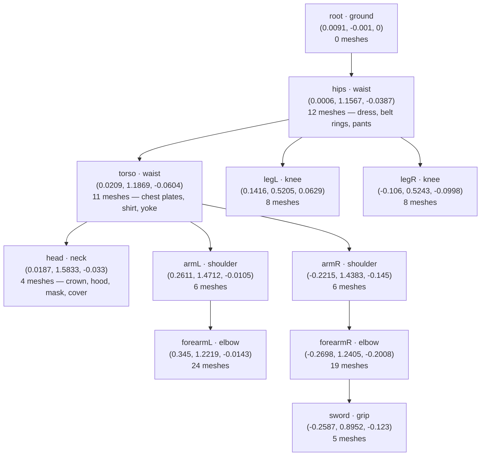
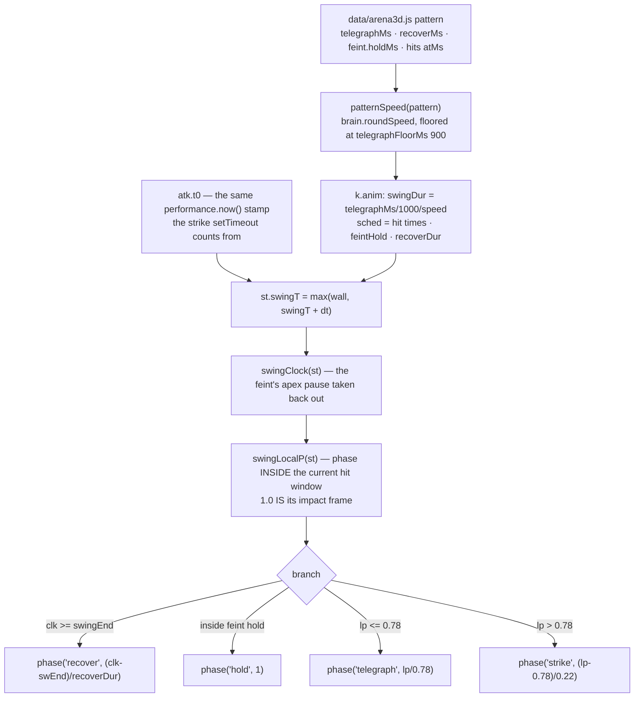

# The Hollow Black Knight — Rig & Animation

The knight you fight is a 103-piece suit of plate armour with **no skeleton at all**: `game/assets/3d/knight.glb` ships `skins: 0`, `animations: 0`, and 103 mesh nodes that are flat siblings of the scene root with zero children between them. There is nothing to key an `AnimationClip` onto and nothing to skin. The answer CHLOE takes is that plate *does not deform* — so every piece can be bolted to a rigid bone and the entire fight (13 static pose keys — idle, guard, five attack pairs and a flinch — plus 10 parametric states running from the stride to the collapse) can be posed by transform alone. The bone hierarchy is **generated data** in [data/knightrig.js](../game/js/data/knightrig.js), produced by [tools/build-knight-rig.js](../tools/build-knight-rig.js) from the GLB's own vertices; the poses live in [engine/knightanim.js](../game/js/engine/knightanim.js); and [engine/arena3d.js](../game/js/engine/arena3d.js) only ever tells the animator *which state* the knight is in and *how far through* it he is. This page is the map of that machinery, including the two bugs it exists to prevent from coming back: a rig measured in the wrong space, and a sword that rotated about a point floating beside itself.

Related pages: [architecture](architecture.md) · [run loop](run-loop.md) · [combat](combat.md) · [knight AI](knight-ai.md) · [knight levels](knight-levels.md) · [difficulty scaling](difficulty-scaling.md) · [data reference](data-reference.md) · [tooling](tooling.md) · [debugging](debugging.md)

---

## 1. The asset, measured

Read straight out of the GLB container (verified by parsing the file, not by trusting a comment):

| Fact | Value |
| --- | --- |
| `skins` | 0 |
| `animations` | 0 |
| `nodes` | 103 |
| `meshes` | 103 (one per node) |
| nodes with children | 0 — every node is a direct child of the scene root |
| materials | `MAT_METAL`, `MAT_CLOTH`, `MAT_SWORD` |
| node names | all unique, all contain a colon (`Crown:Group19458`) |
| distinct base names (before the colon) | 39 |
| native height, highest vertex | 1.83189 m (the head cluster is the highest thing on him) |
| node TRS convention | rotation `(0.7071, 0, 0, 0.7071)` — a +90° X turn, Z-up → Y-up — and uniform scale 0.01 (cm → m) |

That last row is load-bearing for the tool: a +90° X rotation maps local `(x, y, z)` to world `(x, -z, y)`, so **the local Z axis is the model's height**. Reading the wrong axis puts every part at the wrong elevation. The reader applies each node's own TRS rather than assuming the convention holds forever — [tools/build-knight-rig.js:206](../tools/build-knight-rig.js:206), with the `isPlusNinetyX` test at [:201](../tools/build-knight-rig.js:201). Because every node carries the *same* rotation and it is an exact +90° about a coordinate axis, an axis-aligned box pushed through it comes out axis-aligned and exact — which is what makes the model's `Box3` honest in §5.

**34 of the 103 meshes are literally named `Glove_MainPlate_low1`** — 17 on each hand. The name carries no side information whatsoever, which is the first reason nothing in this pipeline may sort by name suffix.

---

## 2. §18's answer, and the defect it caused

§18 ([GAME_SPEC.md:337](../GAME_SPEC.md:337)) built the rig at load time inside `arena3d.js`: sort the 103 pieces into six groups by name, split left/right by bounding-box centre, and hang each group off a pivot `Group` that was a **sibling of the model** rather than a link in a chain. Its own comment recorded the price, and the spec now carries the supersede note at [GAME_SPEC.md:339](../GAME_SPEC.md:339):

- **The head never inherited the torso lean.** Siblings do not compose. Three bones had to be posed by hand to *agree* about a single lean, and any pose that forgot one of them produced a knight whose head stayed bolt upright while his chest pitched forward.
- **Shoulder pivots were placed at a fraction of the model's HEIGHT** (`shoulders 0.80h`, `hips 0.48h`, `waist 0.50h`, `neck 0.82h`), which puts them inside the chest rather than at a joint.
- **The `_low1`/`_low2` name split is INVERTED for `Boot_Toe`.** In the shipped data `Boot_Toe_low1:*` is the **right** leg ([data/knightrig.js:135](../game/js/data/knightrig.js:135)) and `Boot_Toe_low2:*` is the **left**, while `Shoulder_Plate_01/02/03_low1` and `Shoulder_Elbow_low1` are the **left**. (The two pauldron shells are not evidence either way — `Shoulder_Left_low1` and `Shoulder_Right_low1` carry their side in the *name*, not in the suffix, and land on opposite arms: [data/knightrig.js:65](../game/js/data/knightrig.js:65) and [:73](../game/js/data/knightrig.js:73).) §18's documented split was `legL 9 / legR 7` ([GAME_SPEC.md:345](../GAME_SPEC.md:345)) — a shin plate on the wrong side. The centroid method gives 8/8.
- §21 added two more failures of the same rig ([GAME_SPEC.md:463](../GAME_SPEC.md:463)): the pivots were measured in **world** space and written into **model-local** `g.position`, so the squad leader's shoulder pivot ended up 5.9 m from his own hand while a clone's sat 2.0 m away — one line, two opposite failures, and a squad that read as one windmilling leader and N−1 statues.

All of that is deleted. `arena3d.js` no longer contains a rig at all — §28 B is explicit that two rigs must not end up fighting over the same 103 meshes, and a per-channel amplitude table *is* a rig ([engine/arena3d.js:3312](../game/js/engine/arena3d.js:3312)).

---

## 3. §28 B — the rigid-plate hierarchy

Eleven bones, one chain, generated into [data/knightrig.js:17](../game/js/data/knightrig.js:17). Pivots are in **native model metres** (see §5 — this is a trap).



Facing convention throughout: **+X is his left, +Y is up, +Z is forward** (toward whoever he is facing) — [engine/knightanim.js:234](../game/js/engine/knightanim.js:234).

Two things the hierarchy buys that were impossible on siblings, both named in the code:

1. **`hips` carries the hem.** §22 had to cap boot swing at 0.28 rad (16°) because the "legs" are boots and the dress above them never moved, so a real stride swung bare boots out from under a static skirt. With a pelvis bone the stride opens back up to **30° at a walk, 45° at a dash** — [engine/knightanim.js:447](../game/js/engine/knightanim.js:447).
2. **`torso` lean propagates.** Head and arm angles in every pose are now **relative to the parent they hang off**. A §22 number copied across unchanged would double up — [engine/knightanim.js:404](../game/js/engine/knightanim.js:404). `stagger` exploits this deliberately: the torso goes back 24° and the head adds its own 20° on top, a harder snap than §22 could produce ([:603](../game/js/engine/knightanim.js:603)).

Note `legL`/`legR` own **boots and greaves only** — the thigh is inside `Padded_Pants` and the skirt, which belong to `hips`. The highest joint a leg bone can honestly serve is therefore the **knee**, not a hip socket. §18's table put them at y = 0.90 with the boot cluster topping out at 0.637: a pivot outside the bbox of the meshes it moves. That is now a hard error in the generator ([tools/build-knight-rig.js:508](../tools/build-knight-rig.js:508)).

---

## 4. The generated file — read it, never edit it

[data/knightrig.js](../game/js/data/knightrig.js) is a **generated artefact**. Its first line says so, and the header records which rule measured each pivot. It exports exactly two things onto `CHLOE.data.knightRig`:

| Key | Shape | Notes |
| --- | --- | --- |
| `bones` | array of 11 `{ id, parent, pivot: [x,y,z], from }` | order matters — see the parent-relative trap in §7 |
| `meshes` | `{ boneId: [raw node name, …] }` | 103 names total, colons included, exactly as authored in the GLB |

`from` is the derivation rule that produced the pivot (`ground` · `waist` · `neck` · `shoulder` · `elbow` · `knee` · `grip`), kept so a reader can re-check a number instead of trusting it. `root` appears in `bones` but not in `meshes` — it owns nothing. Its job is to be the plane between his boots that `mountKnight` slides onto `k.group`'s own origin (§5, rule 2), so that the point every hit test and the `ground_slam` ring actually measure from — `k.group.position` — sits between his feet rather than wherever a bounding box happened to land.

Hand-patching this file is the one thing the whole §28 B2 rewrite exists to prevent. Change the **rule** in the tool and regenerate.

---

## 5. The scale trap ("Box3 lies about skinned meshes", one level up)

Pivots and mesh offsets are both in **native model metres**. The knight is bbox-normalised to `knight.targetHeight` = **2.15 m** ([data/arena3d.js:87](../game/js/data/arena3d.js:87)), i.e. roughly **1.173×**. Getting this wrong is the §17 bug class again ([GAME_SPEC.md:299](../GAME_SPEC.md:299)), so [engine/arena3d.js:731](../game/js/engine/arena3d.js:731) states three rules and then asserts the outcome:

1. **Rig the model DETACHED and UNSCALED.** `knightanim.build()` preserves each mesh's world matrix as it reparents, so whatever space the model is in at build time is the space the bone offsets are computed in. The model is rigged *before* it is parented to `k.group` and *before* any scale is applied.
2. **The normalising scale goes on `rig.root`, never on the model.** Scaling the meshes first leaves the bones 1.83 m tall inside 2.15 m of plate. `mountKnight` does `rig.root.scale.setScalar(s)` and then `setRootRest(rig, -rp[0]*s, -rp[1]*s, -rp[2]*s)` where `rp` is the `root` bone's own pivot, so the `root` bone lands exactly on the group's origin — [engine/arena3d.js:829](../game/js/engine/arena3d.js:829), [:831](../game/js/engine/arena3d.js:831).
3. **He is grounded and centred on the `root` BONE, not on a bounding box.** The old code centred on the full bbox — measured from the GLB, the drawn sword drags that centre to x −0.112 / z −0.146 while the `root` bone sits at x 0.0091 / z 0, so the group origin landed **0.19 m** from his actual body (0.12 m across it, 0.15 m behind it). The unrigged fallback at [engine/arena3d.js:818](../game/js/engine/arena3d.js:818) still does exactly that, which is the point of keeping it visible.

The numbers, and why they do not all agree:

| Number | Value | Where |
| --- | --- | --- |
| true crown (highest vertex, native) | 1.83189 m — `Hood_Hood_low1:Group48674` | measured from the GLB |
| what the tool prints as native crown | 1.832 m → scale **1.1736×** | [tools/build-knight-rig.js:655](../tools/build-knight-rig.js:655) |
| what the engine actually uses: model `Box3` height | 1.8329 m → scale **1.1730×** | [engine/arena3d.js:805](../game/js/engine/arena3d.js:805) |
| asserted on-screen crown after rigging | **2.146 m** (tolerance ±0.02 m against 2.15) | [engine/arena3d.js:865](../game/js/engine/arena3d.js:865) |

**The first two numbers differ for a dull reason, and it is not `Box3` inflation.** `nativeH` is `box.max.y - box.min.y` over the *untouched, unrigged, unposed* model. `Box3.expandByObject` in the vendored three.js (r128, [game/vendor/three.min.js](../game/vendor/three.min.js)) takes each `geometry.boundingBox` and pushes it through `matrixWorld` — the AABB of a transformed box — and there every node carries the same exact +90° X rotation, for which that is exact, not conservative (§1). So 1.83293 is simply crown 1.83189 minus the model's lowest vertex, a boot sole that sits 1.03 mm **below** y = 0 — not a box reading high. The tool prints only the crown, measured from y = 0, which is why it says 1.832.

**And the 4 mm shortfall is the idle pose, not the scale.** Do the arithmetic at rest and it cancels exactly: `s · (crown − rootPivotY)` = 1.172988 × 1.83289 = **2.1500**. What the assert actually measures is the rig *after* `build()` ends in `reset()`, which snaps `POSES.idle` on — torso +2°, head +4° — and that pitch drops the head bone's highest vertex from 1.83189 to **1.82822** native, i.e. 2.1456 on screen → the 2.146 the code reports ([engine/knightanim.js:213](../game/js/engine/knightanim.js:213), [:842](../game/js/engine/knightanim.js:842)). Deriving `s` from the crown instead would read **2.147**, not 2.150, and would move every hit volume in `data/arena3d.js` by ~4 mm, and those were reconciled against the blade **at this scale** — so leaving it alone is still right, just for a different reason than the comment at [:865](../game/js/engine/arena3d.js:865) gives.

The assert deliberately does **not** use a `Box3` (that is the joke §17 is making): `crownHeight()` walks the head bone's own vertices and subtracts the `root` bone's world Y — [engine/arena3d.js:772](../game/js/engine/arena3d.js:772). That refusal is well founded even though the *un*rigged box was honest, because a box over the **rigged** knight is not: once bone rotations are on the meshes their AABBs really are the AABB of a set of OBBs, and the code records that reading 2.166 m against a real 2.146 — a 20 mm inflation sitting exactly on the 20 mm tolerance.

**Two heights, and the difference matters.** `_rigProbe(i).heightAtSpawn` is the acceptance number (measured once, at rest). `heightNow` is a live bounding box of a *posed* body and legitimately reads ~1.94 m mid-stride, because the raised boot is the lowest point of the box. Asserting 2.15 against `heightNow` is the same mistake one level up — [engine/arena3d.js:4940](../game/js/engine/arena3d.js:4940).

---

## 6. How the 103 meshes get sorted

Assignment is name-**prefix** for the group and **centroid** for the side. Rules run in order, first match wins — [tools/build-knight-rig.js:421](../tools/build-knight-rig.js:421):

| # | Base-name test | Bone |
| --- | --- | --- |
| 1 | `Crown` · `Head_Mask` · `Hood_` · `Padded_Cover` | `head` |
| 2 | `Merged_Sword` | `sword` |
| 3 | `Boot_Toe` | `legL` if centroid x ≥ 0 else `legR` |
| 4 | `Bracer_` · `Gloves_` · `Glove_MainPlate` | `forearmL` / `forearmR` by centroid x |
| 5 | `Shoulder_Elbow` | `forearmL` / `forearmR` by centroid x |
| 6 | `Shoulder_` · `ArmStrap_` · `UnderShoulder` | `armL` / `armR` by centroid x |
| 7 | `Dress_` · `Belt_` · `Padded_Pants` | `hips` |
| 8 | `Chest_` · `Padded_` | `torso` |

**Never the name suffix.** The tool header calls `_low1`/`_low2` "+X/−X for shoulders, elbows and gloves but INVERTED for `Boot_Toe`", and the shipped manifest shows it is worse than that: it holds for the pauldron plates (`Shoulder_Plate_0N_low1` → armL) and the elbow cops (`Shoulder_Elbow_low1` → forearmL) and for the single `Gloves_Gloves_low1/low2` pair, it is **inverted** for `Boot_Toe`, and it is simply **absent** from the 34 `Glove_MainPlate_low1` meshes — one name, 17 per hand, no suffix to sort by at all. Trusting it gives you backwards legs and a coin flip on every plate of both gauntlets.

**The straddle test overrules the side split — it does not precede it.** `assign()` runs the name rules first and lets the centroid pick a side; only then, and only if the answer is one of the six `SIDED` bones, does it ask whether the mesh reaches more than `STRADDLE` = 0.12 m past the centreline on **both** sides. If it does, it cannot belong to one arm, because half of it is bolted to the other one, and it is promoted to `torso` (centroid y ≥ 1.0) or `hips` — [tools/build-knight-rig.js:442](../tools/build-knight-rig.js:442). The centred bones and the sword are never tested; the chest plate spans 0.38 m and the blade 0.88 m, and neither is a mistake. Three meshes fail it on every run:

```
UnderShoulder_UnderLeather_low1:Group23786   armL -> torso   spans x -0.260 .. 0.292
ArmStrap_Rings_low4:Group50309               armL -> torso   spans x -0.160 .. 0.246
ArmStrap_Straps_low3:Group57527              armL -> torso   spans x -0.301 .. 0.375
```

That is the *whole* of the old 9/6 armL/armR asymmetry — with them on the torso the pauldrons are 6/6.

The threshold has room, and rather more of it than the tool's own header claims. Re-measured off the GLB, the deepest any **one-sided** piece reaches past the centreline is **0.0016 m** (`Boot_Toe_low1:Group16572`, x −0.226 .. +0.002), while the narrowest straddler reaches **0.160 m**. `STRADDLE` could be anything in that band and sort all 103 identically. The tool header's "0.076 m (a boot)" is not a crossing at all — the nearest measurement to it is `Boot_Toe_low1:Group47025`, which *clears* the centreline by 0.075 m ([tools/build-knight-rig.js:114](../tools/build-knight-rig.js:114)).

### The validation numbers

| Bone | meshes | | Bone | meshes |
| --- | ---: | --- | --- | ---: |
| `head` | 4 | | `forearmR` | 19 |
| `torso` | 11 | | `sword` | 5 |
| `hips` | 12 | | `legL` | **8** |
| `armL` | 6 | | `legR` | **8** |
| `armR` | 6 | | `root` | 0 |
| `forearmL` | 24 | | **total** | **103 / 103, 0 unassigned** |

`forearmL 24 / forearmR 19` is asymmetric and **correct**: the model has five `Bracer_` meshes and all five are on the left arm. `legL 8 / legR 8` is the number §28 B asks for, against §18's 9/7.

An unassigned node is a hard failure: the tool prints it, sets a non-zero exit code and **refuses to write** ([tools/build-knight-rig.js:666](../tools/build-knight-rig.js:666)).

---

## 7. `build()` — reparenting without moving anything

[engine/knightanim.js:100](../game/js/engine/knightanim.js:100). Bones are empty `THREE.Group`s named `bone:<id>`; each mesh keeps its world transform by being offset against its bone's inverse world matrix, so **`build()` then `play()` with no `update()` must look identical to the untouched model**. That property is what makes the whole thing safe to ship. Four traps live in this function, each with a measured failure recorded next to it:

1. **Pivots must be made parent-relative against the parent's PIVOT from the data, never the parent group's current position** ([:123](../game/js/engine/knightanim.js:123)). The parent is earlier in the same list and has already been made relative to *its* parent, so subtracting its live position removes the grandparent twice. Measured with that bug in: the head bone landed at y 2.740 against a pivot of 1.583, the crown rendered 2.99 m tall, and the sword — five levels down, so the error compounds five times — sat 1.686 m from the fist. **It is invisible at build time** (meshes are reparented by world matrix and do not move); it only appears the first time a bone is rotated.
2. **Match on the SANITIZED name.** The manifest records node names exactly as authored, colons and all. `GLTFLoader` runs every name through `PropertyBinding.sanitizeNodeName`, which deletes `[ ] . : /`, so `Crown:Group19458` arrives as `CrownGroup19458`. Measured before the fix: **103 of 103 lookups missed**, `build()` bailed with "no meshes matched", and arena3d fell back to the unrigged model — §28's whole skeleton, grip fix included, was dead in the browser while every offline check passed. Both sides are pushed through the same idempotent `nameKey()` — [:81](../game/js/engine/knightanim.js:81).
3. **`takeMesh()` retires both keys.** A mesh listed twice in the manifest would otherwise be silently stolen off the first bone by the second; retiring the name makes it a warning instead of a limb that quietly empties — [:176](../game/js/engine/knightanim.js:176).
4. **Degrade, do not throw.** Missing manifest meshes warn and the rest of the rig still works; zero matches returns `null`, and `mountKnight` falls back to the pre-§28 placement so the knight is at least the right size in the right place — [engine/arena3d.js:809](../game/js/engine/arena3d.js:809).

Per-rig scratch (`rig._s`) is allocated once in `build()`: `commitPose` runs over 11 bones every frame for every knight on the floor, and a squad of six at 60 fps is ~4000 `Euler`/`Quaternion` allocations a second if they are made inline — [:108](../game/js/engine/knightanim.js:108).

**Load order.** `data/knightrig.js` is a `<script>` tag at [game/index.html:53](../game/index.html:53) and `engine/knightanim.js` at [:78](../game/index.html:78), before `engine/arena3d.js`. Both tags are load-bearing and **silent** if removed: no rig data means "knight stays static", not an exception.

---

## 8. §28 B2 — the grip bug, and pivots derived rather than remembered

Reported from play: *"the knight is holding the blade not the shaft of the sword; the movements seem wrong for thrusting and swinging."* Measured against the GLB, that was exactly right, and it was a **rig** defect, not a pose defect.

The `sword` pivot was hand-authored at `[-0.28, 0.95, 0]`. Measured through the generator:

| | authored `[-0.28, 0.95, 0]` | derived `[-0.2587, 0.8952, -0.123]` |
| --- | --- | --- |
| distance to the right-hand centroid | **0.139 m** | **0.0033 m** (limit `GRIP_TOL` 0.06) |
| distance to the sword's own axis | **0.129 m** — *not on the sword at all* | **0.0000 m** (limit `SWORD_AXIS_TOL` 0.05) |
| position along the blade chord | 64.4 % from the tip | 61.8 % from the tip |

Rotating about a point 0.129 m off the blade's centre line **cones the weapon around a point floating beside it**. That is why a swing scythed instead of sweeping and a thrust slid the blade through itself instead of driving from the grip.

The fix is structural: the `BONES` table no longer holds a single coordinate. Every pivot is measured from the vertices of the meshes its own bone owns, by one of four rules — [tools/build-knight-rig.js:289](../tools/build-knight-rig.js:289) (the banner there still says "three"; `gripPivot` at [:361](../tools/build-knight-rig.js:361) is the fourth):

| Rule | Bones | What it measures |
| --- | --- | --- |
| `seamPivot` | `armL/R` (`shoulder`), `forearmL/R` (`elbow`) | the centroid of the `SEAM_FRAC` = 10 % of the bone's own vertices lying nearest the neighbouring cluster — literally where two pieces of plate meet. `upperHalf` is **not optional** on shoulders: the arm straps wrap the ribs and are nearer still, dragging `armR` down to y 1.268 (armpit) instead of 1.438. |
| `centralPivot` | `hips`, `torso` (`waist`), `head` (`neck`) | seam gives the joint HEIGHT honestly; X and Z come from the centre of the bone's own cluster instead, because a seam sample happily reports whichever hip the belt rings hang on. That bias was 0.07 m on `hips`, and `hips` takes a 22° yaw — enough to swing the whole body 2.6 cm sideways under it. **The tool header pins that 22° on `turnInPlace`; the shipped library does not.** `turnInPlace` yaws the hips 8° ([engine/knightanim.js:520](../game/js/engine/knightanim.js:520)) — the 22° belongs to `strafe` ([:475](../game/js/engine/knightanim.js:475)), so the sideways swing an off-centre pelvis would cause shows up while he circles you, not while he pivots. |
| `proximalPivot` | `legL/R` (`knee`) | the outer FACE of the top slab of the boot cluster (98th percentile, so one spike of geometry cannot define a joint). A seam is unmeasurable here: the skirt hangs to the ankle, so every boot vertex is "near" the hips. |
| `gripPivot` | `sword` | the right-hand glove cluster's centroid (18 meshes), projected onto the sword's own long axis so the pivot lies ON the blade line. |

`root` is its own case: the lowest vertex in the model, under the midpoint of the two boot clusters, so a yaw turns him **between his feet**.

Because a seam averages a subset of the bone's *own* vertices, a seam pivot is inside its own cluster by construction — which lets `validate()` be a real test rather than a restatement. Graded by that test, three of §18's remembered pivots (`forearmR`, `legL`, `legR`) sat **outside** the bbox of the meshes they move — the legs by 0.26 m. All three are now hard errors.

### The sword's long axis is a chord, not a PCA

`longestChordAxis` ([tools/build-knight-rig.js:375](../tools/build-knight-rig.js:375)) takes two "farthest point" passes. PCA would be wrong: it weights by vertex count, and the crossguard carries 666 of the sword's 1492 vertices while the blade carries 103, so a principal axis is dragged toward the guard. The chord is unambiguous — tip to pommel is **1.694 m**, against a crossguard whose own longest chord measures **0.50 m** (its printed max radius 0.257 doubled, and its bbox is 0.21 × 0.43 × 0.16). The tool header rounds that to "0.55m"; the ratio is what matters and either number makes the point.

The tool re-derives and prints the sword's anatomy on every run rather than remembering it (`t` measured along that axis, 0 = the derived grip):

| part | t span | max radius | mesh |
| --- | --- | --- | --- |
| blade | −1.046 .. 0.128 | 0.033 | `Merged_Sword_Sides_low1:Group62261` |
| collar/ricasso | 0.074 .. 0.200 | 0.072 | `…:Group43544` |
| crossguard | 0.147 .. 0.185 | 0.257 | `…:Group28594` |
| GRIP rod | 0.193 .. 0.554 | 0.029 | `…:Group62470` |
| pommel | 0.546 .. 0.648 | 0.041 | `…:Group26170` |

All five carry `MAT_SWORD` — a foreign material would be an error, because their bboxes look like five unrelated objects (0.88 × 0.61 × 0.55 down to 0.09 × 0.07 × 0.07) and were worth distrusting. The guard is identified by shape, not by name: it is the piece that is wide across the axis and thin along it.

**The uncomfortable part the rig cannot fix.** The fist closes at t = 0, but the grip rod does not start until t ≈ +0.193, on the far side of the crossguard at t ≈ +0.166. In the shipped art the knight's hand is on the **ricasso, below the guard** — he is holding the blade *in the mesh*, not only in the pivot. Moving sword meshes is a content edit, so the tool reports it and does not do it. What the rig guarantees is that the sword rotates about the fist.

### The poses had to be re-derived, not nudged

Every pose that holds or swings a sword had been authored against the broken pivot, so the angles were silently compensating for it. With the grip on the fist they played wrong in ways a measurement catches and an eye might not ([engine/knightanim.js:20](../game/js/engine/knightanim.js:20)): the overhead finished with its point at y 1.93 — **above his own head**, on the frame the data says the floor gets hit; both thrusts drove the point **backward** along its own axis (117° for `thrust_combo`, 145° for `charge`, where 0° is a clean stab); `guard` held the blade horizontally across his chest, tip at y 1.30 pointing 0.97 m to his own left.

The ten attack keys and five of the holds were re-solved numerically against **tip targets** measured in the knight's own frame, under real joint limits (the elbow may only flex forward; the wrist is a wrist). The five are the ones still carrying a `§28 B2` note in the file: `guard` ([:257](../game/js/engine/knightanim.js:257)), `strafe` ([:480](../game/js/engine/knightanim.js:480)), `backpedal` ([:503](../game/js/engine/knightanim.js:503)), `taunt` ([:562](../game/js/engine/knightanim.js:562)) and `press` ([:587](../game/js/engine/knightanim.js:587)). What ships produces, measured through the driver — [engine/knightanim.js:288](../game/js/engine/knightanim.js:288):

| pattern | tip travel | chord | bow | reach wind→strike | impact y |
| --- | ---: | ---: | ---: | --- | ---: |
| `slash` | 3.42 | 2.96 | 0.73 | 1.45 → 1.87 | 1.22 |
| `overhead` | 3.71 | 3.15 | 0.83 | 0.62 → 1.76 | 0.86 |
| `charge` | 1.41 | 1.41 | 0.06 | 0.55 → 1.91 | 1.37 |
| `thrust_combo` | 1.10 | 1.09 | 0.03 | 0.89 → 1.95 | 1.30 |
| `ground_slam` | 3.71 | 2.93 | 0.95 | 0.07 → 0.58 | 0.15 |

`bow` is the acceptance test: the worst distance the tip strays from the straight line between where it starts and where it lands. The two **drives** bow 0.03 m and 0.06 m over a ~1.4 m stroke — a straight line, which is what a thrust is. The three **swings** bow 0.73–0.95 m, which is what an arc is, and more of that arc is the blade turning about the grip than the grip being carried (2.2/1.4, 2.9/1.9, 2.6/1.3). *That pair of numbers is what "swinging from the hand" means.*

Anatomy caps everything here: shoulder to grip is 0.64 m fully extended and grip to tip is 1.227 m, so **1.87 m from the shoulder is the ceiling** and no pose can be authored past it. That is why the hit volumes moved to meet the poses rather than the reverse — [data/arena3d.js:280](../game/js/data/arena3d.js:280):

| pattern | tip reach | + 0.35 body | was | now | change |
| --- | ---: | ---: | ---: | ---: | ---: |
| `slash` | 1.85 | 2.20 | 3.4 | **2.2** | −35 % |
| `overhead` | 1.78 | 2.13 | 4.4 | **2.1** | −52 % |
| `charge` | 1.90 | 2.25 | 7.5 | **2.6** | −65 % |
| `thrust_combo` | 1.77 | 2.12 | 3.6 | **2.1** | −42 % |
| `ground_slam` | n/a | n/a | 4.2 | 4.2 | none |

The **widths are unchanged** — what was wrong was the lane length, not how far you must step aside. `ground_slam` keeps 4.2 because its volume is the ring, not the blade; the tip only has to reach the flags to justify it — `data/arena3d.js` records that finish as y 0.166 and `knightanim.js` as y 0.15, two roundings of the same frame ([data/arena3d.js:306](../game/js/data/arena3d.js:306), [engine/knightanim.js:293](../game/js/engine/knightanim.js:293)). See [combat](combat.md) and [difficulty scaling](difficulty-scaling.md) for what that nerf did to the fight.

---

## 9. The pose library — what actually ships

Two tables. `POSES` are static keys (euler degrees per bone, relative to parent, plus an optional `_root` metre offset). `LOCO` are **functions**, because a stride, a decaying recoil and a three-beat collapse are curves, not single keys — arena3d supplies the parameter, this file supplies the shape.

### `POSES` — [engine/knightanim.js:245](../game/js/engine/knightanim.js:245)

| id | line | role |
| --- | --- | --- |
| `idle` | [:246](../game/js/engine/knightanim.js:246) | the base of every telegraph blend |
| `guard` | [:263](../game/js/engine/knightanim.js:263) | where `recover` settles — blade up, tip at y 2.21 on a blade tilted 63° up |
| `slash_wind` / `slash_strike` | [:311](../game/js/engine/knightanim.js:311) | horizontal sweep through chest height; impact at y 1.22 — over a 0.85 crouch, under a 1.6 standing eye |
| `overhead_wind` / `overhead_strike` | [:327](../game/js/engine/knightanim.js:327) | apex puts the tip 2.92 m up; the impact frame is a 45° chop, not a vertical one, because a vertical finish lands under his own hands |
| `charge_wind` / `charge_strike` | [:343](../game/js/engine/knightanim.js:343) | a DRIVE: blade locked down the lane in both keys, elbow folded to 104° and opening through the stroke |
| `thrust_wind` / `thrust_strike` | [:359](../game/js/engine/knightanim.js:359) | the tightest pair — it fires three times, so jab 1/2/3 differ only by the driver's per-hit lunge offset |
| `slam_wind` / `slam_strike` | [:376](../game/js/engine/knightanim.js:376) | radial, so the yaw channels stay at zero and the torso stays square; tip finishes at y 0.15, on the flags |
| `flinch` | [:389](../game/js/engine/knightanim.js:389) | kept so a caller can hold it statically; the live flinch is additive |

`PATTERN_POSES` ([:396](../game/js/engine/knightanim.js:396)) maps `slash` · `overhead` · `charge` · `thrust_combo` · `ground_slam` onto those pairs — keyed on the pattern ids in `data/arena3d.js` directly, never freezing on a miss. **Two different fallbacks, and the outer one is the interesting one.** `phase()` falls back to `PATTERN_POSES.slash` if it is handed an id it does not know ([:767](../game/js/engine/knightanim.js:767)), but arena3d picks the id before that and never hands over an unknown one: it sets `swingKind` to the pattern id when the table has it, and otherwise splits on `evade` — `crouch → slash`, everything else → `overhead` — because a crouch-evade attack played as an overhead chop is a telegraph that lies about which way to move ([engine/arena3d.js:2911](../game/js/engine/arena3d.js:2911)). §28 dropped the old alias layer (`charge → thrust`, `crouch → sweep`), so adding a pattern in data and a pose pair here is now the whole job.

### `LOCO` — [engine/knightanim.js:427](../game/js/engine/knightanim.js:427)

All six §22 states the spec forbids losing, plus the four that were already parametric:

| id | line | parameters | notes |
| --- | --- | --- | --- |
| `idle` | [:431](../game/js/engine/knightanim.js:431) | `cycle` | two slow terms at different rates so the loop never becomes a metronome; arena3d offsets `cycle` per knight or a squad breathes as one organism |
| `walk` | [:447](../game/js/engine/knightanim.js:447) | `cycle`, `amp`, `lean` | 30° stride at a walk, 45° at a dash; pelvis counter-rotates under the shoulders |
| `strafe` | [:471](../game/js/engine/knightanim.js:471) | `cycle`, `dir` | crossover side gait: hips lead −22°·dir, torso resists +12°·dir (net −10°, still square to you), head net 0°. Blade actually tracks you now (0.64 forward, 0.43 up) |
| `backpedal` | [:495](../game/js/engine/knightanim.js:495) | `cycle` | heel-first retreat, the highest guard in the set (tip at y 2.31) |
| `turnInPlace` | [:517](../game/js/engine/knightanim.js:517) | `dir` | shoulders lead the hips round; before §22 he could rotate 180° with boots welded forward |
| `coil` | [:538](../game/js/engine/knightanim.js:538) | — | the dash TELL, held for `dashTellMs` (380 ms) |
| `taunt` | [:557](../game/js/engine/knightanim.js:557) | `cycle` | point stands at y 2.90, above his own crown. Pre-fix it raised the *hand* (hilt y 1.99) and let the point fall to y 1.26 |
| `press` | [:580](../game/js/engine/knightanim.js:580) | `cycle` | weight shift while he waits, period `pressSwayMs` (800 ms) |
| `stagger` | [:603](../game/js/engine/knightanim.js:603) | `f` | amplitude decays with the punish window's own remaining fraction; a wobble rides the tail |
| `death` | [:628](../game/js/engine/knightanim.js:628) | `f` | three overlapping beats over `deathMs` (1600 ms): knees buckle 0.00–0.30, torso pitches 0.22–0.62, body settles 0.62–0.80 — arena3d drops the sword and starts the fade only after that |

`poseIds()` ([:862](../game/js/engine/knightanim.js:862)) returns **22 ids** — the 10 `LOCO` names first (LOCO shadows POSES on a clash, so `pose(rig, 'idle')` gets the breathing version) then the 12 `POSES` names that are not in LOCO. That list is the acceptance list §28 C asks a test to walk.

### Rates, and why they are exponential

`RATE` ([:665](../game/js/engine/knightanim.js:665)) is per joint, so the body reads as mass: `head 22` (he keeps his eyes on you), `torso 10` (heaviest), `hips 12`, arms/forearms/sword `18`, legs `16`; `RATE_DEFAULT 14`, `RATE_ROOT 12`. The approach is `alpha = 1 − exp(−rate·dt)`, **not** `min(1, rate·dt)` — at `RATE_DEFAULT` the Euler approximation over-closes by 12 % at 60 fps, 25 % at 30 fps (the figure the file itself quotes) and 39 % at the 0.05 s `dt` clamp ([engine/arena3d.js:4447](../game/js/engine/arena3d.js:4447)), so the knight got *snappier the worse your machine ran*. The error scales with the rate, so the fast joints are worse: `head` at 22 over-closes 19 % even at 60 fps.

### Blending happens on quaternions

`blendPose` ([:688](../game/js/engine/knightanim.js:688)) slerps end orientations; it used to lerp euler triples channel by channel. That is fine for the small deltas locomotion uses and badly wrong for the large ones an attack needs, because euler space is not flat. Measured on the overhead with the corrected rig: **the tip covered 8.38 m to travel 3.19 m** — a tumble, not a chop. Slerping makes the path the shortest rotation between the two ends *by construction*, which is what "an arc centred on the grip" means.

Two details inside it are load-bearing: the scratch quaternion map is cleared every call (a bone left over from the previous blend keeps posing a limb neither pose names), and a bone named on **one** side only blends against **its rest**, which is what lets `slash_wind` name legs that `idle` never mentions and still ease into them.

---

## 10. One clock, and it is the data

§21 records a fight lost because the picture and the damage were counting on two different clocks: `swingDur = telegraphMs * 1.25` parked the visual hit a permanent 20 % late — 375–475 ms, roughly **twice** the entire 220 ms i-frame window — so a player who dodged when the blade *looked* like it landed was guaranteed to be hit.

The rule now: **poses are keyed at normalised phase 0..1 and never in milliseconds.** `knightanim` contains no timer at all. The driver stretches them over whatever the data says.



- **`SWING_APEX_P` = 0.78** ([engine/arena3d.js:3258](../game/js/engine/arena3d.js:3258)) is a *contract*, not a look: the feint freezes here, the telegraph pose is stretched over 0..0.78 and the strike over 0.78..1, and the impact frame stays pinned to 1.0 either way. Move it and all three move together — that is the point of one name.
- **Easing directions are deliberate.** Telegraph eases OUT (`easeOutCubic`) so the last third of the wind-up is nearly still and the player has a stable pose to read; strike eases IN (`easeInQuart`) so the apex barely moves and then it snaps; recover uses `easeOutBack`. Reversing the first two is what makes procedural combat feel like syrup — [engine/knightanim.js:648](../game/js/engine/knightanim.js:648).
- **`take` is a floor on the blend**, letting a swing take its curve straight instead of running it through a ~70 ms first-order lag (which is exactly what smeared §21's impact frame across a fifth of the wind-up). It ramps in over 100 ms — **and the ramp restarts on every hit window, not once per attack**. Running it off the whole-swing clock pinned it at 1 by the second stab of a `thrust_combo`, and each new window opens at lp 0 near idle: taken straight, that retracted the blade from full extension to a guard in one frame. Measured, the tip moved **2.35 m between two consecutive frames**, twice per combo, against a 0.31 m worst case anywhere else in the library — [engine/arena3d.js:3390](../game/js/engine/arena3d.js:3390).
- **The feint cannot damage during the hold by construction**: `swingClock` has already frozen and the strike timers were pushed back by the same hold, so the `hold` branch only picks a pose that is alive but not advancing (a 1.4° torso sway).
- **Multi-window patterns generalise the guarantee.** `thrust_combo` has three hit windows (`atMs` 1100 / 1400 / 1850); the pose replays the whole envelope inside each slice, so **impact stays lp = 1.0 per window**. A single-hit pattern has `sched = [swingDur]` and reduces exactly to the old maths.
- **The lunge is a LEAN, never travel.** `hits[2].lunge = 1.6` is paid onto `k.group`, where the navgrid can stop him; the pose driver receives `min(0.28, lunge * 0.18)` as a root offset. A root that walked the full 1.6 m would be a step no stone could block — [engine/arena3d.js:3418](../game/js/engine/arena3d.js:3418).
- **Speed scaling keeps the rule.** From round 5 `brain.roundSpeed` divides `telegraphMs`, every `hits[].atMs` and `recoverMs` by one scalar, so the picture shortens with the damage or not at all; `telegraphFloorMs` 900 is the readability guarantee ([data/arena3d.js:220](../game/js/data/arena3d.js:220)). One asymmetry to know: `recoverDur` is `recoverMs / speed + 220 ms` — the scalar shortens the settle, but a flat 220 ms strike window is added back afterwards and is never scaled ([engine/arena3d.js:2894](../game/js/engine/arena3d.js:2894)). See [difficulty scaling](difficulty-scaling.md).

Everything else is a plain `pose()` call from the same state machine that owns the AI — [engine/arena3d.js:3353](../game/js/engine/arena3d.js:3353), mapping `walk`/`dash` → `walk` (with `GAIT` amp 1/1.5, lean 8°/19°, cadence 7/13), `strafe` → `strafe` (dir from the brain's held circling sign), `backpedal` and `turnInPlace` by name with their own stride/`dir`, `coil` and `taunt` with nothing but the shared cycle, `stagger` with `f` = the punish window's remaining fraction, and `death` → `die()`. `press` is the one that is not read off `st.state` at all — it fires on `b.state === 'press'` and rebuilds `cycle` from `pressSwayMs` ([engine/arena3d.js:3446](../game/js/engine/arena3d.js:3446)). The hit flash is laid **over** whatever he was doing (`flinch(rig, hf*hf)`), so a blow never cancels a swing in flight. `update(rig, dt)` is called last, always: it advances the rig's own clock and holds the breathing idle for anything that did not drive it this frame. See [knight AI](knight-ai.md) for the state machine itself.

---

## 11. Running the generator

`node` is not on PATH on the dev machine — use the full path.

```sh
# validate only: runs every check, prints every table, writes NOTHING
"/c/Program Files/nodejs/node.exe" tools/build-knight-rig.js --check

# regenerate game/js/data/knightrig.js
"/c/Program Files/nodejs/node.exe" tools/build-knight-rig.js
```

It reads `game/assets/3d/knight.glb` directly (its own minimal GLB/JSON+BIN parser — no Three.js, no loader) and writes `game/js/data/knightrig.js`. A full run is under a second: vertex clouds are strided down to `SAMPLE_CAP` = 2500 points before any O(n·m) seam search, which still resolves a 1 cm seam.

It prints, in order:

1. `nodes in glb / assigned / unassigned` plus the per-bone counts.
2. The straddle report — which two-sided meshes were pulled off a limb onto the body.
3. **derived vs. hand-authored pivots side by side**, with the distance each one moved. `LEGACY_PIVOTS` is kept for this one purpose — nothing reads it — so the diff is arguable instead of asserted.
4. The sword anatomy table, re-derived every run, plus the "hand is on the ricasso" content note.
5. The grip block: hand centroid, derived pivot, offset to hand, offset to axis, and what the pivot it replaces measured.
6. `native height (crown y)` and the uniform scale it implies — printed so a re-exported GLB that changed height cannot go unnoticed.
7. `validation:` — every node assigned; every pivot inside its own cluster bbox; grip within both tolerances; the parent tree intact.

Failures set a non-zero exit code, and outside `--check` the tool **refuses to write an incomplete or invalid rig**. A `Merged_Sword` mesh without `MAT_SWORD`, a `POSITION` accessor that is quantised or sparse, or a node with no mesh all abort rather than guess.

After regenerating, re-check three things: `arena3d._rigProbe(0).heightAtSpawn` still reads ~2.146 m; `_rigProbe(0).tipReach` at each pattern's impact frame still matches that pattern's `reach`/`length` in `data/arena3d.js`; and the angle tables in `knightanim.js` are re-measured rather than trusted — the file says so itself at [:30](../game/js/engine/knightanim.js:30). Note the frozen-rAF trap when verifying in a browser pane ([debugging](debugging.md)).

---

## 12. Traps, and where spec and code disagree

**The code wins in every row below.**

| Claim | Reality | Where |
| --- | --- | --- |
| §28 B2: the authored sword pivot sits "at 46 % along the sword's extent — its midpoint" | 46.3 % is its fraction along the sword's **bounding-box Y** extent. Along the sword's own chord it sits at **64.4 % from the tip**, i.e. between the derived grip and the crossguard — not a midpoint. The reproducible defect is the **0.129 m off-axis** displacement: the pivot was not on the sword at all. | [GAME_SPEC.md:662](../GAME_SPEC.md:662) vs. a live `--check` run |
| §28 B2: the right hand's centre is `(-0.266, 0.916, -0.130)` and the authored pivot is `0.135 m` from it | The generator measures the 18-mesh right-glove centroid at `(-0.260, 0.894, -0.126)` and the authored pivot at **0.139 m** from it. The generated header carries the correct number. | [GAME_SPEC.md:663](../GAME_SPEC.md:663) vs. [data/knightrig.js:10](../game/js/data/knightrig.js:10) |
| §28 B and `knightanim.js`: pivots are "crown 1.78 against a measured crown of 1.832" | There is no 1.78 anywhere in the shipped rig — the tallest pivot is `head` at **1.5833** and the measured crown is 1.83189. The parenthetical looks like a stale number. The meaningful pair is native crown 1.83189 vs. model `Box3` 1.83293, and they differ only by the 1.03 mm the boot soles sit below y = 0. | [GAME_SPEC.md:657](../GAME_SPEC.md:657), [engine/knightanim.js:95](../game/js/engine/knightanim.js:95) |
| §28 C: the file ships "`idle`, five attack pose pairs, `flinch` and a static `dead`" | There is **no `dead` pose id**. Death is `LOCO.death` driven through `die()`. `pose(rig, 'dead')` resolves nothing and **silently returns the breathing idle** — `pose()` falls back to `LOCO.idle` rather than freezing. Use `die(rig, t01)` or `pose(rig, 'death', {f})`. | [engine/knightanim.js:802](../game/js/engine/knightanim.js:802) |
| The tool prints "uniform scale for 2.15m: 1.1736x" | The engine applies `2.15 / Box3height` = **1.1730×**, because its denominator includes the 1 mm the boot soles sit below y = 0. The tool's printed figure is informational; it is not the scale that ships — and the difference between the two is *not* what the assert's 4 mm is (see §5). | [tools/build-knight-rig.js:655](../tools/build-knight-rig.js:655) vs. [engine/arena3d.js:806](../game/js/engine/arena3d.js:806) |
| The tool header says the grip rod starts "t=+0.20" past a crossguard at "t=+0.175" | A live run prints **+0.193** and **+0.166**. Prose in headers drifts; the printed run is the measurement. | [tools/build-knight-rig.js:93](../tools/build-knight-rig.js:93) |
| `mountKnight`'s comment blames the 4 mm on `Box3` inflation — "`s` is still derived from the model's own Box3 (1.8329 against a true crown of 1.8296)" — and says deriving `s` from the crown "would make this read exactly 2.150" | The unrigged model's box is **not** inflated: every node carries an exact +90° X rotation, so 1.83293 is just crown 1.83189 minus a boot sole 1.03 mm below y = 0, and there is no 1.8296 anywhere in the asset. At rest the arithmetic gives exactly **2.1500**; the 4 mm is the `POSES.idle` lean (torso +2°, head +4°) that `build()` → `reset()` snaps on before the measurement. Crown-derived `s` would read **2.147**, not 2.150. The *conclusion* — leave `s` alone, do not assert with a `Box3` — is still right. | [engine/arena3d.js:865](../game/js/engine/arena3d.js:865) vs. [engine/knightanim.js:213](../game/js/engine/knightanim.js:213) |
| The tool header: "the widest one-sided piece crosses by 0.076m (a boot)" | Measured, no one-sided piece crosses by more than **0.0016 m**. 0.075 m is a boot's *clearance* from the centreline, not a crossing. The safe band for `STRADDLE` is therefore 0.002 .. 0.160, wider than the header claims. | [tools/build-knight-rig.js:114](../tools/build-knight-rig.js:114) |
| The tool header: the chord runs "1.69m apart against the guard's 0.55m span" | The crossguard's longest chord measures **0.50 m** (max radius 0.257, bbox 0.21 × 0.43 × 0.16). The 3.4× ratio the argument rests on survives; the number does not. | [tools/build-knight-rig.js:374](../tools/build-knight-rig.js:374) |
| The tool header: the `hips` bias "takes a 22deg yaw in §22's turnInPlace" | The shipped `turnInPlace` yaws the hips **8°**; the 22° is `strafe`'s. The 2.6 cm sideways swing an off-centre pelvis would cause is real, but it happens while he circles, not while he pivots. | [tools/build-knight-rig.js:68](../tools/build-knight-rig.js:68) vs. [engine/knightanim.js:520](../game/js/engine/knightanim.js:520), [:475](../game/js/engine/knightanim.js:475) |

Other things that look tidy but are not:

- **`rig.bones[id].rest` and `.restPos` are written and never read** ([engine/knightanim.js:144](../game/js/engine/knightanim.js:144), [:220](../game/js/engine/knightanim.js:220)). `restQuat` *is* read, by `commitPose`, which composes every pose onto it. Deleting all three because two are unused would break every pose.
- **`_root` moves `rig.root`, not the `root` bone.** Poses name `_root` for a metre offset on top of `rootRest`; the `root` *bone* is never named by any pose and simply slerps back to rest. Both exist; they are not the same object.
- **Nothing may set `k.group.position.y`.** The bob and the breathe are `_root` offsets inside the poses precisely so they move the body and not his light, his shadow and the origin every hit test measures from. `updateOneKnight` pins it to 0 after posing — [engine/arena3d.js:4200](../game/js/engine/arena3d.js:4200).
- **`dropSword` takes everything on the sword BONE**, not everything under the elbow whose name matches `/Sword/`; the manifest is the definition of "what is the sword" — [engine/arena3d.js:3787](../game/js/engine/arena3d.js:3787). It reparents to `k.group`, not the scene, so a dropped blade cannot outlive its round.
- **`_rigProbe(i).lever` cannot tell you whether the blade has left his hand** — it is measured inside the pivot's own subtree and is rotation-invariant. The mesh **count** is what moves.
- **A missing `<script>` tag is a whole feature shipped dead, silently.** Both of this system's tags degrade to "the knight stands there" rather than throwing.

---

## Where to change what

| Task | File |
| --- | --- |
| Move a bone pivot | **Never by hand.** Change the rule in `BONES` — [tools/build-knight-rig.js:389](../tools/build-knight-rig.js:389) — or the derivation function, then regenerate |
| Move a mesh onto a different bone | `RULES` — [tools/build-knight-rig.js:421](../tools/build-knight-rig.js:421); then regenerate |
| Change the two-sided-mesh threshold | `STRADDLE` — [tools/build-knight-rig.js:142](../tools/build-knight-rig.js:142) |
| Tighten/loosen the grip acceptance test | `GRIP_TOL` / `SWORD_AXIS_TOL` — [tools/build-knight-rig.js:133](../tools/build-knight-rig.js:133) |
| Add or remove a bone | `BONES` in the tool, then the pose tables in [engine/knightanim.js](../game/js/engine/knightanim.js) (bones are read from the data, but `RATE` and every pose name them) |
| Re-tune an attack pose | `POSES` — [engine/knightanim.js:245](../game/js/engine/knightanim.js:245); re-measure the tip table at [:288](../game/js/engine/knightanim.js:288) |
| Add a new attack pattern | pattern in [data/arena3d.js:319](../game/js/data/arena3d.js:319) + a `*_wind`/`*_strike` pair in `POSES` + a row in `PATTERN_POSES` — [engine/knightanim.js:396](../game/js/engine/knightanim.js:396) |
| Re-tune a walk/strafe/taunt/collapse | `LOCO` — [engine/knightanim.js:427](../game/js/engine/knightanim.js:427) |
| Change gait amplitude/lean/cadence | `GAIT` — [engine/arena3d.js:3339](../game/js/engine/arena3d.js:3339) |
| Change when the wind-up becomes the strike | `SWING_APEX_P` — [engine/arena3d.js:3258](../game/js/engine/arena3d.js:3258) |
| Change wind-up, hold, hit or recover timing | `telegraphMs` / `feint.holdMs` / `hits[].atMs` / `recoverMs` — [data/arena3d.js:319](../game/js/data/arena3d.js:319). Never in the animator |
| Change how fast a joint eases | `RATE` / `RATE_DEFAULT` / `RATE_ROOT` — [engine/knightanim.js:665](../game/js/engine/knightanim.js:665) |
| Change the knight's on-screen height | `knight.targetHeight` — [data/arena3d.js:87](../game/js/data/arena3d.js:87); then re-check `_rigProbe().heightAtSpawn` and the hit volumes |
| Change a hit volume | `reach` / `width` / `length` / `radius` — [data/arena3d.js:319](../game/js/data/arena3d.js:319), reconciled against `_rigProbe(i).tipReach` |
| Change the collapse or the flinch | `LOCO.death` [engine/knightanim.js:628](../game/js/engine/knightanim.js:628) / `flinch()` [:822](../game/js/engine/knightanim.js:822); durations are `brain.deathMs` and `brain.hitFlashMs` — [data/arena3d.js:134](../game/js/data/arena3d.js:134) |
| Mount, scale or ground the rig | `mountKnight` — [engine/arena3d.js:795](../game/js/engine/arena3d.js:795) |
| Add a rig debug field | `A._rigProbe(i)` — [engine/arena3d.js:4923](../game/js/engine/arena3d.js:4923), the only per-knight view. `debug().knightRig` is the **leader's** `rigInfo` alone (per-bone counts, `nativeH`, `scale`, `height`) — [engine/arena3d.js:4533](../game/js/engine/arena3d.js:4533) |
| Change script load order | [game/index.html:53](../game/index.html:53) (data) and [:78](../game/index.html:78) (engine) — both before `engine/arena3d.js` |
