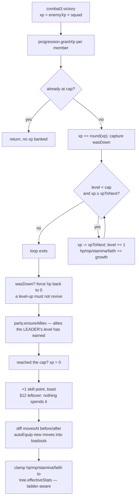
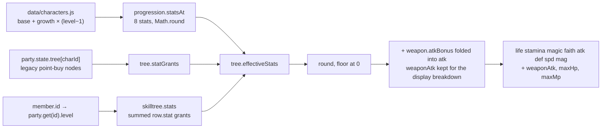

# Player Progression

Every playable character in CHLOE walks the *same* 1-100 unlock ladder, each on their *own* level. There are no skill points to spend and no nodes to choose: reaching a level grants that level's row, automatically and immediately. Levels 1-9 are hand-authored and hand you a real ability plus the number key to put it on; 10-100 are generated on a stated cadence and are honest about being growth. A character's entire kit — abilities, hotbar width, stat bonuses, and which allies exist at all — is a **pure function of their level**, computed on every read, with nothing stored and nothing to migrate ([engine/skilltree.js:1-13](../game/js/engine/skilltree.js:1)).

This page covers the player half of that story. The knight has his own parallel ladder — see [Knight levels](knight-levels.md) — and the two are deliberately separate files with separate rules.

---

## Spec lineage, and where the code has moved on

`GAME_SPEC.md` is layered: later sections supersede earlier ones. Progression has been rewritten three times.

| Section | What it established | Status in the code today |
|---|---|---|
| §12 "Progression v3" | 100 levels, XP curve, 4 resources, 11 damage types, **per-character point-buy skill trees**, +1 skill point per level, respec for shards | XP curve, cap, resources and `effectiveStats` are live. The **tree is dead**: `ui/tree.js` no longer exists in `game/js/ui/` and has no script tag in [game/index.html](../game/index.html); nothing anywhere calls `tree.buy()`. |
| §19 "One ladder" | Replaces the point shop with a shared 1-100 unlock ladder; allies arrive by `row.ally`; the leader's death hands the fight over instead of ending the run | Live. |
| §21 | Authored levels **1-9**, every ability arriving with its key; the tree *screen* deleted; the ladder moved into Menu → Moves | Live. Supersedes §19's own "authored 1-12, Ash at 3" table. |
| §23 | `config.pocketSlots` — two generic keys from level 1, which the ladder never grants | Live, and it is what forces the key arithmetic below. |
| §25 | Row 4 carries Ash **and** `water_wave` **and** a key, rather than renumbering the ladder | Live. |

**Where spec and code disagree, the code wins.** Three places matter and are called out in situ below:

- §19's ladder table (Ash at level 3, keys at 4/7/10) is stale — §21 and §25 replaced it. [data/skilltree.js](../game/js/data/skilltree.js) is the truth.
- §21's own table still says `hammer_fist + key 4` / `ember_jab + key 5` / `hollow_breaker + key 6`. After §25 inserted a key on row 4, those are keys **5, 6, 7**, which is what the row descriptions in the data file say.
- §12's skill points are still minted on every level-up ([engine/progression.js:293-304](../game/js/engine/progression.js:293)) and there is nowhere to spend them. See [Traps](#traps-and-silent-failure-modes).

---

## The ladder

### Row schema

One table, `CHLOE.data.skilltree.rows`, keyed by level number. Every field is optional and a row may carry any subset — level 4 carries five at once: three grants (`ally`, `ability`, `slot`) plus `name` and `desc` ([data/skilltree.js:9-14](../game/js/data/skilltree.js:9), the row itself at [:66-67](../game/js/data/skilltree.js:66)).

| Field | Type | Effect | Read by |
|---|---|---|---|
| `ability` | ability id | Adds to the bindable pool | `skilltree.abilities()` → `combat3.knownAbilities()` |
| `slot` | number | +N usable number keys | `skilltree.slots()` → `combat3.slotCount()` |
| `stat` | `{life,magic,stamina,atk,def,spd,mag}` | Permanent stat grant, summed over every earned row | `skilltree.stats()` → `tree.effectiveStats()` |
| `ally` | character id | That character joins the party | `skilltree.alliesAt()` → `party.ensureAllies()` |
| `name` | string | Row title on the level screen and the mirror | `ui/binds.js`, `ui/sheet.js`, `engine/displays.js` |
| `desc` | string | Row body copy | `ui/binds.js` |

`faith` is **never** granted by any ladder row. In practice it is base + growth and nothing else (see [Resources](#the-four-resources)): the only other source in the codebase is the legacy point-buy tree's `+3 max faith` nodes ([data/tree.js:107](../game/js/data/tree.js:107)), and no character can own a node because nothing calls `tree.buy()` — see [Traps](#traps-and-silent-failure-modes).

### Levels 1-9, exactly as authored

Copied from [data/skilltree.js:53-78](../game/js/data/skilltree.js:53). Abilities and their keys arrive together on purpose — "granting a move with nowhere to bind it reads as a bug, not a reward" ([data/skilltree.js:33](../game/js/data/skilltree.js:33)).

| Lv | `name` | `ability` | `slot` | `ally` | `stat` | Key the desc names |
|---:|---|---|---:|---|---|---|
| 1 | Fists | `punch` | `0` | — | — | key 1 (from `baseSlots`, not from the row) |
| 2 | Fire Tornado | `fire_tornado` | 1 | — | — | key 2 |
| 3 | Asteroid | `asteroid` | 1 | — | — | key 3 |
| 4 | Ash, and the Water Wave | `water_wave` | 1 | `ash` | — | key 4 |
| 5 | Roadworn | — | — | — | `{life:12, stamina:6}` | — |
| 6 | Hammer Fist | `hammer_fist` | 1 | — | — | key 5 |
| 7 | Open Channel | — | — | — | `{magic:8, mag:2}` | — |
| 8 | Ember Jab | `ember_jab` | 1 | — | — | key 6 |
| 9 | Hollow Breaker | `hollow_breaker` | 1 | — | — | key 7 |

Row 1 sets `slot: 0` explicitly. Key 1 comes from `abilityConfig.baseSlots` ([data/abilities.js:227](../game/js/data/abilities.js:227)), not from the row — which is why the counter below is seeded with `baseSlots` rather than starting at zero.

All seven ability ids resolve against `CHLOE.data.abilities` ([data/abilities.js](../game/js/data/abilities.js)): `punch`, `hammer_fist`, `ember_jab`, `fire_tornado`, `asteroid`, `water_wave`, `hollow_breaker`. `combat3.knownAbilities()` filters the ladder's list against that table, so a typo'd id is dropped silently rather than firing into nothing ([engine/combat3.js:96-115](../game/js/engine/combat3.js:96), the `ABIL()[lvl[i]]` test at :102).

**§25's design note, worth keeping:** row 4 was overloaded rather than renumbered because the authored 1-9 ladder is referenced *by level number* all over the spec. Renumbering to fit one ability in would have invalidated every one of those references ([data/skilltree.js:36-40](../game/js/data/skilltree.js:36)).

### Levels 10-100: the generated cadence

The loop at [data/skilltree.js:115-127](../game/js/data/skilltree.js:115) fills every level from 10 to 100 that `rows` does not already define. An authored row always wins — `if (rows[L]) continue;` is the first line — so a new hand-built level 14 simply overrides the generated one.

The branches are checked **in this order**:

1. `L % 4 === 0 && slotsSoFar < keyCap` → **Wider Grip**, `{slot: 1}`, desc `'+1 ability keybind - key N'`
2. `L % 5 === 0` → **Harder to Kill**, `{life: 10, stamina: 4}`
3. `L % 5 === 2` → **Deeper Well**, `{magic: 5, mag: 1}`
4. otherwise → **Seasoned**, `{atk: 1, def: 1, spd: 1}`

**Branch 1 never fires against the rows as they stand today.** `slotsSoFar` is already equal to `keyCap` before the loop starts, so no "Wider Grip" row is generated in this build. The gate is not dead code — it is the branch that comes back the moment the authored ladder stops filling the bar, and [The key arithmetic](#the-key-arithmetic) is where you work out whether an edit has woken it.

Because branch 1 is inert, branch 2 wins at every multiple of 4 that is also a multiple of 5 (level 20, 40, …), and levels like 12 (`%4 === 0`, `%5 === 2`) fall through to Deeper Well.

| Row | Levels | Count | Grant |
|---|---|---:|---|
| Harder to Kill | 10, 15, 20, … 100 | 19 | `+10 life, +4 stamina` |
| Deeper Well | 12, 17, 22, … 97 | 18 | `+5 magic, +1 mag` |
| Seasoned | everything else in 10-100 | 54 | `+1 atk, +1 def, +1 spd` |
| Wider Grip | none, at today's row count | 0 | would be `+1 slot` |

Totals a character has banked from the ladder alone by level 100 (authored rows 5 and 7 included): **life +202, stamina +82, magic +98, mag +20, atk +54, def +54, spd +54**. By level 9 it is only **life +12, stamina +6, magic +8, mag +2** — the early game is abilities, not numbers.

---

## The key arithmetic

This is the most load-bearing ten lines in the file ([data/skilltree.js:102-111](../game/js/data/skilltree.js:102)), and the thing to take from it is the **mechanism**, not the number it produces today. Nothing here is hard-coded: the ladder derives, at script-parse time, both how many number keys it is *allowed* to hand out and how many it *has* handed out, and the gate on the generated loop compares the two. Two named variables carry that:

- **`keyCap`** — the ceiling. `Math.max(1, maxSlots - pockets)`, read from `abilityConfig.maxSlots` and `config.pocketSlots` rather than written down ([data/skilltree.js:104-106](../game/js/data/skilltree.js:104)).
- **`slotsSoFar`** — the running total of ability keys the ladder has committed. Seeded with `abilityConfig.baseSlots`, because key 1 arrives free before any row, then **counted** by walking levels 1 through 9 and adding each row's `slot` ([data/skilltree.js:108-111](../game/js/data/skilltree.js:108)).

Feed those the constants `data/abilities.js` and `data/config.js` publish today and it comes out like this:

```
maxSlots = abilityConfig.maxSlots        = 9    data/abilities.js:226
pockets  = config.pocketSlots            = 2    data/config.js:20
keyCap   = max(1, maxSlots - pockets)    = 7    data/skilltree.js:106

slotsSoFar = abilityConfig.baseSlots     = 1    data/abilities.js:227
           + sum(rows[1..9].slot)        = 6    (rows 2,3,4,6,8,9)
                                         = 7

gate: slotsSoFar < keyCap  ->  7 < 7  ->  false
```

So **as the rows stand today**: 1 base key + 6 slot grants = 7 ability keys by level 9, + 2 pockets = 9 = `maxSlots`. The hotbar is exactly full at the end of the authored ladder, and the generated loop hands out no more keys. The file's own comment on that sum opens with the word that matters — *"Today: 1 + 6 = 7 ability keys by level 9, + 2 pockets = 9 = maxSlots"* ([data/skilltree.js:112-113](../game/js/data/skilltree.js:112)). It is a count of the rows that happen to be authored right now, not a rule the file enforces.

### Recomputing it after an edit

`slotsSoFar` is a sum over the rows actually present in `rows` for levels 1-9, so editing those rows changes it, and the loop's behaviour changes with it. Both directions are reachable in one commit:

- **Take a key away** — delete an authored ability row, or drop its `slot` — and `slotsSoFar` falls to 6. `6 < 7` is now true, so the first multiple of 4 in the generated range fires branch 1: level 12, which is Deeper Well today, becomes a **"Wider Grip"** row handing back key 7 (`slotsSoFar` is incremented first, so the desc reads `+1 ability keybind - key 7` — [data/skilltree.js:117-119](../game/js/data/skilltree.js:117)). The gate then closes again at level 16 and the cadence resumes. The ladder repairs itself, three levels late.
- **Add a key** — give one of the stat rows a `slot`, or overload a row the way §25 overloaded row 4 — and `slotsSoFar` rises to 8, one past `keyCap`. The gate never opens (it only ever tests `<`), so no *generated* row makes it worse; but the authored ladder is now asking for `1 + 7 + 2 = 10` and `slotCount()` clamps that to 9 ([engine/combat3.js:143](../game/js/engine/combat3.js:143)). The bar simply reaches its nine keys a level or two earlier, and the **last** `slot` row on the ladder widens nothing: it names a new key on the Moves screen and the hotbar does not change. `keyCap` is what the generated loop obeys — it cannot stop a hand-authored row from over-promising.

One edge the counter cannot see: the loop that builds `slotsSoFar` runs `for (var A = 1; A <= 9; A++)`, while `skilltree.slots()` sums `row.slot` over **every** earned row ([engine/skilltree.js:44-48](../game/js/engine/skilltree.js:44)). An authored row above level 9 that carries a `slot` — the hand-built level 14 that overrides its generated entry — is therefore granted but never counted, so it lands in the "add a key" case above with the gate none the wiser: `slotsSoFar` still reads 7, the loop still believes the ladder is exactly full, and the extra key is eaten by the clamp. If you author a key outside 1-9, widen the counting loop with it.

### Why `slotsSoFar` is counted, not written down

It used to be the literal `6`, and the gate used to be the literal `9`. Both became wrong the instant §25 gave level 4 a key ([data/skilltree.js:84-89](../game/js/data/skilltree.js:84)).

The failure mode is **silent**, which is the whole argument for counting. A stale literal does not throw and nothing validates it: the ladder just quietly generates a tenth key row at some level in the 10s, names it and promises it on the Moves screen, and `combat3.slotCount()` clamps it off at the far end where nobody is looking. Counting the rows means adding or removing an authored ability can never require remembering to bump a number somewhere else in the same file — the number recomputes itself, and the worst it can do is hand a key back late rather than promise one that does not exist.

### Why `keyCap` subtracts the pockets

§23's two pocket keys are granted from level 1 and the ladder never hands them out — but `combat3.slotCount()` *adds them on top* of the ladder's grants before clamping to `maxSlots` ([engine/combat3.js:134-144](../game/js/engine/combat3.js:134)):

```js
n = cfg.baseSlots || 1;
n += sk.slots(charId);        // ladder
n += tr.abilitySlots(charId); // legacy point-buy nodes, if any survive
n += pocketSlots();           // +2
return Math.max(1, Math.min(cfg.maxSlots || 9, n));
```

The ladder is spending from a budget it does not fully own, so it has to hand back what §23 already spoke for. A ladder that counted only its own ability keys and stopped at `maxSlots` would really be asking for `9 + 2 = 11`, and the clamp would eat the difference: **two "Wider Grip" rows that promise a key and deliver nothing** ([data/skilltree.js:91-98](../game/js/data/skilltree.js:91)). That is also why `pockets` is read from `config.pocketSlots` rather than written as a literal `2` here — a literal would be a second place for the pocket count to live and disagree from. Both sides degrade to 0 pockets when config is missing, so they agree about the cap even when they are both wrong ([data/skilltree.js:100-101](../game/js/data/skilltree.js:100), [engine/combat3.js:127-133](../game/js/engine/combat3.js:127)).

### Hotbar width by level

`slotCount()` = `baseSlots(1)` + cumulative ladder `slot` + pockets(2), clamped to 9.

| Level | Ladder `slots()` | Ability keys | + pockets | `slotCount()` |
|---:|---:|---:|---:|---:|
| 1 | 0 | 1 | 2 | **3** |
| 2 | 1 | 2 | 2 | 4 |
| 3 | 2 | 3 | 2 | 5 |
| 4-5 | 3 | 4 | 2 | 6 |
| 6-7 | 4 | 5 | 2 | 7 |
| 8 | 5 | 6 | 2 | 8 |
| 9-100 | 6 | 7 | 2 | **9** |

On top of those number keys sit the two id-addressed slots in `config.mouseSlots` — `mouseL` and `mouseR`, labelled `LMB` and `RMB` by `config.mouseSlotLabels` ([data/config.js:48](../game/js/data/config.js:48), [:52](../game/js/data/config.js:52)). Nine keys plus two buttons is **eleven addressable slots**, and the buttons are addressed by **string id, never by index**: they live outside the numeric array, are owned from level 1, and are deliberately **not** counted against `maxSlots` — that cap is about how many number keys the *ladder* may hand out, and `slotCount()` is untouched by any of it ([data/config.js:43-47](../game/js/data/config.js:43), [engine/combat3.js:157-159](../game/js/engine/combat3.js:157)). The Moves screen draws `abilityConfig.maxSlots` number keys — nine — regardless of level, then appends the two mouse tiles, greying the keys past `slotCount` as `locked` ([ui/binds.js:226-244](../game/js/ui/binds.js:226)). The lock test is `unlocked = mouse || slotId < slots.length` at [:234](../game/js/ui/binds.js:234), where `slots = combat3.binds(charId)` — an array that is always exactly `slotCount(charId)` long ([engine/combat3.js:278-290](../game/js/engine/combat3.js:278)). A mouse tile is never locked.

---

## XP and the level cap

### The curve

```js
xpToNext(level) = Math.round(22 * Math.pow(level, 1.75));   // engine/progression.js:55
```

XP is **not** cumulative on the member: `grantXp` subtracts `xpToNext(level)` from `member.xp` each time it levels, so `member.xp` is always progress *within* the current level ([engine/progression.js:268-272](../game/js/engine/progression.js:268)).

| Level | `xpToNext(L)` | Total XP earned since level 1 to reach L |
|---:|---:|---:|
| 1 | 22 | 0 |
| 2 | 74 | 22 |
| 3 | 150 | 96 |
| 4 | 249 | 246 |
| 5 | 368 | 495 |
| 9 | 1,029 | 2,869 |
| 10 | 1,237 | 3,898 |
| 20 | 4,161 | 28,213 |
| 25 | 6,149 | 52,862 |
| 50 | 20,683 | 365,778 |
| 100 | — | 2,495,135 |

The cap is 100, read from `config.levelCap` with a hard-coded fallback of 100 ([engine/progression.js:50-53](../game/js/engine/progression.js:50), [data/config.js:7](../game/js/data/config.js:7)). At the cap, `member.xp` is zeroed and further XP is refused outright ([engine/progression.js:262, 290](../game/js/engine/progression.js:262)).

### What a fight actually pays

```js
enemyXp(def) = Math.round(def.rewards.xp * Math.pow(def.level, 1.35) / 2 + 10);  // engine/progression.js:60
```

For `hollow_black_knight` (`rewards.xp: 16`, `level: 2` — [data/enemies.js:35-51](../game/js/data/enemies.js:35)) that is a flat **30**. `combat3.victory()` multiplies by the squad size and grants the full amount to **every member, not a split share** ([engine/combat3.js:1230-1241](../game/js/engine/combat3.js:1230)):

```js
var xp = prog().enemyXp(def) * squad;          // 30 * round
for (i = 0; i < members.length; i++) prog().grantXp(members[i], xp);
```

"Squad size" is literally `st.enemies.length` ([engine/combat3.js:1231](../game/js/engine/combat3.js:1231)), not the round counter — they are equal only because the one live caller passes the round in as `count`: `C3.start(enemyId, round)` with `round = runStats.round` ([ui/battle3d.js:1229-1230](../game/js/ui/battle3d.js:1229)), and `start()` builds one entry per `count` ([engine/combat3.js:594-604](../game/js/engine/combat3.js:594)). Change §20's "round N spawns N knights" rule and the XP curve moves with it.

Clearing round *N* therefore pays each member `30 × N` XP and the party `12 × N` shards (`rewards.shards: 12`, also × squad — [engine/combat3.js:1232](../game/js/engine/combat3.js:1232)). Cumulative after clearing round *R* is `15 × R × (R+1)`. Assuming you clear every round:

| Milestone | XP needed | Round it lands on |
|---|---:|---:|
| Level 4 — Ash joins | 246 | 4 |
| Level 9 — authored kit complete, hotbar full | 2,869 | 14 |
| Level 10 — generated growth begins | 3,898 | 16 |
| Level 20 | 28,213 | 43 |
| Level 100 | 2,495,135 | 408 |

The cap is not a realistic target for a run; the authored ladder is.

### The level-up pipeline

Ordering here is load-bearing. The ally check runs **once, after** the level-up `while` loop has finished — not per level inside it — so gaining three levels in one payout still calls `ensureAllies` a single time ([engine/progression.js:284-289](../game/js/engine/progression.js:284)). It is still *inside* `victory()`'s per-member loop, which is what lets a brand-new ally be paid on the same frame she joins (see [Everyone on their own level](#everyone-on-their-own-level)). The pool clamp runs last because it has to see the new ladder grants.



Only two steps in that chain are unconditional: the `wasDown` re-zero and the at-the-cap `xp = 0`. Everything else below the loop — `ensureAllies`, the skill point, the move diff and the clamp — sits inside `if (res.levelsGained.length)`, so a payout that banks XP without crossing a level does none of it ([engine/progression.js:284](../game/js/engine/progression.js:284), [:293](../game/js/engine/progression.js:293), [:306](../game/js/engine/progression.js:306)).

Two details from [engine/progression.js:267-280](../game/js/engine/progression.js:267) that are easy to break:

- A member who was already at 0 HP still gains XP and levels. `wasDown` is captured *before* the loop and re-zeroes `hp` afterwards, because the growth bumps would otherwise silently revive a corpse — reviving is the item's job, not the level-up's.
- The clamp at the end calls `tree.effectiveStats(member)` rather than `statsAt`, so the new maximum already includes the ladder's `stat` rows. Clamping against raw base+growth would cut the level's own reward off — which is exactly what the guarded fallback does if `engine/tree.js` never loaded ([engine/progression.js:325-327](../game/js/engine/progression.js:325)).

---

## The four resources

Per §12, `hp`/`mp` were renamed to `life`/`magic` and two pools were added. `statsAt` returns all eight v3 stats plus `hp`/`mp` aliases so v2 callers keep working ([engine/progression.js:92-102](../game/js/engine/progression.js:92)).

| Resource | Base + growth | Notes |
|---|---|---|
| `life` | data/characters.js | Aliased from `hp` if a char def predates the rename (`POOL_ALIASES`) |
| `stamina` | data/characters.js | Defaults to `{base:50, growth:5}` for a def that has none (`POOL_DEFAULTS`) |
| `magic` | data/characters.js | Aliased from `mp` |
| `faith` | data/characters.js | Defaults to `{base:5, growth:0}`; **no ladder row grants it** |

Base and growth for the two playable characters ([data/characters.js:21-22, 51-52](../game/js/data/characters.js:21)):

| | life | stamina | magic | faith | atk | def | spd | mag |
|---|---:|---:|---:|---:|---:|---:|---:|---:|
| Chloe base | 62 | 40 | 20 | 3 | 12 | 8 | 9 | 11 |
| Chloe growth | 8 | 3 | 3 | 0.2 | 2 | 2 | 1 | 2 |
| Ash base | 54 | 40 | 24 | 3 | 11 | 7 | 12 | 12 |
| Ash growth | 7 | 3 | 4 | 0.2 | 2 | 1 | 2 | 2 |

**Faith is currently inert in the live game.** `combat3` tracks only `{hp, mana, sta}` ([engine/combat3.js:606](../game/js/engine/combat3.js:606)) and no ability in [data/abilities.js](../game/js/data/abilities.js) declares a faith cost — every `cost` is `{sta}` or `{mana, sta}`. It is rendered on the character sheet and consumed only by the unrouted turn-based `engine/battle.js`.

### How effective stats are assembled

`CHLOE.engine.tree.effectiveStats(member)` is **the one aggregator the whole game consumes** — battle, sheet, mirror and the level-up clamp all read it, never raw base ([engine/tree.js:271-291](../game/js/engine/tree.js:271)).



Notes that bite:

- `out.atk` **includes** the weapon bonus. `battle.js` must not re-add it; `weaponAtk` survives purely so `ui/sheet.js` can print `10+3` ([engine/tree.js:286-287](../game/js/engine/tree.js:286), [ui/sheet.js:166-169](../game/js/ui/sheet.js:166)).
- `party.effStats(member)` is a thin delegate to `tree.effectiveStats` with a degraded fallback that omits ladder grants entirely if `engine/tree.js` failed to load ([engine/party.js:214-229](../game/js/engine/party.js:214)). The fallback is a silent downgrade, not an error.
- The ladder's `stat` grants land at the **member's own level**, so a level-3 ally does not get the leader's bonuses ([engine/tree.js:277-280](../game/js/engine/tree.js:277)). Note the indirection: `effectiveStats` passes `member.id`, not `member.level`, and `skilltree.levelOf()` looks the level back up through `party.get(charId)` — so calling it on an object that is *not* in the party silently grants the level-1 row set ([engine/skilltree.js:22-26](../game/js/engine/skilltree.js:22)). Every live caller passes a real party member, so this has not bitten yet.

---

## The party

State lives in `CHLOE.engine.party.state` and **is** the run — nothing is persisted, and `newGame()` is the only thing that builds it ([engine/party.js:1-9](../game/js/engine/party.js:1)). See [Run loop](run-loop.md) for the run's lifecycle.

### Solo start, then Ash by level

`newGame()` pushes exactly one member: Chloe at level 1, `xp: 0`, pools from `statsAt(def, 1)` ([engine/party.js:117-143](../game/js/engine/party.js:117), `makeMember` at [:60-66](../game/js/engine/party.js:60)).

Allies are earned by **ladder level**, not by clearing the room. `party.ensureAllies(silent)` asks `skilltree.alliesAt(leader.level)` for the list and adds anyone missing; it is idempotent and safe to call on every level-up ([engine/party.js:174-187](../game/js/engine/party.js:174)). The leader is `active() || state.members[0]` ([:177](../game/js/engine/party.js:177)).

> The comments in [engine/party.js:171-173](../game/js/engine/party.js:171) and [engine/progression.js:282-283](../game/js/engine/progression.js:282) still say "Ash at 3". The data says **4** ([data/skilltree.js:66](../game/js/data/skilltree.js:66)). The data is right; the comments are §19-era leftovers.

The §11 legacy hooks are still wired: `setFlag('roomCleared')` ([engine/party.js:307-313](../game/js/engine/party.js:307)) and assigning `state.scene = 'stage'` — intercepted by a `defineProperty` setter on `state` ([engine/party.js:39-48](../game/js/engine/party.js:39)) — both call `ensureAsh()`, which is now just an alias for `ensureAllies` ([engine/party.js:189](../game/js/engine/party.js:189)). They are harmless — the level gate still decides.

### Everyone on their own level

An ally joins at **level 1** and levels independently from there. But because `victory()` iterates `state.members` by re-reading `.length` each pass, and `ensureAllies` pushes onto that same array mid-iteration, a new ally receives **that same victory's XP** on the frame they join.

Worked from the real numbers — Chloe clears rounds 1-4 solo, each paying `30 × N`:

| After round | Party XP paid | Chloe | Ash |
|---:|---:|---|---|
| 1 | 30 | Lv 2, 8/74 | — |
| 2 | 60 | Lv 2, 68/74 | — |
| 3 | 90 | Lv 3, 84/150 | — |
| 4 | 120 | **Lv 4**, 54/249 → Ash joins | joins at Lv 1, is immediately paid 120 → **Lv 3**, 24/150 |

Ash therefore walks in already holding `punch`, `fire_tornado` and `asteroid`, exactly one authored row behind — and permanently 180 XP behind (the rounds 1-3 total she was not there for). Both reach level 9 on the same round (14), because the round payout grows fast enough to swallow the gap.

Nothing heals the party between rounds in the live 3D flow: `party.fullHeal()` is defined at [engine/party.js:291-300](../game/js/engine/party.js:291) and has exactly one caller in the whole codebase — the `'heal'` scene action in the unrouted 2D flow ([ui/scene.js:196](../game/js/ui/scene.js:196); `main.js` states the 2D route is dead at [main.js:5-6](../game/js/main.js:5)). HP carries from fight to fight, and a member at 0 stays at 0 for the rest of the run unless an item picks them up.

### The leader's death is a handoff, not a loss (§19)

`combat3.takeHit()`, the killing-blow tail at [engine/combat3.js:1009-1050](../game/js/engine/combat3.js:1009):

1. Damage lands, `st.hp` hits 0, and the mirror write `m.hp = st.hp` keeps the party member in sync.
2. **§27C first:** a bound revive potion gets its chance *before* the swap. That single line of ordering is what the potion buys — swap first and it could only ever be poured over a body that already lost the fight ([engine/combat3.js:1012-1020](../game/js/engine/combat3.js:1012)).
3. Otherwise `p.firstAliveOther(st.charId)` — first member in `state.members` order with `hp > 0` ([engine/party.js:282-288](../game/js/engine/party.js:282)). Since `newGame()` pushes Chloe first and allies are appended, that order is join order and Chloe is always the fallback.
4. If someone is standing: `setActive`, `st.charId = next.id`, re-read `effStats(next)` into `st.max`, `st.hp = next.hp` (their **carried** life), `st.mana`/`st.sta` set to **full**, `st.cast = null`, `st.lockUntil = 0`, `st.cd = {}` (fresh cooldowns), `st.iframeUntil = now + 900`.
5. If nobody is: `defeat()` — and §15 ends the run for good.
6. Returns `leaderSwap: <charId>` ([engine/combat3.js:1045-1050](../game/js/engine/combat3.js:1045)), which [ui/battle3d.js:1080-1095](../game/js/ui/battle3d.js:1080) uses to rebuild the hotbar **from the new leader's own level and abilities** (`buildHotbar(C3.snapshot())` at :1084).

The incoming member fights on their own row of the ladder. A level-3 Ash taking over from a level-9 Chloe has three abilities on five keys, and the HUD redraws to say so.

---

## Where the player sees this

| Surface | Shows | File |
|---|---|---|
| **Character sheet** (Menu → Party → member) | 4 resource bars, 8 core stats from `effectiveStats`, 11-type resistance grid, per-phase move chips, XP bar, and a pill reading `Lv N: <next row name>` from `skilltree.nextRow` | [ui/sheet.js:103-260](../game/js/ui/sheet.js:103) |
| **Menu → Moves** | The ladder itself: current level, XP bar, and rows from `level−2` to `min(maxLevel, max(level+4, 9))` with a chip for what each hands over. Beside it, the nine key cards + the two `mouseSlots` tiles, with keys past `slotCount` drawn `locked` | `renderLadder` at [ui/binds.js:395-460](../game/js/ui/binds.js:395); the key grid at [:226-244](../game/js/ui/binds.js:226) |
| **Party list** (Menu → Party) | Name + level, element tag, HP/MP/ATK/DEF/SPD/MAG, XP bar, weapon name, learned move names, "Sheet" and "Make lead" | [ui/menu.js:92-169](../game/js/ui/menu.js:92) |
| **The mirror** (dressing room prop) | `WHO YOU ARE`: leader's name, level, life/magic/stamina bars, ATK/DEF/SPD/MAG, unlocked abilities, and `Lv N: <next row name>` along the bottom | [engine/displays.js:63-130](../game/js/engine/displays.js:63) |
| **How to play** (Menu → help) | The player-facing statement of the rule, in prose | [ui/menu.js:244](../game/js/ui/menu.js:244) |

`ui/sheet.js`'s ladder pill and its "Moves & levels" button are what replaced the deleted skill-tree screen: the button flips the menu to the Moves tab for that character via `opts.onOpenLadder` ([ui/sheet.js:231-244](../game/js/ui/sheet.js:231), [ui/menu.js:74-80](../game/js/ui/menu.js:74)).

---

## Traps and silent failure modes

**Load order is a correctness constraint, not a style choice.** [data/skilltree.js](../game/js/data/skilltree.js) reads `abilityConfig` and `config` **eagerly, at script-parse time** inside its IIFE ([data/skilltree.js:102-105](../game/js/data/skilltree.js:102)), while `engine/combat3.js` reads the same config **lazily, per call** ([engine/combat3.js:33-34](../game/js/engine/combat3.js:33)). Today [game/index.html](../game/index.html) loads `config.js` (:30) → `abilities.js` (:46) → `skilltree.js` (:47), which is correct.

The dangerous move is specifically **above `config.js`**. Then `pockets` reads 0, `keyCap` becomes 9, and the loop generates "Wider Grip" rows at levels 12 and 16 — while `slotCount()`, still seeing the real `pocketSlots: 2`, clamps them straight back off. Two rows promise a key and deliver nothing, with no error anywhere. (Verified by loading the real data files headlessly in both orders.)

Moving it above `abilities.js` alone is currently harmless, and that is a trap of its own: `ACFG.maxSlots || 9` and `ACFG.baseSlots || 1` degrade to exactly the values `abilities.js` publishes today, so the bug hides until one of those constants changes. The fallbacks are a coincidence, not a contract.

**Two independent hundreds.** `config.levelCap` ([data/config.js:7](../game/js/data/config.js:7), read by `progression.cap()` and therefore by `grantXp`) and `CHLOE.data.skilltree.maxLevel` ([data/skilltree.js:132](../game/js/data/skilltree.js:132), read by `skilltree.nextRow` at [engine/skilltree.js:71](../game/js/engine/skilltree.js:71) and by `ui/binds.js` at [:409](../game/js/ui/binds.js:409) and [:426](../game/js/ui/binds.js:426)) are separate constants that happen to agree. If they drift, levelling and the ladder display disagree about where the road ends.

**Skill points are minted and unspendable.** Every level-up still adds to `party.state.skillPoints[charId]` and toasts *"gained a skill point!"* ([engine/progression.js:293-304](../game/js/engine/progression.js:293)). `ui/tree.js` was deleted by §21 — the file is gone from `game/js/ui/` and there is no script tag for it — and `engine/tree.js` still exports `buy` and `respec` ([engine/tree.js:299-301](../game/js/engine/tree.js:299)) that nothing calls: the only `.buy(` anywhere in `game/js/` is `shop.buy(id)` in [ui/shop.js:269](../game/js/ui/shop.js:269), the item shop. The player is told about a currency with no shop. `engine/tree.js` itself must stay — `effectiveStats` is the aggregator behind every stat in the game.

**The mirror truncates at six abilities.** `known.slice(0, 6)` ([engine/displays.js:117](../game/js/engine/displays.js:117)) while the ladder grants seven by level 9. `hollow_breaker` — the row whose whole point is "the early kit is complete" — is the one that never appears on the mirror.

**XP does not scale with the knight's level.** `victory()` calls `enemyXp(st.enemyDef)`, and `enemyDef` is the static data record with `level: 2` ([engine/combat3.js:571](../game/js/engine/combat3.js:571), [data/enemies.js:37](../game/js/data/enemies.js:37)). The knight's *actual* level for the round sits right beside it in `st.enemyLevel` and is never used for rewards, so a round-8 knight pays exactly what a round-1 knight pays. Only squad size scales the payout. Whether that is intended tuning or an oversight, it is the reason the pacing table above is quadratic rather than steeper.

**`statsAt` rounds where `characters.js` says floor.** The header of [data/characters.js:7-8](../game/js/data/characters.js:7) specifies `Math.floor(base + growth*(level-1))` for fractional growth; [engine/progression.js:97](../game/js/engine/progression.js:97) uses `Math.round`. With Chloe's `faith` growth of 0.2 the two diverge from level 4 (3.6 → 4 rounded, 3 floored). Only `faith` has fractional growth today, and `faith` is inert, so nothing observable depends on it — until something does.

**Never reach into `party.state.binds` directly.** The hotbar is five maps that only mean anything together (`binds`, `mouseBinds`, `autoBound`, `bindsCleared`, `pocketAt`). `party.resetBinds(charId?)` is the only sanctioned way to clear one ([engine/party.js:82-115](../game/js/engine/party.js:82); the store list is `BIND_STORES` at [:106](../game/js/engine/party.js:106)). Clearing a subset leaves every auto-placed ability marked "done" with nowhere to be. The ladder makes this reachable in ordinary play, because it fills the bar *exactly* at level 9.

**A row's chip shows one grant.** [ui/binds.js:441-456](../game/js/ui/binds.js:441) checks `ability` → `ally` → `slot` → `stat` in that order and stops. Level 4 carries all three of the first kinds and displays only the Water Wave chip; Ash's arrival is visible in the row's `desc` and nowhere else on that screen.

---

## Where to change what

| Task | File |
|---|---|
| Add or change a level's reward (ability / key / stat / ally / copy) | [game/js/data/skilltree.js](../game/js/data/skilltree.js) — `rows` |
| Change the 10-100 cadence or the generated stat amounts | [game/js/data/skilltree.js](../game/js/data/skilltree.js) — the `for (var L = 10; ...)` loop |
| Change the hotbar cap or the free first key | [game/js/data/abilities.js](../game/js/data/abilities.js) — `abilityConfig.maxSlots` / `baseSlots` |
| Change how many generic pocket keys everyone gets | [game/js/data/config.js](../game/js/data/config.js) — `pocketSlots` (then re-check `keyCap`) |
| Author a new ability the ladder can grant | [game/js/data/abilities.js](../game/js/data/abilities.js), then add `ability:` to a row |
| Change the XP curve, the enemy XP formula, or the cap fallback | [game/js/engine/progression.js](../game/js/engine/progression.js) — `xpToNext`, `enemyXp`, `cap` |
| Change the level cap itself | [game/js/data/config.js](../game/js/data/config.js) — `levelCap` (and `skilltree.maxLevel`) |
| Change what a fight pays out | [game/js/data/enemies.js](../game/js/data/enemies.js) — `rewards`; multiplier in [game/js/engine/combat3.js](../game/js/engine/combat3.js) `victory()` |
| Change base stats or growth per character | [game/js/data/characters.js](../game/js/data/characters.js) — `base` / `growth` |
| Change how effective stats are combined | [game/js/engine/tree.js](../game/js/engine/tree.js) — `effectiveStats` |
| Change who is in the party at the start of a run | [game/js/engine/party.js](../game/js/engine/party.js) — `newGame` |
| Change when an ally joins | [game/js/data/skilltree.js](../game/js/data/skilltree.js) — move `ally:` to another row |
| Change the leader-death handoff | [game/js/engine/combat3.js](../game/js/engine/combat3.js) — `takeHit`, the `firstAliveOther` branch |
| Change the character sheet | [game/js/ui/sheet.js](../game/js/ui/sheet.js) — `renderInto` |
| Change the ladder screen | [game/js/ui/binds.js](../game/js/ui/binds.js) — `renderLadder` |
| Change the mirror panel | [game/js/engine/displays.js](../game/js/engine/displays.js) — `mirror()` |
| Add a menu tab / change the party list | [game/js/ui/menu.js](../game/js/ui/menu.js) |

---

**See also:** [architecture](architecture.md) · [run-loop](run-loop.md) · [combat](combat.md) · [knight-ai](knight-ai.md) · [knight-levels](knight-levels.md) · [knight-rig](knight-rig.md) · [difficulty-scaling](difficulty-scaling.md) · [world-room](world-room.md) · [stages](stages.md) · [data-reference](data-reference.md) · [tooling](tooling.md) · [debugging](debugging.md)
