# The Run Loop

A night of CHLOE is one uninterrupted session in memory. You press Start, a level-1 solo Chloe appears in a first-person dressing room, you walk into the thing standing in the room, and you get pulled into an arena for **round 1** against **one** Hollow Black Knight. Win, and you are put back in the room with the round counter at 2 and two knights waiting. Lose — meaning every member of your party is down, not just the one you were driving — and the run is over: a summary card, possibly a name prompt for the record board on the wall, and then a brand-new level-1 solo Chloe with nothing carried over. There is no save, no account, and no continue. Reloading the page is the same thing as dying, only quieter. This page traces that circuit end to end, in the order the code actually runs it.

Everything below is read out of the source. Where [GAME_SPEC.md](../GAME_SPEC.md) and the code disagree, the code is described and the disagreement is called out.

---

## 1. The rules the loop is built on (§15, as narrowed by §27)

[GAME_SPEC.md §15](../GAME_SPEC.md) is the roguelike contract: **one run per page load, permadeath on defeat, nothing persisted.** It explicitly supersedes accounts, the account screen, save v2, save v3 + migration, §13's PIN flow and cloud sync everywhere. `CHLOE.engine.save` and `ui/account.js` are deleted, not disabled.

§27 narrows it, and the narrowing is worth stating precisely because it produces the only `localStorage` key in the game. The spec's own words ([GAME_SPEC.md:246](../GAME_SPEC.md:246)):

> a records board may persist in `localStorage`, and `worker/` reopens for an optional records endpoint. Persistence that RESUMES a run is still dead — no accounts, no saves, no cloud progress. What §27 keeps is a record ABOUT finished runs, which restores nothing.

(Two clauses, then — the board and the endpoint — not one. The endpoint half is unreachable in this build; see [§11](#11-where-the-spec-and-the-code-disagree).)

[engine/records.js](../game/js/engine/records.js) states the line in its own header and defends it: there is no `restore()`, and no code path in that module writes to `party`, `inventory`, or the tree ([engine/records.js:13-24](../game/js/engine/records.js:13)). It is in fact stricter than its own header claims: that header says it reads the current round for a footer line, and **it does not read it at all** — `footer()` prints only the source label and a count, and every round the module handles arrives as an argument from `battle3d.runRound()`. Its only two global reads are `CHLOE.data.version` for the patch stamp ([engine/records.js:127](../game/js/engine/records.js:127)) and `CHLOE.data.config.apiUrl` ([engine/records.js:230](../game/js/engine/records.js:230)). It touches live run state nowhere.

What actually survives a run, and what does not:

| Thing | Survives a run? | Survives a reload? | Where |
|---|---|---|---|
| Levels, XP, tree, loadouts, hotbar binds | no | no | [engine/party.js:117](../game/js/engine/party.js:117) |
| Shards, inventory, flags, `runStats` | no | no | [engine/party.js:122](../game/js/engine/party.js:122) |
| Record board rows (name/round/time/patch/date) | yes | yes — `localStorage['chloe.records.v1']` | [engine/records.js:52](../game/js/engine/records.js:52) |
| The stage you picked at the board | **yes** (module-level, not run-scoped) | no | [data/stages.js](../game/js/data/stages.js) `stagePick` — see [Traps](#10-traps) |

---

## 2. Starting a run

`CHLOE.game.startNew()` ([js/main.js:27](../game/js/main.js:27)) is the whole of "start a run". It does three things, in this order:

1. `CHLOE.engine.party.newGame()` — rebuilds the run state from nothing.
2. `CHLOE.engine.records.start()` — starts the run clock. Guarded with a `typeof` check so a build without `engine/records.js` still starts a run ([js/main.js:36-37](../game/js/main.js:36), reasoned out in the comment at [:29-35](../game/js/main.js:29)).
3. `enterRoom3d()` — sets `party.state.scene = 'room3d'` and calls `CHLOE.ui.room3d.enter()` ([js/main.js:19-22](../game/js/main.js:19)).

### Both entry points

`startNew()` is deliberately the single funnel, and there are exactly two routed callers:

| Entry point | Call site |
|---|---|
| Title screen, **Press Start** | [ui/title.js:25](../game/js/ui/title.js:25) |
| Defeat panel, **Begin again** (via `scene.onBattleEnd('defeat')`) | [ui/room3d.js:377](../game/js/ui/room3d.js:377) |

A third caller exists in the unrouted legacy 2D flow ([ui/scene.js:214](../game/js/ui/scene.js:214)); the 2D scene path is kept working but is no longer reachable in Room3D mode ([js/main.js:1-6](../game/js/main.js:1)).

**This is why `records.start()` lives next to `newGame()`.** The clock's fallback is time-since-module-load ([engine/records.js:98-103](../game/js/engine/records.js:98)), which reads correctly for the first run of a page and *silently bills the second run for the first one's minutes*. Putting `start()` at the one function both entries pass through is the line that stops that ([js/main.js:36-37](../game/js/main.js:36)).

### What `newGame()` builds

[engine/party.js:117-143](../game/js/engine/party.js:117):

| Field | Reset to |
|---|---|
| `members` | `[]`, then one level-1 `chloe` via `makeMember('chloe')` |
| `activeId` | `'chloe'` |
| `runStats` | `{ kills: 0, round: 1, trophies: [] }` |
| `loadouts`, `skillPoints`, `tree` | `{}` |
| all five hotbar stores | via `resetBinds()` — see below |
| `shards` | `0` |
| `flags` | `{}` |
| `scene` | `story.startScene` (then immediately overwritten to `'room3d'`) |
| inventory | `reset()`, then `bandage` ×2, `energy_drink` ×1 |

`makeMember` builds `{id, level:1, xp:0, hp, mp, stamina, faith, weaponId}` from `progression.statsAt(def, 1)` ([engine/party.js:60-66](../game/js/engine/party.js:60)).

**The hotbar is five maps, and they move as one.** `binds`, `mouseBinds`, `autoBound`, `bindsCleared` and `pocketAt` only mean anything together; clearing a subset is the §27A bug in one move — a cleared `binds` with a surviving `autoBound` leaves every ever-auto-placed ability marked "done" with nowhere to be, and it never comes back. `resetBinds()` is the only sanctioned way to rebuild a hotbar from empty ([engine/party.js:82-115](../game/js/engine/party.js:82)).

---

## 3. One full run, as a flow

```mermaid
flowchart TD
    T["Title screen<br/>ui/title.js"] -->|Press Start| SN
    SN["CHLOE.game.startNew&#40;&#41;<br/>party.newGame&#40;&#41; + records.start&#40;&#41;"] --> ROOM
    ROOM["The dressing room<br/>ui/room3d.js + engine/world3d.js<br/>round N on the wall"]
    ROOM -->|"crosshair on the knight,<br/>&lt;= 3.5 m, click"| ENG["room3d.engage&#40;&#41;<br/>inBattle = true, pause the room"]
    ROOM -.->|"board arrows<br/>picks the floor"| ROOM
    ROOM -.->|"giftbox<br/>spend Shards"| ROOM
    ENG --> BEG["battle3d.begin&#40;enemyId&#41;<br/>round = runStats.round<br/>combat3.start&#40;id, round&#41;<br/>applyStage BEFORE the arena builds<br/>arena3d.spawnSquad&#40;round&#41;"]
    BEG --> GATE{"assets ready?"}
    GATE -->|no| LOAD["loading gate<br/>ui/loading.js"] --> FIGHT
    GATE -->|yes| FIGHT["startFight&#40;&#41;<br/>real-time, N knights"]
    FIGHT --> OUT{"combat3 result"}
    OUT -->|victory| VIC["combat3.victory&#40;&#41;<br/>kills += N, trophy pushed<br/>round = round + 1<br/>xp x N and shards x N"]
    VIC --> CARD["Encore! card"] -->|Continue| BACK["room3d.onBattleEnd&#40;'victory'&#41;<br/>setFlag roomCleared<br/>knight respawns after 15 s"] --> ROOM
    OUT -->|"leader at 0 life,<br/>someone still up"| SWAP["leader swap<br/>fight continues"] --> FIGHT
    OUT -->|"everyone down"| DEF["combat3.defeat&#40;&#41;"]
    DEF --> PANEL["showDefeat&#40;&#41;<br/>records.stop&#40;&#41; freezes the clock<br/>The Night Wins card"]
    PANEL -->|Begin again| REC{"isRecord&#40;round&#41;?"}
    REC -->|yes| NAME["name prompt<br/>records.submit&#40;&#41; -> localStorage"] --> END2
    REC -->|no| END2["end&#40;'defeat'&#41; &#8594;<br/>room3d.onBattleEnd&#40;'defeat'&#41;"]
    END2 --> SN
```



---

## 4. The room, and the handoff into the arena

The room screen is `#screen-room3d`, owned by [ui/room3d.js](../game/js/ui/room3d.js). That file wires only; every Three.js rule lives in [engine/world3d.js](../game/js/engine/world3d.js). A 120 ms poll drives the crosshair, the hint line, the HUD and the lock overlay ([ui/room3d.js:169-201](../game/js/ui/room3d.js:169); the interval is set in `startRoom` at [:302](../game/js/ui/room3d.js:302)).

Four things are **clicked**, and the engine's click handler ranks them enemy → TV → stage board → giftbox ([engine/world3d.js:1373-1381](../game/js/engine/world3d.js:1373)). The UI's hint line matches that order exactly and then adds a fifth rank the click handler has no branch for: a glinting floor pickup ([ui/room3d.js:188-198](../game/js/ui/room3d.js:188)). The order matching for the first four is not a coincidence — a prompt naming a target the click would not act on is worse than no prompt — and the pickup is not an exception to it: a pickup is taken by the §16 **grab**, `onMouseDown` → `tryGrab`, which is deliberately suppressed while any of the four click targets is under the crosshair ([engine/world3d.js:1428-1438](../game/js/engine/world3d.js:1428)).

| Target | Reach | What it does |
|---|---|---|
| The enemy | `ENGAGE_DIST` / `ENGAGE_RANGE` = **3.5 m** | starts the fight ([engine/world3d.js:52](../game/js/engine/world3d.js:52), [ui/room3d.js:27](../game/js/ui/room3d.js:27)) |
| The TV | `TV_RANGE` = **2.5 m** | pages through the how-to programme ([ui/room3d.js:28](../game/js/ui/room3d.js:28)) |
| Stage board arrows | `BOARD_DIST` = 2.5 m | steps `CHLOE.data.stagePick` — picks the next floor ([engine/world3d.js:579-584](../game/js/engine/world3d.js:579)) |
| Giftbox | `GIFT_DIST` = **3.0 m** | opens the Shards shop ([engine/world3d.js:903](../game/js/engine/world3d.js:903)) |

The hint only says `CLICK TO ENGAGE` when the crosshair **ray** actually hits the enemy mesh, not merely when you are within range — `world3d` only fires engage on the ray, so a distance-only hint would promise a click that does nothing ([ui/room3d.js:176-183](../game/js/ui/room3d.js:176)).

`engage()` ([ui/room3d.js:335-354](../game/js/ui/room3d.js:335)):

1. Bail if already `inBattle`.
2. Read the enemy id from `CHLOE.data.room3d.enemy.id` — `hollow_black_knight` ([data/room3d.js:21](../game/js/data/room3d.js:21)). Unknown id → warn and return.
3. `inBattle = true`, `pause()` the world loop and release pointer lock.
4. `CHLOE.ui.battle3d.begin(id)`, falling back to the 2D `CHLOE.ui.battle.begin(id, {boss:false})` if `battle3d` is absent.

Note what `engage()` deliberately does **not** do: it does not resolve the stage. §24 puts that inside `battle3d.begin` so every caller lands on the floor the room's board announced, and a second resolution on the room side would be a second thing to drift ([ui/room3d.js:343-348](../game/js/ui/room3d.js:343)).

### Coming back

Every battle end — 2D or 3D, victory, defeat or fled — funnels through `CHLOE.ui.scene.onBattleEnd(result)` ([ui/battle3d.js:1507](../game/js/ui/battle3d.js:1507)). `room3d.wire()` monkey-patches that function once, so room-engaged battles are diverted to `room3d.onBattleEnd` and everything else still reaches the original ([ui/room3d.js:403-411](../game/js/ui/room3d.js:403)). `wire()` is idempotent via a `wired` flag — without it, a second run would stack a second wrapper.

---

## 5. What a ROUND is

A round is one arena fight. `party.state.runStats.round` starts at **1** and is the run's difficulty dial.

**Where it is read:** `battle3d.begin` takes it as the squad size and the stage key ([ui/battle3d.js:1229](../game/js/ui/battle3d.js:1229)); `knighttree.round()` reads it for the knight ladder ([engine/knighttree.js:38-47](../game/js/engine/knighttree.js:38)); `world3d.nextStagePlan()` reads it for the wall board ([engine/world3d.js:490-493](../game/js/engine/world3d.js:490)); `displays.trophy()` reads it for the picture over the couch ([engine/displays.js:196-201](../game/js/engine/displays.js:196)).

**Where it is written:** exactly two places — `newGame()` sets it to 1, and `combat3.victory()` sets it to `cleared + 1` ([engine/combat3.js:1228](../game/js/engine/combat3.js:1228)). Nothing else may touch it.

### What the round number controls

| Effect | Rule | Source |
|---|---|---|
| **Squad size** | round N fields N knights: `combat3.start(enemyId, round)` builds N entries in `st.enemies[]`, `arena3d.spawnSquad(round)` puts N on the floor | [ui/battle3d.js:1230](../game/js/ui/battle3d.js:1230), [engine/combat3.js:594-604](../game/js/engine/combat3.js:594), [engine/arena3d.js:884](../game/js/engine/arena3d.js:884) |
| **Round baseline level** | `levelForRound(r) = clamp(1 + (r-1) * levelPerRound)`, `levelPerRound = 1` | [engine/knighttree.js:28](../game/js/engine/knighttree.js:28), [data/knighttree.js](../game/js/data/knighttree.js) |
| **Per-knight opening level** | `seniorityFor(index, count) = count - index`; `spawnLevel(personality, seniority) = clamp(startLevel + baseBonus[personality] + (seniority-1) * levelPerRound)` | [engine/knighttree.js:75-95](../game/js/engine/knighttree.js:75) |
| **Knight stats** | multipliers from `data/knighttree.js` rows applied to `data/enemies.js` base — the LAST row that sets one wins, they are absolute not cumulative | [engine/knighttree.js:175-196](../game/js/engine/knighttree.js:175) |
| **Knight move pool** | `patterns(level)` — every pattern unlocked up to that level, minimum `slash` | [engine/knighttree.js:163-171](../game/js/engine/knighttree.js:163) |
| **Swing cadence** | `max(650, (1700 + rand*1300) / sqrt(aliveCount))` ms — indirect: the round sets the count, the count sets the drumbeat | [ui/battle3d.js:916-921](../game/js/ui/battle3d.js:916) |
| **Stage** | `stagePick.forRound(n)` — a player pick if set, else `['ring','church'][(n-1) % 2]`; reached through `CHLOE.engine.stages.forRound`, which wraps it | [data/stages.js:264-266](../game/js/data/stages.js:264), [engine/arena3d.js:175-188](../game/js/engine/arena3d.js:175) |
| **The room's wall** | picture shows the round you are standing in; board announces the next floor and knight count | [engine/displays.js:196](../game/js/engine/displays.js:196), [engine/world3d.js:487](../game/js/engine/world3d.js:487) |

### The squad is a ladder, not a rank of clones (§30)

Round N adds exactly one knight, so the squad **index is a join date**. Index 0 has been coming since round 1 and opens at level N; the last index walked in tonight and opens at 1. `arena3d.spawnSquad` reuses `knights[0]` across rounds and splices the extras, so index 0 is literally the same object that fought round 1 — the arithmetic names something the code already does ([engine/knighttree.js:68-99](../game/js/engine/knighttree.js:68), [engine/arena3d.js:884-894](../game/js/engine/arena3d.js:884)).

`combat3.start` calls `spawnLevel('', sen)` with an **empty personality on purpose**: temperaments are dealt by the §22 brain in the 3D layer, which does not exist yet when `start()` runs. The brute's `+1` arrives on the first `syncLevels` tick ([engine/combat3.js:582-593](../game/js/engine/combat3.js:582)). Each entry also builds its **own** stats object inside the loop — one shared object by reference was harmless while every knight had the same level and is a corruption the moment they do not.

Growth knobs, in `CHLOE.data.knighttree.growth` ([data/knighttree.js:127-140](../game/js/data/knighttree.js:127)) — **except the last row**, which is a sibling of `growth`, not a member of it ([data/knighttree.js:150](../game/js/data/knighttree.js:150)); `knighttree.growth()` merges only the `growth` object against its defaults and reads `levelPerRound` off `T()` separately:

| Knob | Value | Meaning |
|---|---|---|
| `startLevel` | 1 | a newcomer's opening level |
| `secondsPerLevel` | 6.0 | base seconds alive per in-fight level |
| `rate` | `aggressive 0.70 · cautious 1.00 · brute 1.45` | multiplier on the above; **bigger is slower** |
| `baseBonus` | `brute: 1` | extra opening levels by temperament |
| `overCap` | 2 | how far past **his own** opening level a knight may climb |
| `tellMs` | 800 | how long the level-up tell burns |
| `levelPerRound` | 1 | the whole ladder's slope — **on `CHLOE.data.knighttree`, not on `.growth`** |

(`growth` also carries `trigger: 'aliveSeconds'`, which is documentation rather than a knob — nothing reads it.)

`capForKnight` mins the knight's own ceiling against the round's ceiling ([engine/knighttree.js:112-117](../game/js/engine/knighttree.js:112)). The **data** file's worked example, not the engine's ([data/knighttree.js:123-125](../game/js/data/knighttree.js:123)): a round-5 squad spawns `[5,5,3,2,2]` and tops out at `[7,7,5,4,4]`, where §28's round-relative cap gave `[7,7,7,7,7]`. Note that those two 5s and two 2s already include the brute's `+1` — the seniority ladder on its own opens a round-5 squad at `[5,4,3,2,1]`, and `combat3.start` is what sees that shape, because it passes an empty personality (below). The example is `arena3d`'s numbers, after temperaments have been dealt.

### The stage, applied before anything builds

`resolveStage(round)` asks three questions in order, and `world3d.nextStagePlan()` asks the identical three, because a board naming a different floor than the one you land on is the single failure that makes the feature worthless ([ui/battle3d.js:1162-1189](../game/js/ui/battle3d.js:1162), [engine/world3d.js:476-503](../game/js/engine/world3d.js:476)):

1. `CHLOE.engine.stages.forRound(n)` — the stateful selector, **if it exists**.
2. `CHLOE.data.stagePick.stageForRound(n)` / `.forRound(n)` — the pure half that lives in data.
3. Neither → `church`, i.e. exactly what every fight was before §24.

**It is rule 1 that answers, and rule 2 that almost never runs.** There is no `game/js/engine/stages.js` — but "no such file" is not "no such selector", and stopping at the filename is the easy way to get this backwards. `CHLOE.engine.stages` is defined by **`engine/arena3d.js`**, which says so out loud: `index.html` lists every script by hand, so a file nobody wires up is a file that silently never loads, and §24 allows an equivalently named export as long as the code states it ([engine/arena3d.js:140-157](../game/js/engine/arena3d.js:140)). `S.order / forRound / current / next / get / apply` are all built there, and deliberately **above** the `window.THREE` guard so the board still answers on a machine with no WebGL ([engine/arena3d.js:170-195](../game/js/engine/arena3d.js:170), guard at [:197](../game/js/engine/arena3d.js:197)).

The reason nothing drifts is that rule 1 is not a rival to rule 2, it is a wrapper over it: `S.forRound(n)` asks `CHLOE.data.stagePick.forRound(n)` first and returns that id — including the player's board pick — and only falls through to its own `order` cycle when the id names a stage that is not in `CHLOE.data.stages`, so a typo'd order cannot resolve to `undefined` and leave `setStage` quietly holding the previous floor ([engine/arena3d.js:175-188](../game/js/engine/arena3d.js:175)). So the *answer* is `stagePick`'s, exactly as the round table above says; the *path* is one hop longer than the three-rule list suggests.

All three rules are gated on `arena3d.setStage` existing. That gate is looser than it reads: `arena3d` defines `setStage` on its **disabled** API too, so it still records the pick on a machine with no WebGL ([engine/arena3d.js:128](../game/js/engine/arena3d.js:128)). The gate really only fails when `arena3d.js` is absent from the page altogether — and then every round is in the church and the board says so.

`applyStage` runs **before** `a3d.init` / `a3d.reset` / `spawnSquad`, tries `def.id` then the entry object, and **verifies against `debug().stage`** rather than assuming the call took ([ui/battle3d.js:1209-1222](../game/js/ui/battle3d.js:1209)). A `null` from `debug()` means the arena publishes nothing to check against and is accepted rather than re-set twice. A mismatch warns:

```
[battle3d] stage "ring" did not take — arena reports "church"
```

---

## 6. Victory

`combat3.victory()` runs the moment the last knight falls ([engine/combat3.js:1208-1250](../game/js/engine/combat3.js:1208)), in this order:

1. `st.over = true`, `st.result = 'victory'`.
2. `runStats.kills += st.enemies.length` — **counts knights, not fights.**
3. Push a trophy: `{round, knights, by, hpLeft, hpMax}`. This list *is* the round history, one entry per squad put down, and it dies with the run.
4. `runStats.round = cleared + 1` — the next fight is bigger.
5. `xp = progression.enemyXp(def) * squad`, `shards = (rewards.shards||0) * squad`.
6. `party.addShards(shards)`.
7. `progression.grantXp(member, xp)` for **every** member — the full amount each, not a split ([engine/combat3.js:1235-1240](../game/js/engine/combat3.js:1235)).
8. Roll drops per `rewards.drops[].chance` into the inventory.

The reward numbers, from [data/enemies.js:50](../game/js/data/enemies.js:50) and [engine/progression.js:60-65](../game/js/engine/progression.js:60):

- `hollow_black_knight.rewards = { xp: 16, shards: 12, drops: [bandage 0.5, tourniquet 0.25] }`, `level: 2`.
- `enemyXp = round(16 * 2^1.35 / 2 + 10)` = **30 XP per knight**, and `2` here is the enemy's *static* def level — it does **not** scale with `knighttree`. Only the squad count multiplies rewards.
- So round N pays **30N XP to each member** and **12N Shards**.

With `xpToNext(level) = round(22 * level^1.75)` ([engine/progression.js:55](../game/js/engine/progression.js:55)), a solo Chloe who clears every round reaches: **Lv 2 after round 1**, **Lv 3 after round 3**, **Lv 4 after round 4** — which is the level Ash joins on (computed from those two formulas, not read from a table).

`grantXp` also bumps current pools by the growth amount on each level, but **a downed member stays down**: `wasDown` is captured before the loop and `member.hp` is forced back to 0 after it, because reviving is the item's job ([engine/progression.js:267-280](../game/js/engine/progression.js:267)). It then calls `party.ensureAllies(false)` on every level-up so an ally arrives the moment it is earned ([engine/progression.js:282-288](../game/js/engine/progression.js:282)).

### The Encore card, then back to the room

`showVictory()` ([ui/battle3d.js:1371-1417](../game/js/ui/battle3d.js:1371)) prints `+X XP · +Y ◆`, one line per level gained, then — for each level-up — calls `C3.binds(memberId)` **before** asking `C3.takeAutoBound()`, because reading `binds()` is what triggers the auto-bind. Newly placed abilities are announced as `— ready on key N`. Then `Next at Lv N: <row name>` from `skilltree.nextRow`, then any drops. **Continue** calls `end('victory')`.

`room3d.onBattleEnd('victory')` ([ui/room3d.js:382-394](../game/js/ui/room3d.js:382)):

1. Set the `roomCleared` flag if unset.
2. `world3d.setEnemyAlive(false)` — the lure disappears.
3. Schedule `setEnemyAlive(true)` after `RESPAWN_MS` = **15000 ms** ([ui/room3d.js:29](../game/js/ui/room3d.js:29)).
4. `backToRoom()` → `ui.show('room3d')`, whose `onShow` handler calls `world3d.refreshPanels()` and `resume()` ([ui/room3d.js:356-359](../game/js/ui/room3d.js:356), [ui/room3d.js:449-459](../game/js/ui/room3d.js:449)).

One repaint on entry covers the mirror, the knight poster, the round picture and the stage board at once — which is why the board hangs off `refreshPanels` rather than its own hook.

**Nothing heals between rounds.** `party.fullHeal()` exists but its only caller is the unrouted 2D `heal` hotspot ([ui/scene.js:196](../game/js/ui/scene.js:196)). `combat3.start` carries the leader's life forward as `hp: Math.max(1, m.hp)` and refills only mana and stamina to max ([engine/combat3.js:607-609](../game/js/engine/combat3.js:607)). A member who fell in round 3 is still at 0 life in round 9 unless an item picks them up.

---

## 7. Defeat

### The leader falling is not the run ending

`combat3.takeHit` handles a killing blow in a strict order, and the order **is** the feature ([engine/combat3.js:1010-1050](../game/js/engine/combat3.js:1010)):

```mermaid
flowchart TD
    HIT["takeHit: st.hp -= dmg<br/>mirror to member.hp"] --> Z{"st.hp &lt;= 0 ?"}
    Z -->|no| ON["fight continues"]
    Z -->|yes| RV{"a bound revive item<br/>actually carried?"}
    RV -->|yes| POT["tryPassiveRevive&#40;&#41;<br/>consume 1, hp = revivePct% of max<br/>0.9 s i-frames, drop the cast<br/>SAME leader, same hotbar"] --> ON
    RV -->|no| SW{"firstAliveOther&#40;charId&#41;<br/>anyone else standing?"}
    SW -->|yes| SWAP["setActive&#40;next&#41;<br/>re-read max pools, hp = next.hp<br/>cast = null, cd = {} fresh<br/>0.9 s i-frames<br/>returns leaderSwap"] --> ON
    SW -->|no| DEF["defeat&#40;&#41;<br/>st.over = true, result = 'defeat'"]
```



The revive check sits **before** the swap deliberately: swap first and the potion could only ever be poured over a body that had already lost the fight — it would save the corpse. Revive first and the leader keeps her level, her hotbar, her cooldowns ([engine/combat3.js:1012-1021](../game/js/engine/combat3.js:1012)).

`tryPassiveRevive` is reachable **only** from the killing-blow branch, which is what makes "never consumed on a survivable hit" true by construction rather than by a check that could drift. It scans the **whole** hotbar via `allEntries` ([engine/combat3.js:214-216](../game/js/engine/combat3.js:214)) — every number key the character actually owns, which is `slotCount(charId)` = `baseSlots` + ladder grants + tree grants + `pocketSlots`, clamped to the 9-key cap ([engine/combat3.js:134-144](../game/js/engine/combat3.js:134)), plus every id in `config.mouseSlots` — because the potion works by being *bound*, and which slot it sits on is the player's business. (The function's own comment calls that the "eleven-slot hotbar": nine keys and two buttons. Read the list rather than the number — `allEntries` counts whatever `MOUSE_SLOTS()` returns.) First bound-and-carried item wins, and because it puts life back above zero the next fall is a genuinely new fall and costs a second potion — one per fall, with no counter to keep in step ([engine/combat3.js:1069-1116](../game/js/engine/combat3.js:1069)).

The swap gives the new leader **fresh cooldowns** (`st.cd = {}`) and 900 ms of i-frames so the swap is not a free kill. The item cooldown `itemReadyAt` is *not* cleared — it belongs to your hands and the bag is the party's ([engine/combat3.js:613-616](../game/js/engine/combat3.js:613)). `config.reviveIframeMs` is 900 for the same reason ([data/config.js](../game/js/data/config.js)).

Only when `firstAliveOther` returns `null` does `defeat()` fire. Liveness is `hp > 0` over `party.state.members`, and member `hp` is mirrored from `st.hp` on every hit, so a fallen leader stays recorded as down ([engine/party.js:279-288](../game/js/engine/party.js:279)).

### The run-summary panel

`finish()` sees `snap.result === 'defeat'` and calls `showDefeat()` ([ui/battle3d.js:1351-1369](../game/js/ui/battle3d.js:1351)). Before the card goes up it cancels the rAF, stops the ability, **unwires the keys** and releases pointer lock — because pointer lock hides the mouse and eats clicks, and the handler `preventDefault`s Space, which is the key that would activate the card's focused button.

`showDefeat()` ([ui/battle3d.js:1467-1498](../game/js/ui/battle3d.js:1467)) builds, in order:

1. `records.stop()` **first**, freezing the clock before the player reads a word — the seconds they spend deciding whether to type a name are not billed to the run.
2. Heading: `The Night Wins`.
3. `"<stage name> keeps what it takes..."` — from `curStage`, a module-level copy of the stage, kept because `stage` has gone out of `startFight`'s scope by now and a card naming the church over a body lying in the Ring is the same lie the loading-gate copy was fixed for ([ui/battle3d.js:25-30](../game/js/ui/battle3d.js:25)).
4. `Run over — Lv <highest member level> · ◆ <shards> · <kills> fights won`.
5. `Every night starts from nothing.`
6. **If** `records.isRecord(round)`: `🏆 Round N in M:SS — the best this browser has seen. Name it on the way out.`
7. One button: **Begin again**, which sets `b.disabled = true` on the first click — one run-end, one record.

`runRound()` returns `max(1, runStats.round)`, which is the round they were **on** when they fell — the round *reached*, since `combat3` only bumps it after a round is *cleared* ([ui/battle3d.js:1433-1435](../game/js/ui/battle3d.js:1433)).

Clicking **Begin again** runs `claimRecord(round, runMs, () => end('defeat'))`. The `after` callback **always** runs — skipped name, rejected name, missing module, thrown prompt — because it is the thing that starts the next run, and a player must never be stranded on a dead panel by a board that failed to open ([ui/battle3d.js:1445-1465](../game/js/ui/battle3d.js:1445)). A `done` latch makes it fire exactly once.

`end('defeat')` → `scene.onBattleEnd('defeat')` → `room3d.onBattleEnd('defeat')` ([ui/room3d.js:368-379](../game/js/ui/room3d.js:368)):

1. Clear any pending enemy-respawn timer.
2. `world3d.setEnemyAlive(true)` and `world3d.resetPlayer()` — enemy back, player at spawn, pickups restored.
3. `CHLOE.game.startNew()`.
4. Toast: `A new night begins. Nothing came with you.`

---

## 8. Shards

Shards `◆` are the run's only currency and are strictly run-scoped ([GAME_SPEC.md §15](../GAME_SPEC.md), [engine/shop.js:26-27](../game/js/engine/shop.js:26)).

- **Earned** only in `combat3.victory()`: `(enemy.rewards.shards || 0) * squad` = **12 per knight**, so 12N per round ([engine/combat3.js:1232-1234](../game/js/engine/combat3.js:1232)).
- **Held** in `party.state.shards`, written only through `addShards`, which clamps at 0 and rounds ([engine/party.js:303-305](../game/js/engine/party.js:303)).
- **Shown** in the room HUD as `◆ N` ([ui/room3d.js:98-100](../game/js/ui/room3d.js:98)) and on the defeat card.
- **Spent** at the giftbox → `ui/shop.js` over `engine/shop.js`. The shelf is a **rule over `data/items.js`**, not a list: anything with `price > 0` and no `noShop` flag is for sale, so adding a priced item to `data/items.js` puts it on the counter ([engine/shop.js:5-18](../game/js/engine/shop.js:5)). Every refusal is checked before any write, and `inventory.add` runs before the debit, so a bad id can never take your Shards.

Reference prices ([data/items.js](../game/js/data/items.js)): `bandage` 15, `energy_drink` 20, `antidote` 25, `tourniquet` 25, `sage_smoke` 40, `adrenaline_shot` 60, `revive_potion` 90.

---

## 9. The run clock and the record board

[engine/records.js](../game/js/engine/records.js) is its own module rather than a fourth function in `engine/displays.js` because it owns a clock, the only `localStorage` key in the game, and an optional server — none of which belong in a file whose whole contract is "no state of its own".

### The clock

Three module-level numbers ([engine/records.js:75-103](../game/js/engine/records.js:75)):

| Var | Meaning |
|---|---|
| `loadedAt` | `now()` at module load — the **fallback** origin |
| `startedAt` | set by `start()`; `null` until someone calls it |
| `frozenAt` | set by `stop()`; once set, `elapsed()` returns it forever |

`now()` prefers `performance.now()` because it is monotonic — a system-clock nudge mid-run cannot hand back a negative run time. `elapsed()` measures from `startedAt`, or from `loadedAt` when nobody called `start()`, which reads correctly for the first run of a page and wrongly for every one after it. `stop()` is idempotent: `if (frozenAt === null)`.

### The board

| Constant | Value | Source |
|---|---|---|
| `KEY` | `chloe.records.v1` | [engine/records.js:52](../game/js/engine/records.js:52) |
| `SCHEMA` | 1 | [engine/records.js:53](../game/js/engine/records.js:53) |
| `CAP` | 10 | [engine/records.js:54](../game/js/engine/records.js:54) |
| `NAME_MAX` | 12 | [engine/records.js:55](../game/js/engine/records.js:55) |
| `REQUEST_MS` | 4000 | [engine/records.js:56](../game/js/engine/records.js:56) |
| Canvas | 512 × 700 | [engine/records.js:383](../game/js/engine/records.js:383) |

Stored value: `{v:1, rows:[{name, round, timeMs, patch, dateISO}, ...]}`. **Five dead facts. There is no run state in that shape, and that is the whole §15 argument.**

Sort is round DESC, then `timeMs` ASC, then oldest `dateISO` first. The third key is not cosmetic — without it two identical runs could swap places on every repaint and the framed picture would flicker ([engine/records.js:155-163](../game/js/engine/records.js:155)).

`clean(r)` is one gate used **both** on the way in (`submit`) and on the way out (a corrupt blob, an unexpected server payload), so junk cannot enter from any direction ([engine/records.js:136-152](../game/js/engine/records.js:136)). Names are scrubbed at the door — control characters, zero-widths and RTL overrides stripped, `<>&"'\`\\` removed so nothing can read as markup downstream, whitespace collapsed, hard-capped at 12; anything that survives as nothing is **rejected**, because a board of anonymous entries is worse than a board with one fewer.

Every `localStorage` access is wrapped in `try/catch`, because it throws on its own in private-mode Safari and on a full quota, and the board is decoration — it must never be the thing that takes the room down ([engine/records.js:178-220](../game/js/engine/records.js:178)). A write that fails costs the player nothing: the run still ends fine.

`isRecord(round)` is **strictly greater** than the best ever seen, so equalling the record does not re-ask for a name ([engine/records.js:298-303](../game/js/engine/records.js:298)).

The prompt exits pointer lock before opening (typing under lock shows no cursor and Escape would eat the lock instead of the dialog), stops key events from reaching the room so a name containing `w` does not walk you into a wall, and returns `{el, input, accept, cancel}` so a test can drive it without synthetic mouse events ([engine/records.js:492-596](../game/js/engine/records.js:492), the return at [:595](../game/js/engine/records.js:595)).

The painted footer says `THIS BROWSER ONLY` / `no world board until one is hosted` until a remote list is live — saying so on the wall is cheaper than a player discovering it and assuming the game lost their record ([engine/records.js:465-479](../game/js/engine/records.js:465)).

**What must never be persisted:** anything that could resume a run. If you find yourself adding a `restore()` to this module, you have misread §15.

---

## 10. Traps

1. **`records.start()` has exactly one call site.** Move it, or add a third `startNew`-like entry that skips it, and the second run of a page is silently timed from the first run's start ([js/main.js:36-37](../game/js/main.js:36)).
2. **The hotbar's five maps must be cleared together.** Use `party.resetBinds(charId)` — one optional id, or no argument at all to reset the whole party ([engine/party.js:107-115](../game/js/engine/party.js:107)); it is not an array parameter. Reaching into `party.state.binds` directly re-arms the §27A bug. `combat3.binds()` self-heals as a second line of defence — both, not either ([engine/party.js:82-115](../game/js/engine/party.js:82)).
3. **A stage pick outlives permadeath.** `chosenId` in `CHLOE.data.stagePick` is module-level, not run state, and `newGame()` does not touch it. `stagePick.clear()` exists and **nothing in the codebase calls it** — the file's own comment says it "is what a new run calls if picks are ever made run-scoped". It dies on reload, not on death.
4. **Nothing heals between rounds** (see §6 above). A KO'd ally is down for the rest of the run; `grantXp` explicitly refuses to revive them.
5. **`applyStage` must run before the arena is constructed.** On the first fight `arena3d` has not been init'd, so it only records the pick; on later fights `setStage` must tear the previous stage down. The arena must never be built and then re-pointed ([ui/battle3d.js:1203-1208](../game/js/ui/battle3d.js:1203)).
6. **The loading gate defers `startFight`.** `startFight` opens with `if (!active) return` because the router may have moved on while the gate was up. The room's `resume()` carries the same idea in its own loading-gate callback — `if (ui.current() === 'room3d' && !inBattle) startRoom()` — rather than at the top of the function ([ui/battle3d.js:1274](../game/js/ui/battle3d.js:1274), [ui/room3d.js:286-287](../game/js/ui/room3d.js:286)).
7. **`room3d.wire()` monkey-patches `scene.onBattleEnd` and `menu.close`.** It is guarded by a `wired` flag; drop that guard and every run stacks another wrapper ([ui/room3d.js:399-401](../game/js/ui/room3d.js:399)).
8. **Mouse binds are live only in the arena, enforced by *where the listener lives*, not by a screen-name check.** It is added in `wireKeys()` when a fight begins and removed in `unwireKeys()` when it ends, so in the room LMB/RMB are never anything but hands and grab ([ui/battle3d.js:1297-1348](../game/js/ui/battle3d.js:1297)).
9. **`combat3.mousePress().handled` is a protocol, not a return value.** `false` means the click was not a bind and the arena's own click (pointer lock, engage) must run exactly as before; `true` means the slot fired — refusals included — and nothing else may happen on that button.
10. **Slot ids for the mouse are strings**, never numbers. A numeric off-by-one there silently fires the wrong ability instead of failing loudly. The list is data — `config.mouseSlots` reads `['mouseL','mouseR']` ([data/config.js:48](../game/js/data/config.js:48)), and the engine asks exactly one question of it, `isMouseSlot()`, separating "addressed by id" from "indexed as a number key". Read `MOUSE_SLOTS()` rather than assuming a count; it falls back to those same two ids only when config is absent ([engine/combat3.js:160-166](../game/js/engine/combat3.js:160)).
11. **The room's enemy-id fallback is a different enemy.** `room3d.enemyId()` falls back to `'the_hollow'` if `data/room3d.js` loses its `enemy` block ([ui/room3d.js:33-36](../game/js/ui/room3d.js:33)), while the configured enemy is `hollow_black_knight`. The two have different stats and rewards, and the fallback fails silently.

---

## 11. Where the spec and the code disagree

The code wins in all of these.

| Claim in `GAME_SPEC.md` | What the code does | Source |
|---|---|---|
| §19's authored list: "3 Ash joins" ([GAME_SPEC.md:372](../GAME_SPEC.md:372)); `party.js`'s own comment still says "(Ash at 3)" ([engine/party.js:172](../game/js/engine/party.js:172)) | Ash is on **row 4**, alongside `water_wave` — §25 folded two grants onto one level rather than renumber a ladder the spec references by number everywhere. Note the spec is not uniformly wrong here: §25's own ladder table already prints "4 Ash joins" and agrees with the code ([GAME_SPEC.md:453](../GAME_SPEC.md:453)). It is §19's list and the `party.js` comment that are stale | [data/skilltree.js:66](../game/js/data/skilltree.js:66) |
| §15: "the `roomCleared` flag ... fires `party.ensureAsh` — Ash joins with a toast" | `ensureAsh` is now a legacy alias for `ensureAllies`, which is **level-gated** via `skilltree.alliesAt(lead.level)`. Setting `roomCleared` adds nobody unless the leader is already level 4. The flag is still set on victory but no longer recruits | [engine/party.js:174-187](../game/js/engine/party.js:174) |
| §15: `runStats = { kills }` "incremented in `battle.victory()`" | The routed path is `combat3.victory()`, and it increments by `st.enemies.length`. `runStats` also carries `round` and `trophies` (§20) | [engine/combat3.js:1212-1229](../game/js/engine/combat3.js:1212) |
| §27E: records use the remote list "when `config.apiUrl` is set" | `data/config.js` has **no `apiUrl` key at all** (§15 itself removed it), so `api()` always returns `''`. And **nothing in the game ever calls `records.refresh()`**: the module's only three callers are `main.js` (`start`), `ui/battle3d.js` (`stop`, `isRecord`, `prompt`, `fmtTime`) and `engine/world3d.js` (`board`), none of which touch the remote half. `remote` therefore stays `null` and `source()` always answers `'local'`. The remote code is complete and unreachable | [data/config.js](../game/js/data/config.js), [GAME_SPEC.md:255](../GAME_SPEC.md:255), [engine/records.js:222-281](../game/js/engine/records.js:222) |

### Two things that look like genuine bugs

**`st.hpMax` is never assigned.** `combat3.victory()` writes the trophy as `hpMax: Math.round(st.hpMax || st.hp)`, but `combat3.start` builds the state with `max: {hp, mana, sta}` and no `hpMax` field — grep the file and line 1225 is the only occurrence. So every trophy records `hpMax === hpLeft`, and the picture on the wall always prints a full bar:

```
round 4 fell to Chloe — 31/31 life left
```

The intended value is `st.max.hp` ([engine/combat3.js:1225](../game/js/engine/combat3.js:1225), consumed at [engine/displays.js:248](../game/js/engine/displays.js:248)).

**`kills` counts knights; the defeat card calls them fights.** `runStats.kills += st.enemies.length`, so clearing rounds 1-4 leaves `kills = 10`. The card renders `10 fights won` when four fights were won ([engine/combat3.js:1214](../game/js/engine/combat3.js:1214), [ui/battle3d.js:1477-1479](../game/js/ui/battle3d.js:1477)). The spec is inconsistent with itself here — §15 says "fights won", §20 says `kills += squad` — so pick a side deliberately: either rename the label to "felled" (which is what `displays.trophy()` already calls the same quantity, computed independently from `trophies`) or count `trophies.length`.

Lower-stakes drift: the comment above `revive_potion` prices it from "about 6 shards a knight" ([data/items.js:41](../game/js/data/items.js:41)), which is `the_hollow`'s reward — the arena enemy pays **12** ([data/enemies.js:50](../game/js/data/enemies.js:50)). At the real rate the potion costs half the knights that comment reckons on: 7.5 rather than 15. In run terms, clearing rounds 1-3 banks `12 + 24 + 36 = 72 ◆`, so 90 lands partway through round 4 — a claim the doc can make and the comment's "roughly three cleared floors" cannot, since at its own 6 a head three floors come to 36.

---

## 12. Where to change what

| I want to change... | Edit |
|---|---|
| What a fresh run starts with (members, shards, starting items, flags) | [engine/party.js:117](../game/js/engine/party.js:117) `newGame()` |
| The order of operations when a run begins | [js/main.js:27](../game/js/main.js:27) `startNew()` |
| The mouse slot ids and their labels | [data/config.js:48-52](../game/js/data/config.js:48) `mouseSlots`, `mouseSlotLabels` |
| How many knights a round fields | [ui/battle3d.js:1229](../game/js/ui/battle3d.js:1229) — but it is the §20 contract; prefer the growth knobs |
| Knight difficulty per round (stats, unlocked patterns, ladder slope) | [data/knighttree.js](../game/js/data/knighttree.js) — `rows`, `levelPerRound` |
| Knight in-fight growth, per-temperament rate, the level ceiling | [data/knighttree.js](../game/js/data/knighttree.js) `growth` — `secondsPerLevel`, `rate`, `baseBonus`, `overCap` |
| The maths that turns a round into a level | [engine/knighttree.js:28](../game/js/engine/knighttree.js:28) `levelForRound`, [:90](../game/js/engine/knighttree.js:90) `spawnLevel`, [:137](../game/js/engine/knighttree.js:137) `levelFor` |
| Swing cadence with a squad | [ui/battle3d.js:916](../game/js/ui/battle3d.js:916) `scheduleSwing` |
| XP and Shards per kill | [data/enemies.js:50](../game/js/data/enemies.js:50) `rewards`; the curve is [engine/progression.js:60](../game/js/engine/progression.js:60) `enemyXp` |
| The XP-per-level curve | [engine/progression.js:55](../game/js/engine/progression.js:55) `xpToNext` |
| When an ally joins, and which abilities/keys a level grants | [data/skilltree.js](../game/js/data/skilltree.js) `rows` |
| Which stage a round uses, and the pick cycle | [data/stages.js](../game/js/data/stages.js) `stagePick` — `ORDER`, `cycleForRound` |
| A stage's geometry, lights, fog, spawns | [data/stages.js](../game/js/data/stages.js) `CHLOE.data.stages.<id>` |
| Which enemy the room's lure leads to | [data/room3d.js:21](../game/js/data/room3d.js:21) `enemy.id` |
| Enemy respawn delay in the room | [ui/room3d.js:29](../game/js/ui/room3d.js:29) `RESPAWN_MS` |
| Interaction reach for enemy / TV / board / giftbox | [ui/room3d.js:27-29](../game/js/ui/room3d.js:27) and [engine/world3d.js:52](../game/js/engine/world3d.js:52), [:903](../game/js/engine/world3d.js:903) |
| Crosshair hint wording and target priority | [ui/room3d.js:143-168](../game/js/ui/room3d.js:143) `setHint` |
| The victory card's contents | [ui/battle3d.js:1371](../game/js/ui/battle3d.js:1371) `showVictory` |
| The defeat / run-summary card's contents | [ui/battle3d.js:1467](../game/js/ui/battle3d.js:1467) `showDefeat` |
| What happens after death (respawn, reset, toast) | [ui/room3d.js:368](../game/js/ui/room3d.js:368) `onBattleEnd` |
| Leader-swap i-frames, or what carries across a swap | [engine/combat3.js:1025-1042](../game/js/engine/combat3.js:1025) |
| Revive-potion behaviour and its grace window | [engine/combat3.js:1069](../game/js/engine/combat3.js:1069) `tryPassiveRevive`; `reviveIframeMs` in [data/config.js](../game/js/data/config.js) |
| Record board size, name limit, storage key, sort | [engine/records.js:52-56](../game/js/engine/records.js:52) and [:155](../game/js/engine/records.js:155) `order` |
| When a record is offered | [engine/records.js:298](../game/js/engine/records.js:298) `isRecord` |
| How the record board is painted | [engine/records.js:383](../game/js/engine/records.js:383) `board()` — house palette is **copied**, not imported; match `engine/displays.js` by hand |
| Shop stock and prices | [data/items.js](../game/js/data/items.js) `price` / `noShop`; the shelf rule is [engine/shop.js:52-58](../game/js/engine/shop.js:52) |
| The round picture and the stage board on the wall | [engine/displays.js:196](../game/js/engine/displays.js:196) `trophy()`, [:300](../game/js/engine/displays.js:300) `stage()` |

---

**See also:** [architecture](architecture.md) · [combat](combat.md) · [knight AI](knight-ai.md) · [knight levels](knight-levels.md) · [difficulty scaling](difficulty-scaling.md) · [knight rig](knight-rig.md) · [progression](progression.md) · [world room](world-room.md) · [stages](stages.md) · [data reference](data-reference.md) · [tooling](tooling.md) · [debugging](debugging.md)
