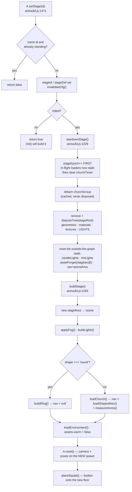
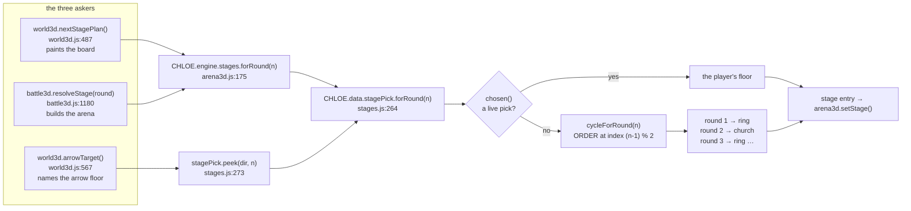

# Stages — The Church and The Ring

A stage is *where the fight happens*: the floor you stand on, what stops you at its edge, how it is lit, and where the two sides start. CHLOE ships two of them — **The Church**, a real 26MB draco-compressed model whose walkable floor was measured out of the actual stone, and **The Ring**, a 14m-radius disc of blank lit floor built at runtime from cylinders and one existing jpg. Every fact about a stage lives in exactly one object in [game/js/data/stages.js](../game/js/data/stages.js); the engine reads the active one through a single accessor and builds the whole world under a single scene node so the whole thing can be thrown away again between rounds. Which stage you get is answered in exactly one function — [`CHLOE.data.stagePick.forRound`](../game/js/data/stages.js:264) — because the room's wall board and the battle entry point both ask, and a wall that promises a floor you do not land on is worse than no board at all.

Related pages: [architecture](architecture.md) · [run-loop](run-loop.md) · [combat](combat.md) · [knight-ai](knight-ai.md) · [world-room](world-room.md) · [data-reference](data-reference.md) · [debugging](debugging.md)

---

## The two floors, measured

Every number below was read out of the source or decoded from the shipped navgrid, not from the spec.

| | The Church | The Ring |
|---|---|---|
| `id` / `shape` | `church` / `'model'` | `ring` / `'round'` |
| geometry | `assets/3d/church.glb` — 25,816,636 bytes, `KHR_draco_mesh_compression` **required**, 35 glTF meshes / **37 primitives** / 33 materials / 27 embedded images / 41 textures. Three splits a multi-primitive mesh into one `Mesh` per primitive, so the scene really carries 37 of them — which is the number the engine's own comments quote | procedural: 1 void plate, 1 floor disc, 3 kerb pieces, 24 pylon meshes |
| new assets | the glb + a 1.65MB HDRI | **none** — `assets/gen/tex/wall.jpg` at two repeats |
| containment | baked navgrid, 0.4m cells ([data/arena-nav.js](../game/js/data/arena-nav.js)) | radius clamp, `nav = null` |
| walkable area | **250.08 m²** (1563 of 3500 cells, decoded) | **615.75 m²** (π·14²) |
| declared `area` (board only) | `250` | `616` |
| footprint | bounds box 17.6 × 16.8 m | disc, 28 m across |
| `arena.radius` | `9.0` — no containment path reaches it while `bounds` exists, but it is not dead: [`buildFallbackChurch`](../game/js/engine/arena3d.js:599) sizes the stand-in nave from it (floor disc `radius + 2` = 11m, apse at `z −10.4`) | `14` |
| `arena.bounds` | `{minX:-9.7, maxX:7.9, minZ:-9.1, maxZ:7.7}` | **`null`**, deliberately |
| `arena.knightMinDist` | `1.3` | `1.3` |
| `arena.colliders` | `[]` | `[]` |
| player spawn | `(-6.0, -5.4)`, yaw `-π/2` | `(-6.5, 0)`, yaw `-π/2` |
| knight spawn | `(5.0, -5.4)` | `(6.5, 0)` |
| spawn separation | **11.00 m** | **13.00 m** |
| `hdri` | `assets/hdri/afrikaans_church_interior_1k.hdr` | **`null`** (a statement, not an omission) |
| `fog` | `0x0d1018`, near 14, far 70 | `0x05060a`, near 18, far 52 |
| lights under `stageRoot` | 8: ambient, moon (shadow-casting), hemisphere fill, altar, key, key2, 2 candles | 8: ambient, moon (shadow-casting), hemisphere fill, key, 4 rim |
| board size line | `18 × 17 m · ~250 m²` | `28 m across · ~616 m²` |

The Ring is roughly **2.5×** the church by walkable area. That ratio is the whole reason it exists: round N fields N knights ([GAME_SPEC.md §20](../GAME_SPEC.md)), and six of them in 250 m² of pillars is a scrum.

---

## `data/stages.js` — the schema, field by field

One entry per stage, keyed by its own `id`. The engine resolves the entry for the round and applies it **before** the arena builds ([data/stages.js:1](../game/js/data/stages.js:1)).

| field | type | who reads it | notes |
|---|---|---|---|
| `id` | string | everything | must equal the table key — [`stagePick.byId`](../game/js/data/stages.js:245) and [`S.get`](../game/js/engine/arena3d.js:171) both index by key, [`applyStage`](../game/js/ui/battle3d.js:1209) verifies against `def.id` |
| `name` | string | the board, the fight log | painted big and shrunk to fit between the arrows by [`fitPx`](../game/js/engine/displays.js:411) |
| `blurb` | string | the board, the fight log | **one line.** [`wrap`](../game/js/engine/displays.js:446) truncates at 3 lines with an ellipsis rather than eating the plan diagram; the fight log prints it whole after the name ([battle3d.js:1282](../game/js/ui/battle3d.js:1282)) |
| `shape` | `'model'` \| `'round'` | [`buildStage`](../game/js/engine/arena3d.js:1269) | the only branch: `'round'` → [`buildRing()`](../game/js/engine/arena3d.js:1327), anything else → [`loadChurch()`](../game/js/engine/arena3d.js:500) |
| `model` | key into `CHLOE.data.arena3d.models`, or `null` | `loadChurch` | the **path** stays in [data/arena3d.js:17](../game/js/data/arena3d.js:17) — a second copy of a file path is a second thing to forget to bump |
| `nav` | `'baked'` \| `null` | documentation only | the engine never reads this field; `nav` is set by the build path itself. It is a statement of intent, and `debug().stage.nav` is the measured truth |
| `playerSpawn` | `{x, z, yaw}` | [`cfgSpawn`](../game/js/engine/arena3d.js:1156) → [`A.reset`](../game/js/engine/arena3d.js:2200) | yaw convention: camera forward is `(-sin yaw, -cos yaw)`, so yaw 0 looks down −Z and **yaw −π/2 looks toward +X** |
| `knightSpawn` | `{x, z}` | [`spawnSquad`](../game/js/engine/arena3d.js:884) | only `x`/`z` are written, over a shallow copy of `data/arena3d.js`'s `knight` block, so `targetHeight`, `name`, the §18 fallback speeds and the whole `brain` survive. (The engine's own comment at [arena3d.js:354](../game/js/engine/arena3d.js:354) also lists `rotY`; no `rotY` key exists in that block today.) |
| `arena` | `{cx, cz, radius, knightMinDist, bounds, colliders}` | [`containPlayer`](../game/js/engine/arena3d.js:2559) / [`containKnight`](../game/js/engine/arena3d.js:2605) | replaced **wholesale**, never key-merged — see the trap below |
| `area` | number, m² | the board's `sizeLine` | cosmetic. The church's `250` is the flood-fill area, *not* the bounds box (~296 m², which counts stone) |
| `hdri` | path or `null` | [`loadEnvironment`](../game/js/engine/arena3d.js:1028) | `null` means "keep whatever probe is resolved", not "clear it" |
| `lights` | see below | [`buildLights`](../game/js/engine/arena3d.js:1085) | replaced wholesale |
| `fog` | `{color, near, far}` | [`applyFog`](../game/js/engine/arena3d.js:1255) | also sets `scene.background` to the same colour |
| `build` | only for `shape:'round'` | [`buildRing`](../game/js/engine/arena3d.js:1327) | read straight off `stageDef`, **not** through the merge |

### What a stage is *not* allowed to own

[`mergeStage`](../game/js/engine/arena3d.js:338) reads exactly six keys off the stage entry — `playerSpawn`, `arena`, `knightSpawn`, `lights`, `fog`, `hdri` — and writes six onto a shallow copy of `CHLOE.data.arena3d` (`knightSpawn` lands as `knight.x`/`knight.z` over a copy of the base `knight` block). Everything else — `models`, `assetVersion`, `church` placement, `eye`, `firstPerson`, the five attack `patterns`, and the entire `knight.brain` — stays in [data/arena3d.js](../game/js/data/arena3d.js) and is identical on both floors. A stage owns *where the fight happens and what it looks like*; it does not get to retune the knight.

The merge is cached and re-cut only when `stageDef` or the underlying data object changes, because [`D()`](../game/js/engine/arena3d.js:317) is called inside the frame loop ([arena3d.js:314](../game/js/engine/arena3d.js:314)).

### The church entry restates, it does not reference

`stages.church` duplicates today's real values out of `data/arena3d.js`: spawns, `arena`, `lights`, `fog`, `hdri`. Deep-compared against `data/arena3d.js` for this page, **all six restated groups are identical** — `playerSpawn`, `knightSpawn` (against `knight.x`/`knight.z`), `arena`, `lights`, `fog`, `hdri`, 53 leaf values in total, no drift anywhere. That is a deliberate duplication with a documented obligation attached ([data/stages.js:11](../game/js/data/stages.js:11)): change one file and not the other and the two disagree about where the player stands, which is a bug rather than a preference. If you edit the church, edit both.

---

## The Church

### The asset

`assets/3d/church.glb` is a real Blender export (`Khronos glTF Blender I/O v4.5.51`) with `KHR_draco_mesh_compression` in **`extensionsRequired`** — without the decoder it does not load at all, it errors. [`makeLoader`](../game/js/engine/arena3d.js:477) attaches a `DRACOLoader` pointed at `vendor/draco/` inside a `try`, and logs `draco unavailable` if that throws; the load then fails and you get the fallback nave instead of the church.

Placement is one transform in [data/arena3d.js:224](../game/js/data/arena3d.js:224):

```
church: { rotY: Math.PI / 2, x: 0, y: 34.04, z: -7.5 }
```

The measured blender probe behind those numbers is recorded at [data/arena3d.js:45](../game/js/data/arena3d.js:45): nave floor at `z = -34.04`, altar chancel toward `+X`, door at `x = -55`, centre aisle `|y| < 1.2`, pew rows from `x <= -9`. The rotate-then-offset maps the blender crossing `(-7.5, 0)` onto the world origin.

Two safety nets sit under the load ([arena3d.js:500](../game/js/engine/arena3d.js:500)):

1. **A 12-second timer.** Draco and network failures can stall without ever calling the error callback, so if nothing has arrived after 12,000ms, [`buildFallbackChurch()`](../game/js/engine/arena3d.js:597) puts up a stone disc, eight columns and a glowing apse. A late-arriving real church removes and disposes it.
2. **An epoch guard.** `root` and `epoch` are captured before the async load ([arena3d.js:526](../game/js/engine/arena3d.js:526)). If a stage switch has bumped `stageEpoch` in the meantime, the parsed gltf is disposed on the spot and its asset slot is settled as `'stale'` — otherwise a church quietly materialises in the middle of the Ring several seconds into the fight.

### The arena is baked from the actual stone (§20)

Before §20, `arena.bounds` was a hand-guessed rectangle that was wrong in both directions: it cut off walkable side aisle *and* let you walk through the rood screen, the altar and the columns. The current constraint is a **precomputed navgrid** flood-filled from the player spawn.

The bake ([`buildNavGrid`](../game/js/engine/arena3d.js:2333)) accepts a cell only if both hold:

- floor within `FLOOR_TOL` = **0.28m** of `y = 0` ([arena3d.js:2357](../game/js/engine/arena3d.js:2357)) — deliberately tight, because the church is full of pews whose seats sit 0.45–0.85m up and a loose tolerance spawns you standing on the furniture;
- a clear **1.7m** head column ([arena3d.js:2358](../game/js/engine/arena3d.js:2358)).

Meshes whose material name matches `/banc/i` (French for *pew*) are excluded from the solid set entirely ([`isPew`](../game/js/engine/arena3d.js:2323)): the rows are thinner than the 0.4m grid, so cell centres land half on seat and half on aisle and the floor comes out speckled.

The bake settled the geometry of the fight. **The nave centre is solid** — decoding the shipped grid, the cell holding world `(0, 0)` (grid index `(24, 34)`) reads 0. Both sides used to spawn inside the rood screen. The arena is really a ring around that block, and the fight now happens in the open band at `z = -5.4`, where the full 11m line between the two spawns is clear (verified against the decoded bitfield: zero blocked cells between `x = -6.0` and `x = 5.0`).

### §22: the benches went, and the box was widened to the measured floor

§22 deleted the bench props outright — `benches`/`bench` left `data/arena3d.js`, and `buildBenches`, `breakBench`, `benchPush`, `benchHit`, `benchDebug` and the `benchSlow` multiplier left the engine. The model's baked pews stay as scenery. `arena.colliders` is `[]` on both stages and there is nothing soft to walk into any more.

At the same time `arena.bounds` was re-authored **from the flood fill instead of by hand**. The old box was `±8.0 / -7.4..7.0`; it clipped 1.7m off the west aisle and 0.7m off the south end of floor you can actually stand on. The current box is the exact bounding rectangle of the 1563 connected walkable cells — decoding `arena-nav.js` gives `minX -9.7, maxX 7.9, minZ -9.1, maxZ 7.7`, which is byte-for-byte what both data files declare.

§22 also loosened the body probe. [`navFree`](../game/js/engine/arena3d.js:2437) used to demand all five sample points open at `RADIUS * 0.8` for **both** bodies; it now demands the centre plus **3 of 4** rim points, each body probing with **its own** radius (`RADIUS` 0.35 for the player, `KNIGHT_RADIUS` 0.55 for the knight). The measured effect on the shipped grid, recorded in the source: all-5 leaves 1319 cells (211 m²), centre+3-of-4 leaves 1539 (246.2 m²) of the 1563 the bake found.

> **Resolution trap** ([arena3d.js:2432](../game/js/engine/arena3d.js:2432)): the baked cell is 0.4m, so any body radius from ~0.2 to ~0.59 samples the *immediate* neighbour cell — the two bodies test the same footprint. Past 0.6 the rim rounds two cells out and skips the neighbour entirely. If a body ever needs a radius that big, probe the intermediate ring; do not just raise the number.

The `-9.1..-8.3` tail of the bounds box is a real artefact and the source calls it out ([data/arena3d.js:58](../game/js/data/arena3d.js:58)). Decoding it confirms the claim exactly: at `z = -9.1` only `x = -3.3` is open, at `z = -8.7` only `x = -3.7` and `-3.3`, at `z = -8.3` only `x = -3.7`, and at `z = -7.9` the row runs unbroken from `-8.1` to `7.9`. It is a one-to-two-cell doorway spur that a 0.35m body cannot enter. The **standable** region really stops at `z = -7.9`, and the extra 0.8m is harmless only because the navgrid, not the box, is the live constraint.

### `data/arena-nav.js` — what it is and how it is encoded

The navgrid is **a data file, not a load-time computation**, and the reason is measured: three r128 ships no BVH, so probing 3500 cells against the church's meshes walks every triangle twice per cell — about 50 seconds of frozen main thread. Baked once, shipped, decoded in under a millisecond.

| field | shipped value | meaning |
|---|---|---|
| `key` | `'6\|0\|34.04\|-7.5\|1.5708'` | `assetVersion \| church.x \| church.y \| church.z \| church.rotY` — pins the grid to the placement it was measured against |
| `cell` | `0.4` | metres per cell |
| `minX` | `-9.7` | world x of grid column 0 |
| `minZ` | `-13.5` | world z of grid row 0 |
| `nx` | `50` | columns → x sampled to `-9.7 + 49·0.4 = 9.9` |
| `nz` | `70` | rows → z sampled to `-13.5 + 69·0.4 = 14.1` |
| `walkable` | `1563` | open cells, of 3500 |
| `b64` | 584 chars | base64 of a 438-byte packed bitfield |

**The encoding.** One bit per cell, LSB-first within each byte. Bit `i` is cell `(i / nz | 0, i % nz)`; `1` means you can stand there. The cell centre is `(minX + i·cell, minZ + j·cell)`. [`loadShippedNav`](../game/js/engine/arena3d.js:4854) does the whole decode in four lines:

```js
var bin = atob(d.b64), n = d.nx * d.nz, out = new Uint8Array(n);
for (var i = 0; i < n; i++) {
  out[i] = (bin.charCodeAt(i >> 3) >> (i & 7)) & 1;
}
```

The bake already flood-filled from the player spawn, so isolated side chapels ship as 0 and never have to be re-filtered at runtime.

Independently decoded for this page: 584 base64 chars → 438 bytes → 3500 cells → **1563 walkable → 250.08 m²**, bounding box `x [-9.7, 7.9] z [-9.1, 7.7]`. Every published figure checks out.

**The key is a stale-data guard, and it is also a foot-gun.** [`navKey()`](../game/js/engine/arena3d.js:4848) rebuilds the string from live config; on mismatch [`loadShippedNav`](../game/js/engine/arena3d.js:4854) logs `baked navgrid key mismatch` and returns `null`, and the church falls back to the bounds rectangle — you can then walk through pillars. Because `assetVersion` is the first component, **bumping `assetVersion` for any glb at all invalidates the church grid**. That has already happened once and the fix is recorded in the data file ([arena-nav.js:28](../game/js/data/arena-nav.js:28)): version 6 added `asteroid.glb`, the church was byte-identical, so only the version half of the key was hand-edited rather than paying for a re-bake.

**To re-bake** ([arena-nav.js:14](../game/js/data/arena-nav.js:14)):

1. open the game, enter the arena, wait for `churchLoaded`;
2. run `JSON.stringify(CHLOE.engine.arena3d._bakeExport())` — the tab freezes for about a minute, which is expected;
3. paste the result over the object in `data/arena-nav.js`.

[`_bakeExport(cell, pad, tol)`](../game/js/engine/arena3d.js:4870) defaults to `cell 0.4` and `pad 5.0` and leaves `tol` to [`buildNavGrid`](../game/js/engine/arena3d.js:2333)'s own `0.28`; it stamps the *current* `navKey()` into the output, so a genuine re-bake never needs the key hand-edited. (Careful: `buildNavGrid`'s own default pad is `3.0` ([arena3d.js:2344](../game/js/engine/arena3d.js:2344)) — only the export tool passes 5.0.)

Note that the shipped grid does **not** correspond to today's `bounds` at any pad. Its sample window is `x [-9.7, 9.9]` × `z [-13.5, 14.1]` — 50 × 70 = 3500 cells; today's box at `pad 5.0` would be `x [-14.7, 12.9]` × `z [-14.1, 12.7]`, i.e. 70 × 68 = **4760** cells, wider in x and shifted in z. It was baked against an earlier `arena.bounds` (the box has since been re-authored from the flood fill), so re-running the export today produces a bigger, differently-placed grid. That is fine; it is also why `walkable` and the bbox should be re-checked against the console line after any re-bake.

### The light rig, and why it was brightened

The rule at the top of both rigs is explicit: **lit for playability, not mood** ([data/arena3d.js:234](../game/js/data/arena3d.js:234), restated at [data/stages.js:68](../game/js/data/stages.js:68)). You have to be able to read the knight's wind-up and your own footing; a church you cannot see is not atmospheric, it is unfair. Two consequences fell out of that:

- **Ambient stays neutral.** `0x6b707c` at 2.0. A purple-blue ambient plus the red altar accent turns grey steel mauve.
- **The altar accent sits behind the knight, not on him.** `altar` is at `z = -9`, `distance` 16, `decay` 1.7 — far enough back that it silhouettes him instead of painting his armour.

| light | colour | intensity | position | distance / decay |
|---|---|---|---|---|
| `ambient` | `0x6b707c` | 2.0 | — | — |
| `moon` (directional, casts shadow) | `0xc2d0e6` | 3.2 | `(6, 12, -4)` | — |
| `altar` (point) | `0xe5173f` | 1.4 | `(0, 2.4, -9)` | 16 / 1.7 |
| `key` (point) | `0xd8e2f2` | 3.4 | `(0, 5.2, 1.5)` | 26 / 1.4 |
| `key2` (point) | `0xbfcbe0` | 2.2 | `(0, 4.6, -4.5)` | 20 / 1.4 |
| `knight` (point, on the knight group) | `0xff2038` | 0.55 | `(0, 0.25, 0)` local | 4.5 / 2 |
| `candles` ×2 | `0xffa050` (engine literal) | 1.6 (engine literal) | `(±3.2, 1.1, 1.5)` | 8 / 2 |

Three things about those numbers that are easy to get wrong:

- **Every intensity is multiplied by `LIGHT_SCALE`**, which becomes `Math.PI` when the renderer supports `physicallyCorrectLights` ([arena3d.js:2160](../game/js/engine/arena3d.js:2160)). The values in data are pre-π.
- **The knight light pools at his feet** (`y = 0.25`), not in his chest. A point light at body height washes the armour pink instead of rimming it ([arena3d.js:633](../game/js/engine/arena3d.js:633)).
- **The candles are flickered every frame** by `updateFx` off the `candleLights` array, which lives *outside* the scene graph and therefore has to be emptied by hand on teardown ([arena3d.js:1154](../game/js/engine/arena3d.js:1154)).

The HDRI (`afrikaans_church_interior_1k.hdr`, Poly Haven, CC0, 1.65MB) goes through `RGBELoader` → `PMREMGenerator` → `scene.environment` ([`loadEnvironment`](../game/js/engine/arena3d.js:1028)), with `ENV_INTENSITY` 1.05 applied to every material that has an `envMapIntensity` slot. Failure just leaves the rig lighting alone.

---

## The Ring

The church's opposite, and blank is the point — **do not decorate it into a second church** ([data/stages.js:87](../game/js/data/stages.js:87)). ~616 m² of clear floor with nothing on it, so six knights are a fight instead of a scrum. Built entirely from primitives and textures already in the repo: no glb, no image generation run, no new asset of any kind.

### The build block

`stages.ring.build` is the whole recipe, read directly by [`buildRing`](../game/js/engine/arena3d.js:1327):

| piece | geometry | numbers | why |
|---|---|---|---|
| `void` | `CylinderGeometry(90, 90, 0.2, 24)` at `y = -0.5`, **`MeshBasicMaterial`** | colour `0x05060a` (= fog colour), radius 90 | unlit on purpose: a standard material catches the key light and turns the edge of the world into a grey table. Basic + fog colour means the floor simply stops having edges. Dropped 0.4m below the disc so it can never z-fight |
| `floor` | `CylinderGeometry(16.5, 16.5, 0.2, 96)` at `y = -0.1` | tex `wall.jpg` repeat 10, colour `0x6d6a66`, roughness 0.95, metalness 0.0 | **top face at y = 0**, so every hit test and probe that assumes ground level still agrees with the church. Reaches past the kerb to 16.5 so the pylons stand on something. 96 segments = 3.75° facets ≈ a 1m chord at this radius |
| `kerb` | two open-ended cylinders (`14.4`, `14.95`) + a `RingGeometry` cap, one shared `DoubleSide` material | height 0.9, 96 segments, tex `wall.jpg` repeat 24, colour `0x4a4744` | three primitives rather than a lathe, because a lathe's winding is easy to get inside-out. **0.9m** is high enough to read as a boundary, never high enough to hide a knight behind |
| `pylons` | 12 × (`CylinderGeometry` post + lamp head) at radius **15.6** | height 2.6, postRadius 0.16, capRadius 0.26; post material `0x1a1a1e` from data, lamp head an engine literal `0x120d08` carrying the data's emissive `0xff6a18` @ 1.6 | the only rotation and distance cues on a blank floor. 12 is a clock face at 30° spacing. They stand **outside the kerb and outside the clamp**, so they cannot be walked into — which is how the Ring keeps its promise of "no colliders but the perimeter" |
| lit pylons | `litEvery: 3`, `litPhase: 0` | posts 0, 3, 6, 9 → the four cardinals | only 4 real `PointLight`s; the other 8 posts are emissive geometry only. Twelve punctual lights would push three r128 into recompiling every material in the scene, and four already tells you which way you are facing |

Phase 0 puts post 0 on `+X`, which is exactly where the knight spawns — so the opening beat of a Ring fight has him backlit ([arena3d.js:1417](../game/js/engine/arena3d.js:1417)).

### Containment: why the Ring needs no bake

`shape: 'round'` sets `nav = null` at the end of `buildRing` ([arena3d.js:1441](../game/js/engine/arena3d.js:1441)) and the stage entry sets `arena.bounds = null`. Both containment functions branch in the same order, and that order is load-bearing:

1. **`nav`** — the baked stone, where it exists. Resolved one axis at a time so you slide along a wall instead of sticking. If both axes are blocked *and* the previous cell was itself illegal, walk out with [`navNearest`](../game/js/engine/arena3d.js:2452) rather than freezing.
2. **`arena.bounds`** — the fallback rectangle. Player inset `RADIUS` (0.35); knight inset a hardcoded 0.5.
3. **`arena.radius`** — the circle. Player clamped to `radius - RADIUS`; knight to `radius - 0.4`.

The Ring runs clause 3, and the spec is explicit that this path must be **exercised, not bypassed** (§24). A second clamp written next to it would be a second clamp to keep in step, and the two would disagree the first time either moved.

So the real geometry of the Ring's edge is:

| body | clamped centre | body edge reaches | kerb inner face | air |
|---|---|---|---|---|
| player (`RADIUS` 0.35) | 13.65 m | 14.00 m | 14.4 m | 0.40 m |
| knight (`KNIGHT_RADIUS` 0.55, inset 0.4) | 13.60 m | 14.15 m | 14.4 m | 0.25 m |

`containKnight` is also the **only** place the knight's containment is decided ([arena3d.js:2592](../game/js/engine/arena3d.js:2592)). It was inline in `updateOneKnight` until §25's Water Wave arrived — a shove is a second thing that moves him without asking the arena, and a containment rule in two copies is a stage contained on one path and not the other.

### The Ring's light rig

Key names are kept **parallel** to the church (`ambient` / `moon` / `key` / `knight`) so one engine path applies either, and this rig simply has no `altar`, `key2` or `candles`.

| light | colour | intensity | position | distance / decay |
|---|---|---|---|---|
| `ambient` | `0x5f6570` | 1.35 | — | — |
| `moon` (directional, casts shadow) | `0xaebdd4` | 1.8 | `(4, 14, -6)` | — |
| `key` (point) | `0xd8e2f2` | 2.8 | `(0, 9.5, 0)` | 40 / 1.15 |
| `rim` (point, **per lit pylon**, ×4) | `0xff7a2a` | 2.4 | `(px, 2.5, pz)` | 22 / 1.25 |
| `knight` (point, on the knight group) | `0xff2038` | 0.55 | `(0, 0.25, 0)` local | 4.5 / 2 |

The reasoning is written into the data and is worth carrying forward:

- **Ambient is near-neutral cool grey.** The rim lights are orange; a colour cast in the ambient on top of that turns black armour muddy brown.
- **A directional does the job a point light cannot** across 28m of floor: even shape, no hot spot in the middle of an empty disc.
- **The rim lights separate the silhouette by hue, not just value.** Orange against a cool floor is what carries a black knight across 14m when there is no scenery behind him. `distance` 22 covers the near half of the disc — it is a rim light, not a second key.
- **`fog.near` 18 is deliberately beyond the play radius.** Nothing inside 14m of you is ever hazed, so the silhouette stays hard-edged where it matters; only the far side of the disc (out to 28m) softens, which is what sells how big the floor is. `far` 52 puts the void past the pylons in full fog colour, so the edge of the world needs no geometry.

### `hdri: null` and the env-clamp

The Ring declares `hdri: null` and that is a statement, not a missing field. A lit church-interior probe over a void reads as a grey dome sitting on the horizon. [`loadEnvironment`](../game/js/engine/arena3d.js:1028) returns early on a falsy path and **keeps whatever probe is already resolved** rather than clearing it — clearing would make the Ring's look depend on which stage you came from.

That leaves a live church probe on the scene while you fight in the Ring, which is why **every lit material `buildRing` creates carries `userData.envClamp = 0.1` and `envMapIntensity = 0.1`**. Three of them — floor, kerb, pylon post — get it from [`ringMaterial`](../game/js/engine/arena3d.js:1316); the lamp head is the exception and sets the same two fields by hand ([arena3d.js:1411](../game/js/engine/arena3d.js:1411)), because it is deliberately *not* built by that helper: it needs its own emissive and has to stay a standard material so it takes fog falloff across 28m. The void plate is the fourth material and needs none of this — a `MeshBasicMaterial` has no `envMapIntensity` slot for [`applyEnvIntensity`](../game/js/engine/arena3d.js:1063) to touch. Without the clamp, `applyEnvIntensity` — which runs when the HDRI resolves, long after the materials were made — flattens this dark floor to white plastic.

> **Trap, and it is subtle.** `data/stages.js` writes `build.envClamp: true`, but the engine assigns `envClamp` a **number**: `applyEnvIntensity` reads the value and puts it straight into `envMapIntensity`, so a literal `true` would set intensity 1 — the exact white-plastic bug the clamp exists to prevent ([arena3d.js:1318](../game/js/engine/arena3d.js:1318)). The data flag means "damp this"; the engine picks the figure. Do not "fix" the engine to honour the boolean.

---

## Building and tearing a stage down

Everything a stage puts in the world hangs off **one** `THREE.Group`, `stageRoot` ([arena3d.js:1181](../game/js/engine/arena3d.js:1181)). That is the entire containment strategy and it is deliberate: *"did I remember to remove the second key light"* is not a question a person can answer reliably three rounds into a run, but *"is `stageRoot`'s parent null"* is.



**What must *not* be in `stageRoot`, and why** ([arena3d.js:1168](../game/js/engine/arena3d.js:1168)):

- the knight groups — they outlive the stage; they are repositioned, not rebuilt;
- the first-person arms, hand sign, tornado, asteroid and the pooled shockwave and wave meshes — all stage-independent VFX, all pre-warmed once, and rebuilding them per stage would re-pay the 444ms upload §21 exists to kill;
- the parsed church glb, which is **cached in `churchGroup` and deliberately never disposed**. It is a 26MB draco glb; re-entering the church after a round in the Ring must not re-download, re-parse, or stall the §21 loading gate a second time. Teardown detaches it; `loadChurch` re-attaches it and re-derives `nav` and `measureArena()` from scratch, because 400 bytes of base64 is cheaper to re-decode than to keep valid across a teardown.

**Four handles leak outside the scene graph** and are reset by hand: `candleLights`, `rimLights`, the navgrid plus its measurement (`nav`, `arenaArea`), and the pending church fallback timer — the source comment counts them as *three*, grouping the two flicker arrays ([arena3d.js:1178](../game/js/engine/arena3d.js:1178)). The timer is cleared at the very top of teardown, immediately after the epoch bump, not with the rest. Leaving `nav` behind is called out as the single nastiest way to get this wrong: the Ring would clamp the player against the *church's* baked floor, and the radius clamp §24 asks for would never run at all ([arena3d.js:1247](../game/js/engine/arena3d.js:1247)).

**`disposeTree` disposes lights too, and that one is not obvious** ([arena3d.js:1189](../game/js/engine/arena3d.js:1189)). A shadow-casting light owns a `WebGLRenderTarget` that three allocates lazily on the first shadow pass; removing it from the graph does *not* free it. `buildLights` makes a fresh `castShadow` moon every stage build, so without the explicit `light.dispose()` a full church → Ring → church cycle leaked exactly one shadow map — `renderer.info.memory.textures` climbing +2 per cycle and never coming back down, while every scene-graph count looked perfectly clean.

**Ring textures are asset-slot accounted.** [`ringTexture`](../game/js/engine/arena3d.js:1294) registers each surface as `stagetex@<epoch>:<key>` and teardown calls `assetForget('stagetex@')` ([arena3d.js:1246](../game/js/engine/arena3d.js:1246)). Without it, `assets.total` grows by two every time the Ring is built and after ten rounds the loading bar is counting textures that were disposed nine rounds ago. `assetForget` deliberately refuses to touch a slot still `'pending'` — that one has an in-flight callback that will settle it, and forgetting it would leave a gate nobody can satisfy.

The verification hook is [`A._stageCount()`](../game/js/engine/arena3d.js:4633): `objects`/`meshes`/`lights` counted off the live scene graph, `sceneChildren` (which must not grow by one group per round), `stageObjects`/`stageLights` under `stageRoot`, `candles`, `rims`, `shocks`, `knights`, `listeners`, `colliders`, `nav`/`navCells`, `churchCached`, `churchAttached`, and `gpu` — `{geometries, textures}` lifted straight off `renderer.info.memory`.

---

## Stage selection — one question, one answer

Three places need to know which floor round *n* is fought on: the room's wall board, the crosshair hint on that board's arrows, and the battle entry point that actually builds the arena. They all resolve to the same function.



### `CHLOE.data.stagePick` — the pure half

Lives in data, next to the stages it indexes, because the order and the cycle should be defined in exactly one place ([stages.js:214](../game/js/data/stages.js:214)).

| member | signature | behaviour |
|---|---|---|
| `order` | `['ring', 'church']` | the cycle, in order |
| `cycleForRound(n)` | → id | 1-based; `Math.floor(n)`, anything junk or `< 1` resolves to round 1 rather than returning `undefined`, because the board paints every round |
| `chosen()` | → id \| `null` | the live pick, **validated**: a stale id — a stage renamed out from under it — returns `null` and falls back to the cycle rather than freezing the run on a floor nothing can build |
| `forRound(n)` | → id | `chosen() \|\| cycleForRound(n)` — **the single question** |
| `peek(dir, n)` | → id | what an arrow *would* give you without taking it. Steps from what the board is currently announcing, so the first click always moves you one off the stage you are looking at, whether that was your pick or the cycle's |
| `choose(id)` | → id \| `null` | records the pick only if the id names a stage that exists |
| `cycle(dir, n)` | → id \| `null` | one arrow click: `choose(peek(dir, n))` |
| `clear()` | → `void` | back to the deterministic cycle. **Nothing in the UI calls this today** — it is what a new run would call if picks were ever made run-scoped |
| `byId(id)` / `stageForRound(n)` | → entry \| `null` | resolved objects rather than ids, for engine callers |

### `CHLOE.engine.stages` — the stateful half

Published from [engine/arena3d.js:157](../game/js/engine/arena3d.js:157), not from a file of its own, and the source states why: `index.html` lists every script by hand, and adding a file nobody wires up is a file that silently never loads. §24 permits "an equivalent named export — state it in the code", and that is the statement.

`order` · `forRound(n)` · `current()` · `next()` · `get(id)` · `apply(id)`. `forRound` trusts `stagePick`'s answer **only if it names a stage that really exists** ([arena3d.js:183](../game/js/engine/arena3d.js:183)) — a typo'd order would otherwise resolve to `undefined` and `setStage` would quietly keep the previous stage for the rest of the run. The source states that every member degrades to `'church'` when `data/stages.js` is missing or partial, because a half-shipped data file must be a church, not a throw; read the code and that is true of `order` (`orderList()` falls back to `['church']`) and therefore of `forRound`, while `current()` answers **`null`** rather than `'church'` when there is no stages table at all ([arena3d.js:189](../game/js/engine/arena3d.js:189)) and `get(id)` answers `null` for anything it cannot resolve. Nothing throws either way, which is the part that matters.

Crucially the selector answers **on a machine with no WebGL too**. `stageId`/`stageDef` and the whole `S` object are declared *above* the `if (!window.THREE) { disableAPI(...); return; }` guard ([arena3d.js:137](../game/js/engine/arena3d.js:137), [arena3d.js:197](../game/js/engine/arena3d.js:197)), and the dead `A.setStage` still *records* the choice ([arena3d.js:128](../game/js/engine/arena3d.js:128)) so the board can say which floor the fight is nominally on rather than painting an empty poster.

### §26: the run opens in the Ring

§24 shipped the cycle as `['church', 'ring']`, so every run opened on the hardest floor to read: pillars, a baked navgrid, a knight who can break line of sight on his first approach. §26 flipped it to `['ring', 'church']` ([stages.js:240](../game/js/data/stages.js:240)).

The reasoning, in one sentence: **a lit blank circle with nothing to hide behind is where the fight is legible** — where you learn a wind-up, a dodge and a lane — and the church, with its pillars and its baked navgrid, is the complication you walk into on round 2, not the thing that has to teach you. The cycle is otherwise unchanged and still deterministic and learnable: round 1 Ring, round 2 church, round 3 Ring.

### §26: the board became a picker

The room's south poster used to *announce* the stage; it now *picks* it. Two arrows either side of the stage name, clicked in-room like the TV.

- **Why the override lives in `stagePick` and not in the engine.** `forRound()` is the single question both the board and the fight already ask, so an override answered there reaches both of them and **cannot** drift into a board promising a floor you do not land on, no matter which of the three repaints last ([stages.js:230](../game/js/data/stages.js:230)).
- **A pick sticks until it is changed.** You set the stage, it stays set; the round cycle only decides while nobody has. The board says which of the two is talking — `YOUR PICK · ◀ ▶ TO CHANGE THE FLOOR` against `◀ ▶ CLICK TO CHOOSE THE FLOOR` ([displays.js:348](../game/js/engine/displays.js:348)) — because a player who chose the church on round 1 must not spend round 5 blaming the round counter.
- **The picture and the hit box are the same numbers.** [`STAGE_ARROWS`](../game/js/engine/displays.js:29) is a table of canvas-normalised 0..1 rects owned by `displays.js` *because `displays.js` paints the arrows*, and exported through [`stageArrows()`](../game/js/engine/displays.js:423) as a **copy** — a caller that reached in and moved a hot spot would move the click target without moving the arrow anybody can see. The room hit-tests the poster's own UV against that table ([world3d.js:541](../game/js/engine/world3d.js:541)), flipping `v` because a `PlaneGeometry`'s `uv.y` grows upward and a canvas' `y` grows down.

  ```js
  left:  { x0: 0.045, y0: 0.150, x1: 0.190, y1: 0.248 },
  right: { x0: 0.810, y0: 0.150, x1: 0.955, y1: 0.248 }
  ```

  Generous on purpose (~13 × 11cm on the 0.85 × 1.15m sheet): they are aimed at down a crosshair from across a room, not clicked with a mouse pointer resting on them. **The middle of the board is not clickable.**
- **Reach and priority.** `BOARD_DIST` is 2.5m ([world3d.js:58](../game/js/engine/world3d.js:58)) — exactly `TV_DIST`, for the TV's reason: a wall panel you can press from across the room is one you press by accident while turning around. The board sits behind the enemy (`ENGAGE_DIST` 3.5) and the TV in both chains, and ahead of the floor pickup in both. It does **not** sit in the same place relative to the §27D giftbox in the two: the click chain tests enemy → TV → **board** → giftbox ([world3d.js:1378](../game/js/engine/world3d.js:1378)), while `updateHover` resolves the giftbox first and only gates the board on `!hovered && !tvHovered` ([world3d.js:1677](../game/js/engine/world3d.js:1677)), so there the order is enemy → TV → giftbox → **board**. Both can therefore report a hover at once in principle; in practice they cannot, because the board hangs at `(-1.4, 2.96)` on the south wall and the box stands at `(1.6, 1.35)` — no single crosshair ray reaches both inside 2.5m and `GIFT_DIST` 3.0. The floor pickup is the one thing gated behind all four ([world3d.js:1686](../game/js/engine/world3d.js:1686)), which is the "one list, one order" the source comment is actually claiming.
- **A click repaints in the same breath** ([`stepStage`](../game/js/engine/world3d.js:578)), behind a 0.25s cooldown. The sheet is the only feedback the press has, so a pick that does not show up immediately reads as a dead button.

The panel is keyed by the prop's `kind` out of [data/room3d.js:100](../game/js/data/room3d.js:100) (`poster_stage`, south wall, `x -1.4, z 2.96`), **never** by its position in the furniture list — the two posters are the same `0.85 × 1.15` sheet with the same fallback `tex`, differing only in which wall they hang on (`poster_knight` west at `x -3.96`, `poster_stage` south at `z 2.96`), so matching on array order would silently swap the dossier and the board the first time somebody reordered that list, and both would still look plausible hanging there.

### What the board actually draws

[`displays.stage(def, round, knightCount)`](../game/js/engine/displays.js:300) paints a 512 × 700 canvas; every argument is optional and it resolves what it is not given (round from `party.state.runStats.round`, stage from `stagePick`, knight count from the round, since round N fields N knights). The plan diagram is drawn from the **same numbers the arena spawns from** — world `+X` to the right, world `+Z` down the page — because a hand-drawn picture would be free to lie about which side you start on ([displays.js:462](../game/js/engine/displays.js:462)). The footer names the containment rule, which is the one thing that changes how the edge behaves: *"The kerb turns you back. There is nothing beyond it."* for `'round'`, *"Stone stops you. Learn where it stands."* for `'model'`.

### Applying it — and verifying that it took

[`applyStage`](../game/js/ui/battle3d.js:1209) runs **before the arena exists** — `begin()` resolves the round, starts `combat3`, builds its own DOM if needed, and then calls it at [battle3d.js:1237](../game/js/ui/battle3d.js:1237) under the comment *"Nothing below this line may run first"*; `a3d.init()` / `a3d.reset()` / `spawnSquad()` are all below it. It tries `setStage(def.id)` and then `setStage(def)` — the argument shape belongs to the arena, and `setStage` accepts both ([arena3d.js:1473](../game/js/engine/arena3d.js:1473)) — and then **reads `debug().stage.id` back** to confirm. A silent mismatch here is exactly the lie the board must never tell; a real one logs `stage "x" did not take — arena reports "y"`.

On the first fight `arena3d` has not been `init`'d, so `setStage` only records the choice and returns `true`; [`init()`](../game/js/engine/arena3d.js:2140) resolves the default from `S.forRound(1)` if nobody called first, and `buildStage()` builds it. On later fights `setStage` tears the previous stage down and rebuilds in place. The arena must **never** be constructed and then re-pointed.

The loading gate copy is stage-aware too ([battle3d.js:1255](../game/js/ui/battle3d.js:1255)): *"Unsealing the church…" / "Lighting the candles…"* against *"Opening The Ring…" / "Lighting the rim…"*. The church string over a bare disc of stone read as a bug the moment §24 gave the run somewhere else to go.

---

## Asset versioning (§17) — why the church looked broken for so long

`CHLOE.data.arena3d.assetVersion` is **6** today ([data/arena3d.js:15](../game/js/data/arena3d.js:15)). Every model and HDRI URL is loaded through [`versioned()`](../game/js/engine/arena3d.js:364), which appends `?v=N`:

```js
return v ? path + (path.indexOf('?') === -1 ? '?v=' : '&v=') + v : path;
```

The history behind it is recorded in both the spec and the data file: a texture/material bug in the church was fixed, the glb was rebuilt — and browsers went on serving the **cached, all-black** church long after the fix shipped. It read as "no textures", so time was spent re-debugging a bug that had already been fixed. Bumping `assetVersion` changes the URL, which forces the refetch.

**Bump it whenever a `.glb` is rebuilt.** And remember the coupling: `assetVersion` is the first component of the navgrid `key`, so bumping it for *any* model invalidates the church grid. Either re-bake (`_bakeExport()` stamps the current key automatically) or, when the church itself is byte-identical, hand-edit the version half of `key` in `data/arena-nav.js` and say so in the comment — which is exactly what was done for version 6.

Note that `versioned()` reads `D().assetVersion`, and `mergeStage` does not overlay `assetVersion`, so the value always comes from `data/arena3d.js` regardless of which stage is standing.

---

## Traps

- **`arena` is replaced wholesale, never key-merged** ([arena3d.js:330](../game/js/engine/arena3d.js:330)). Key-merging would leave the church's `bounds` sitting under the Ring's `radius`, and `containPlayer` prefers `bounds` when present — the circle would come out square. Same reasoning for `colliders`: a stage that declares none must *get* none. The one exception is `knightMinDist`, which describes the knight's body rather than the room and falls back to the base value ([arena3d.js:347](../game/js/engine/arena3d.js:347)).
- **`bounds: null` on the Ring is load-bearing, not tidiness.** Delete the key and the merge still produces an `arena` without it, but writing it explicitly is what documents the intent to any reader — and to any future engine that prefers `bounds` when present.
- **`hdri: null` means "keep", not "clear".** `mergeStage` tests for the *key* with `hasOwnProperty`, not for a truthy value ([arena3d.js:360](../game/js/engine/arena3d.js:360)), and `loadEnvironment` returns early rather than nulling `scene.environment`.
- **`build.envClamp: true` is a flag; the engine writes the number.** See the Ring section — a boolean assigned straight to `envMapIntensity` is the white-plastic bug.
- **The hemisphere `fill` light is unconditional.** [`buildLights`](../game/js/engine/arena3d.js:1085) adds `HemisphereLight(0x8092c0, 0x241c1e, 0.9 × LIGHT_SCALE)` on *every* stage ([arena3d.js:1108](../game/js/engine/arena3d.js:1108)), and neither stage declares a `fill` block. `altar`, `key`, `key2` and `candles` are opt-in; `ambient`, `moon` and `fill` are not. So the Ring is lit by a light its own rig does not mention. That was a deliberate call — it keeps the church's look unchanged to the pixel — but a rig author reading `data/stages.js` alone will not see it.
- **`spawnSquad` uses `!= null`, not `||`** ([arena3d.js:934](../game/js/engine/arena3d.js:934)). The church spawns at `z -5.4` so `0 || 5.4` never fired, but the Ring puts the knight on `z 0` — and `0 || 5.4` is `5.4`, so the whole squad would have fanned 5.4m off the stage's own spawn line. A legitimate zero coordinate is exactly what a centred stage has.
- **Order matters in `setStage`** ([arena3d.js:1490](../game/js/engine/arena3d.js:1490)): `A.reset()` reads the new spawn out of the refreshed config and puts the camera and every knight's pose back, *then* `placeSquad()` walks the bodies onto the new floor. The other way round leaves them facing the old stage's player position.
- **`stageEpoch` is bumped first in teardown**, not last ([arena3d.js:1233](../game/js/engine/arena3d.js:1233)). Anything still on the wire is stale from the moment we *decide* to tear down, not from the moment we finish.
- **`debug().stage.nav` distinguishes design from bug** ([arena3d.js:4602](../game/js/engine/arena3d.js:4602)). `nav: false` on a `'round'` stage is the whole design — the radius clamp is doing the work. `nav: false` on a `'model'` stage means the bake key failed to match and you can walk through pillars. Only the clamp actually in play is reported, so the field cannot claim a rectangle the engine is ignoring.
- **`churchGroup` is never disposed, on purpose.** If you add a code path that disposes it, re-entering the church costs a fresh 26MB download and a full draco parse behind the loading gate.

---

## Where the spec and the code disagree

The code wins in all of these. Recorded so a reader of `GAME_SPEC.md` is not misled.

| claim | spec says | code says |
|---|---|---|
| church spawns | §20: "player at `(-6.0, 5.4)` … knights across the band at `(4.0, 5.4)`" | `playerSpawn (-6.0, **-5.4**)`, `knight (**5.0**, -5.4)` — [data/arena3d.js:84](../game/js/data/arena3d.js:84). Both `z` signs and the knight's `x` differ; 11.00m apart, verified against the decoded grid |
| which part of the church | §20 calls it the "open south band" | [data/arena3d.js:75](../game/js/data/arena3d.js:75) calls the same place the "north transept". Same coordinates, two names |
| stage order default | §24: `order` default `['church','ring']` | `['ring','church']` — superseded by §26 and correctly implemented at [stages.js:240](../game/js/data/stages.js:240) |
| navgrid size | [arena3d.js:4845](../game/js/engine/arena3d.js:4845) comment: "2.4k cells cost ~400 bytes" | decoded: **3500 cells, 438 bytes, 584 base64 chars**. `data/arena-nav.js`'s own "~580 chars" is right |
| church mesh count | comments in [arena3d.js:572](../game/js/engine/arena3d.js:572), [arena-nav.js:5](../game/js/data/arena-nav.js:5) and [GAME_SPEC.md §20](../GAME_SPEC.md) say "37 church meshes" | **they are right, and the glb's own header is the misleading number.** The glTF declares 35 `meshes` / 35 nodes / 33 materials / 27 images / 41 textures, but those 35 meshes hold **37 primitives**, and `GLTFLoader` emits one `THREE.Mesh` per primitive. `buildNavGrid`'s `scene.traverse(o.isMesh)` therefore walks 37 objects |
| pylon spacing | [stages.js:191](../game/js/data/stages.js:191): "~7.3m apart along the rim" | 7.33m is the spacing at the **arena** radius 14. The pylons stand at 15.6, where 12 posts are **8.17m** apart by arc (8.07m chord). The 12-count reasoning is unaffected |
| Ring clamp radius | [stages.js:113](../game/js/data/stages.js:113): "radius 14 is the clamp on BODY CENTRES" | `containPlayer` clamps centres at `radius - RADIUS` = **13.65m** ([arena3d.js:2584](../game/js/engine/arena3d.js:2584)). The described *outcome* (~0.4m of air at the kerb) is right; the mechanism is off by one body radius |
| Ring plan diagram | — | [`drawRoundPlan`](../game/js/engine/displays.js:489) lights posts on `i % every === 0`, ignoring `build.pylons.litPhase`. Correct today only because `litPhase` is `0`; change the phase and the board's picture stops matching the floor |

---

## Where to change what

| task | file | what to touch |
|---|---|---|
| Add a third stage | [game/js/data/stages.js](../game/js/data/stages.js) | new entry in `CHLOE.data.stages` + add its id to `ORDER` at [stages.js:240](../game/js/data/stages.js:240). Nothing else — `orderList()`, the board and the picker all read from there |
| Change which floor round 1 opens on | [game/js/data/stages.js:240](../game/js/data/stages.js:240) | reorder `ORDER` |
| Move a spawn | [game/js/data/stages.js](../game/js/data/stages.js) **and** [game/js/data/arena3d.js](../game/js/data/arena3d.js) | for the church, both files (`playerSpawn` / `knightSpawn` vs `playerSpawn` / `knight.x,z`). For the Ring, `stages.js` only. Re-verify against the navgrid with `arena3d._probeAt(x, z)` |
| Retune the Ring's floor, kerb, pylons or void | [game/js/data/stages.js:173](../game/js/data/stages.js:173) | the `build` block. `buildRing` reads every value with a fallback, so a partial edit degrades rather than throws |
| Change where the Ring's edge stops you | [game/js/data/stages.js:121](../game/js/data/stages.js:121) | `arena.radius`. Then move `build.kerb.inner` to match, or the wall and the wall you hit diverge |
| Relight a stage | [game/js/data/stages.js](../game/js/data/stages.js) `lights` block | remember `LIGHT_SCALE` (π) and that `ambient`/`moon`/`fill` are unconditional while `altar`/`key`/`key2`/`candles`/`rim` are opt-in |
| Change the fog or sky colour | [game/js/data/stages.js](../game/js/data/stages.js) `fog` | [`applyFog`](../game/js/engine/arena3d.js:1255) also drives `scene.background` from `fog.color` |
| Rebuild or replace `church.glb` | [game/js/data/arena3d.js:15](../game/js/data/arena3d.js:15) then [game/js/data/arena-nav.js](../game/js/data/arena-nav.js) | bump `assetVersion`, then **re-bake**: `JSON.stringify(CHLOE.engine.arena3d._bakeExport())` and paste over the object |
| Move the church in the world | [game/js/data/arena3d.js:224](../game/js/data/arena3d.js:224) | `church.rotY/x/y/z` — this changes `navKey()`, so the grid **must** be re-baked or containment silently falls back to the rectangle |
| Widen the church's walkable floor | re-bake, then [game/js/data/arena3d.js:64](../game/js/data/arena3d.js:64) + [game/js/data/stages.js:54](../game/js/data/stages.js:54) | author `bounds` from the flood fill (`debug().arenaArea`), never by hand |
| Loosen or tighten the body probe | [game/js/engine/arena3d.js:2437](../game/js/engine/arena3d.js:2437) | `navFree` — read the 0.4m-cell resolution note first |
| Change what stops the knight at the edge | [game/js/engine/arena3d.js:2605](../game/js/engine/arena3d.js:2605) | `containKnight` is the **only** place; §25's shove goes through it too |
| Change what stops the player | [game/js/engine/arena3d.js:2559](../game/js/engine/arena3d.js:2559) | `containPlayer`; keep the branch order in step with `containKnight` |
| Add a field the engine reads off a stage | [game/js/engine/arena3d.js:338](../game/js/engine/arena3d.js:338) | `mergeStage` — it is an allow-list, so a new key is ignored until you add it |
| Redesign the stage board canvas | [game/js/engine/displays.js:300](../game/js/engine/displays.js:300) | `stage()`, plus [`plan`](../game/js/engine/displays.js:466) / [`drawRoundPlan`](../game/js/engine/displays.js:489) / [`drawNavePlan`](../game/js/engine/displays.js:515) |
| Move the picker arrows | [game/js/engine/displays.js:29](../game/js/engine/displays.js:29) | `STAGE_ARROWS` only. The room hit-tests through `stageArrows()`; nothing else may hard-code a position |
| Change the board's reach or click priority | [game/js/engine/world3d.js:58](../game/js/engine/world3d.js:58), [world3d.js:1378](../game/js/engine/world3d.js:1378), [world3d.js:1678](../game/js/engine/world3d.js:1678) | `BOARD_DIST`, and keep the hover chain and the click chain in the same order |
| Move which wall the board hangs on | [game/js/data/room3d.js:100](../game/js/data/room3d.js:100) | the `poster_stage` prop. Match on `kind`, never on array index |
| Change how the fight resolves its stage | [game/js/ui/battle3d.js:1180](../game/js/ui/battle3d.js:1180) | `resolveStage` — and keep [world3d.nextStagePlan](../game/js/engine/world3d.js:487) in step, or the wall lies |
