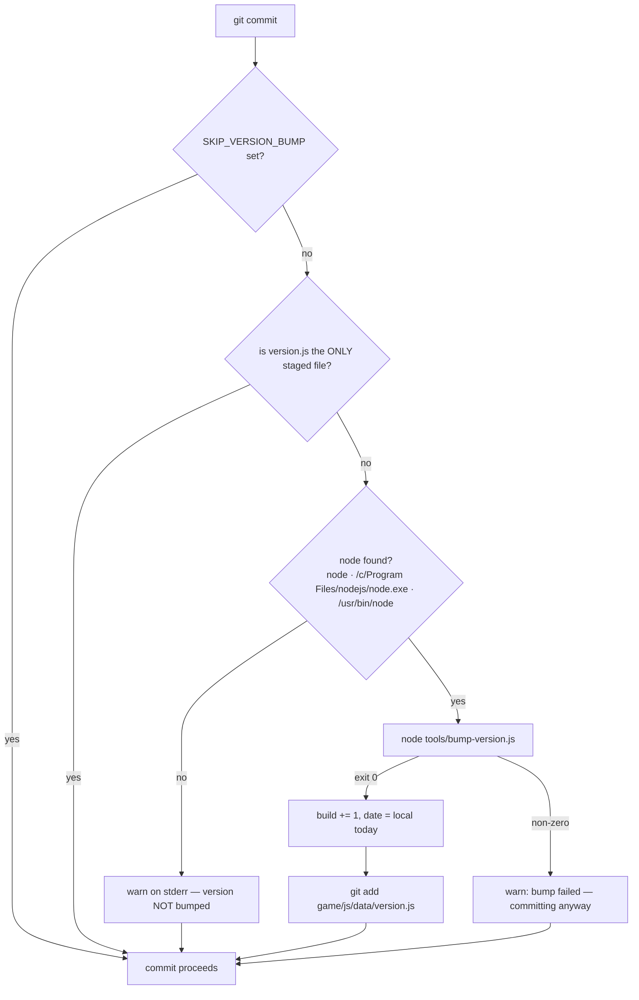
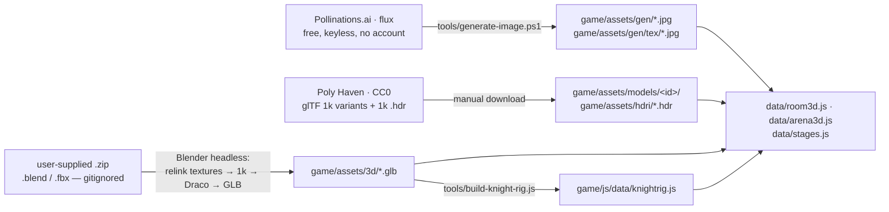

# Tooling, Assets & Deployment

Everything in this repo that is not game code. CHLOE has no build step, no `package.json`, and no
dependencies to install — the game is classic `<script>` tags over a hand-ordered list in
[game/index.html](../game/index.html), so "building" it means copying files to a web server. What
lives outside `game/js/` instead is a small set of one-job scripts: a dev server (two of them), a
version bumper wired into a git hook, three asset acquisition routes that all end in
`game/assets/`, a code generator for the knight's skeleton, and a Cloudflare Worker that the game
optionally talks to and currently does not. This page covers each of them, what they promise, and
where they quietly do not.

Sibling pages: [architecture](architecture.md) · [run-loop](run-loop.md) · [combat](combat.md) ·
[knight-ai](knight-ai.md) · [knight-levels](knight-levels.md) ·
[difficulty-scaling](difficulty-scaling.md) · [knight-rig](knight-rig.md) ·
[progression](progression.md) · [world-room](world-room.md) · [stages](stages.md) ·
[data-reference](data-reference.md) · [debugging](debugging.md).

---

## 1. Running it locally

### You need a real server. `file://` runs, but it runs wrong.

[GAME_SPEC.md §1](../GAME_SPEC.md:9) states the rule that everything must work opened from `file://`,
and §16 restates it as a hard requirement that asset loading *degrade gracefully*
([GAME_SPEC.md:266](../GAME_SPEC.md:266)). Both are honoured — the game never crashes and every fight
stays playable — but the browser's file-origin rules block the GLB, glTF and HDR loads, so what you
get is the fallback game, not the game.

| Asset | Served over `http://` | Opened from `file://` |
|---|---|---|
| `church.glb` (25.8 MB, Draco) | the real nave | `buildFallbackChurch()` — a cylinder floor of radius `arena.radius + 2` and 8 ring columns ([engine/arena3d.js:597](../game/js/engine/arena3d.js:597)) |
| `knight.glb` (6.6 MB, 103 meshes) | the plate-armour knight | `buildFallbackKnight()` — a box torso/legs/helm totem with a red bar for an eye ([engine/arena3d.js:714](../game/js/engine/arena3d.js:714)) |
| Poly Haven furniture `.gltf` | real sofa/TV/lamp/vanity/chair/clutter | per-item `fail()` → `buildPiece()` textured-box placeholder; the collider stays the placeholder AABB ([engine/world3d.js:379](../game/js/engine/world3d.js:379)) |
| HDRI (`.hdr` → PMREM) | image-based lighting | `envMapOk = false`, room lit by the light rig alone ([engine/world3d.js:310](../game/js/engine/world3d.js:310)) |
| generated `.jpg` textures | mapped onto walls/floor/props | some browsers let the `` load and then throw `SecurityError` at GL upload; the first render throw sets `renderFailed` and `stripMaps()` strips every map back to flat colours, once ([engine/world3d.js:1320](../game/js/engine/world3d.js:1320), [engine/world3d.js:179](../game/js/engine/world3d.js:179)) |

**Trap:** the church has a 12-second fallback timer
([engine/arena3d.js:530](../game/js/engine/arena3d.js:530)) — if nothing has arrived by then it builds
the fallback nave so the arena is never a void, and removes it again if the real church shows up
late ([:565](../game/js/engine/arena3d.js:565)). The knight carries the identical 12-second stall timer
([:686](../game/js/engine/arena3d.js:686)), and a late-arriving `knight.glb` likewise tears the totem
down — model **and** rig root, or the totem would be left standing inside him
([:696](../game/js/engine/arena3d.js:696)). So a slow *network* also produces the cylinder-and-columns
arena, and the box totem, for a moment. Seeing either fallback is not proof you are on `file://`.

### `dev.ps1` — the one for humans

[dev.ps1](../dev.ps1) serves the repo root on port 8080 and prints the URL. It prefers `npx
http-server`, falls back to Python, and gives up with an install hint if it finds neither.

| Line | What it does |
|---|---|
| [dev.ps1:3](../dev.ps1:3) | `$port = 8080` — the only knob |
| [dev.ps1:7](../dev.ps1:7) | if `npx` is not on `PATH`, tries `$env:ProgramFiles\nodejs\npx.cmd` directly |
| [dev.ps1:9](../dev.ps1:9) | `npx --yes http-server -p 8080 -c-1 $here` — `-c-1` disables caching, which is what stops you debugging yesterday's JS |
| [dev.ps1:12](../dev.ps1:12) | else `python -m http.server 8080` |

Landing page at `http://localhost:8080/`, game at `http://localhost:8080/game/`.

### `tools/devserver.js` — the one for agents and harnesses

[tools/devserver.js](../tools/devserver.js) is a ~30-line dependency-free `http` server. Its header
says exactly why it exists next to `dev.ps1`: *automated/browser harnesses run without npx on PATH
and still need the game served over `http://`*.

```
node tools/devserver.js [port]      # default 8080 -> http://localhost:8080/game/
```

- Root is the repo root, resolved from `__dirname/..` ([tools/devserver.js:8](../tools/devserver.js:8)).
- Only a path ending in `/` gets `index.html` appended ([tools/devserver.js:16](../tools/devserver.js:16)).
  `/game` without the slash is joined as a file, `fs.readFile` fails on the directory, and you get a
  bare `404` — there is no redirect to `/game/`, and no directory listings. Anything else unreadable
  is a `404` too.
- Every response carries `Cache-Control: no-cache` ([tools/devserver.js:23](../tools/devserver.js:23)).
- MIME table covers `.html .js .css .json .glb .hdr .png .jpg .svg .mp3 .wav .webp .ico`; everything
  else falls through to `application/octet-stream`.

**Two things the MIME table omits, and why neither breaks:** `.gltf` / `.bin` (the Poly Haven room
models) and `.wasm` (the Draco decoder). `GLTFLoader` parses by content, not by content-type — it
requests everything as an `arraybuffer` and branches on the four-byte `glTF` magic
([vendor/GLTFLoader.js:175](../game/vendor/GLTFLoader.js:175)) — and
`DRACOLoader` fetches `draco_decoder.wasm` with `responseType: 'arraybuffer'` and hands it over as
`wasmBinary` ([vendor/DRACOLoader.js:234](../game/vendor/DRACOLoader.js:234)) rather than using
`WebAssembly.instantiateStreaming`, which is the API that would have demanded `application/wasm`.
Serve this repo from a stricter server and that stays true; swap the vendored loader for a newer
one and re-check it.

**Trap (real, minor):** the traversal guard is a string prefix test —
`if (file.indexOf(root) !== 0) 403` ([tools/devserver.js:19](../tools/devserver.js:19)). `path.join`
normalises `..` away, so `/../secrets/x` cannot escape, but a *sibling directory whose name starts
with the repo folder's name* does pass: with the repo at `…\Desktop\Chloe`, a request for
`/../Chloe-secret/x.txt` resolves to `…\Desktop\Chloe-secret\x.txt`, whose path still begins with
`…\Desktop\Chloe`. Verified against the real `path.join`. It is a local dev server bound to
`localhost`, so the blast radius is small — but if you ever expose it, compare against `root +
path.sep`.

---

## 2. Versioning

### `game/js/data/version.js` is the single source of truth

One object, three numbers, two helper methods
([game/js/data/version.js:18](../game/js/data/version.js:18)):

| Field | Line | Current | Rule |
|---|---|---|---|
| `major` | [:19](../game/js/data/version.js:19) | `0` | stays 0 until the game is called finished |
| `minor` | [:20](../game/js/data/version.js:20) | `30` | **tracks the `GAME_SPEC.md` section this build implements** — `v0.23.x` *is* "the game as of §23" |
| `build` | [:21](../game/js/data/version.js:21) | `2` | +1 on every push; never reset except by a minor bump |
| `label` | [:22](../game/js/data/version.js:22) | `'Seniority'` | prose, the drop's name — the one field meant to be hand-edited |
| `date` | [:23](../game/js/data/version.js:23) | `'2026-08-25'` | stamped by the bumper, **local date not UTC** ([tools/bump-version.js:58](../tools/bump-version.js:58)) — a build made at 01:00 CEST showing "yesterday" reads as stale even though it is minutes old |

`string()` returns `v0.30.2` ([game/js/data/version.js:27](../game/js/data/version.js:27)); `full()`
appends `— Seniority` ([:28](../game/js/data/version.js:28)). They are kept as *methods*, not a baked
string, precisely so the bumper only ever rewrites the field lines it owns and can never corrupt the
display logic. Those lines are **four**, not three: `minor`, `build` and `date` on every run, plus
`label` when `--label` is passed. The comment in `version.js` itself says the bumper "only ever
rewrites the three numeric lines it owns" ([:25](../game/js/data/version.js:25)) — that undercounts:
`date` and `label` are string fields and `setStr()` rewrites them the same way
([tools/bump-version.js:34](../tools/bump-version.js:34), [:63](../tools/bump-version.js:63),
[:66](../tools/bump-version.js:66)). Nothing breaks, but do not read that comment as a guarantee that
`date` survives a bump untouched — it does not.

Three consumers, all read-only:

1. Title screen — `CHLOE.data.version.full()` ([ui/title.js:33](../game/js/ui/title.js:33)).
2. In-game menu ([ui/menu.js:62](../game/js/ui/menu.js:62)).
3. The record board's `patch` field — `version.string()`, falling back to `'?'` if the object is
   missing ([engine/records.js:127](../game/js/engine/records.js:127)). This is why a version that lies
   about being new also puts a lie on the leaderboard.

`version.js` is loaded second in the script list, right after `config.js`
([game/index.html:31](../game/index.html:31)).

> **Not the same number:** `CHLOE.data.config.version` is `2`
> ([game/js/data/config.js:5](../game/js/data/config.js:5)) — a config *schema* version, unrelated to
> the displayed build. And `CHLOE.data.arena3d.assetVersion` is `6`
> ([game/js/data/arena3d.js:15](../game/js/data/arena3d.js:15)) — the GLB cache-buster (§3 below).
> Three independent counters; do not sync them.

### `tools/bump-version.js`

```
node tools/bump-version.js                 bump build            (every push)
node tools/bump-version.js --minor 24      new spec section: minor=24, build=0
node tools/bump-version.js --label "Name"  rename the drop
node tools/bump-version.js --print         show the version, change nothing
```

It rewrites **only** the `minor:`, `build:`, `date:` and `label:` lines by targeted regex, never by
reserialising the file — so the comment block and the `string()`/`full()` helpers cannot be
clobbered ([tools/bump-version.js:11](../tools/bump-version.js:11)). It exits non-zero if a field it
was asked to change is not found, on the stated reasoning that a silent no-op here means shipping a
build whose version lies about being new
([tools/bump-version.js:31](../tools/bump-version.js:31), [:36](../tools/bump-version.js:36)).

Behaviours worth knowing:

- `--minor N` sets `build = 0` — a new spec section restarts the build count ([:51](../tools/bump-version.js:51)); a plain run is `build += 1` ([:53](../tools/bump-version.js:53)).
- `--print` runs *after* the fields are read but *before* any mutation, and `exit(0)`s ([:45](../tools/bump-version.js:45)).
- `flag()` is positional: `--minor` with no following argument yields `''` and the script **silently
  falls through to a plain build bump** ([:47](../tools/bump-version.js:47)). Same for a bare `--label`.
- `--label` strips single quotes out of the value before writing (the field is a `'…'` literal).
- On success it prints the new version to stdout — the hook captures that string for its message.

### The pre-commit hook

[tools/hooks/pre-commit](../tools/hooks/pre-commit) exists because *the version is a promise to the
player that what they are looking at changed, so it must not depend on anyone remembering to bump
it*. Enable it **once per clone**:

```bash
git config core.hooksPath tools/hooks
```



Every path exits `0`. **The hook never blocks a commit** — a broken hook must not hold the repo
hostage ([tools/hooks/pre-commit:11](../tools/hooks/pre-commit:11)). Three details are load-bearing:

1. **`SKIP_VERSION_BUMP=1 git commit …`** skips one commit
   ([tools/hooks/pre-commit:13](../tools/hooks/pre-commit:13)). That syntax is POSIX; from PowerShell
   it is `$env:SKIP_VERSION_BUMP=1; git commit …` (and remember to clear it afterwards — it persists
   for the session).
2. **The self-commit guard.** If `git diff --cached --name-only` is *exactly*
   `game/js/data/version.js`, the hook exits without bumping
   ([tools/hooks/pre-commit:18](../tools/hooks/pre-commit:18)) — that is the bumper's own commit, or a
   hand edit to the label, and without the guard an amend would loop.
3. **Node is searched in three places**, `node` on `PATH` first, then
   `/c/Program Files/nodejs/node.exe`, then `/usr/bin/node`
   ([tools/hooks/pre-commit:20](../tools/hooks/pre-commit:20)). This machine's Node is off-`PATH` from
   git bash, which is why the Windows path is hard-coded — see [debugging](debugging.md).

**Portability trap:** `tools/hooks/pre-commit` is committed with mode `100644`, not `100755`
(`git ls-files -s tools/hooks/pre-commit`). Git for Windows ignores the executable bit and runs the
hook through its bundled `sh`, so it works here; on Linux or macOS git will *skip* a non-executable
hook and the build number will silently stop moving. `git update-index --chmod=+x
tools/hooks/pre-commit` is the fix if the repo ever grows a non-Windows contributor. (The blob
itself is stored LF and this clone has `core.autocrlf=true`, so the CRLF you see in the working tree
is not committed and is not a problem.)

---

## 3. Asset pipelines

Three routes in, one destination. Nothing here runs at build time — every product is committed.



### 3a. Generated images — Pollinations

[tools/generate-image.ps1](../tools/generate-image.ps1) hits `https://image.pollinations.ai/prompt/…`
with `model=flux&nologo=true`. Free, keyless, no account; 20–60 s per image
([tools/IMAGEGEN.md](../tools/IMAGEGEN.md)).

```powershell
powershell -File tools\generate-image.ps1 -prompt "<house prefix + subject>" `
    -out "game\assets\gen\<name>.jpg" -w 768 -h 768
```

| Detail | Value | Source |
|---|---|---|
| Default size | 768 × 768 | [generate-image.ps1:8](../tools/generate-image.ps1:8) |
| Prompt encoding | `[uri]::EscapeDataString` | [generate-image.ps1:20](../tools/generate-image.ps1:20) |
| Retries | 3 | [generate-image.ps1:26](../tools/generate-image.ps1:26) |
| Success test | file exists **and** > 20 KB | [generate-image.ps1:37](../tools/generate-image.ps1:37) |
| Request timeout | 120 s (`-TimeoutSec 120`), TLS 1.2 forced for PS 5.1 | [generate-image.ps1:32](../tools/generate-image.ps1:32), [:24](../tools/generate-image.ps1:24) |
| Failure | undersized file deleted, then `Write-Error` + `exit 1` | [generate-image.ps1:45](../tools/generate-image.ps1:45), [:50](../tools/generate-image.ps1:50) |

The >20 KB gate is the important part, and the reason it is written down rather than guessed at:
[tools/IMAGEGEN.md:20](../tools/IMAGEGEN.md:20) records that small files "indicate an error page or
truncated download". The script never looks inside the body — size is the only evidence it has —
so without the gate a failure lands on disk with a `.jpg` extension and renders as a broken texture.

**House style** — prefix every prompt, or the art will not match:
`photorealistic cinematic still, dark nightclub corridor lit deep red, film grain, horror
ambience,` then the subject. The endpoint is non-deterministic: the same prompt gives a different
image every call, so "re-run with a reworded subject" is the whole retry strategy.

What the **Room3D** run produced, and what each file is for, is recorded in
[tools/room3d-assets.json](../tools/room3d-assets.json) — 8 room textures plus the enemy billboard:

| File | Use | Size |
|---|---|---|
| `gen/tex/carpet.jpg` | floor tiling (dark red worn carpet, top-down) | 512² |
| `gen/tex/wall.jpg` | wall tiling (padded deep-red club panels) | 512² |
| `gen/tex/ceiling.jpg` | ceiling tiling (dark speckled acoustic tile) | 512² |
| `gen/tex/couch.jpg` | couch upholstery tiling | 512² |
| `gen/tex/door.jpg` | door prop, non-tiling | 512×768 |
| `gen/tex/mirror.jpg` | dead cracked vanity mirror plane, slight emissive | 512×768 |
| `gen/tex/tv_static.jpg` | TV static, seamless, animated by offset cycling | 512² |
| `gen/tex/poster.jpg` | grungy gig poster plane, non-tiling | 512×768 |
| `gen/enemy-hollow-sprite.jpg` | `the_hollow` billboard for the luminance-key shader (**discard lum < 0.09**) | 768² |

That last row is a contract, not a note: the sprite's near-black background is what the shader keys
out — the billboard's fragment shader is literally `if (lum < 0.09) discard;`, with a
`smoothstep(0.09, 0.25, lum)` alpha ramp above it ([engine/world3d.js:999](../game/js/engine/world3d.js:999))
— and the soft glow around the figure is deliberate. Regenerate it brighter and the ghost gets a
black rectangle around it.

> **That JSON is not an index of `game/assets/gen/`.** Six more Pollinations products sit beside
> those nine with no row in any manifest: the five 2D enemy portraits
> (`enemy-the-hollow.jpg`, `enemy-neon-wisp.jpg`, `enemy-static-ghoul.jpg`, `enemy-mirror-shade.jpg`,
> `enemy-promoter.jpg`) referenced from [data/enemies.js:24](../game/js/data/enemies.js:24) onward — and
> `enemy-the-hollow.jpg` again as the room's billboard fallback
> ([data/room3d.js:42](../game/js/data/room3d.js:42)) — plus `room-dressing.jpg`, the 2D dressing-room
> background ([data/scenes.js:21](../game/js/data/scenes.js:21)). That last one is the subject of the one
> `tools/` file this page would otherwise not mention: [tools/room-manifest.json](../tools/room-manifest.json),
> which stores its `bg` path and nine percent-coordinate clickable hotspots for the (unrouted) 2D room.

### 3b. Poly Haven — CC0 models and HDRIs

Downloaded by hand (Sketchfab requires OAuth-gated downloads, so it was ruled out —
[GAME_SPEC.md:221](../GAME_SPEC.md:221)), as glTF **1k-texture** variants, preserving relative paths
into `game/assets/models/<canonical id>/`. The canonical ids are fixed and the engine addresses
models by them.

| id | Asset | Entry file | On disk | Real dims (m, Blender axes, z = height) |
|---|---|---|---|---|
| `sofa` | Sofa 01 | `models/sofa/Sofa_01_1k.gltf` | 506 KB | 1.571 × 0.658 × 0.797 |
| `tv` | Television 01 | `models/tv/Television_01_1k.gltf` | 519 KB | 0.600 × 0.471 × 0.457 |
| `lamp` | Desk Lamp Arm 01 | `models/lamp/desk_lamp_arm_01_1k.gltf` | 2809 KB | 0.617 × 0.408 × 0.879 |
| `vanity` | Classic Console 01 | `models/vanity/ClassicConsole_01_1k.gltf` | 723 KB | 1.543 × 0.589 × 0.949 |
| `chair` | Painted Wooden Chair 01 | `models/chair/painted_wooden_chair_01_1k.gltf` | 481 KB | 0.432 × 0.540 × 0.956 |
| `clutter1` | Cassette Player | `models/clutter1/cassette_player_1k.gltf` | 923 KB | 0.129 × 0.049 × 0.237 |
| `clutter2` | Wine Bottles 01 | `models/clutter2/wine_bottles_01_1k.gltf` | 3818 KB | 0.676 × 0.081 × 0.331 |
| `hdri` | Creepy Bathroom | `hdri/creepy_bathroom_1k.hdr` | 1601 KB | — |

Source of truth: [tools/model-manifest.json](../tools/model-manifest.json) (`totalKB: 11380`), with
authors and licence rows in [tools/ATTRIBUTIONS.md](../tools/ATTRIBUTIONS.md). All CC0 1.0 — attribution
is not required and is given anyway. `realDims` are Poly Haven's stated dimensions converted mm→m;
`data/room3d.js` scales each model to a target height rather than trusting them blind, and its
comment records that the paths were verified against `entryFile`
([game/js/data/room3d.js:45](../game/js/data/room3d.js:45)).

> **Gap — the arena HDRI is not in either file.** `game/assets/hdri/afrikaans_church_interior_1k.hdr`
> (1.65 MB) is loaded by the church arena
> ([game/js/data/arena3d.js:43](../game/js/data/arena3d.js:43),
> [game/js/data/stages.js:66](../game/js/data/stages.js:66)) but appears in neither
> `tools/model-manifest.json` nor `tools/ATTRIBUTIONS.md`, both of which list only
> `creepy_bathroom`. The manifest is therefore incomplete for the shipped game. Add the row when you
> next touch attributions.

### 3c. Blender headless — the church, the knight, the spell props

`game/assets/3d/*.glb` did not come from a manifest. They were converted from user-supplied source
archives with Blender LTS (installed via winget — [ROADMAP.md:10](../ROADMAP.md:10)) running headless,
in four steps: **relink textures → downscale to 1k → Draco-compress → export GLB**. Treat those four
steps as a reconstruction, not as a documented procedure: the only part written down anywhere is the
end state, at [GAME_SPEC.md:264](../GAME_SPEC.md:264) — Draco-compressed, textures embedded at ≤1024
JPEG, and the warning that the textures must sit next to the `.blend` when converting. `README.md`
has no asset-pipeline section and `tools/` has no conversion script.

| File | Size on disk | Provenance |
|---|---|---|
| `church.glb` | 25.8 MB | `old-church-modeling-interior-scene.zip` (a `.blend`; **the textures must sit next to the `.blend`** when converting, or they relink to nothing) |
| `knight.glb` | 6.6 MB | `dark-knight.zip` → `Knight_All.fbx`, **no animations, no armature** — procedural animation was always the plan |
| `punch.glb` | 0.91 MB | `rapid-punching-animation.zip`, a Maya rig with 92 armatures and ~2070 control empties; only `DeformationSystem` (147 bones, baked) skins the mesh — the converter keeps that plus the mesh, deletes the control rig, purges ~70 orphan actions, exports one clip named `Punch` ([GAME_SPEC.md:322](../GAME_SPEC.md:322)) |
| `asteroid.glb` | 1.62 MB | spell prop (§21/§23) |
| `firetornado.glb` | 0.77 MB | three nested tubes, counter-rotating (§18) |
| `handsign.glb` | 25 KB | ZBrush hand decimated 787k → 7.9k faces for the cast pose ([GAME_SPEC.md:361](../GAME_SPEC.md:361)) |

The source `.zip`s (165 MB + 120 MB) are meant to sit in the repo root, gitignored via `*.zip`
([GAME_SPEC.md:267](../GAME_SPEC.md:267), [.gitignore:9](.gitignore:9)) — they are **not present in
this working copy**. Re-running the conversion requires getting them back from the owner, and there
is no script in `tools/` that reproduces the Blender steps: the conversion was run ad hoc, and what
survives of it is the spec's description of the *output* plus the four-step shape above.

> **Spec vs disk, code wins:** [GAME_SPEC.md:264](../GAME_SPEC.md:264) says `church.glb` is *"~13MB"*.
> The file is **25,816,636 bytes (25.8 MB)**, and the spec itself says "26MB GLB" a few hundred
> lines later when explaining why the loading screen is CSS-only
> ([GAME_SPEC.md:431](../GAME_SPEC.md:431)). The ~13MB figure is stale; use 25.8 MB when reasoning about
> load times.

**`assetVersion` — the cache-buster you must remember.**
[game/js/data/arena3d.js:15](../game/js/data/arena3d.js:15) carries `assetVersion: 6`, and every URL the
**arena** loads — the six models in `arena3d.models` and the church HDRI — goes through `versioned()`,
which appends `?v=N` ([engine/arena3d.js:364](../game/js/engine/arena3d.js:364)). **Bump it whenever a
`.glb` is rebuilt.** The comment above the field records the incident that earned the rule
([game/js/data/arena3d.js:11](../game/js/data/arena3d.js:11)): browsers happily served a cached
all-black church long after the fix shipped, which reads as "no textures" and cost real debugging
time.

**The room is not covered by it.** `engine/world3d.js` hands the raw path to `RGBELoader`
([:298](../game/js/engine/world3d.js:298)) and `GLTFLoader` ([:387](../game/js/engine/world3d.js:387)) with
no `?v=` at all, so a replaced Poly Haven model or a re-exported room HDRI is cache-busted by
nothing. Rename the file, or accept that returning players may keep the old one.

A second consumer piggybacks on `assetVersion` — `data/arena-nav.js` keys its baked navgrid on
`(assetVersion | x | y | z | rotY)` so a moved or replaced church invalidates the navmesh
([game/js/data/arena-nav.js:10](../game/js/data/arena-nav.js:10)). Note the arena-nav comment's caveat:
*assetVersion 6 added asteroid.glb; the CHURCH is byte-identical*, so the navgrid was deliberately
kept ([game/js/data/arena-nav.js:28](../game/js/data/arena-nav.js:28)).

### 3d. `tools/build-knight-rig.js` — a code generator, not an asset step

`knight.glb` ships with `skins: 0`, `animations: 0` and 103 flat sibling meshes, so the knight's
skeleton is *derived* rather than authored. [tools/build-knight-rig.js](../tools/build-knight-rig.js)
reads the GLB directly (it parses the container itself — magic check, JSON chunk, BIN chunk, no
dependencies — [tools/build-knight-rig.js:152](../tools/build-knight-rig.js:152)), measures every pivot
from the vertices of the meshes each bone owns, validates the result, and writes
`game/js/data/knightrig.js`.

```
node tools/build-knight-rig.js            measure, validate, write
node tools/build-knight-rig.js --check    measure, validate, print the tables, write NOTHING
```

It refuses to write an incomplete or invalid rig (`process.exit(1)` if any mesh is unassigned or any
validation fails — [tools/build-knight-rig.js:666](../tools/build-knight-rig.js:666)), and the file it
emits is headed *GENERATED … do not hand-edit*. `game/index.html` carries a comment explaining what
happens if you drop the script tag: the knight loads and then just stands there, because
`knightanim`'s fallback is "no rig data, stay static" ([game/index.html:49](../game/index.html:49)).

The full rationale — why pivots are measured and never remembered, the sword-grip defect, the
straddle test — belongs to [knight-rig](knight-rig.md); read that before changing anything in the
tool.

### 3e. The image catalog and the 111 photos

`game/assets/chloe/Chloe001.jpg` … `Chloe111.jpg` are the project's own AI-generated character
photos, and they are described in [tools/catalog/](../tools/catalog/) — 8 JSON chunks, **14 + 14 + 14 +
14 + 14 + 14 + 14 + 13 = 111 entries**, one per photo:

```json
{"file":"Chloe001.jpg","shot":"half","people":2,"setting":"flat red studio backdrop",
 "mood":"defiant, gritty","desc":"…","portrait":false}
```

The catalog is **documentation, not runtime data** — nothing loads it; the game hard-codes the paths
it wants. It exists so that a person or an agent picking a background can search descriptions
instead of opening 111 files. Two data files cite it as their authority:
[data/scenes.js:3](../game/js/data/scenes.js:3) (*"All bg images verified against tools/catalog/*.json"*)
and [data/portraits.js:3](../game/js/data/portraits.js:3), whose note is the catalog's most useful
single fact: **the catalog contains no solo closeups — all 111 shots feature 2+ people.** That is why
`portraits.js` picks `Chloe073.jpg` for Chloe and `Chloe004.jpg` for Ash rather than a clean headshot
for each.

> **Repo hygiene:** all 111 photos are tracked **twice** — once at the repo root
> (`/Chloe001.jpg` …) and once at `game/assets/chloe/`. They are byte-identical (verified with
> `cmp`), and every reference in the codebase — the landing page
> ([index.html:101](../index.html:101)), `landing.css` ([landing.css:112](../landing.css:112)), and every
> `data/*.js` path — points at `game/assets/chloe/`. The root copies are ~12 MB of unreferenced
> duplicate that GitHub Pages publishes for nothing. Also tracked and apparently stray:
> `done.txt` (contents: `ok`).

### `tools/typechart.md`

Not a pipeline — a document. The 11 × 11 damage-type chart, authored as the source of truth for
`CHLOE.data.types` in [data/elements.js](../game/js/data/elements.js:4), with a one-line rationale per
type and the v1/v2 → v3 name migration (`none→physical, ember→fire, volt→lightning, shadow→occult,
light→divine, frost→magical`). The chart itself is covered in [data-reference](data-reference.md).

---

## 4. Deployment

The whole thing is static files. There is nothing to build, nothing to install, and no server-side
component in the shipped game.

- **GitHub Pages, from `main`, repo root.** Settings → Pages → "Deploy from a branch" → `main` / `/`.
  The landing page is `/index.html` and links relatively into `game/`
  ([GAME_SPEC.md:93](../GAME_SPEC.md:93)). Live at `https://enderpeer.github.io/chloe/` (landing) and
  `https://enderpeer.github.io/chloe/game/` (game).
- **Deploy = merge to `main`.** Pages rebuilds automatically, in about a minute
  ([README.md](../README.md) — "Auto-redeploys on every push, in about a minute"). No workflow
  file, no action, no deploy key, nothing to configure per push.
- **Cloudflare Pages mirror** — connect the repo in the Cloudflare dashboard, **no build command**,
  output directory `/`. This gives a second URL for redundancy if one host is down.
  **Status: documented, not done** — [ROADMAP.md:4](../ROADMAP.md:4) still has P2 unchecked with
  *"Cloudflare Pages mirror (second URL) pending"*, while [ROADMAP.md:28](../ROADMAP.md:28) lists
  "GitHub Pages (primary) + Cloudflare Pages (mirror)" as the settled hosting decision. The decision
  is made; the mirror is not yet stood up.
- **Anywhere else** — copy the folder onto any web server. The only requirement is the one from §1:
  it must be a server, and it should serve `.glb`, `.gltf`, `.bin`, `.hdr` and `.wasm` without
  mangling them.

What ships is bigger than the code: `game/assets/3d/` is ~34 MB, `game/assets/chloe/` ~12 MB (plus
the ~12 MB duplicate at the root), `game/assets/models/` ~10 MB, `game/assets/hdri/` ~3 MB,
`game/vendor/` ~1.5 MB. The 25.8 MB church is the single largest file and the reason `ui/loading.js`
animates in **CSS only** — it is on screen precisely when the main thread is busy parsing that GLB,
so it must not ask for JS frames ([GAME_SPEC.md:431](../GAME_SPEC.md:431)).

Third-party in the shipped bundle: Three.js **r128** (MIT, vendored at
[game/vendor/three.min.js](../game/vendor/three.min.js) — the file's header carries only "Copyright
2010-2021 Three.js Authors" and the SPDX MIT line; the revision number itself is minified away, and
is recorded instead in [README.md](../README.md) "Repo layout" and [ROADMAP.md:7](../ROADMAP.md:7)) plus
`GLTFLoader.js`, `DRACOLoader.js`, `RGBELoader.js` and the `vendor/draco/`
decoders, all loaded as classic scripts before any game file
([game/index.html:26](../game/index.html:26)).

---

## 5. `worker/` — what its status actually is

**"Legacy cloud-save Worker, safe to delete" is the old answer and it is wrong.** That is how the
folder was described for most of its life, and you will still meet the phrasing in older notes and
in anything written before §27. §27E **reopened** it: [ROADMAP.md:27](../ROADMAP.md:27) records the
correction in its don't-re-litigate list — *"§27 also reopens `worker/` (previously called dead) for
an optional records endpoint; cloud-saving progress stays dead"* — and both
[worker/README.md](../worker/README.md) and [worker/worker.js](../worker/worker.js) have been rewritten to
match.

§32 reopened it a second time, for the PvP relay. The accurate status, in four parts:

1. **The record board endpoints are live code** (§27E). `GET /records[?limit=N]` and `POST /records
   {name, round, timeMs, patch}`, matched from their own `REC_ROUTES` table
   ([worker/worker.js:360](../worker/worker.js:360)) and checked **before** the cloud-save routes
   ([worker/worker.js:378](../worker/worker.js:378)), because they have a different body shape (no
   `pinHash`) and different methods. Server-side validation is
   deliberate and strict: `name` scrubbed of control characters, zero-widths and ``< > & " ' ` ``
   then capped at **12** chars; `round` an integer 1–100000 and `timeMs` 0–30 days, **rejected with
   `400` rather than clamped**; `patch` whitelisted against `^[\w.\-+ ]{1,16}$` or stored as `?`
   because it lands on a canvas in someone else's browser; `dateISO` **ignored if sent** and stamped
   by the server; body over 2 KB → `413`; table keeps 100, a bare `GET` returns 10; **5 POSTs per IP
   per minute** keyed on `CF-Connecting-IP` (the sixth gets `429`), reads unmetered. There is no auth,
   deliberately — *"A record is a name and a number on a wall, not an account"*
   ([worker/worker.js:198](../worker/worker.js:198)).
2. **The cloud-save endpoints are mothballed, not deleted.** `/register`, `/login`, `/save`, `/load`
   still exist in `worker.js` and **nothing in the game calls them**. §15 made CHLOE a roguelike —
   no accounts, no saves, permadeath — and reconnecting them would break that rule. They were kept
   because the record board reuses the same deploy, the same KV namespace and the same CORS
   contract, and a working example of the auth shape is more use in the file than in git history
   ([worker/worker.js:9](../worker/worker.js:9)).
3. **Nothing is deployed, and the game does not care.** `CHLOE.data.config` has **no `apiUrl` field**
   at all today ([game/js/data/config.js](../game/js/data/config.js) — §15 removed it,
   [GAME_SPEC.md:255](../GAME_SPEC.md:255)). `engine/records.js` never touches the field directly: it
   goes through `api()` ([engine/records.js:228](../game/js/engine/records.js:228)), which reads the
   missing key defensively and returns `''` ([:230](../game/js/engine/records.js:230)), and both remote
   paths bail on that empty string before opening an XHR — `refresh()`
   ([:270](../game/js/engine/records.js:270)) and the push at the end of `submit()`
   ([:323](../game/js/engine/records.js:323)). So nothing is requested. The board runs local-only out of
   `localStorage['chloe.records.v1']` ([engine/records.js:52](../game/js/engine/records.js:52)) and
   labels itself `THIS BROWSER ONLY` ([:470](../game/js/engine/records.js:470)).

   > **Do not take §9 of the spec at face value here.** [GAME_SPEC.md:93](../GAME_SPEC.md:93) still
   > states that `game/js/data/config.js` "holds `apiUrl` (default `''`)". It does not — §15 deleted
   > the key and the object goes `version` → `levelCap` → … with no `apiUrl` line anywhere
   > ([game/js/data/config.js:4](../game/js/data/config.js:4) onward). The code is the truth; §9 is a
   > pre-roguelike leftover.

4. **§32 added a PvP relay, and it is optional in exactly the same way.** `GET /pvp` lives in
   `REC_ROUTES` rather than `ROUTES` — those handlers receive `(env, body)` because the top-level
   `fetch` has already drained the request, so an `Upgrade` header would be invisible to them — and
   it hands the socket to a `PvpRoom` **Durable Object**, one per room code, bound as `PVP_ROOM` in
   [worker/wrangler.toml](../worker/wrangler.toml) with a `new_sqlite_classes` migration (see the
   correction below: that is the free-plan class). The room uses the **Hibernation API**
   (`state.acceptWebSocket`) rather than `server.accept()`, which stops duration billing while a
   room idles — the difference that matters on the free tier. Its 101 response deliberately
   **bypasses `json()`**: a handshake needs a null body and the `webSocket` ResponseInit field, and
   must not carry CORS headers (CORS is inert on a WebSocket handshake — browsers do not preflight
   `new WebSocket()`). Room throttling is an in-memory counter in the DO, **not** `rateLimited()`,
   which costs a KV write per call against the 1,000/day budget. The game reads
   `CHLOE.data.config.netUrl`, which is **absent by default**: with no relay, §32's deathmatch runs
   across browser tabs on `BroadcastChannel` and needs no worker at all.

Turning the record board on is a **one-time deploy only the repo owner can do**, because step 2 opens
a browser and approves access to their Cloudflare account: `npm i -g wrangler` → `wrangler login` →
`wrangler kv namespace create CHLOE_KV` → paste the 32-hex id over `REPLACE_ME` in
[worker/wrangler.toml](../worker/wrangler.toml:6) → `wrangler deploy` → curl-check → add
`apiUrl: 'https://chloe-api.<subdomain>.workers.dev'` (**no trailing slash**) to `config.js`. Rolling
back is deleting that one line. The full steps, with expected output at each, are in
[worker/README.md](../worker/README.md).

Behaviour once it is on, from [engine/records.js](../game/js/engine/records.js:225): `remote` stays
`null` until a `GET /records` actually succeeds, requests time out at **4000 ms**
([engine/records.js:56](../game/js/engine/records.js:56)), every failure is silent, and submits write to
`localStorage` **first** and push to the server fire-and-forget. The module uses `XMLHttpRequest`
rather than `fetch` on purpose — §1 bans ES-module/async syntax, nothing else in the codebase uses a
Promise, and XHR gives a real timeout in one property.

Two limits the worker's own docs are honest about: `POST /records` is a read-modify-write against a
single KV key with no compare-and-set, so two records landing in the same instant can lose one; and
free-tier KV allows **1,000 writes/day**, which is why reads are unmetered and writes are
rate-limited.

> **Correction — a Durable Object *is* on the free plan (§32).** Older notes in this repo say the
> fix for that lost-record race "is a Durable Object, which is not on the free plan this game is
> hosted from". That stopped being true in **April 2025**, when Cloudflare opened **SQLite-backed**
> Durable Objects to the **Workers Free** plan. The migration type is the load-bearing detail: a
> class declared with **`new_sqlite_classes`** deploys on the free plan, while the legacy KV-backed
> **`new_classes`** remains paid-only and a free-plan deploy of it is refused. §32 ships a DO on
> exactly those terms (`PvpRoom`), so the claim is now contradicted by the repo's own
> `wrangler.toml` — do not reinstate it. What has *not* changed is the decision about the record
> board: moving it off KV is still a separate piece of work nobody has asked for, and a rare lost
> record on a hobby board is still the cheaper failure.

---

## 6. The git workflow this repo actually uses

Read off `git log`, not off a CONTRIBUTING file (there isn't one).

1. **One spec section per drop.** A change starts as a numbered section appended to `GAME_SPEC.md`,
   and later sections supersede earlier ones in their headings (e.g. *"§30 … supersedes §28 A's
   'every knight spawns at level 1'"*).
2. **A feature branch named after the drop**, not after a ticket: `knight-seniority-levels`,
   `hud-shop-records`, `stage-picker-board`, `damage-fix-water-wave`, `second-stage-ring`,
   `pockets-asteroid-stun`, `knight-v2-open-arena`.
3. **One substantial commit** carrying the drop — spec text, roadmap line, code and the
   hook's version bump together. `585dee8` ("A knight levels for every round he comes back") touched
   `GAME_SPEC.md`, `ROADMAP.md`, `version.js` and five game files in one commit.
4. **A PR merged into `main`** — `Merge pull request #20 from enderPeer/knight-seniority-levels`.
   PR numbers run to #20; the merge commit's body is the feature commit's subject.
5. **Often a follow-up cleanup commit** on the same branch before merge, from a review pass:
   `b66f07c` ("Close the ladder's three loose ends") opens *"Review of the seniority commit raised 18
   findings; 7 survived refutation"*.

**Commit subjects are prose sentences**, present tense, describing the game rather than the diff:
*"A knight levels for every round he comes back"*, *"The giftbox says what it is, and joins the
guard"*, *"A dodge costs nothing, and Water Wave parts the line"*, *"The knight rig was measured in
the wrong space; knights now level too"*. Never `feat:`/`fix:`, never a file list.

**Bodies are long and argumentative**, in paragraphs with occasional ALL-CAPS lead-ins for each
finding, and they carry measurements rather than claims: *"spawn [5,4,3,2,1] with life 71/64/57/51/44
… a forced climb ends [7,7,5,4,4]"*. They close with **`Spec section NN.`** — present on the
drops for §22–§28 and §30 — and then `Co-Authored-By: Claude Opus 5 <noreply@anthropic.com>`. The
footer marks a drop that carries its spec section; a commit that is only *part* of one omits it (the
follow-up `b66f07c` above has the `Co-Authored-By` line and no `Spec section`, and so does `aaedeaa`,
which repaired §27's giftbox after §27 had already shipped).

Three things about the numbering you will notice and should not try to reconcile:

- **The section numbers are contiguous — an older note here said `GAME_SPEC.md` "has no §29", and
  that is out of date.** §29 landed ("The 9mm, and three fists become one"), and the headings now
  run unbroken to §32. Read the headings out of the file rather than trusting any list of them,
  including this one: `grep -n '^## ' GAME_SPEC.md`.
- **A spec section does not open at `.0`.** `--minor N` sets `build = 0` (§2 above), but the drop
  commit is itself a commit, so the hook's plain bump lands on top of it in the same commit: §30's
  drop `585dee8` wrote `minor: 30, build: 1` — up from `minor: 28, build: 0`, label `'The Grip'` →
  `'Seniority'` — and the follow-up `b66f07c` then took it to `build: 2` while leaving `minor`
  alone. So `minor` names the spec section and `build` counts commits since it, which means the
  live number is whatever [`game/js/data/version.js`](../game/js/data/version.js) currently says and
  is stale in any doc that writes it down — including this one.
- **`ROADMAP.md` skips P5.17 and P5.18** — it jumps from *P5.16 — Ring first* straight to *P5.19 — A
  knight levels for every round*, so the §27 (shop/records/hotbar) and §28 (real skeleton) drops have
  no roadmap entry even though both shipped. The roadmap is history and is incomplete; `GAME_SPEC.md`
  and the git log are the reliable record.

Local environment, recorded in [ROADMAP.md:30](../ROADMAP.md:30): Windows 11, `gh` CLI authenticated, Node
LTS installed. Both Node and `gh` are off `PATH` from git bash on this machine — see
[debugging](debugging.md) for the working paths and for the frozen-`requestAnimationFrame` trap that
makes a browser check pass when it should not.

---

## Where to change what

| Task | File |
|---|---|
| Change the local dev port | [dev.ps1:3](../dev.ps1:3) and/or pass an argument to [tools/devserver.js](../tools/devserver.js:9) |
| Serve a new file extension with a correct MIME type | `TYPES` in [tools/devserver.js:10](../tools/devserver.js:10) |
| Rename the drop shown on the title screen | `label` in [game/js/data/version.js:22](../game/js/data/version.js:22) (hand-edit; the bumper leaves it alone unless `--label`) |
| Start a new spec section's version line | `node tools/bump-version.js --minor <N> --label "<name>"` |
| Read the current version without touching anything | `node tools/bump-version.js --print` |
| Turn the automatic build bump on in a fresh clone | `git config core.hooksPath tools/hooks` |
| Skip the bump for one commit | `SKIP_VERSION_BUMP=1 git commit …` (PowerShell: `$env:SKIP_VERSION_BUMP=1`) |
| Add a Node search path for the hook | the `for node in …` list, [tools/hooks/pre-commit:20](../tools/hooks/pre-commit:20) |
| Generate a new enemy portrait or texture | [tools/generate-image.ps1](../tools/generate-image.ps1); prompt conventions in [tools/IMAGEGEN.md](../tools/IMAGEGEN.md); output to `game/assets/gen/` |
| Record what a newly generated texture is for | [tools/room3d-assets.json](../tools/room3d-assets.json) (Room3D art only — the 2D enemy portraits and `room-dressing.jpg` have no row there today) |
| Add a Poly Haven model | download to `game/assets/models/<id>/`, add rows to [tools/model-manifest.json](../tools/model-manifest.json) **and** [tools/ATTRIBUTIONS.md](../tools/ATTRIBUTIONS.md), then reference it from [game/js/data/room3d.js](../game/js/data/room3d.js) |
| Point the room or arena at a different HDRI | `hdri:` in [game/js/data/room3d.js:48](../game/js/data/room3d.js:48) (room) / [game/js/data/arena3d.js:43](../game/js/data/arena3d.js:43) and [game/js/data/stages.js:66](../game/js/data/stages.js:66) (arena) |
| Ship a rebuilt `.glb` | replace the file in `game/assets/3d/`, then **bump `assetVersion`** at [game/js/data/arena3d.js:15](../game/js/data/arena3d.js:15) — that only cache-busts the arena's own loads; a replaced `game/assets/models/**` file or room HDRI has no cache-buster at all (§3c) |
| Regenerate the knight's bone hierarchy | `node tools/build-knight-rig.js` (dry run: `--check`) → writes `game/js/data/knightrig.js`; see [knight-rig](knight-rig.md) |
| Change what the record board's `patch` string says | it is `version.string()` — change the version, not the board ([engine/records.js:127](../game/js/engine/records.js:127)) |
| Turn the world record board on | deploy the worker, then add `apiUrl` to [game/js/data/config.js](../game/js/data/config.js); steps in [worker/README.md](../worker/README.md) |
| Turn it back off | delete the `apiUrl` line — `engine/records.js` falls straight back to local |
| Change record validation rules | the `REC_*` constants at [worker/worker.js:32](../worker/worker.js:32) **and** the mirrored `CAP` / `NAME_MAX` / `REQUEST_MS` in [engine/records.js:54](../game/js/engine/records.js:54) — they must agree or the two boards disagree about who is in front (note the client *clamps* an over-long `timeMs` at [engine/records.js:145](../game/js/engine/records.js:145) where the server **rejects** it) |
| Change the KV namespace id | [worker/wrangler.toml:6](../worker/wrangler.toml:6) |
| Look up which photo shows what | [tools/catalog/](../tools/catalog/) chunk JSON, by `desc` / `mood` / `setting` |
| Adjust the damage-type chart | [game/js/data/elements.js](../game/js/data/elements.js) is the code; keep [tools/typechart.md](../tools/typechart.md) in step |
| Publish a change | merge to `main`; GitHub Pages rebuilds in ~1 min. Nothing else to run |
