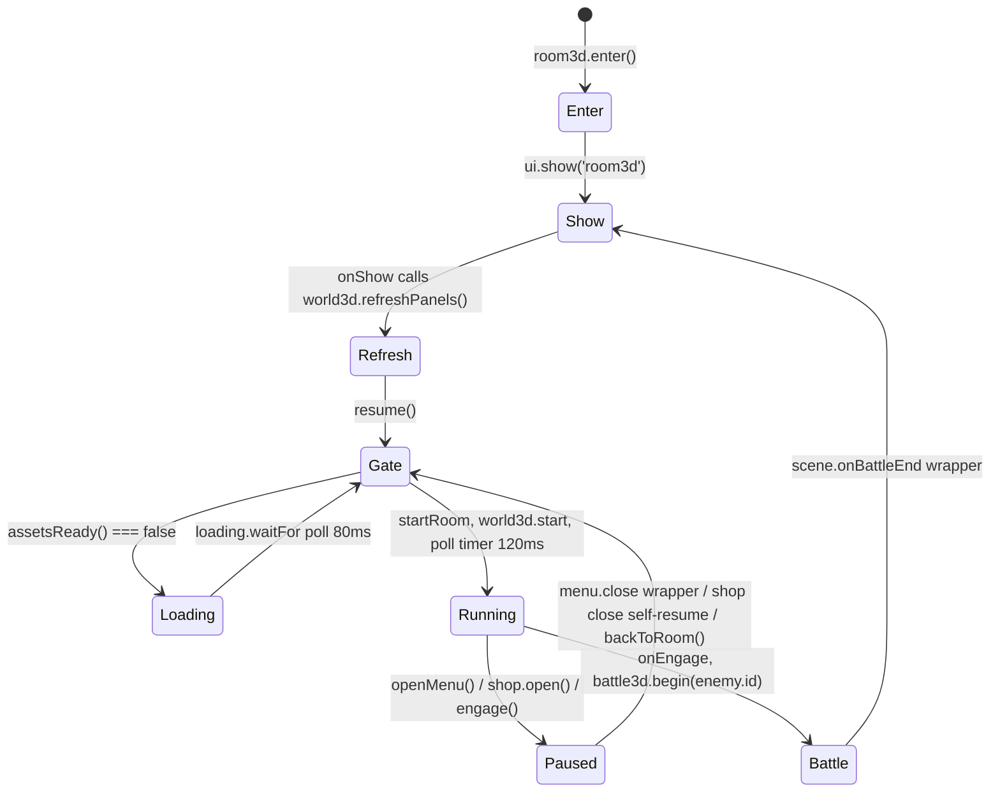
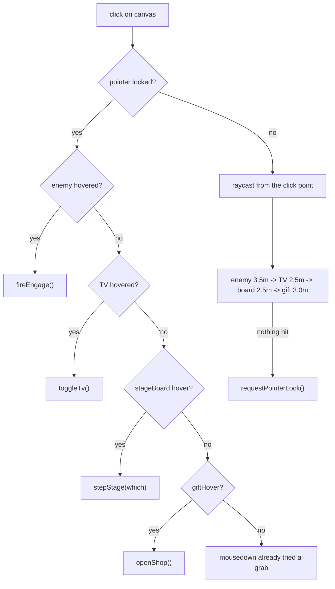

# The Room (First-Person World)

The Room is the dressing room you walk around in first person between fights: an 8 × 6 × 3 metre box with red club walls, a couch, a CRT, a floor lamp, two grungy sheets on the wall, a wrapped giftbox on the floor and a ghost standing in the corner. Walking into the ghost is how a fight starts; everything else in here is a surface that tells you something (your stats, the knight's stats, where the next fight happens, who has ever done better) or a thing you can pick up and carry into that fight. It is three files with a hard split: [engine/world3d.js](../game/js/engine/world3d.js) owns every line of Three.js and touches no DOM outside its canvas, [ui/room3d.js](../game/js/ui/room3d.js) owns the screen, the HUD, the pointer lock and the battle handoff and owns no world rules, and [data/room3d.js](../game/js/data/room3d.js) is pure numbers — dimensions, spawns, asset paths, the furniture list and the light rig. Spec sections: §13 (the room), §14 (photoreal v2), §16 (hands, crouch, pickups), §19 (the panels), §21 (the loading gate), §24/§26 (the stage board), §27 (shop and records), §28 D (the resume export).

---

## 1. The three files, and who may write what

| File | Owns | Must never |
|---|---|---|
| [data/room3d.js](../game/js/data/room3d.js) | `CHLOE.data.room3d`: `size`, `playerSpawn`, `enemySpawn`, `enemy.id`, `pickups[]`, `textures{}`, `hdri`, `models{}`, `tvScreen{}`, `furniture[]`, `lights{}` | contain logic |
| [engine/world3d.js](../game/js/engine/world3d.js) | scene build, movement, AABB collision, hands, raycast hover, click routing, panel repaint, asset ledger | touch the DOM beyond its canvas + pointer lock; know a game rule |
| [ui/room3d.js](../game/js/ui/room3d.js) | `#screen-room3d`, crosshair + hint captions, top HUD, lock overlay, menu key, battle handoff, the loading gate call | contain Three.js |
| [engine/displays.js](../game/js/engine/displays.js) | the canvases painted onto props: `mirror()`, `poster()`, `tv(ch)`, `trophy()`, `stage(def,round,n)`, `stageArrows()`, `chapterCount` | import THREE or build a DOM tree |
| [engine/records.js](../game/js/engine/records.js) | the §27E top-10 canvas `board()` — deliberately a separate module from displays.js | — |
| [engine/shop.js](../game/js/engine/shop.js) / [ui/shop.js](../game/js/ui/shop.js) | §27D shop rules / shop overlay | live inside ui/room3d.js |

Load order is hand-maintained in [index.html](../game/index.html:26): `vendor/three.min.js`, `GLTFLoader.js`, `DRACOLoader.js`, `RGBELoader.js` (26–29) → `data/room3d.js` (40) → `data/stages.js` (45) → `engine/displays.js` (60) → `engine/shop.js` (68), `engine/records.js` (69) → `engine/world3d.js` (73) → `ui/loading.js` (81) → `ui/room3d.js` (90) → `ui/shop.js` (94). Nothing here uses modules; everything hangs off `window.CHLOE`. See [architecture](architecture.md).

**No-THREE degradation.** If `window.THREE` is missing, `disableAPI()` replaces ten exports with no-ops — `init`, `start`, `stop`, `setEnemyAlive`, `onEngage`, `onHover`, `resetPlayer`, `onPickup`, `onGiftHover`, `resize` — and `debug()` with `deadDebug()` ([engine/world3d.js:31](../game/js/engine/world3d.js:31)). The module then `return`s before defining anything else, so `refreshPanels`, `assetProgress`/`assetsReady`, `releaseLock`/`isLocked`, `tvChapter` and the test hooks are not no-ops but **absent**. The room is dark and nothing throws only because every call site in `ui/room3d.js` feature-tests (`typeof w.refreshPanels === 'function'`, `w.assetsReady && …`) or sits in a `try`. `ui/room3d.js` prints `engine/world3d.js not loaded — the room stays dark.` once and rewrites the overlay line ([ui/room3d.js:209](../game/js/ui/room3d.js:209)).

---

## 2. Lifecycle: entry, the gate, pause, resume

1. `CHLOE.ui.room3d.enter()` builds the screen once, wires once, sets `party.state.scene = 'room3d'` and calls `ui.show('room3d')` ([ui/room3d.js:463](../game/js/ui/room3d.js:463)).
2. The router's `onShow('room3d')` handler repaints the HUD, calls `world3d.refreshPanels()` and then `resume()` ([ui/room3d.js:449](../game/js/ui/room3d.js:449)). Every re-entry repaints — the mirror, the knight poster, the round picture, the stage board and the record board all moved while you were out.
3. `resume()` → `ensureInit()` (first time: `world3d.init(canvas)` plus the `onEngage` / `onHover` / `onGiftHover` / `onPickup` callbacks) → `resize()` → the §21 gate → `startRoom()`.
4. `startRoom()` calls `world3d.start()` and installs a 120 ms `poll()` interval that drives the crosshair, the hint caption, the lock overlay and the top bar ([ui/room3d.js:296](../game/js/ui/room3d.js:296)).
5. `pause()` stops the loop, clears `cbHover`, kills the poll timer and exits pointer lock ([ui/room3d.js:306](../game/js/ui/room3d.js:306)). `poll()` also self-pauses if the router has moved off `room3d` behind its back.

`W.init()` is idempotent (`if (inited) return`, [engine/world3d.js:1272](../game/js/engine/world3d.js:1272)) and builds in a fixed order: `buildRoom, buildFurniture, buildTrophies, buildLights, buildEnemy, buildHands, buildPickups, loadEnvironment`, then `resetPlayer()`, `resize()`, and one throwaway `render()` whose exception flips `renderFailed` and strips every texture ([engine/world3d.js:1308](../game/js/engine/world3d.js:1308)).

**Battle handoff.** `engage()` refuses unknown ids, sets `inBattle`, pauses, and calls `CHLOE.ui.battle3d.begin(id)` — falling back to the 2D `CHLOE.ui.battle.begin(id, {boss:false})` ([ui/room3d.js:335](../game/js/ui/room3d.js:335)). The id comes from `data.room3d.enemy.id` = `hollow_black_knight`; `'the_hollow'` survives only as the hard fallback in `enemyId()` ([ui/room3d.js:35](../game/js/ui/room3d.js:35)). Which *stage* that fight uses is deliberately **not** decided here — see §5 below. Battle ends funnel through a wrapper installed over `CHLOE.ui.scene.onBattleEnd` ([ui/room3d.js:405](../game/js/ui/room3d.js:405)):

- `defeat` → cancel the respawn timer, `setEnemyAlive(true)`, `resetPlayer()`, `CHLOE.game.startNew()`, toast *"A new night begins. Nothing came with you."*
- `victory` → set the run flag `roomCleared` (the §11 hook that brings Ash in), `setEnemyAlive(false)` (dissolve), and a 15 000 ms `setTimeout` to `setEnemyAlive(true)`.
- anything else (fled) → straight back to the room.

---

## 3. Controls — the real bindings

Read off `updatePlayer()` ([engine/world3d.js:1468](../game/js/engine/world3d.js:1468)) and the mouse handlers. `keys` is indexed by `KeyboardEvent.code`, so every engine binding is a physical key, not a layout-dependent character. The menu key is the one exception and it lives in the other file: `ui/room3d.js` matches `e.key` against `'m' / 'M' / 'Tab'` ([ui/room3d.js:430](../game/js/ui/room3d.js:430)), so that one *does* follow the layout.

| Input | Code(s) | Effect |
|---|---|---|
| Forward / back | `KeyW`/`ArrowUp`, `KeyS`/`ArrowDown` | move along yaw, `WALK` 3.0 m/s |
| Strafe | `KeyA`, `KeyD` | sideways; **no arrow-key strafe** |
| Turn (keyboard fallback) | `ArrowLeft`/`KeyQ` = left, `ArrowRight`/`KeyE` = right | `TURN_RATE` 100°/s — the mandatory pointer-lock-free path (§13) |
| Sprint | `ShiftLeft`/`ShiftRight` | `SPRINT` 5.0 m/s; also 1.5× hand sway, but only once you are actually moving above `0.9 × WALK` — the key alone does not multiply it ([engine/world3d.js:1120](../game/js/engine/world3d.js:1120)) |
| Jump | `Space` (edge-triggered on keydown, no auto-repeat) | `JUMP_V` 4.8, `GRAVITY` −14, grounded only, no double-jump |
| Crouch | `ControlLeft`/`ControlRight`/`KeyC` | eye 1.6 → 0.85 lerped at 10/s, speed × 0.55, bob × 0.5 |
| Look | mouse move while locked | `SENS` 0.0022 rad/px, pitch clamped ±80° |
| Left hand | LMB down/up | close/open the left fist; also the interact click |
| Right hand | RMB down/up | close/open the right fist; context menu suppressed on the canvas |
| Menu | `m`/`M`/`Tab` | `openMenu()` — stops the loop, releases the lock ([ui/room3d.js:425](../game/js/ui/room3d.js:425)) |
| Release lock | `Esc` | browser-native; the overlay reappears via `pointerlockchange` |

`PREVENT = {ArrowUp, ArrowDown, ArrowLeft, ArrowRight, Space}` calls `preventDefault()` so the page never scrolls ([engine/world3d.js:1336](../game/js/engine/world3d.js:1336)). `window.blur` clears the whole key map, and `start()`/`stop()` clear it too — a key held across a battle cannot come back stuck.

The two on-screen hint lines are hard-coded strings in [ui/room3d.js:82](../game/js/ui/room3d.js:82) and [ui/room3d.js:91](../game/js/ui/room3d.js:91). Neither mentions sprint or the Q/E fallback. There *is* a third place the controls are written down — the TV's `CH 1 — THE ROOM` chapter, which does list `Shift sprints` ([engine/displays.js:555](../game/js/engine/displays.js:555)) — but it is behind two clicks on a prop, and it does not mention Q/E either. Add a binding and those three strings are the only places the player will ever hear about it.

**Pointer lock.** A click on the canvas that hits nothing interactive calls `canvas.requestPointerLock()`, and the returned promise's rejection is swallowed — Chrome rejects it inside the exit/enter cooldown and an unhandled rejection is a console error ([engine/world3d.js:1411](../game/js/engine/world3d.js:1411)). While unlocked, `onMouseMove` records the cursor in NDC (`mouseNdc`) so hover uses the same ray an unlocked click would ([engine/world3d.js:1350](../game/js/engine/world3d.js:1350)); off-canvas resets it to `null` and hover falls back to screen centre.

---

## 4. Movement, and the AABB collision that is more subtle than it looks

Velocity is a lerp toward the target, not an instant set: `vel += (target - vel) * min(1, ACCEL_LERP * dt)` with `ACCEL_LERP = 10` — that is the entire "feel" of starting and stopping. Diagonals are normalised before scaling by speed.

Collision is **axis-separated**: resolve X against the current Z, commit `pos.x`, then resolve Z against the *new* X ([engine/world3d.js:1499](../game/js/engine/world3d.js:1499)). That is what gives you sliding along a wall instead of sticking. Two details in that block are load-bearing and both were exposed by the §27 giftbox — the first collidable prop you can walk into head-on in open floor:

1. **`EPS = 1e-4` in the overlap test.** The X pass parks the body exactly against a face; floating point leaves `pos.x - RADIUS` a hair *under* `maxX`, so without the epsilon the Z pass re-resolves a contact that was already resolved.
2. **Resolve by smallest penetration when the axis velocity is zero**, never by which half the centre is in. Walking due west gives `vel.z ≈ 0`; the old centre comparison could pick the *far* face — a 0.72 m sideways snap, and on a corner approach it threw the body clean out of the room to `x = 5.35`.

Body radius is `RADIUS = 0.35`. Colliders come from two sources:

- **Walls**: four AABBs of thickness `T = 1` sitting *outside* the shell, pushed in `buildRoom()` ([engine/world3d.js:333](../game/js/engine/world3d.js:333)). One code path handles walls and furniture alike.
- **Furniture**: only kinds in `COLLIDABLE = {vanity, couch, tv, lamp, chair, giftbox}` ([engine/world3d.js:343](../game/js/engine/world3d.js:343)). `addCollider(kind,x,z,w,d,rotY)` folds `rotY` in by expanding the half-extents with `|cos|`/`|sin|` — an AABB *around* the rotated box, not an OBB.
- **Then the GLTF replaces it.** When a model finishes loading, the collider's four fields are overwritten in place from the scaled, floor-dropped `Box3` in world space ([engine/world3d.js:414](../game/js/engine/world3d.js:414)). **The collider therefore changes shape a fraction of a second after the room appears.** [data/room3d.js:15](../game/js/data/room3d.js:15) records the consequence: the TV model's scaled AABB reaches `x −2.70`, so with radius 0.35 anything west of −2.35 overlaps, which is why `playerSpawn.x` is `−2.2` and not the `−2.5` the engine's built-in fallback data still uses ([engine/world3d.js:1279](../game/js/engine/world3d.js:1279)).

Wall-flush planes (`mirror`, `door`, `poster`, `poster_stage`, `frame_records`) and the two `clutter` props get **no** collider; the wall boxes cover the former and the latter are deliberately walk-through.

Jump/gravity is a pure vertical offset `yOff` over the eye height — there is no floor geometry test, landing is `yOff <= 0`. Landing sets `dipTimer = DIP_TIME` (0.15 s) and both the camera and the hand group ride the same `-DIP_AMP * sin(π * dipTimer/DIP_TIME)` dip, amplitude 0.05 m. Head bob (`BOB_AMP` 0.03, phase rate `6 + speed*1.7`) only runs while grounded and above 0.15 m/s.

---

## 5. The interactive props

Everything you can point at is one of the eight props below, plus the §8 pickups. `kind` in [data/room3d.js](../game/js/data/room3d.js:74) — never list position — decides what a prop becomes; the two posters are the same mesh on the same kind of wall, and matching on array order would silently swap the knight dossier and the stage board the first time somebody reordered the list ([engine/world3d.js:459](../game/js/engine/world3d.js:459)). Only four of the eight are clickable at all.

| Prop | `kind` / position | Reach | Click does | Painted by |
|---|---|---|---|---|
| Ghost (the lure) | `enemySpawn` (2.2, −1.6) | `ENGAGE_DIST` 3.5 m | `onEngage` → battle | shader billboard, [engine/world3d.js:980](../game/js/engine/world3d.js:980) |
| TV | `tv`, south-west corner (−3.45, 2.35) | `TV_DIST` 2.5 m | turn the page of the programme | `displays.tv(chapter)` |
| Mirror | `mirror`, north wall (−1.5, −2.96) | — (not clickable) | — | `displays.mirror()` |
| Knight poster | `poster`, west wall (−3.96, 0.6) | — | — | `displays.poster()` |
| Stage board | `poster_stage`, south wall (−1.4, 2.96) | `BOARD_DIST` 2.5 m | step the stage pick left/right | `displays.stage()` |
| Record board | `frame_records`, north wall (0.95, −2.96), `y: 1.52` | — | — | `records.board()` |
| Giftbox (shop) | `giftbox`, open floor (1.6, 1.35) | `GIFT_DIST` 3.0 m | `CHLOE.ui.shop.open()` | primitives, no canvas |
| Round picture | not in data — `TROPHY_SPOT` (3.93, 1.72, 0.4) in engine | — | — | `displays.trophy()` |

### The ghost

A `PlaneGeometry(1,1)` scaled to 1.1 × 1.9, billboarded by `rotation.y = atan2(camX - spawnX, camZ - spawnZ)` and drawn with a hand-written `ShaderMaterial` that luminance-keys the black background away: `discard` below 0.09, `smoothstep(0.09, 0.25)` for the alpha ramp, plus a red additive term driven by `hoverGlow` ([engine/world3d.js:999](../game/js/engine/world3d.js:999)). The 1.1 is only the build-time default: when the sprite loads, `applyTex` re-derives the X scale from the image's aspect, `max(0.7, min(1.7, 1.9 * ar))` ([engine/world3d.js:1019](../game/js/engine/world3d.js:1019)), so the height is authored and the width is the picture's. Texture is `assets/gen/enemy-hollow-sprite.jpg`, falling back to `enemy-the-hollow.jpg` ([engine/world3d.js:1023](../game/js/engine/world3d.js:1023)), falling back to a canvas-drawn grey figure so the shader always has something to key ([engine/world3d.js:248](../game/js/engine/world3d.js:248)). Dissolve is 0.8 s of scale + flicker + light fade; respawn is 15 s (`RESPAWN_SECS`), armed by the engine after the dissolve *and* independently by the UI's 15 000 ms timeout after a victory.

### The TV — a programme, not a toggle

`toggleTv()` ([engine/world3d.js:666](../game/js/engine/world3d.js:666)): off → on starts at chapter 0; every further click increments; past the last chapter it switches off and resets to 0. `displays.chapterCount` is **7** — a title card plus CH 1–6 ([engine/displays.js:553](../game/js/engine/displays.js:553)) — so one control cycles eight clicks. A 0.25 s `tvCooldown` stops one click firing on several frames. The ON material is `MeshBasicMaterial`, the OFF material a near-black glossy PBR (`roughness 0.08, metalness 0.85, envMapIntensity 0.9`) so a dead tube still catches the HDRI. The screen plane's local offset/size comes from `data.tvScreen.model` (GLTF path) or `.fallback` (box-TV path) ([data/room3d.js:64](../game/js/data/room3d.js:64)) — two different sets of numbers because the GLTF is scaled to `targetH` and floor-dropped first.

### The stage board (§24 → §26)

The south poster started as a second knight dossier, became an announcement, and is now a **picker**. Three pieces have to agree and are deliberately wired so they cannot drift:

1. `displays.js` owns `STAGE_ARROWS` — normalised 0..1 rects, `left {x0 .045, y0 .150, x1 .190, y1 .248}`, `right {x0 .810 … x1 .955}` ([engine/displays.js:29](../game/js/engine/displays.js:29)) — because `displays.js` *paints* the arrows. It exports a **copy** via `stageArrows()` so a caller cannot move the hit box without moving the picture.
2. `world3d.arrowAt(hit)` ([engine/world3d.js:541](../game/js/engine/world3d.js:541)) hit-tests the poster's own UV against that table, flipping v (`v = 1 - uv.y`, [engine/world3d.js:545](../game/js/engine/world3d.js:545)) because a `PlaneGeometry`'s UV grows upward and a canvas' y grows down. It also returns `null` outright while `panels.stagePlan` is null — a board that fell back to the dossier has no arrows to press.
3. The pick itself is `CHLOE.data.stagePick` — `chosen() / choose(id) / peek(dir,n) / cycle(dir,n) / clear() / forRound(n) / stageForRound(n)`, order `['ring','church']` ([data/stages.js:237](../game/js/data/stages.js:237)).

`stepStage(which)` calls `pick.cycle(±1, round)` and repaints the wall in the same breath, because the sheet is the only feedback the press has ([engine/world3d.js:578](../game/js/engine/world3d.js:578)); a 0.25 s `stageCooldown` guards it.

The single question everybody asks is `forRound(n)`. `world3d.nextStagePlan()` ([engine/world3d.js:487](../game/js/engine/world3d.js:487)) and `ui/battle3d.resolveStage()` ([ui/battle3d.js:1180](../game/js/ui/battle3d.js:1180)) are the same four lines in the same order: `CHLOE.engine.stages.forRound(n)` first, then `CHLOE.data.stagePick.stageForRound/forRound`, then the church. And `CHLOE.engine.stages.forRound` (published by [engine/arena3d.js:175](../game/js/engine/arena3d.js:175), above the THREE guard so it answers on a machine with no WebGL) itself delegates to `stagePick.forRound` and only falls back to its own cycle if the pick names a stage that does not exist. That chain is what makes it impossible for the board to promise a floor you do not land on. See [stages](stages.md).

The whole feature is gated on `arena3d.setStage` existing ([engine/world3d.js:495](../game/js/engine/world3d.js:495)) — on a build that cannot move the fight, the board must not promise the Ring. Round comes from `party.state.runStats.round`, which combat3 bumps the moment a round is cleared, so by the time you walk back in it is already the round to announce. `plan.knights = plan.round` — round N fields N knights (§20). If `displays.stage()` is missing, returns nothing, or throws, `panelCanvas()` falls back to `displays.poster()` and `panels.stagePlan` goes null — which also disables the arrows, because a dossier has no arrows to press. The missing case is silent; a `stage()` that *throws* is caught and logged as `[world3d] displays.stage() failed: …` ([engine/world3d.js:521](../game/js/engine/world3d.js:521)).

### The giftbox and the shop (§27D)

Built from primitives on purpose — body, proud lid, two ribbon bands, a two-part bow, and the same red glint sprite the pickups wear ([engine/world3d.js:780](../game/js/engine/world3d.js:780)). The glow *is* the hint as far as the engine is concerned: it breathes at `0.26 + 0.1·sin(2.2t)` idle and pulses at `0.6 + 0.16·sin(7t)` while aimed at, and the ribbon's `emissiveIntensity` jumps 0.35 → 1.1 ([engine/world3d.js:1657](../game/js/engine/world3d.js:1657)). Raycast targets are the real body and lid meshes, not an invisible proxy box — a proxy would still be walked by the shadow pass.

`openShop()` ([engine/world3d.js:911](../game/js/engine/world3d.js:911)) warns once and does nothing if `CHLOE.ui.shop` is absent, and a 0.4 s `giftCooldown` makes it one open per click rather than one per frame; it never calls `world3d.stop()` itself, because nothing in that file would start the loop again and a stopped room with no resume path is exactly the §22 freeze ([engine/world3d.js:899](../game/js/engine/world3d.js:899)). Pausing is the overlay's job.

Rules live in [engine/shop.js](../game/js/engine/shop.js): stock is **derived**, not listed — anything in `CHLOE.data.items` that is an own property, is an object, has a numeric `price > 0` and lacks `noShop` is on the shelf, sorted cheapest first then alphabetically ([engine/shop.js:96](../game/js/engine/shop.js:96)). Nothing in [data/items.js](../game/js/data/items.js) sets `noShop` today, so the shelf is **every priced item, all seven**: bandage ◆15, energy_drink ◆20, antidote ◆25, tourniquet ◆25, sage_smoke ◆40, adrenaline_shot ◆60, revive_potion ◆90. That is the derivation earning its keep — antidote, tourniquet and sage_smoke were authored with prices, icons and descriptions and had been unbuyable ever since, because nothing but a drop table ever named them, and the rule put all three on the counter without anyone editing shop.js ([engine/shop.js:6](../game/js/engine/shop.js:6)). `itemDef()` uses `hasOwnProperty` **and** a typeof check because data/items.js hangs helper *functions* off the same object ([engine/shop.js:39](../game/js/engine/shop.js:39)). `buy()` is validate → `inventory.add()` → `party.addShards(-price)`, in that order, so a rejected id can never take your shards ([engine/shop.js:135](../game/js/engine/shop.js:135)).

### The record board (§27E) and the round picture (§20)

`frame_records` builds a frame box plus a plane floating 0.026 m proud of it ([engine/world3d.js:815](../game/js/engine/world3d.js:815)), and `recordsMaterial()` wraps a **512 × 700 canvas that world3d owns**, not the one `records.board()` returns ([engine/world3d.js:953](../game/js/engine/world3d.js:953)); `paintRecords()` draws the fresh board into it ([engine/world3d.js:942](../game/js/engine/world3d.js:942)). That is deliberate: a frame hung inert because `engine/records.js` was not in the build upgrades itself the first time a repaint finds the module, instead of staying dead forever. `debug().recordBoard` reports `'live'`, `'inert'` or `null` (prop absent from data). Records are per-browser `localStorage` under `chloe.records.v1` — §27 explicitly narrows §15's no-localStorage rule to *run saves*; a record board is not a save.

The round picture is the odd one out: it is **not** in `data/room3d.js` at all. `TROPHY_SPOT` is hard-coded at `(3.93, 1.72, 0.4)` with `rotY = -π/2` — east wall above the couch — and the picture is 0.86 × 1.15 m, a 3:4 match for `displays.trophy()`'s 384 × 512 canvas ([engine/world3d.js:847](../game/js/engine/world3d.js:847)). To move it you edit engine code.

---

## 6. engine/displays.js — the thing that paints the surfaces

Pure 2D canvas drawing: takes game state, returns a `<canvas>`. No THREE, no DOM tree. `world3d.displayMat(kind)` wraps the returned canvas in a `CanvasTexture` on a `MeshBasicMaterial`, stashes the `kind` and the **canvas** on `mat.userData`, and files the material under `panels[kind]` ([engine/world3d.js:588](../game/js/engine/world3d.js:588)) — the canvas is what the repaint path needs, and the texture is reachable as `mat.map`.

| Surface | Canvas | Reads |
|---|---|---|
| `mirror()` | 512 × 640 | `party.active()`, `party.effStats`, `combat3.knownAbilities`, `skilltree.nextRow` |
| `poster()` | 512 × 700 | `knighttree.level()/stats()/rowAt()/patterns()`, `data.arena3d.patterns` |
| `stage(def, round, n)` | 512 × 700 | `data.stages`, `data.stagePick.chosen()`, `party.state.runStats.round` |
| `trophy()` | 384 × 512 | `party.state.runStats.round` / `.trophies` |
| `tv(chapter)` | 512 × 384 | nothing — the chapters are a literal array |
| `records.board()` | 512 × 700 | `localStorage` |

The **refresh rule is the same everywhere and it matters**: repaint by drawing the fresh canvas *into the canvas the material already holds*, then set `map.needsUpdate = true`. Never swap the texture. `A_refreshPanels` ([engine/world3d.js:605](../game/js/engine/world3d.js:605)), `buildTrophies()`'s early-return branch ([engine/world3d.js:855](../game/js/engine/world3d.js:855)) and `paintRecords()` ([engine/world3d.js:942](../game/js/engine/world3d.js:942)) all do exactly this, so the panels never blink out between rounds. `W.refreshPanels()` fires all three and is called on every room entry.

`displays.stage()` reads state itself when an argument is omitted (round defaults to `runStats.round`, knight count defaults to round, `def` resolves through `stagePick`), which is what keeps the board in step with the round counter hanging two walls away. Its layout anchors the knight row and footer to the **bottom** and gives the plan diagram whatever is left, because a two-line blurb was already pushing the knight count into the footer ([engine/displays.js:356](../game/js/engine/displays.js:356)). The plan diagram plots the real `playerSpawn`/`knightSpawn` numbers through the same projection as the floor outline — a hand-drawn picture would be free to lie about which side you start on.

---

## 7. Hover and click: one ladder, three places, almost the same order

The single most breakable invariant in this file. **Enemy → TV → stage arrows → giftbox → pickup**, and it is repeated in three separate code paths that must not disagree — the two click chains hold that order exactly, the hover pass holds the set but leaves board and box unranked against each other (see below):

- **Locked click**: [engine/world3d.js:1373](../game/js/engine/world3d.js:1373).
- **Unlocked click**: same order, raycast from the click NDC, and if nothing is hit it requests pointer lock instead — that is the state you are in the first time you click anything in this room ([engine/world3d.js:1384](../game/js/engine/world3d.js:1384)).
- **Hover** (`updateHover()`, every frame): same *set*, and not quite the same order ([engine/world3d.js:1620](../game/js/engine/world3d.js:1620)). Enemy is resolved first, then the TV behind it, then the giftbox ([engine/world3d.js:1649](../game/js/engine/world3d.js:1649)) and the board arrows ([engine/world3d.js:1677](../game/js/engine/world3d.js:1677)) — but those last two are each gated only on `!hovered && !tvHovered`, **not on each other**, so unlike the two click chains the hover pass never decides between board and box. Nothing exercises the difference today (the south board and the floor box cannot both be inside their 2.5 m / 3.0 m reaches on one ray), which is exactly the kind of gap that survives until somebody moves a prop. The pickup is the only one gated behind all four. The comment at [engine/world3d.js:1681](../game/js/engine/world3d.js:1681) records what happens when the lists drift — the giftbox was added to both click chains but not to the hover chain, so the HUD offered a pickup that `onClick` would never take because it stopped at the box.
- **HUD** (`poll()` in [ui/room3d.js:169](../game/js/ui/room3d.js:169)): ranks the same way a fourth time, off `debug()`.

`onMouseDown` closes the fist immediately and attempts a grab **only while locked**, and only when the left button is not already claimed by the enemy/TV/board/box ([engine/world3d.js:1428](../game/js/engine/world3d.js:1428)) — pressing an arrow must not also close a hand on a grab (§26). `onMouseUp` refuses to reopen a hand that is mid-grab, so the fist stays shut until the item lands.

Callback shapes, and why there are two of them: `onHover(cb)` has the signature `cb(enemyHovered, enemyDist, tvHovered)` and belongs to `ui/room3d.js`. The giftbox got its **own** hook, `onGiftHover(cb) → cb(hovered, dist)`, rather than a fourth argument bolted onto `onHover`, because that would have been a silent contract change in a file another session owned ([engine/world3d.js:1853](../game/js/engine/world3d.js:1853)). The UI stores nothing from it — it just calls `poll()` on the edge so the prompt does not trail the aim; `debug().giftHover` stays the single source. `onWorldHover` in the UI accepts an object shape, a `(hovering, kind)` shape and the v2 `(enemy, dist, tv)` shape, so an older or newer engine both work ([ui/room3d.js:248](../game/js/ui/room3d.js:248)).

Hint captions and crosshair states ([ui/room3d.js:143](../game/js/ui/room3d.js:143)):

| Target | Caption | Crosshair class |
|---|---|---|
| enemy | `CLICK TO ENGAGE` | `in-range` (red) |
| TV | `TV — click to turn on/off` | `tv-range` (white) |
| stage arrow | `◀ THE RING` / `▶ THE CHURCH`, or `◀ ANOTHER FLOOR` when the name is unknown | `tv-range` |
| giftbox | `open the giftbox — the shop` | `tv-range` |
| pickup | `take the Bandage` | `in-range` |

Red is reserved for what you can attack; everything you merely *press* borrows the TV's white reticle. The gift caption names the **action**, not the object, because the box is the only way to spend shards and a player who never guesses never finds the shop.

---

## 8. Hands and pickups (§16)

The hands are primitives parented to the camera: a squashed sphere palm, a cuff box, four two-segment fingers in their own group, a thumb — `hands.l` at `(-0.28, -0.25, -0.55)` and `hands.r` mirrored, rotated inward ([engine/world3d.js:1085](../game/js/engine/world3d.js:1085)). `renderOrder = 999` and `frustumCulled = false` on every mesh, plus a 0.05 near plane, keep them on top of the room. `camera` is added to the scene explicitly ([engine/world3d.js:1111](../game/js/engine/world3d.js:1111)) — **without that line the camera's children never render at all.**

The glove material's `envMapIntensity` is clamped to **0.12**, not the room-wide 0.6 ([engine/world3d.js:1059](../game/js/engine/world3d.js:1059)). §19's lighting note says why: unclamped IBL renders dark leather as white plastic, and it has now bitten the room hands, the arena arms and the benches.

Motion, all in `updateHands()` ([engine/world3d.js:1117](../game/js/engine/world3d.js:1117)):

| Component | Value |
|---|---|
| walk sway | `x = sin(bobPhase)·0.02`, `y = |cos(bobPhase)|·0.015`, ×1.5 sprinting, grounded and > 0.15 m/s only |
| idle breath | `sin(elapsed·1.7)·0.004` |
| jump raise | 0.045 m, lerped at 10/s |
| landing dip | shared with the camera, `DIP_AMP` 0.05 over `DIP_TIME` 0.15 s |
| rotational lag | a world-space quaternion slerps toward the camera at 12/s; the group's local rotation is the leftover delta |
| grip | `closeL/closeR` lerp toward `targetL/targetR` at 14/s; fingers curl `t·1.15` rad, thumb unyaws by `1 - t·0.55` |

**Pickups** are authored in `data.pickups[]` — today `bandage` on the vanity top `(-1.1, 1.02, -2.55)` and `energy_drink` on the couch seat `(3.25, 0.52, 1.15)`. Each is a 0.16 × 0.1 × 0.12 emissive box that spins at `0.8 rad/s` ([engine/world3d.js:1254](../game/js/engine/world3d.js:1254)), plus a glint sprite that breathes (opacity `0.3 + 0.25·|sin(2.2t + i)|`, scale `0.5 + 0.18·sin(3t + 1.7i)`; a sprite is camera-facing, so spinning it would show nothing). `pickupUnderCrosshair()` takes the nearest hit within `GRAB_RANGE` 2.2 m ([engine/world3d.js:1208](../game/js/engine/world3d.js:1208)).

The grab is a 0.45 s animation, one at a time: the hand reaches inward/forward over the first ~0.45 of it, the item starts flying at `t > 0.35` and lerps to `(0, -0.2, -0.6)` in camera space while shrinking to 0.3× ([engine/world3d.js:1247](../game/js/engine/world3d.js:1247)). `tryGrab` marks the pickup `taken` immediately so nothing double-grabs it. **`W.stop()` calls `finishGrab()`** ([engine/world3d.js:1763](../game/js/engine/world3d.js:1763)) — a battle starting mid-grab must not eat the item. Delivery fires `onPickup(itemId, label)`, which the UI turns into `inventory.add(itemId, 1)` plus a toast; an unknown item id is dropped silently ([ui/room3d.js:229](../game/js/ui/room3d.js:229)). Taken items come back only with a new run, via `W.resetPlayer()` → `buildPickups()` (§15 run scope).

---

## 9. The photoreal pipeline (§14)

`setupPipeline()` ([engine/world3d.js:266](../game/js/engine/world3d.js:266)) — every step feature-detected, and the whole thing wrapped so a partial capability set warns rather than throws:

| Setting | Value | Note |
|---|---|---|
| `outputEncoding` | `sRGBEncoding` | if defined in this THREE build |
| `toneMapping` | `ACESFilmicToneMapping`, exposure 1.1 | |
| `physicallyCorrectLights` | `true`, and **`LIGHT_SCALE = Math.PI`** | the flag divides punctual response by ~π vs the legacy pipeline the room was tuned in, so every data intensity is multiplied back up. Stays 1 if the flag is absent. |
| `shadowMap` | enabled, `PCFSoftShadowMap` | |
| anisotropy | `min(4, capabilities.getMaxAnisotropy())` | |
| pixel ratio | `min(devicePixelRatio, 2)` | re-applied on every `resize()` |
| `envMapIntensity` | `ENV_INTENSITY` 0.6 on every **PBR** material this file makes (`makeMat`'s standard branch + `stdMat`), and forced onto every GLTF material on load | two deliberate exceptions: the gloves at 0.12 and the TV's OFF face at 0.9. The `MeshBasicMaterial`s — the panels and the TV's ON face — have no env response to set |

**One shadow-casting light in the whole room**: the lamp's `PointLight`, 1024² map, `bias -0.005`, `near 0.1`, `far = distance` ([engine/world3d.js:439](../game/js/engine/world3d.js:439)). `enableShadows(root, castOK)` gives every mesh `receiveShadow`, but casts only for non-`Plane` geometry (wall-flush planes cause acne) and never for the lamp itself — its own shade surrounds the light and would blacken the room ([engine/world3d.js:225](../game/js/engine/world3d.js:225)).

**HDRI**: `assets/hdri/creepy_bathroom_1k.hdr` → `RGBELoader` → `PMREMGenerator` → `scene.environment`, deliberately **not** `scene.background` (the room is enclosed). Any failure — no RGBELoader, no PMREMGenerator, 404, `file://` — leaves `envMapOk = false` and the room lit by the light rig alone, with the PMREM generator disposed on every exit path ([engine/world3d.js:289](../game/js/engine/world3d.js:289)).

**Furniture models** are Poly Haven CC0, glTF with 1k textures, mirrored into `data.models` (the engine never reads `tools/model-manifest.json` at runtime):

| id | Poly Haven asset | `targetH` | Collidable |
|---|---|---|---|
| `vanity` | ClassicConsole_01 | 0.92 | yes |
| `sofa` | Sofa_01 | 0.80 | yes (`couch`) |
| `tv` | Television_01 | 0.90 | yes |
| `lamp` | desk_lamp_arm_01 | 1.65 | yes |
| `chair` | painted_wooden_chair_01 | 0.85 | yes |
| `clutter1` | cassette_player | 0.052 | no |
| `clutter2` | wine_bottles_01 | 0.33 | no |
| `hdri` | creepy_bathroom | — | — |

Total on disk ~11.4 MB against §14's 40 MB budget ([tools/model-manifest.json](../tools/model-manifest.json)); licences in [tools/ATTRIBUTIONS.md](../tools/ATTRIBUTIONS.md). `loadFurnitureModel()` uniform-scales to `targetH / size.y`, recentres X/Z and drops `Box3.min.y` to the floor, forces `envMapIntensity` and anisotropy on every material it finds, rebuilds the collider, and — for the TV — attaches the screen plane ([engine/world3d.js:377](../game/js/engine/world3d.js:377)). **Any** failure (404, `file://`, parse error, an exception inside the setup) falls through to `fail()`, which builds the textured-box version of that one piece and settles its asset slot. The room never has holes and one bad model never costs you the others.

The textured-box fallbacks are full compositions, not placeholders: the vanity gets a body plus a proud top, the couch a base, back and two arms, the TV a stand plus a body plus its screen plane, the lamp a foot, pole and emissive shade ([engine/world3d.js:685](../game/js/engine/world3d.js:685)). An unknown `kind` still gets a plain dark box at the authored size — a typo in data is a visible object, never a hole.

**`stripMaps()`** is the last-ditch fallback: on some browsers `file://` lets the `` load but throws `SecurityError` at GL upload. The first `render()` that throws sets `renderFailed`, and `stripMaps()` nulls every map on every material it can reach — the tracked `texturedMats` list, a full `scene.traverse` covering late-arriving GLTF textures, the TV, and the enemy shader's uniform ([engine/world3d.js:182](../game/js/engine/world3d.js:182)). It is idempotent and re-runs from the render loop's catch.

---

## 10. The loading gate (§21)

The gate exists because the room used to assemble itself around you: furniture popping in, the first turn of the head stuttering as each material compiled on the frame it first became visible.

`world3d` keeps an explicit ledger, `roomAssets = {total, done, warm}`, because **`modelsLoaded` cannot answer "are we done?"** — it stores `false` for both *still loading* and *failed* ([engine/world3d.js:116](../game/js/engine/world3d.js:116)). `roomExpect()` is called once per GLTF furniture entry (today: 7) and `roomSettle()` on success **and** on failure. A missing optional asset must never wedge the gate.

- `W.assetProgress()` → `{done, total: max(1,total), warm}`.
- `W.assetsReady()` → false until `done >= total`; then, once, it calls `renderer.compile(scene, camera)` **and draws one frame**, sets `warm = true`, and returns true ([engine/world3d.js:1820](../game/js/engine/world3d.js:1820)). Compiling builds shader *programs* but never uploads *textures*; those go to the GPU lazily on the frame a material is first drawn, which is why the extra render is not redundant.
- `ui/room3d.resume()` shows `CHLOE.ui.loading` with `'Waking the room…'`, polls `assetsReady()` every 80 ms via `loading.waitFor`, drives the bar from `assetProgress()` against `total + 1` (so the bar cannot read 100 % before the warm-up), relabels to `'Turning on the lights…'` once the models are in, and only then calls `startRoom()` — re-checking that the router has not moved on while it waited ([ui/room3d.js:274](../game/js/ui/room3d.js:274)).
- `loading.waitFor` gives up after 25 s by default, warns, and starts anyway rather than stranding the player ([ui/loading.js:127](../game/js/ui/loading.js:127)). The veil is CSS-only on purpose — it is on screen precisely when the main thread is busy.

Note the ledger counts **models only**. Wall/floor textures, the enemy sprite and the HDRI are not expected slots; they pop in after the gate lifts, which is acceptable because each has an immediate flat-colour fallback.

---

## 11. Pointer lock, pause/resume, and the export you must not tidy away

There are three ways the room stops and three ways it starts again, and they are not symmetrical:

| Stopper | Restarter |
|---|---|
| `openMenu()` (button, `M`, `Tab`) → `world3d.stop()` + release lock | `CHLOE.ui.menu.close` is **wrapped** by `ui/room3d.wire()` and calls `resume()` ([ui/room3d.js:414](../game/js/ui/room3d.js:414)) |
| `engage()` → `pause()` | `onBattleEnd` → `backToRoom()` → `ui.show('room3d')` → the `onShow` handler |
| `ui/shop.js open()` → `pauseWorld()` → `room3d._pause()` | `ui/shop.js close()` → `resumeWorld()` → **`room3d._resume()`** |

> **§28 D, verbatim in spirit:** `ui/room3d.js` exports `_resume` labelled *"exposed for tests/debugging"* ([ui/room3d.js:474](../game/js/ui/room3d.js:474)) and §27's shop close path depends on it. **Tidying it away freezes the room after a purchase.** Same for `_pause`.

There is a second layer to this trap, and it is worth reading the code rather than the comments. `ui/shop.js`'s header instructs `ui/room3d.js` to wrap `CHLOE.ui.shop.close` the same way it wraps `menu.close` ([ui/shop.js:9](../game/js/ui/shop.js:9)) — **that wrapper does not exist in `ui/room3d.js` today.** What actually resumes the room after a purchase is shop.js's own self-resume: `close()` compares the live export against its local binding, finds nobody has wrapped it, and calls `resumeWorld()` itself ([ui/shop.js:98](../game/js/ui/shop.js:98)). So the working path is: every close route (the ✕, `Esc`, the backdrop click) calls the **public export** `CHLOE.ui.shop.close()`, never the local `close` — which is precisely the §22 bug that froze the room permanently when something called a module's inner close directly and the wrapper that restarts the loop never ran. If you ever add the room-side wrapper, `closeIsWrapped()` flips and shop.js stops self-resuming, so the loop is started exactly once either way. If you add a close path that calls the local `close`, the room freezes with the pointer unlocked and nothing on screen explains why.

Shop input is bound in the **capture** phase on purpose: `ui/room3d.js` listens for `M`/`Tab` on `document` in the bubble phase and its guard only knows about `#overlay-menu`, so a bubble-phase listener could not stop the menu opening on top of the shop ([ui/shop.js:142](../game/js/ui/shop.js:142)).

Two lock helpers exist on the engine for callers that need the cursor back: `W.releaseLock()` and `W.isLocked()` ([engine/world3d.js:1836](../game/js/engine/world3d.js:1836)) — the same handles `arena3d` exposes, so nothing has to special-case which 3D scene is up. Note `W.isLocked()` answers for a lock on *any* element, while the internal `isLocked()` used by the click and hover paths requires the lock to be on **this canvas**.

---

## 12. `debug()` — the verification surface

`world3d.debug()` is mandatory per §13/§14 and is how every automated check reads the room ([engine/world3d.js:1860](../game/js/engine/world3d.js:1860)). Before `init()` it returns `deadDebug()` ([engine/world3d.js:23](../game/js/engine/world3d.js:23)) — but **`deadDebug()` is not the same shape as `debug()`**, and has drifted behind it. It carries only the §13/§14-era fields (`x, y, z, yaw, pitch, locked, grounded, enemyDist, enemyAlive, tvOn, envMap, handsVisible, stageBoard, stageArrow, modelsLoaded, colliders`); everything added since — `crouch`, `eye`, `tvHover`, `enemyHovered`, `pickupHover`, `pickupsLeft`, `hands`, `giftHover`, `shopReady`, `recordBoard` — comes back `undefined` before `init()`. A pre-init caller reading `d.hands.l` throws; reading `d.locked` does not. Treat the table below as the post-`init()` shape.

| Field | Meaning |
|---|---|
| `x, y, z, yaw, pitch` | `y` is `eyeH + yOff` — no bob, no dip |
| `locked, grounded, crouch, eye` | `eye` is the lerped stand/crouch height |
| `enemyDist, enemyAlive, enemyHovered` | distance is planar, to the mesh if alive else to the spawn |
| `tvOn, tvHover` | plus `W.tvChapter()` for the page number |
| `stageArrow` | `{which, id, name} \| null` — the arrow under the crosshair and the floor it would pick (§26) |
| `stageBoard` | `{id, name, round, knights} \| null` — what the sheet is **actually announcing**, straight off the last paint rather than re-resolved; `null` means it fell back to the dossier (§24) |
| `envMap, handsVisible, modelsLoaded{}` | `handsVisible` is set once in `buildHands()` and never cleared |
| `pickupHover, pickupsLeft, hands{l,r,grabbing}` | §16 |
| `giftHover, shopReady, recordBoard` | §27D/E; `recordBoard` is `'live'`/`'inert'`/`null` |
| `colliders[]` | `{kind,minX,maxX,minZ,maxZ}` per collider — the post-GLTF values |

Test-only hooks: `W._renderOnce()` (draws one frame on demand where rAF is throttled — see [debugging](debugging.md) for the frozen-rAF trap), `W._look(yaw,pitch)`, `W._teleport(x,z)`.

`debug().shopReady` has **zero consumers** today (§28 D notes it). If the shop is ever made optional, that gate belongs on the giftbox glow and both click paths — not on the hint caption, which would leave an unlabelled lit prop that still eats clicks and still hides the pickup behind it.

---

## 13. Traps

- **`var A_refreshPanels;` at [engine/world3d.js:618](../game/js/engine/world3d.js:618) is load-bearing.** The assignment sits *above* it at line 605 and only works because `var` hoists. The file is `'use strict'` — delete that declaration and the assignment becomes an assignment to an undeclared variable, which throws at load time and takes the whole engine module with it. Same pattern for `ZERO2` ([engine/world3d.js:1693](../game/js/engine/world3d.js:1693)), used by functions defined above it.
- **Panels are keyed by `kind`, never by array position.** `PANEL_KINDS = ['mirror','poster','poster_stage']` ([engine/world3d.js:464](../game/js/engine/world3d.js:464)) and every §27 prop follows the same rule. Reordering `data.furniture` must stay harmless.
- **A GLTF collider replaces the authored one asynchronously.** Anything tuned against a spawn position or a walking lane (see the `playerSpawn.x = -2.2` note) is tuned against the *model's* box, not the numbers in `data.furniture`.
- **Never `stop()` the world from inside an interaction handler.** `openShop()` says so explicitly ([engine/world3d.js:899](../game/js/engine/world3d.js:899)): nothing in world3d.js would start it again.
- **Every close path goes through the public export.** See §11.
- **Repaint into the existing canvas.** Swapping a `CanvasTexture` makes the panel blink out for a frame between rounds.
- **`roomSettle()` must be called on the failure path too.** It is, in `fail()` ([engine/world3d.js:384](../game/js/engine/world3d.js:384)). Forget it in a new loader and the loading gate hangs for its full 25 s timeout on any 404.
- **The hover ladder and the two click ladders are three separate lists.** Add a prop to one and not the others and you get a caption for an action the click will not perform (or a lit prop that eats clicks silently).
- **`stripMaps()` reaches the information panels too.** Its `scene.traverse` spares only `enemy.mat`, and the panel materials are `MeshBasicMaterial({map})` with the default white colour — nulling their map leaves flat white rectangles rather than the dark fallback the box furniture gets ([engine/world3d.js:190](../game/js/engine/world3d.js:190)). Only reachable after a GL upload failure, but that is the exact scenario the function exists for.
- **`resume()` skips the gate if a loading veil is already on screen** (`!load.isShown()`, [ui/room3d.js:275](../game/js/ui/room3d.js:275)). In that path the room starts before its models have settled.
- **The TV's ON material is shared with the static texture loader.** See the defect note directly below before changing anything in `addTvScreen`/`paintTv`/`updateFx`.

### One live defect, read off the code

`addTvScreen()` builds the ON material with `makeMat(f.tex || 'tv_static', …)` ([engine/world3d.js:643](../game/js/engine/world3d.js:643)) and, six lines further down but still in the same synchronous pass, calls `paintTv()` ([engine/world3d.js:649](../game/js/engine/world3d.js:649)). `paintTv()` sets `tv.onMat.map` to the programme `CanvasTexture` and nulls `tv.tex` to stop the static jitter ([engine/world3d.js:629](../game/js/engine/world3d.js:629)). But `makeMat`'s texture load is asynchronous, and when `assets/gen/tex/tv_static.jpg` (210 KB, present on disk) finishes loading, its callback does `m.map = t; m.color.set(0xffffff)` on that same material ([engine/world3d.js:165](../game/js/engine/world3d.js:165)) and hands the texture back through `onTex`, which re-arms `tv.tex` ([engine/world3d.js:167](../game/js/engine/world3d.js:167)) — overwriting the programme map. Every later `paintTv()` takes the `else` branch, which only redraws into `panels.tvCanvas` and never re-attaches `panels.tvMat` to the material. Net effect: with the jpg present, turning the TV on shows animated static, and §19's chaptered programme is never visible. `debug().tvOn` and `W.tvChapter()` still advance correctly, so a state-only test passes.

The mirror image of the same tangle: if the jpg *is* missing (`file://`, 404), `tv.tex` stays null, the programme map survives — and `updateFx`'s "no texture" branch then multiplies the painted canvas by `(0.16, 0.19, 0.24) × v` every frame ([engine/world3d.js:1715](../game/js/engine/world3d.js:1715)), rendering the how-to text at roughly a fifth of its brightness. That branch was written for a material with no map at all, and it cannot tell that case apart from "the programme deliberately nulled `tv.tex`".

A fix has to make `paintTv()` the sole owner of `tv.onMat.map` (re-assign it on every paint, or stop the texture load once a programme canvas exists) and give `updateFx` a real "is the programme showing?" flag instead of inferring it from `tv.tex`. Not applied here — this page owns no code.

---

## 14. Where the code and GAME_SPEC disagree (the code wins)

- §13 specifies the click handoff as `CHLOE.engine.battle.start('the_hollow')`. The code fires `world3d.onEngage` → `ui/room3d.engage()` → `CHLOE.ui.battle3d.begin('hollow_black_knight')`, with the 2D `CHLOE.ui.battle.begin(id,{boss:false})` only as a fallback. §16 supersedes §13 here; `'the_hollow'` survives solely as the default in `enemyId()`.
- §21 says the warm-up "pushes every texture through `renderer.initTexture()` and draws one frame with all hidden objects forced visible". `world3d.assetsReady()` does **not** call `initTexture()` — it calls `renderer.compile()` then one ordinary `render()` ([engine/world3d.js:1827](../game/js/engine/world3d.js:1827)). That paragraph describes the *arena's* warm-up, which really does push every texture through `initTexture()` ([engine/arena3d.js:445](../game/js/engine/arena3d.js:445)); the room's is the weaker version, which is adequate because the room has no hidden VFX.
- §27D says "Closing returns to the room and resumes the 3D loop the same way the menu overlay does." Mechanically it does not: `menu.close` is wrapped by `ui/room3d.js`; `shop.close` is not wrapped by anyone, and `ui/shop.js` self-resumes instead. The outcome is the same; the mechanism is not, and §28 D exists because of it.
- §13's furniture schema is `{kind,x,z,w,d,h,rotY,tex}` (the ENGINE-agent ownership bullet); the live entries also carry `model`, `targetH`, `id` and — for `frame_records` only — `y`.
- §27D lists the shelf as "`bandage`, `energy_drink`, `revive_potion` at minimum, plus the §12 cure items". The code names none of them: the shelf is a rule over `data/items.js`, so the live stock is seven items today and changes the moment that file does, with neither §27D nor shop.js touched. The spec's list is a floor, not an inventory — read `engine.shop.stock()`.

---

## Where to change what

| I want to… | Edit |
|---|---|
| Move a piece of furniture, or add one | [data/room3d.js](../game/js/data/room3d.js) `furniture[]` — and add its `kind` to `COLLIDABLE` in [engine/world3d.js:343](../game/js/engine/world3d.js:343) if it should be solid |
| Make a new furniture `kind` render as something | `buildPiece()`'s switch, [engine/world3d.js:685](../game/js/engine/world3d.js:685) |
| Swap a model or the HDRI | [data/room3d.js](../game/js/data/room3d.js) `models{}` / `hdri` (mirror the path from [tools/model-manifest.json](../tools/model-manifest.json); update [tools/ATTRIBUTIONS.md](../tools/ATTRIBUTIONS.md)) |
| Change walk/sprint/crouch/jump feel | the constant block, [engine/world3d.js:42](../game/js/engine/world3d.js:42) |
| Rebind a key | `updatePlayer()` / `onKeyDown`, [engine/world3d.js:1469](../game/js/engine/world3d.js:1469) — **and** the two hint strings at [ui/room3d.js:82](../game/js/ui/room3d.js:82) and [ui/room3d.js:91](../game/js/ui/room3d.js:91), **and** the TV's `CH 1` chapter in `CHAPTERS` ([engine/displays.js:555](../game/js/engine/displays.js:555)), which is the third place the controls are written out |
| Change an interaction range | `ENGAGE_DIST`/`TV_DIST`/`BOARD_DIST`/`GRAB_RANGE` ([engine/world3d.js:45](../game/js/engine/world3d.js:45)), `GIFT_DIST` ([engine/world3d.js:903](../game/js/engine/world3d.js:903)); mirror `ENGAGE_RANGE`/`TV_RANGE` in [ui/room3d.js:27](../game/js/ui/room3d.js:27) |
| Add or move a grabbable item | [data/room3d.js](../game/js/data/room3d.js) `pickups[]` (the id must exist in [data/items.js](../game/js/data/items.js) or the pickup is dropped silently) |
| Reword a crosshair hint | `setHint()`, [ui/room3d.js:143](../game/js/ui/room3d.js:143) |
| Change what the mirror/poster/board/TV say | [engine/displays.js](../game/js/engine/displays.js) — one function per surface |
| Move the stage board's arrows | `STAGE_ARROWS` in [engine/displays.js:29](../game/js/engine/displays.js:29) only; the hit box reads that table |
| Change which stage a round uses | [data/stages.js](../game/js/data/stages.js) `stagePick` (`ORDER`, `cycleForRound`) — see [stages](stages.md) |
| Change the top-10 board | [engine/records.js](../game/js/engine/records.js) `board()` (its canvas is 512 × 700 to match [engine/world3d.js:956](../game/js/engine/world3d.js:956)) |
| Add or price a shop item | [data/items.js](../game/js/data/items.js) — a numeric `price > 0` puts it on the shelf; `noShop: true` opts out |
| Change shop rules (affordability, ordering, atomicity) | [engine/shop.js](../game/js/engine/shop.js) |
| Restyle the shop overlay or its rows | [ui/shop.js](../game/js/ui/shop.js) + `#overlay-shop` / `.shop-*` in [game/css/game.css:1942](../game/css/game.css:1942) (built on top of the menu overlay's rules, not beside them) |
| Restyle the crosshair, hint, HUD or lock overlay | the Room3D block, `#screen-room3d` / `.r3d-*` in [game/css/game.css:1357](../game/css/game.css:1357) |
| Change the loading veil, its copy or its tips | [ui/loading.js](../game/js/ui/loading.js) + `.loading-*` in [game/css/game.css:1849](../game/css/game.css:1849) |
| Change the light rig | [data/room3d.js](../game/js/data/room3d.js) `lights{}` — remember `LIGHT_SCALE` multiplies these by π |
| Add a field to `debug()` | [engine/world3d.js:1860](../game/js/engine/world3d.js:1860) **and** `deadDebug()` at [engine/world3d.js:23](../game/js/engine/world3d.js:23) — which today is ten fields behind it (§12), so this is a repair as much as a rule |

Related pages: [architecture](architecture.md) · [run-loop](run-loop.md) · [combat](combat.md) · [stages](stages.md) · [progression](progression.md) · [data-reference](data-reference.md) · [debugging](debugging.md)
